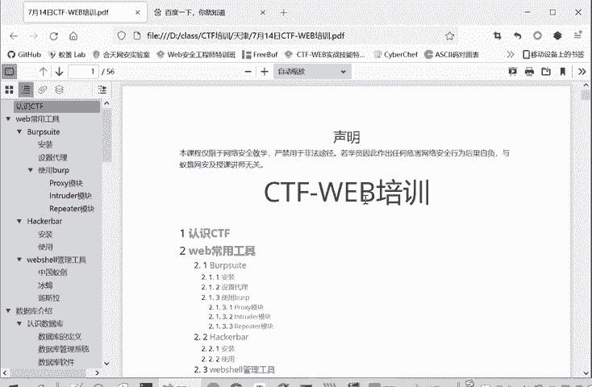
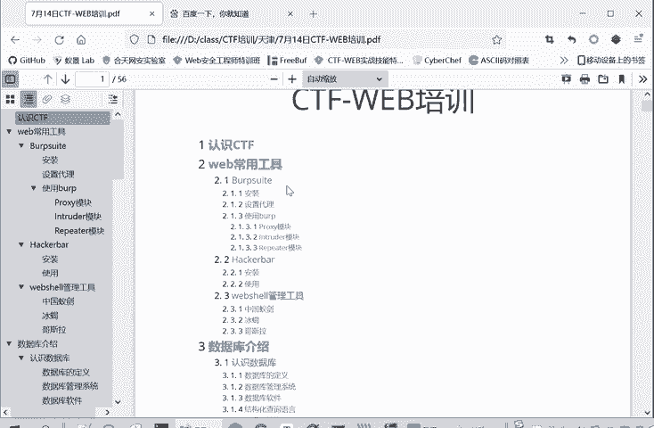
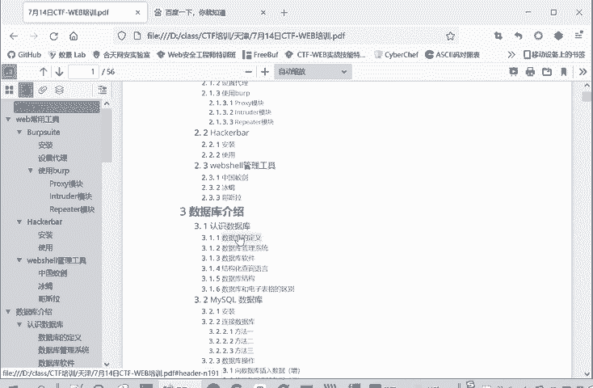
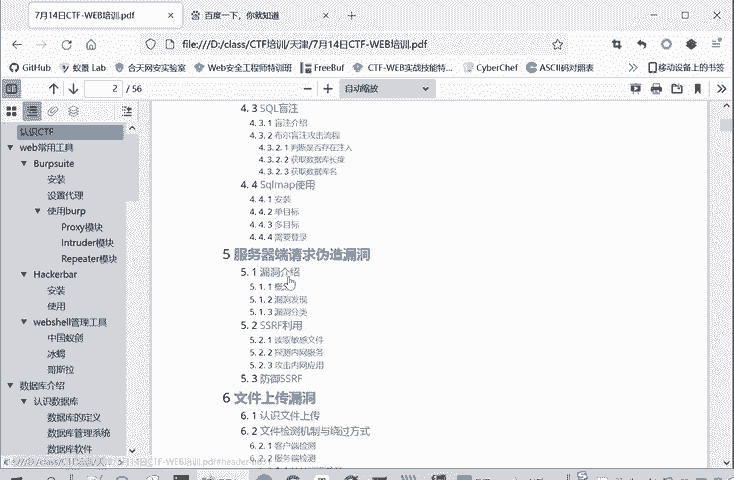
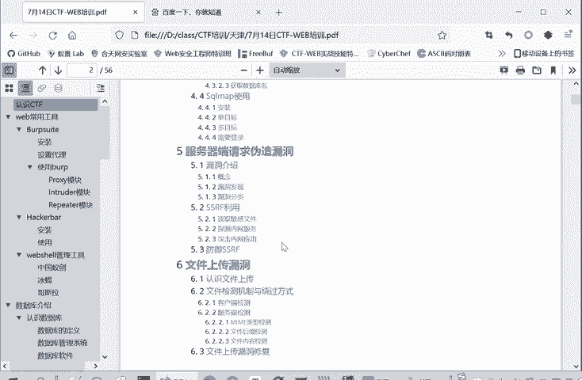
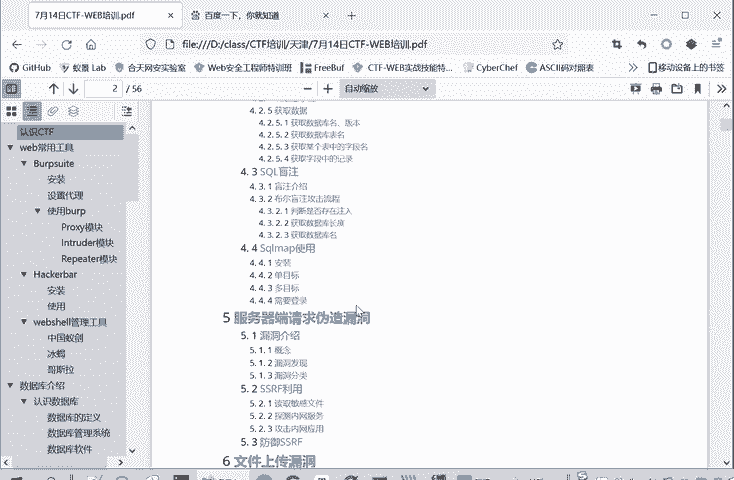
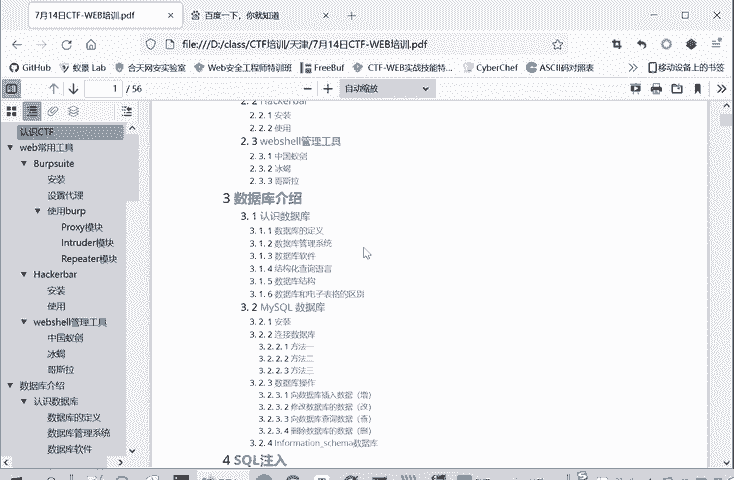
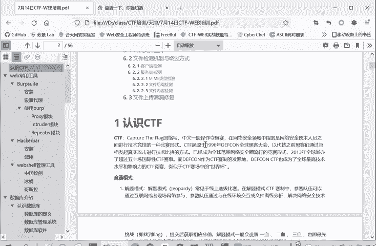

# 网络安全系统教学合集：P67：1.认识CTF 🏴‍☠️

在本节课中，我们将要学习网络安全竞赛——CTF（夺旗赛）的基础知识，包括其定义、主要竞赛模式以及涵盖的核心技术领域。

## 课程安排概述

本次课程分为上、下午两个部分。上午课程从9点至10点半，中间休息约10分钟。课程内容主要分为两部分：CTF介绍与常用工具安装，并会介绍一部分数据库知识。

下午课程将继续讲解数据库和SQL注入，随后是服务器请求伪造漏洞，最后是文件上传漏洞。

在听课过程中，如有任何疑问，请将问题发布在聊天区。每节课下课之前，会集中回答大家的问题。

## 什么是CTF？

首先，我们来介绍CTF。CTF是 **Capture The Flag** 的缩写，中文称为“夺旗赛”。

CTF是一种网络安全竞赛形式。其核心是通过寻找一个被称为 **`flag`** 的特定字符串，作为成功完成挑战的标志。例如，发现并利用了对方服务或二进制文件的漏洞后，成功获取到这个`flag`即算作挑战成功。

参赛者将找到的`flag`提交给评分系统，若`flag`正确，则对应题目即被解答。其基本流程可概括为：**发现漏洞 → 利用漏洞 → 获取`flag` → 提交得分**。

## CTF的三种竞赛模式

CTF主要有三种竞赛模式，以下是它们的简要介绍：

**1. 解题模式**
这种模式常见于线上选拔赛。参赛者通过互联网或现场网络参与，通过分析题目文件、解决网络安全技术问题来找到`flag`。提交`flag`即可获得相应分值。题目通常设有“一血”、“二血”等奖励，越早解出题目得分越高。比赛结束后，通常需要提交详细的解题报告（Writeup），以防止直接抄袭`flag`的行为。例如，“网鼎杯”的官方资格赛就采用此模式。

**2. 攻防模式**
这种模式常见于线下决赛。参赛队伍分为攻击方和防守方。攻击方需要攻击对方队伍的系统服务以获取`flag`，而防守方则需要加固自身服务、修复漏洞并抵御攻击。比赛中，各队伍通常会轮流扮演攻击和防守的角色。例如，“网鼎杯”的半决赛和决赛会采用这种模式。

**3. 混合模式**
这是一种较新颖的模式，也称为“分享赛”或“AWD Plus”。在此模式下，各参赛队伍既要为自己出题，也要解答其他队伍的题目。出题质量、解题成功率以及赛后的思路分享都会计入综合评分。

## CTF竞赛涵盖的技术领域

CTF题目内容广泛，主要涵盖以下几个技术模块：

**1. Web（网络攻防）**
此模块主要考察常见的Web漏洞及其利用技术。核心考点包括：
*   **SQL注入漏洞**
*   **跨站脚本攻击**
*   **跨站请求伪造**
*   **文件包含漏洞**
*   **文件上传漏洞**（本节课下午内容）
*   **代码审计**
*   **PHP弱类型**等

**2. Reverse Engineering（逆向工程）**
此模块涉及软件逆向分析。内容包括：
*   常见逆向题型与工具
*   基础平台与解析思路
进阶部分难度较大，会涉及**软件保护技术、反编译、反调试、加壳与脱壳**等技术。

**3. Pwn（二进制漏洞利用）**
此模块主要考察二进制程序中的漏洞挖掘与利用。核心是通过**栈溢出、堆溢出**等技术，获取程序控制权或直接读取`flag`。

**4. Crypto（密码学）**
此模块涵盖密码学知识，包括：
*   **古典密码**
*   **现代密码**

**5. Mobile（移动安全）**
随着移动设备普及，此模块重要性日益增加。主要考察**Android**和**iOS**系统的安全，其中以Android相关题目为主。

**6. Misc（安全杂项）**
此模块范围广泛，内容较杂，可能涉及：
*   信息搜集
*   编码分析
*   隐写术
*   取证分析等

## 总结

本节课我们一起学习了CTF（夺旗赛）的基础概念。我们了解了CTF是以获取`flag`为目标的网络安全竞赛，并介绍了其三种主要模式：**解题模式、攻防模式和混合模式**。最后，我们概述了CTF竞赛涵盖的六大技术领域：**Web、逆向工程、Pwn、密码学、移动安全和安全杂项**。这些知识为我们后续深入学习具体的安全技术和漏洞利用打下了基础。