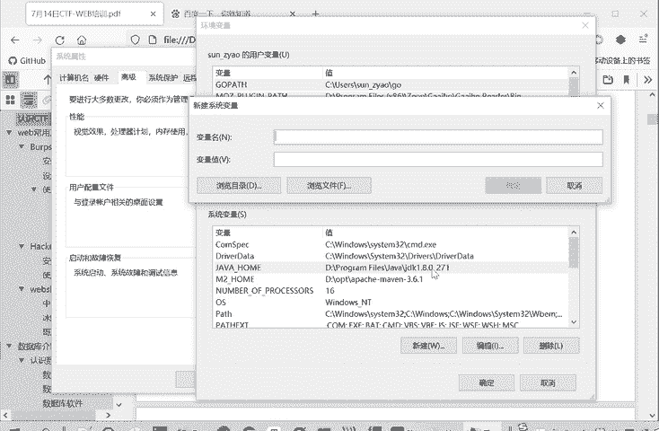
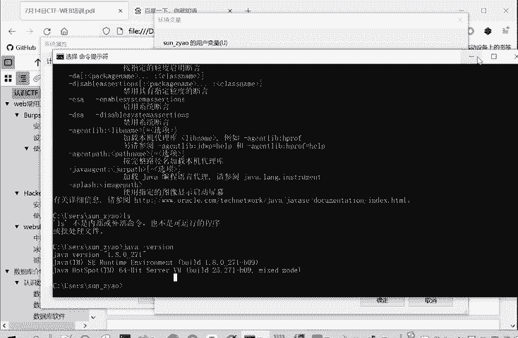
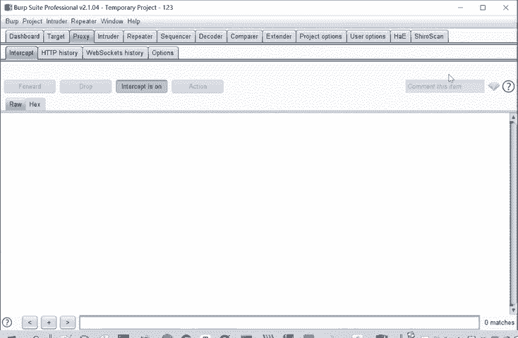

# Kali渗透教程：P68：2.Burpsuite工具安装

## 概述
在本节课中，我们将要学习网络安全渗透测试中一个至关重要的工具——Burpsuite的安装与配置。Burpsuite是进行Web应用安全测试、抓包、改包的必备工具。我们将从Java环境的安装开始，逐步完成Burpsuite的安装与激活。

## Java环境安装与配置
Burpsuite的运行依赖于Java环境，因此我们的第一步是安装Java Development Kit。

以下是安装Java的步骤：
1.  从提供的工具包中找到Java安装程序（例如：`jdk-8u121-windows-x64.exe`）。
2.  双击运行安装程序，按照提示完成安装。安装过程中可以选择默认路径或自定义路径。

安装完成后，需要配置系统环境变量，以确保在任何命令行路径下都能调用Java命令。

配置环境变量的步骤如下：
1.  打开“系统属性”设置（可通过搜索“高级系统设置”找到）。
2.  点击“环境变量”按钮。
3.  在“系统变量”区域，点击“新建”。
4.  设置变量名为 **`JAVA_HOME`**。
5.  设置变量值为你的Java安装路径（例如：`C:\Program Files\Java\jdk1.8.0_121`）。
6.  在“系统变量”中找到 `Path` 变量，点击“编辑”，在末尾添加 **`;%JAVA_HOME%\bin`**。
7.  依次点击“确定”保存所有更改。

验证Java是否安装配置成功：打开命令行（CMD），输入 `java -version`。如果成功显示Java版本信息，则说明安装与配置正确。

## Burpsuite安装与激活
上一节我们介绍了Java环境的搭建，本节中我们来看看Burpsuite的安装与激活流程。

首先，将提供的Burpsuite压缩包解压，你会得到两个关键文件：`burp-loader-keygen.jar`（用于激活）和 `burpsuite_pro_vX.X.X.jar`（主程序）。

为了学习目的，我们需要绕过软件的激活验证。以下是激活步骤：
1.  运行 `burp-loader-keygen.jar` 文件（确保Java环境已配置好）。
2.  在弹出的激活器界面中，点击 **`Run`** 按钮，这将启动Burpsuite。
3.  在Burpsuite启动的激活界面，选择“手动激活”（Manual activation）。
4.  将激活器界面中 `License` 文本框内的全部内容复制，粘贴到Burpsuite激活界面的“许可证密钥”（License Key）框中。
5.  将Burpsuite激活界面中“手动激活”选项下的请求码（Activation Request）全部复制。
6.  回到激活器界面，将复制的请求码粘贴到 `Activation Request` 文本框中，此时 `Activation Response` 框会自动生成响应码。
7.  将自动生成的响应码全部复制，并粘贴回Burpsuite激活界面的响应码（Activation Response）输入框中。
8.  点击“下一步”（Next），即可完成激活。

激活操作只需进行一次。以后每次使用时，都通过运行 `burp-loader-keygen.jar` 并点击 **`Run`** 来启动Burpsuite，无需再次激活。

## 总结
本节课中我们一起学习了Burpsuite工具的完整安装流程。我们首先安装了Java运行环境并配置了系统变量，然后解压Burpsuite工具包，最后通过加载器完成了软件的一次性激活。现在，你已经成功安装并可以启动这个强大的Web安全测试工具，为后续的抓包、改包和漏洞测试实践做好了准备。