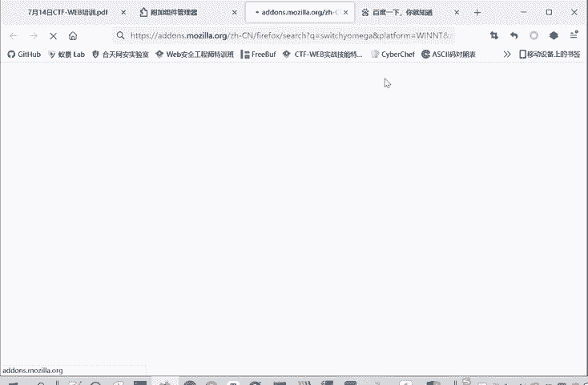
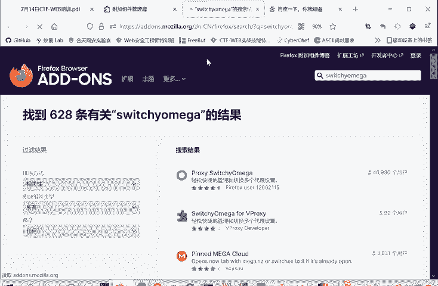
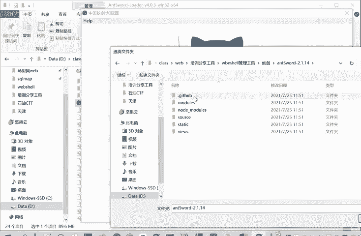
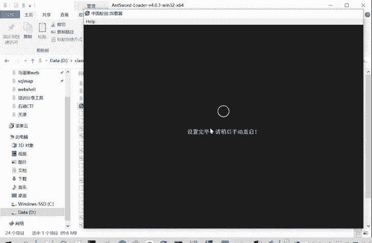
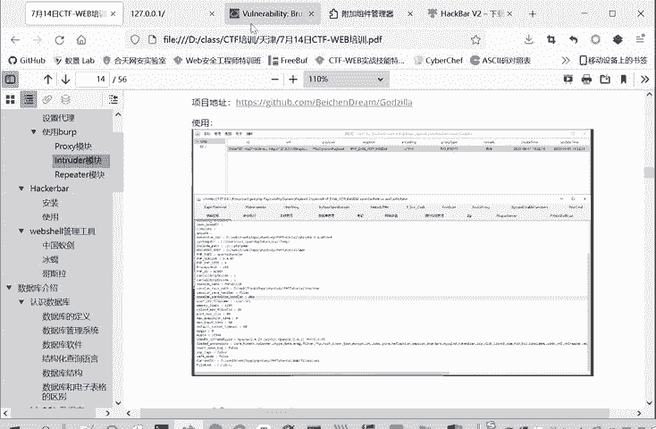
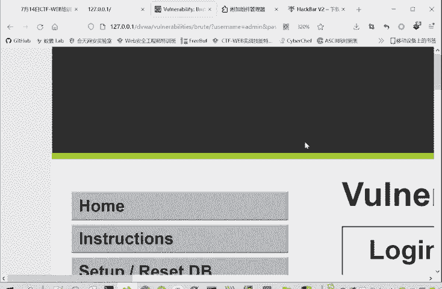
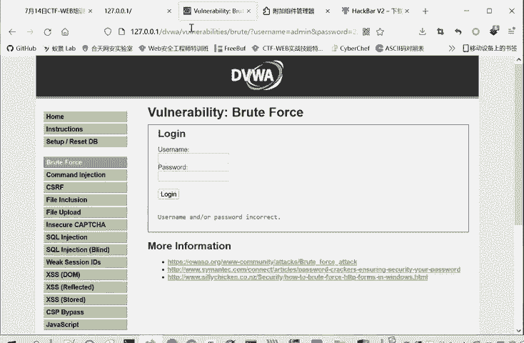
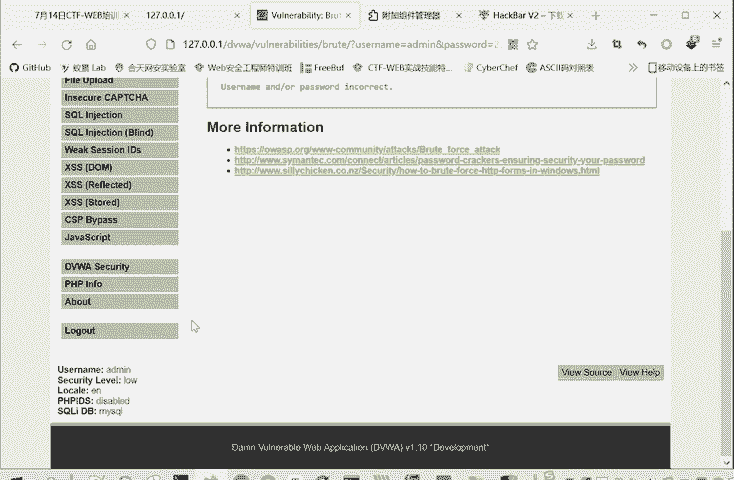

# Kali渗透与网络安全：P69：3.Burpsuite代理模块

## 概述
在本节课中，我们将学习网络安全渗透测试中至关重要的工具——Burpsuite的代理模块。我们将详细讲解如何配置代理、抓取和修改网络数据包，并介绍与之配合使用的其他关键工具，为后续的Web安全测试打下坚实基础。

## 代理与监听的基本原理
Burpsuite是一个用于抓包和改包的工具。为了实现其功能，需要配置代理。代理配置包含两部分：一部分是浏览器或操作系统需要配置代理；另一部分是Burpsuite需要监听这个代理服务器。配置代理意味着浏览器将流量发送到代理服务器，而监听则是Burpsuite接收这些代理流量。

## 代理设置的最佳实践
虽然可以在Windows系统中设置全局代理，但不推荐这样做。因为在抓包和改包过程中会产生大量流量，包括Windows系统自身的联网操作（如检查更新）以及其他浏览器（如火狐、谷歌、IE）的流量。如果在系统层面设置代理，所有流量都会混杂在一起，导致分析目标流量时受到无关流量的严重干扰。因此，推荐在单个浏览器内设置代理，这样只会抓取该浏览器的流量，避免干扰。

### 浏览器代理配置：SwitchyOmega插件
以下是在浏览器中配置代理的推荐方法，使用SwitchyOmega插件。

1.  **安装插件**：在火狐浏览器（或其他浏览器）的扩展商店中搜索“SwitchyOmega”并安装。安装后，浏览器右上角会出现一个圆形图标。
2.  **配置代理情景**：点击插件图标，进入“选项”。可以新建一个情景模式（例如命名为“Burp”）。
    *   **代理协议**：选择HTTP（Burpsuite抓包默认协议）。
    *   **代理服务器**：填写 `127.0.0.1`（本地地址）。
    *   **代理端口**：填写 `8080`（Burpsuite默认监听端口，可自定义）。
    *   **不代理的地址列表**：建议清空，以确保能抓取本地流量（这对搭建本地靶场进行测试至关重要）。
3.  **切换代理**：配置完成后，可以通过点击插件图标快速在不同的代理情景（如Burp代理、直连等）间切换，非常方便。

## Burpsuite监听器配置
在SwitchyOmega中设置好代理后，需要在Burpsuite中配置对应的监听器。

1.  打开Burpsuite，进入 **Proxy** -> **Options** 选项卡。
2.  在 **Proxy Listeners** 部分，确保有一个监听器被勾选。
3.  该监听器的 **IP地址** 应设置为 `127.0.0.1`，**端口** 需要与SwitchyOmega中设置的代理端口保持一致（例如 `8080`）。
4.  建议避免使用 `80`、`443` 等常用端口，以防冲突。

完成以上设置后，Burpsuite就能抓取HTTP流量，进行拦截和分析。

## 抓取HTTPS流量（安装CA证书）
当前设置只能抓取HTTP流量，无法抓取HTTPS流量，因为HTTPS需要数字证书进行验证。Burpsuite本身不是合法的证书颁发机构（CA），因此需要安装其提供的CA证书来“欺骗”客户端，以抓取HTTPS包。

### 证书安装方法
以下是两种安装CA证书的方法：

1.  **浏览器导入（仅对当前浏览器生效）**：
    *   在浏览器中访问 `http://burp`，点击 **CA Certificate** 下载证书文件。
    *   在浏览器设置中（如火狐：`设置` -> `隐私与安全` -> `证书` -> `查看证书` -> `证书颁发机构` -> `导入`），导入下载的证书文件。

2.  **系统安装（推荐，对所有浏览器生效）**：
    *   双击下载的证书文件（`.cer` 或 `.der` 格式）。
    *   在打开的证书安装向导中，选择“将所有的证书都放入下列存储”，点击“浏览”，选择“受信任的根证书颁发机构”。
    *   点击“确定”，并完成后续安装步骤。

推荐使用系统安装方式，这样Burpsuite可以抓取系统中任何浏览器的HTTPS流量，无需为每个浏览器单独配置。

## Burpsuite核心模块详解
成功配置后，我们来了解Burpsuite的核心功能模块。

### Dashboard（仪表盘）
仪表盘显示Burpsuite的总体信息，如运行时间、任务和事件日志，提供全局视图。

### Target（目标）
目标模块显示已抓取流量的目标站点信息，可以查看站点地图和定义测试范围。

### Proxy（代理）
代理模块是最常用的模块，用于拦截、查看和修改HTTP/HTTPS请求与响应。它包含四个子模块：

*   **Intercept（拦截）**：控制是否拦截经过Burpsuite的流量。当拦截开启（Intercept is on）时，请求会暂停在Burpsuite中，允许用户查看和修改后再转发（Forward）或丢弃（Drop）。关闭拦截时，流量正常通过但会被记录。
*   **HTTP history（HTTP历史）**：记录所有经过代理的HTTP/HTTPS请求和响应，即使拦截关闭也会记录。用户可以在此回顾和分析流量。
*   **WebSockets history**：记录WebSocket流量，使用相对较少。
*   **Options（选项）**：用于配置代理监听器、拦截规则等设置。

**工作流程**：浏览器请求先发送到Burpsuite代理，Burpsuite根据拦截设置决定是直接转发给服务器，还是暂停供用户修改。服务器响应同样会经过Burpsuite返回给浏览器。这使得Burpsuite成为一个“中间人”。

### Intruder（入侵者）
入侵者模块用于自动化攻击，如暴力破解密码、枚举标识符等。它包含四个子模块：

*   **Target（目标）**：设置要攻击的目标主机和端口。
*   **Positions（位置）**：定义攻击的“载荷位置”（即需要爆破的变量）。在请求中选中变量，点击 **Add §** 进行标记。
*   **Payloads（载荷）**：为标记的变量设置字典或生成规则。可以从文件导入字典，或手动添加测试用例。
*   **Options（选项）**：设置攻击速度、结果处理等。

**攻击类型**：
*   **Sniper（狙击手）**：对单个位置使用一个载荷列表依次进行测试。
*   **Battering ram（攻城锤）**：对多个位置使用同一个载荷列表进行测试。
*   **Pitchfork（草叉）**：对多个位置使用不同的载荷列表，同步进行测试。
*   **Cluster bomb（集束炸弹）**：对多个位置使用不同的载荷列表，进行交叉组合测试。

**使用示例（爆破DVWA登录密码）**：
1.  在Proxy的HTTP history中找到登录请求包，右键发送到Intruder。
2.  在Positions选项卡，清除自动标记，只将密码字段（如 `password=§root§`）标记为变量。
3.  攻击类型选择 **Sniper**。
4.  在Payloads选项卡，添加或导入密码字典。
5.  点击 **Start attack** 开始攻击。通过比较响应长度（Length）或状态码，找出可能正确的密码。

### Repeater（重放器）
重放器模块用于手动修改和重复发送单个HTTP请求，非常适合精细测试和漏洞验证。你可以修改任何请求参数（如URL、参数、头部），然后点击 **Send** 发送，并观察响应变化。

### 其他模块
*   **Decoder（解码器）**：用于对各种编码（如URL、Base64、HTML）进行编解码。
*   **Comparer（对比器）**：用于比较两次请求或响应的差异。

最常用的三个模块是 **Proxy**、**Intruder** 和 **Repeater**。

## 辅助工具介绍

### HackBar（浏览器插件）
HackBar是火狐浏览器的一个便捷插件，用于快速构建和发送HTTP请求。按F12打开开发者工具，可以找到HackBar面板。它可以方便地设置URL、POST数据、Referer、User-Agent等，对于快速测试非常有用。

### WebShell管理工具
当攻击者成功上传WebShell（网页木马）后，需要使用管理工具进行连接和控制。常见的工具有：

1.  **中国蚁剑（AntSword）**：
    *   基于Node.js，图形化界面友好。
    *   使用前需初始化工作目录（指向源代码文件夹）。
    *   添加数据时，填写目标URL、连接密码（即WebShell中定义的参数名，如 `pass`）和脚本类型即可连接。

2.  **冰蝎（Behinder）**：
    *   基于Java开发，使用AES加密通信，隐蔽性更强。
    *   需要使用配套的专用WebShell（与工具一一对应）。
    *   连接密码需要在工具和WebShell中设置一致的密钥（Key），密码的MD5哈希值需填入WebShell特定位置。

3.  **哥斯拉（Godzilla）**：
    *   功能类似，支持多种脚本类型，加密方式多样。
    *   同样需要上传对应的WebShell进行连接。

掌握多种工具可以应对不同环境，避免因单一工具被防护软件识别而导致无法连接。

### PHPStudy（本地Web环境）
PHPStudy是一个集成了Apache、Nginx、PHP、MySQL的本地服务器环境，用于搭建漏洞靶场和测试环境。

1.  **安装与启动**：解压安装包（路径不要有中文或空格），运行主程序。点击对应版本的 **启动** 按钮，当Apache和MySQL图标变绿即表示启动成功。
2.  **目录结构**：网站根目录通常位于安装路径下的 `www` 文件夹。将靶场文件（如DVWA）放入此目录。
3.  **访问靶场**：在浏览器中访问 `http://127.0.0.1/靶场文件夹名` 即可访问本地搭建的漏洞靶场，如 `http://127.0.0.1/dvwa`。

## 总结
本节课我们一起学习了Burpsuite代理模块的完整配置与核心功能。我们从代理和监听的基本原理出发，详细讲解了如何在浏览器中配置SwitchyOmega插件以及在Burpsuite中设置监听器。为了抓取HTTPS流量，我们学习了安装CA证书的两种方法。接着，我们深入探讨了Burpsuite的Dashboard、Target、Proxy（特别是拦截和历史记录）、Intruder（爆破模块）和Repeater（重放器）等核心模块的用法。最后，我们介绍了HackBar插件、中国蚁剑/冰蝎/哥斯拉等WebShell管理工具以及PHPStudy本地环境搭建方法，这些工具和环境将为后续的渗透测试和漏洞挖掘实践提供重要支持。