# Kali渗透测试教程：P6：Metasploit免杀技巧

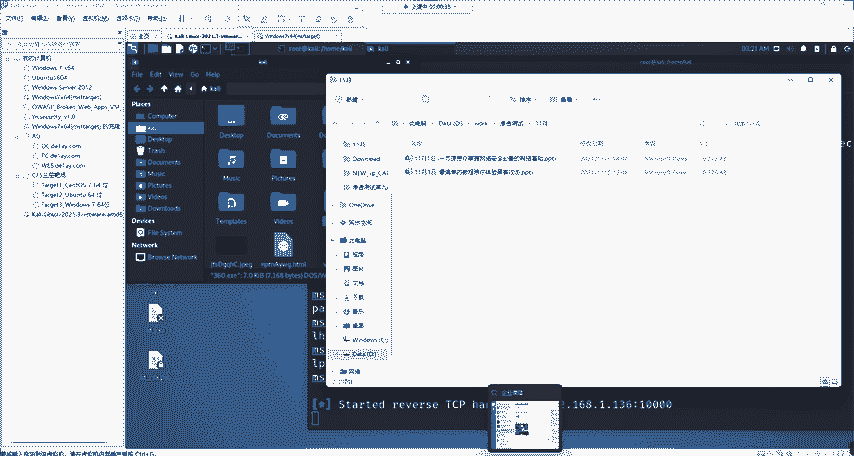

在本节课中，我们将要学习如何让Metasploit生成的后门程序绕过杀毒软件的检测，这是渗透测试中至关重要的一步。我们将重点介绍一种简单有效的免杀方法——加壳，并演示其实际效果。

## 杀毒软件的工作原理与免杀必要性

首先需要清楚杀毒软件存在的目的。其主要功能是防御木马和病毒入侵，保护用户系统安全。作为渗透测试人员，我们的目标是让生成的后门程序不被杀毒软件查杀，否则攻击将无法成功。因此，进行免杀操作是必要的。

## 基础免杀方法：加壳

最基础且能有效躲避安全软件探测的免杀方法是加壳。加壳技术分为压缩壳和加密壳，其最初目的是防止软件被反编译和盗版，起到保护软件的作用。既然木马也是一个软件，那么加壳同样可以保护木马不被杀毒软件查杀。

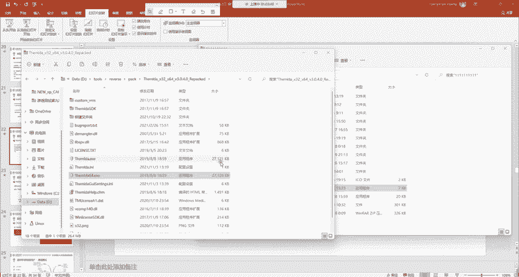

网络上存在多种加壳软件，例如：
*   **UPX**
*   **穿山甲 (ASPack)**
*   **虚拟机保护壳 (如Themida)**

不同的壳针对不同杀毒软件的效果可能不同，需要自行尝试，因为杀毒软件的病毒库也在持续更新。

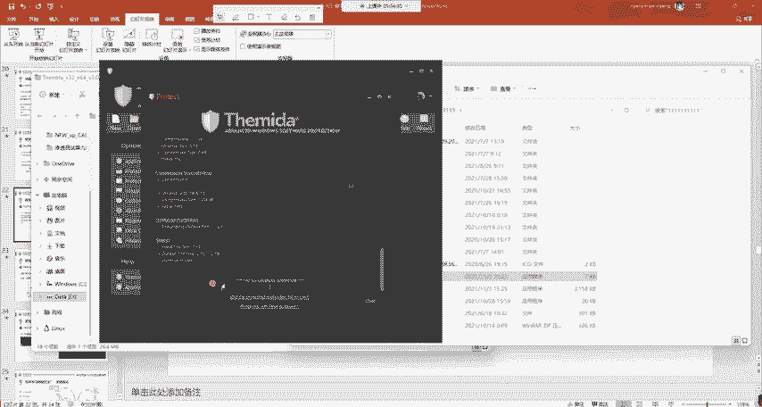

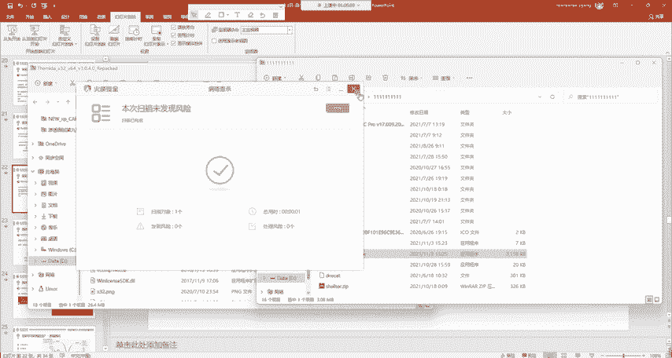

## 实战演示：使用Themida进行加壳

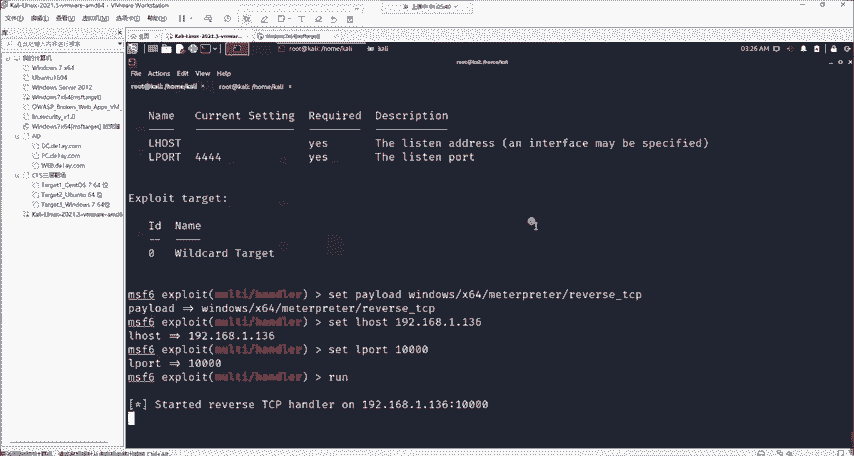

以下将演示如何使用Themida壳对后门程序进行加壳处理。

1.  **准备阶段**：首先，确保你的后门程序（本例中名为`360.exe`）已被杀毒软件检测并隔离。我们将其从隔离区“提取”出来（而非“恢复”），这样杀毒软件仍会继续监控它。
2.  **运行加壳工具**：打开Themida加壳程序。
3.  **加载目标文件**：将需要加壳的后门程序文件直接拖入Themida的界面中。
4.  **执行加壳**：无需修改任何设置，直接点击 **`Protect`** 按钮。
5.  **完成**：程序提示 **`Successful`** 后，会在同目录下生成一个加了壳的新文件（例如`360_protected.exe`）。

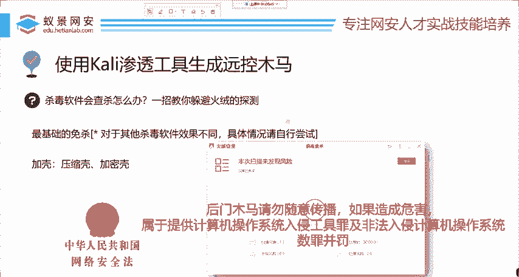

此时，使用杀毒软件扫描新生成的文件，会发现它已成功绕过检测。这意味着“鱼钩”已经准备好，可以通过社会工程学手段（如伪装成其他软件）诱使目标运行。

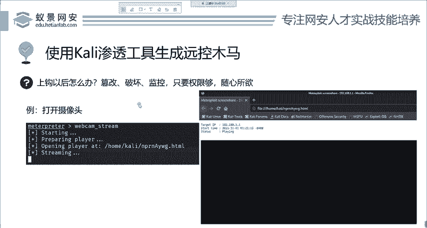

**重要警告**：此类免杀后门程序严禁随意传播或用于非法攻击。未经授权对他人计算机使用，可能构成“提供侵入、非法控制计算机信息系统程序、工具罪”及“非法侵入计算机信息系统罪”，将承担法律责任。渗透测试必须在获得明确授权的前提下进行。

## 后门利用演示：远程摄像头控制

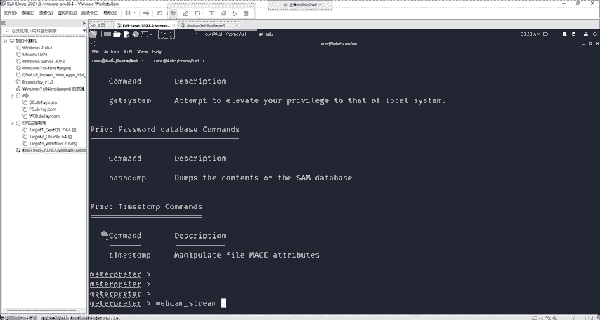

当目标运行了我们的后门程序后，我们便获得了其系统的控制权。以下演示如何远程开启目标摄像头。

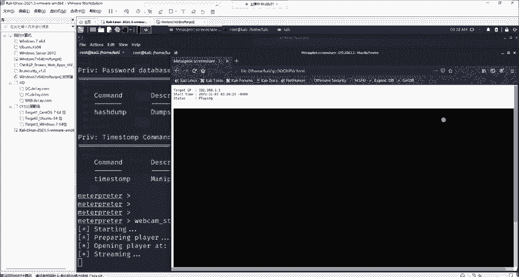

在Metasploit的Meterpreter会话中，可以执行以下命令：
1.  首先检查目标机器是否装有摄像头：
    ```
    webcam_list
    ```
2.  如果存在摄像头，可以使用以下命令进行拍照或开启视频流：
    ```
    webcam_snap  // 拍摄一张照片
    webcam_stream  // 开启实时视频流
    ```

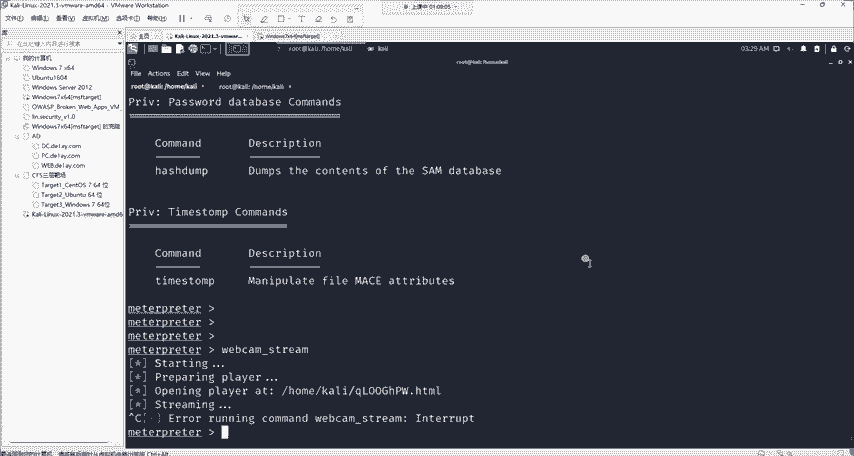

通过这种方式，攻击者可以在受害者毫无察觉的情况下进行监控。这解释了为什么许多安全从业人员会用贴纸遮盖摄像头。

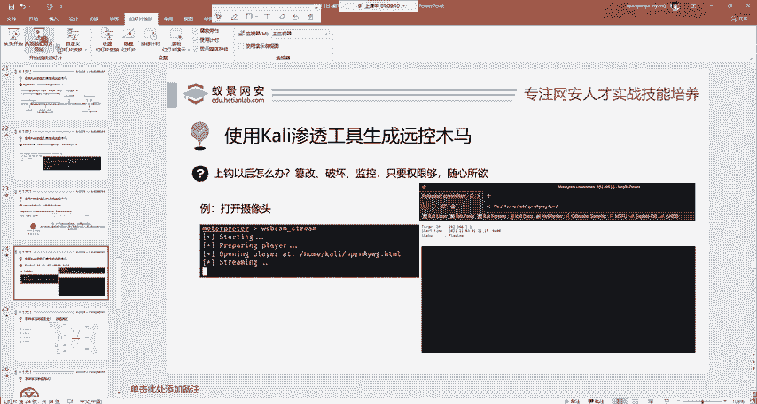

## 课程总结

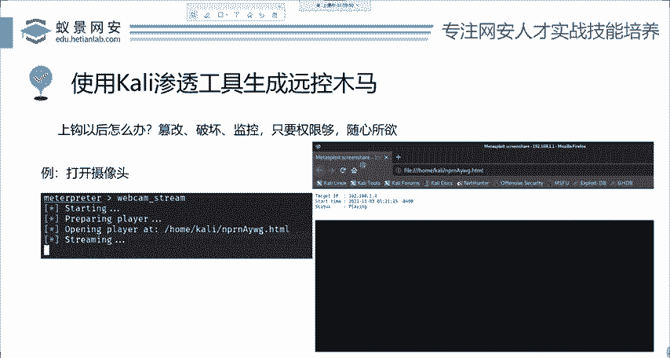

本节课中我们一起学习了以下核心内容：
1.  **Metasploit基础**：回顾了Metasploit框架的基础使用模式。
2.  **漏洞利用**：讲解了如何利用“永恒之蓝”漏洞攻击未打补丁的Windows 7系统。
3.  **后门生成与免杀**：重点介绍了在没有直接漏洞时，如何生成后门程序并通过**加壳**技术绕过杀毒软件，进行“钓鱼”攻击。
4.  **后门利用**：演示了在获取控制权后，如何进行远程摄像头监控等操作。

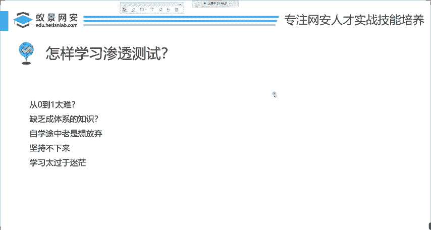

渗透测试领域知识体系庞大，本节内容仅是其中的一个切入点。如果你对网络安全感兴趣，并希望进行系统化、深入的学习，可以关注相关的专业培训课程。