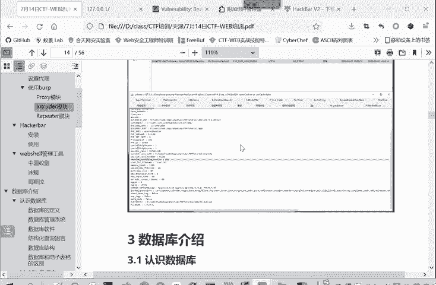
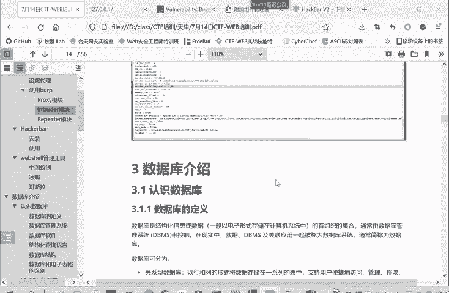
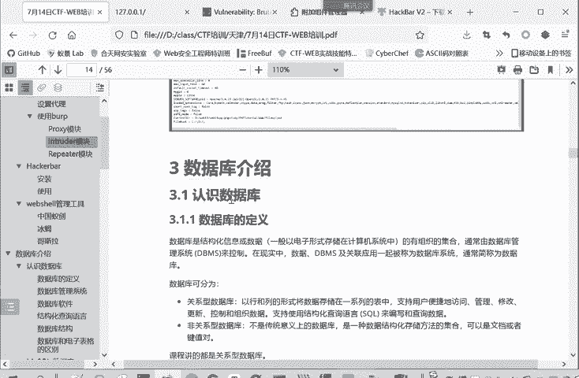
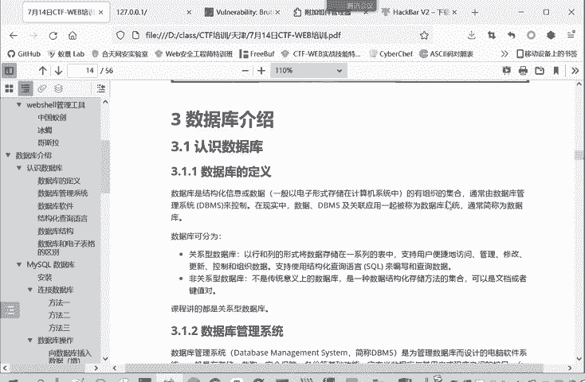
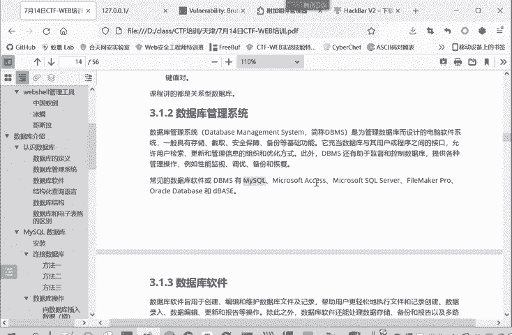
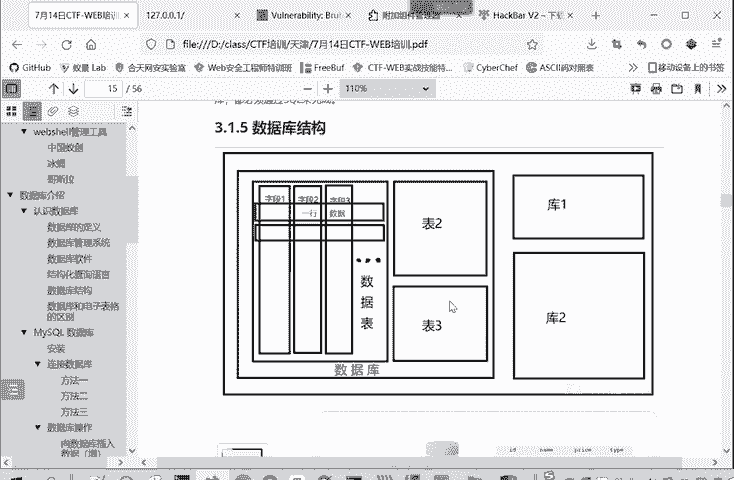
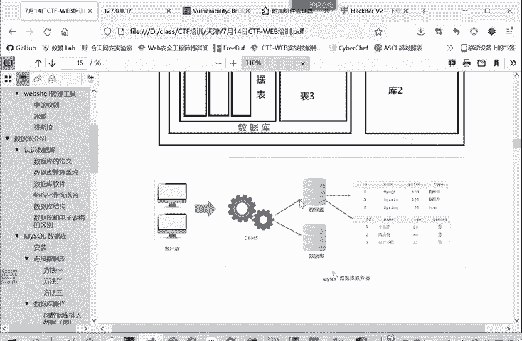
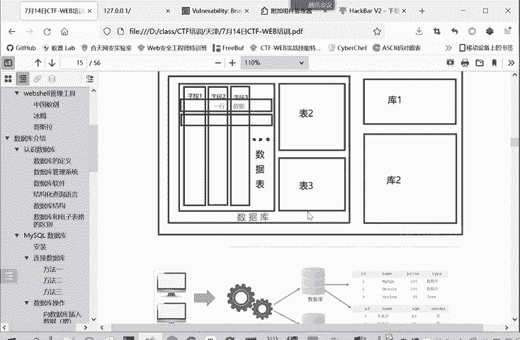
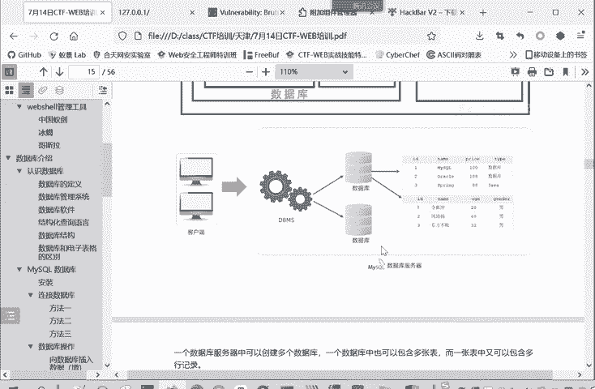
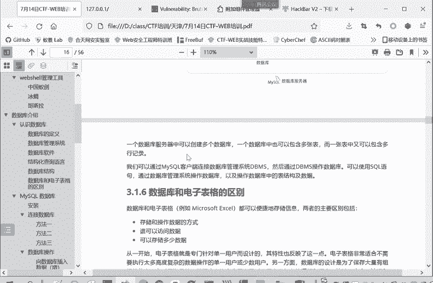

# 数据库基础：P70：4.认识数据库 🗄️

在本节课中，我们将要学习数据库的基础知识，为后续理解SQL注入攻击打下坚实的理论基础。我们将介绍数据库的概念、类型、结构以及核心的操作语言。

## 概述

数据库是存储和管理数据的核心系统。本节课程将帮助你理解什么是数据库、数据库管理系统（DBMS）以及结构化查询语言（SQL）。我们将重点介绍关系型数据库，特别是MySQL，并解释数据库的基本结构。

## 数据库简介

数据库是一个结构化信息或数据的有组织集合。在计算机领域，信息通常以数据的形式存在。数据库通常由数据库管理系统（DBMS）进行控制。在实际应用中，数据、数据库管理系统及其相关软件常被统称为“数据库”或“数据库管理系统”，并未做严格区分。

## 数据库类型

数据库主要分为两种类型：关系型数据库和非关系型数据库。

上一节我们介绍了数据库的基本概念，本节中我们来看看数据库的具体分类。

以下是两种主要数据库类型的介绍：

*   **关系型数据库**：以行和列的形式将数据存储在一系列表中。它支持用户便捷地访问、管理、修改和控制数据。关系型数据库支持使用**结构化查询语言（SQL）**来编写和执行查询。这是我们传统的主流数据库类型。
*   **非关系型数据库**：并非传统意义上的关系型数据库。它是一种数据结构化存储的集合。非关系型数据库不以固定的行和列形式存储数据，也不能直接用SQL语言查询。其数据存储方式更灵活，但也更复杂。

我们课程主要学习关系型数据库，因为后续讲解的SQL注入攻击，其前提就是目标系统使用支持SQL语言的数据库。

## 数据库管理系统（DBMS）

数据库管理系统（DBMS）是为了管理数据库而设计的电脑软件系统。它具有存储、检索、安全保障和备份等基础功能。DBMS实际上是数据库与用户或应用程序之间的接口，用户或程序通过DBMS来使用和控制数据库。

常见的数据库管理系统有：
*   **MySQL**（本课程重点）
*   Microsoft Access
*   Microsoft SQL Server
*   Oracle

## 结构化查询语言（SQL）

结构化查询语言（Structured Query Language），取其首字母简称为SQL。我们常说的SQL注入，就是指这种语言的注入攻击。SQL是一种特殊目的的编程语言，专门为操作数据库而设计，用于查询数据以及存储、更新、管理数据库系统。

无论使用何种编程语言（如Java、Python、C等）编写程序，只要涉及操作关系型数据库，都需要使用SQL语言及其语法规则。其核心操作可以概括为“增删改查”（CRUD）。

## 数据库结构

理解了数据库的操作语言后，我们再来看看数据库的内部是如何组织的。

一个数据库服务器（或DBMS）中可以管理多个**数据库**。
每个数据库中包含多张**数据表**。
每张数据表由**行**（记录）和**列**（字段）组成，类似于一个Excel表格。
每个表中有多个**字段**（如ID、姓名、年龄），以及多条**记录**（每一行是一个人的完整数据）。

另一种理解角度是：客户端或应用程序通过数据库管理系统（如MySQL）访问某个具体的数据库，进而操作其中的某张表，对表中的记录进行增删改查。

这两种描述内容一致，只是呈现形式不同，旨在帮助大家更好地理解。简而言之：**一个数据库服务器中有多个数据库，一个数据库中有多张表，一张表中有多行记录和多个字段。**

## 数据库与电子表格的区别

数据库和电子表格（如Excel）的主要区别在于存储和操作数据的方式不同。

以下是它们的主要区别点：

*   **设计目的**：数据库用于存储大量数据，并通过SQL语言操作；电子表格用于存储少量数据，并通过软件界面操作。
*   **访问方式**：数据库支持多人同时访问（如众多用户同时访问网站数据）；电子表格主要为单一用户设计。
*   **数据容量**：数据库可存储海量有组织的信息；电子表格存储容量相对较小，处理大数据时性能不足。
*   **用户设计**：电子表格为单一用户设计；数据库为保存大量信息并允许多用户同时使用而设计。

## 重点介绍：MySQL数据库

MySQL是一种开源的关系型数据库管理系统，基于SQL。它专为Web应用进行过优化，可以在任何平台（Windows, Linux, macOS）上运行。

MySQL的一个主要特点是**灵活**。互联网的兴起带来了许多新的、不同的需求，MySQL因其灵活、可扩展的特性，成为了Web开发人员和基于Web的应用程序的首选平台。许多顶级的互联网网站和Web应用都采用MySQL作为其数据管理系统。

## 总结

本节课中我们一起学习了数据库的基础知识。我们了解了数据库的定义、关系型与非关系型数据库的区别、数据库管理系统（DBMS）的作用、以及核心的结构化查询语言（SQL）。我们还剖析了数据库的层次结构（服务器->数据库->表->记录/字段），并比较了数据库与电子表格的差异。最后，我们重点介绍了本课程将频繁使用的MySQL数据库及其特点。掌握这些概念是理解后续SQL注入攻击原理的关键。