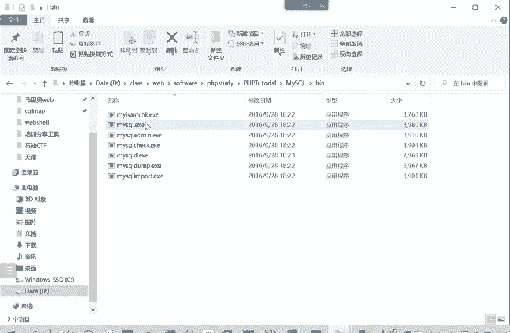
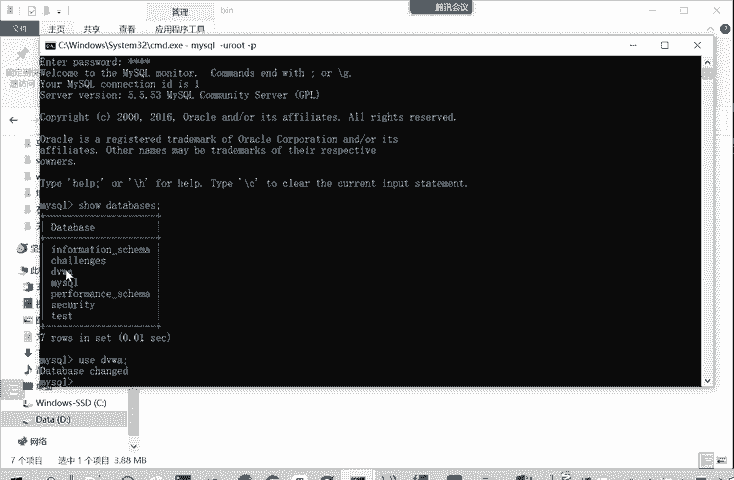

# Kali渗透与网络安全：P71：数据库的安装与连接 🗄️

在本节课中，我们将学习如何在渗透测试环境中安装和连接MySQL数据库。我们将重点介绍三种主要的连接方法，并解释它们各自的应用场景。

## 概述

上一节我们介绍了PHPStudy集成环境的基础。本节中我们来看看MySQL数据库的安装与连接。由于PHPStudy是一个集成环境，它已经包含了MySQL，因此我们无需单独安装数据库软件。

PHPStudy是一个WAMP集成环境。其中，**W**代表Windows操作系统，**A**代表Apache服务器，**M**代表MySQL数据库，**P**代表PHP后端语言。启动PHPStudy即同时启动了这些服务。

## 连接MySQL数据库的三种方法

启动了数据库服务后，我们需要知道如何连接并进行操作。主要有以下三种连接方法。



### 1. 通过命令行工具连接

第一种方法是使用MySQL自带的命令行客户端进行连接。PHPStudy的安装目录中包含了此工具。

以下是具体操作步骤：
*   在PHPStudy的安装目录下，找到 `mysql/bin` 文件夹。
*   运行其中的 `mysql.exe` 程序。
*   在命令行中，使用以下命令格式进行连接：
    ```bash
    mysql -u 用户名 -p
    ```
*   按回车后，输入密码即可成功连接。
*   连接成功后，可以使用SQL命令操作数据库，例如：
    ```sql
    SHOW DATABASES; -- 查看所有数据库
    USE database_name; -- 使用某个特定数据库
    ```



通过这种方式，我们可以进入并管理特定的数据库，例如DVWA靶场所需的数据库。

### 2. 通过数据库管理软件连接

第二种方法是使用图形化的数据库管理软件，这种方式更为直观便捷。PHPStudy自带了一个名为“MySQL Front”的工具。

以下是具体操作步骤：
*   在PHPStudy面板中找到“MySQL管理器”并选择“MySQL Front”。
*   首次使用时，需要新建一个连接。
*   设置连接名称（可任意填写），主机地址填写本地地址（如`localhost`或`127.0.0.1`），并输入正确的用户名和密码。
*   保存后，每次即可直接使用此连接信息登录。
*   连接后，可以直观地看到所有数据库。例如，DVWA靶场的数据库包含`guestbook`和`users`等表，表中存储了用户ID、姓名、用户名、密码及登录时间等信息。

除了MySQL Front，PHPStudy也提供了通过网页进行管理的phpMyAdmin。但通常我们更习惯使用独立的客户端软件进行连接和管理。

### 3. 通过编程语言连接（以PHP为例）

以上两种方法适用于用户直接管理数据库。然而，当普通用户访问网站时，网站后端程序需要代表用户查询数据库，这就需要通过编程语言来建立连接。

以下是以PHP语言为例的连接方式，其他如JSP等语言原理类似。核心在于使用数据库连接函数。

关键连接代码如下：
```php
$connection = mysqli_connect($servername, $username, $password, $dbname);
```
在这行代码中，你需要提供数据库服务器的地址（`$servername`）、登录用户名（`$username`）、密码（`$password`）以及要连接的数据库名（`$dbname`）。这是网站开发中后端程序与数据库交互所必需的连接方式。

## 总结


本节课中我们一起学习了MySQL数据库在渗透测试环境中的连接方法。我们了解到，对于日常管理，可以通过**命令行工具**或**图形化软件（如MySQL Front）**进行连接和操作；而对于网站运行时的数据交互，则需要通过**后端编程语言（如PHP）**来建立连接。理解这些不同的连接方式，是进行Web安全测试和代码审计的重要基础。