# 网络安全系统教学合集：P72：数据库基本操作

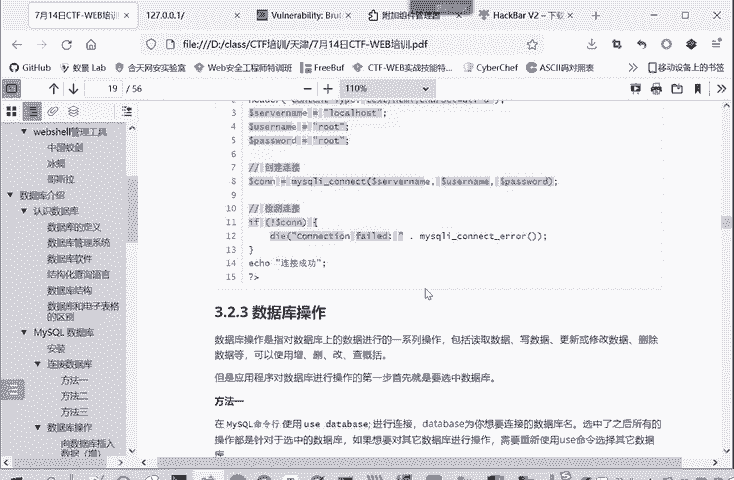

在本节课中，我们将要学习数据库的基本操作。这些操作是后续学习SQL注入等Web安全测试技术的基础。我们将重点介绍如何使用SQL命令对数据库进行“增删改查”，并了解一个关键的内部数据库——`information_schema`。

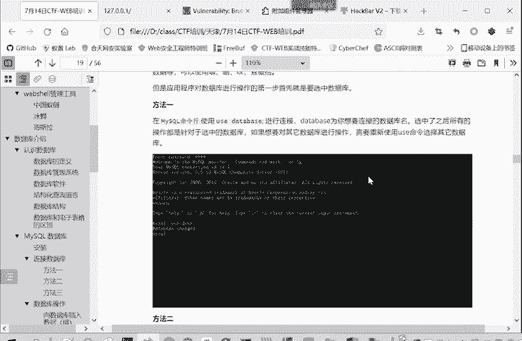

## 选择数据库

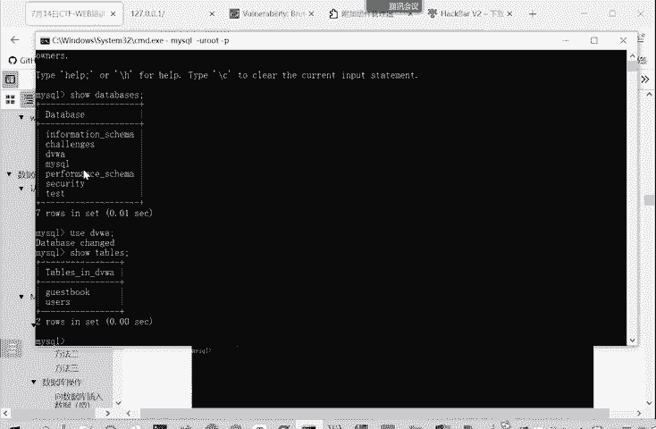

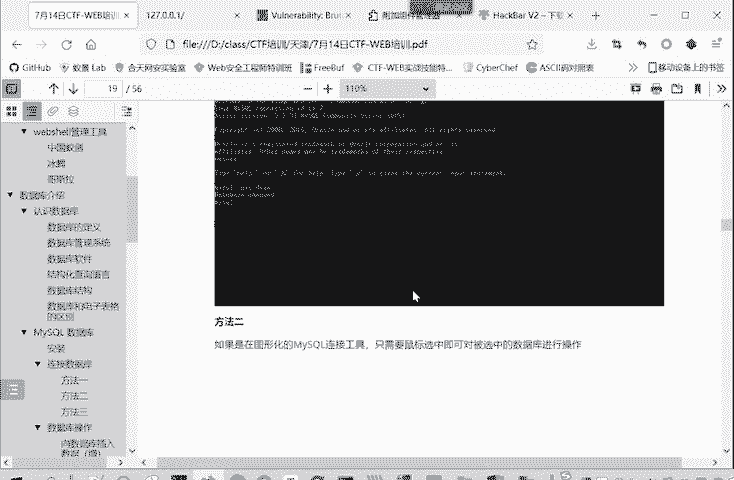

在对数据库进行任何操作之前，首先需要选择要操作的数据库。这相当于告诉数据库系统，你后续的所有命令都针对这个特定的数据库。

以下是选择数据库的三种方法：

1.  **命令行**：使用 `USE` 语句。
    ```sql
    USE database_name;
    ```
2.  **图形化软件**：在软件界面中直接用鼠标点击选择目标数据库。
3.  **网站开发**：在PHP等语言中，使用如 `mysqli_select_db()` 函数。

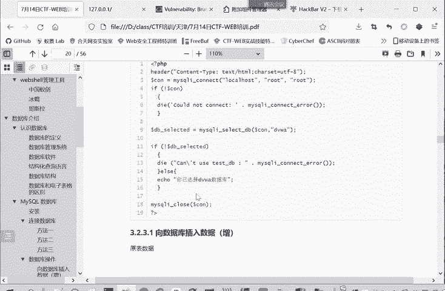

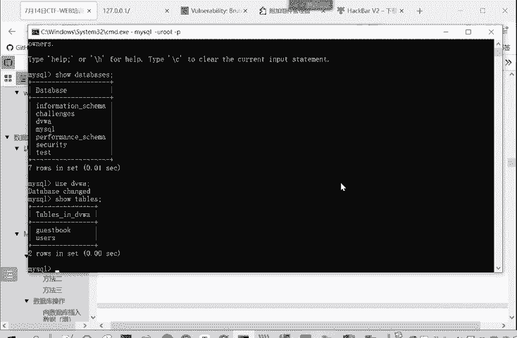

本教程将重点讲解在命令行中的操作方法，因为这在CTF比赛和安全测试中更为常用。

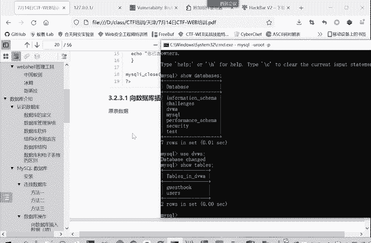

## 数据操作：增删改查

上一节我们介绍了如何选择数据库，本节中我们来看看如何对数据库中的数据进行核心操作，即“增删改查”。

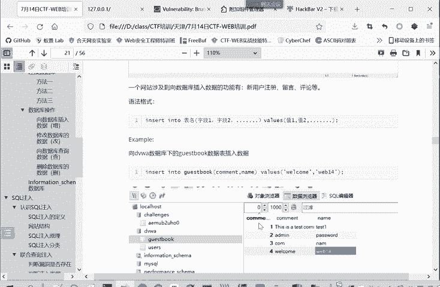

### 增加数据 (INSERT)

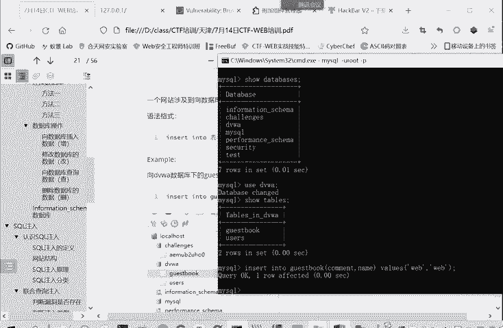

`INSERT` 语句用于向表中添加新的数据行。

以下是向 `guestbook` 表插入一条记录的示例：
```sql
INSERT INTO guestbook (comment, name) VALUES ('test comment', 'test user');
```
*   `INSERT INTO` 后接表名。
*   括号内指定要插入数据的字段名。
*   `VALUES` 后接对应字段的值，字符串值需要用引号括起来。

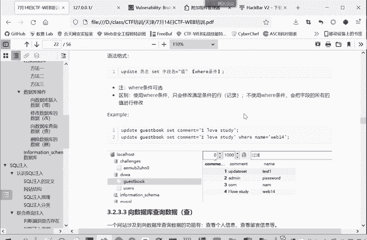

### 修改数据 (UPDATE)

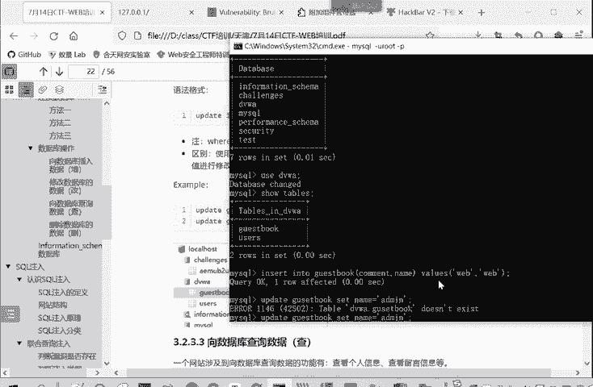

`UPDATE` 语句用于修改表中已有的数据。

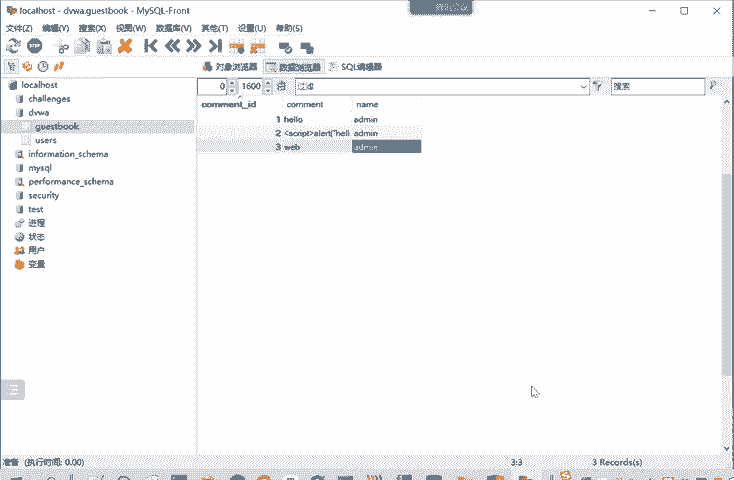

以下是更新 `guestbook` 表中数据的示例：
```sql
-- 更新所有行的 name 字段
UPDATE guestbook SET name = 'admin';

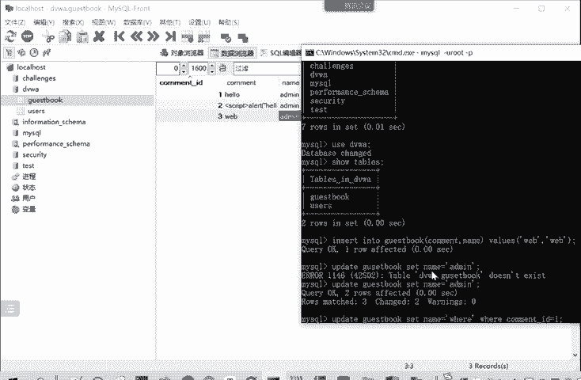

-- 仅更新 comment_id 为 1 的行的 name 字段
UPDATE guestbook SET name = 'where' WHERE comment_id = 1;
```
*   `UPDATE` 后接表名。
*   `SET` 指定要修改的字段及其新值。
*   `WHERE` 子句用于限定修改哪些行。**如果不加 `WHERE` 条件，将修改表中所有行。**

### 查询数据 (SELECT)

`SELECT` 语句用于从表中查询数据，这是最常用的操作。

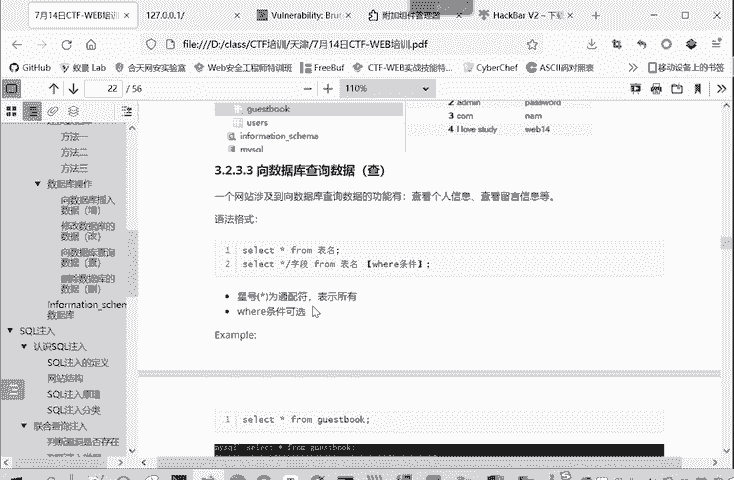

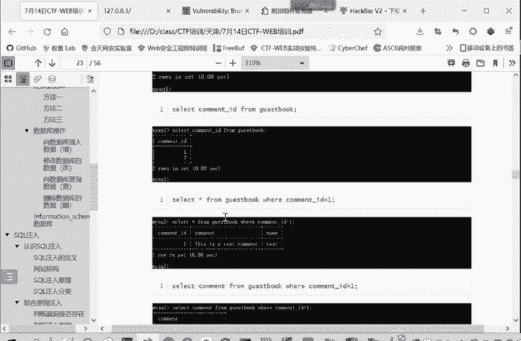

以下是查询 `guestbook` 表数据的示例：
```sql
-- 查询表中所有数据的所有字段
SELECT * FROM guestbook;

-- 只查询 name 和 comment 字段
SELECT name, comment FROM guestbook;

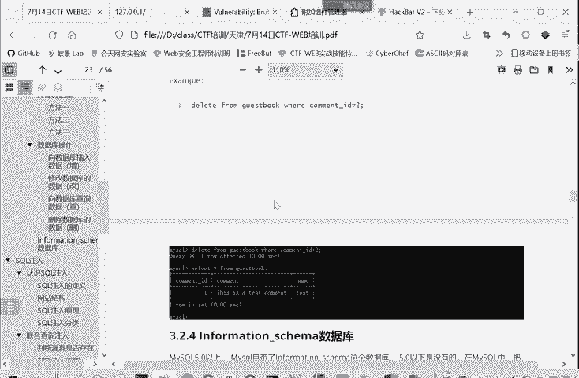

-- 查询 comment_id 为 2 的记录
SELECT * FROM guestbook WHERE comment_id = 2;
```
*   `SELECT` 后接要查询的字段名，`*` 代表所有字段。
*   `FROM` 后接表名。
*   `WHERE` 子句用于过滤查询结果。

### 删除数据 (DELETE)

`DELETE` 语句用于从表中删除数据行。

以下是删除 `guestbook` 表中数据的示例：
```sql
-- 删除 comment_id 为 2 的记录
DELETE FROM guestbook WHERE comment_id = 2;
```
*   `DELETE FROM` 后接表名。
*   **务必谨慎使用 `DELETE` 语句。如果不加 `WHERE` 条件，将删除表中所有数据。**

## 关键系统数据库：information_schema

掌握了基本的增删改查后，我们需要了解一个MySQL自带的特殊数据库——`information_schema`。它存储了关于MySQL服务器维护的所有其他数据库的元信息（即数据的数据），在安全测试中至关重要。

`information_schema` 数据库中有很多表，我们重点掌握以下三个核心表：

1.  **`schemata` 表**：存储了当前MySQL实例中所有**数据库**的信息。
    *   关键字段：`schema_name` (数据库名)

2.  **`tables` 表**：存储了所有数据库中的**表**的信息。
    *   关键字段：`table_schema` (表所属的数据库名)， `table_name` (表名)

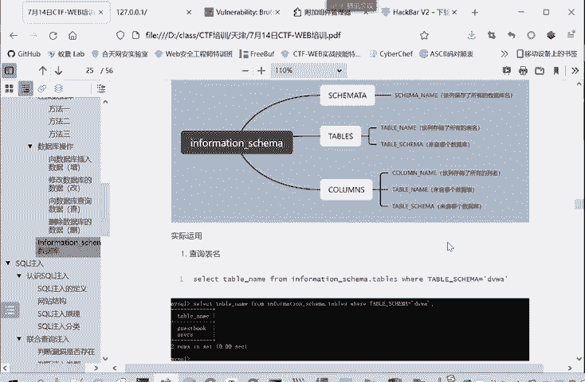

3.  **`columns` 表**：存储了所有表中**字段（列）** 的信息。
    *   关键字段：`table_schema` (字段所属的数据库名)， `table_name` (字段所属的表名)， `column_name` (字段名)

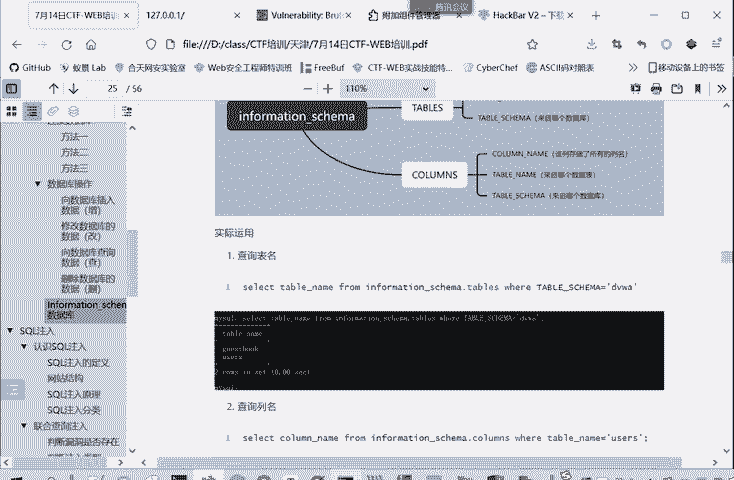

### 应用示例

在SQL注入中，当无法直接使用 `SHOW DATABASES` 或 `SHOW TABLES` 等命令时，可以通过查询 `information_schema` 来获取数据库结构。

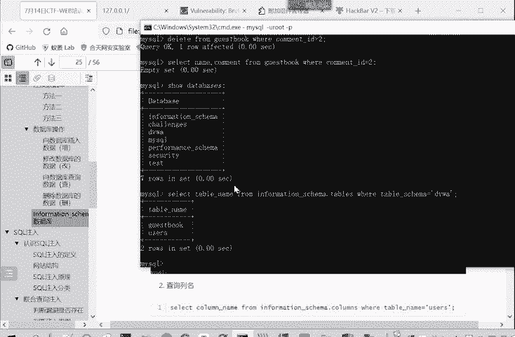

以下是利用 `information_schema` 进行查询的示例：

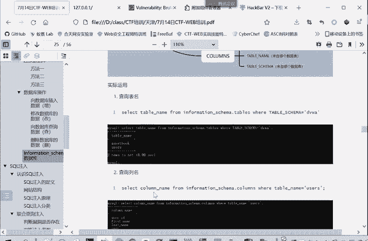

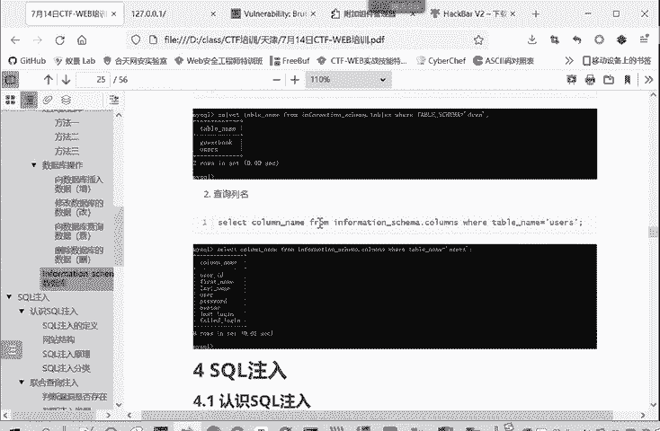

```sql
-- 查询当前数据库（如DVWA）中的所有表名
SELECT table_name FROM information_schema.tables WHERE table_schema = 'dvwa';

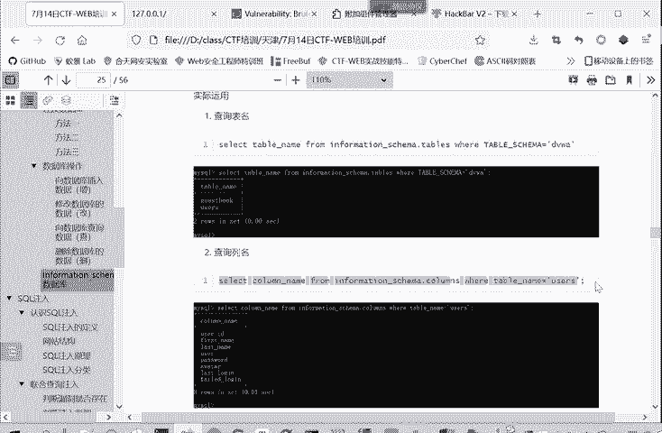

-- 查询指定表（如users）中的所有字段名
SELECT column_name FROM information_schema.columns WHERE table_schema = 'dvwa' AND table_name = 'users';
```

## 总结

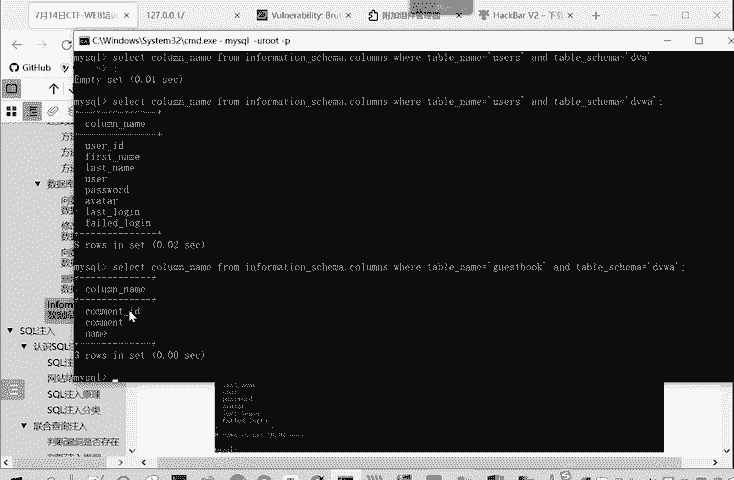

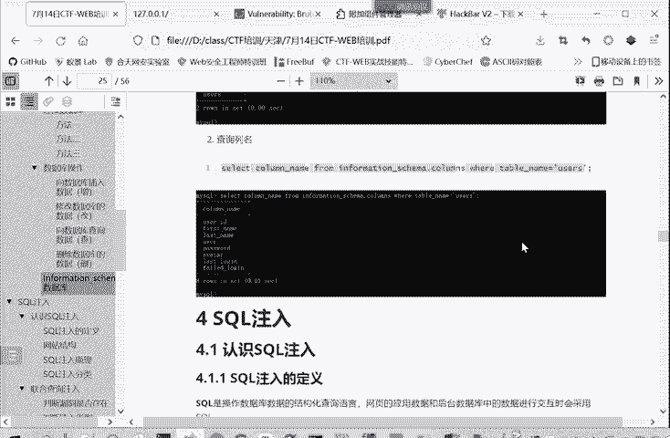

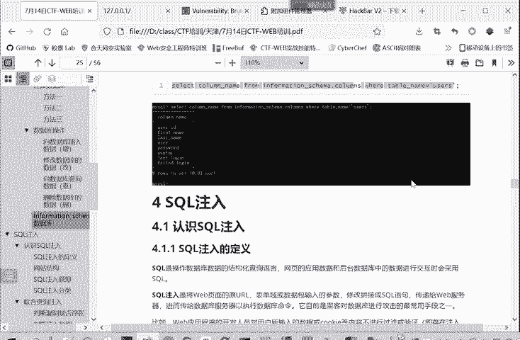

本节课中我们一起学习了数据库的基本操作。我们首先了解了如何选择目标数据库，然后详细讲解了使用SQL语句进行数据**增(INSERT)、删(DELETE)、改(UPDATE)、查(SELECT)** 的方法，并强调了 `WHERE` 条件子句的重要性。最后，我们介绍了MySQL的系统数据库 `information_schema` 及其核心表（`schemata`, `tables`, `columns`），这些知识是后续进行SQL注入漏洞探测和利用的基石。请务必熟练掌握这些基本命令和概念。