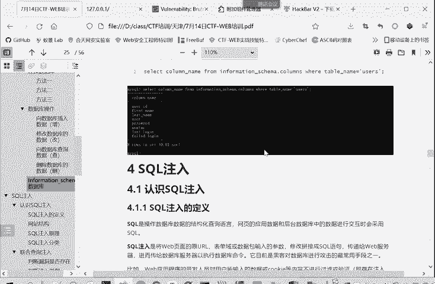
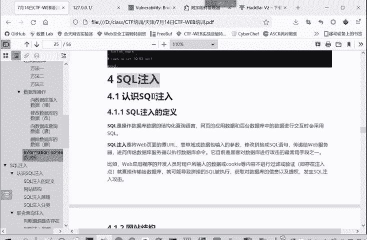
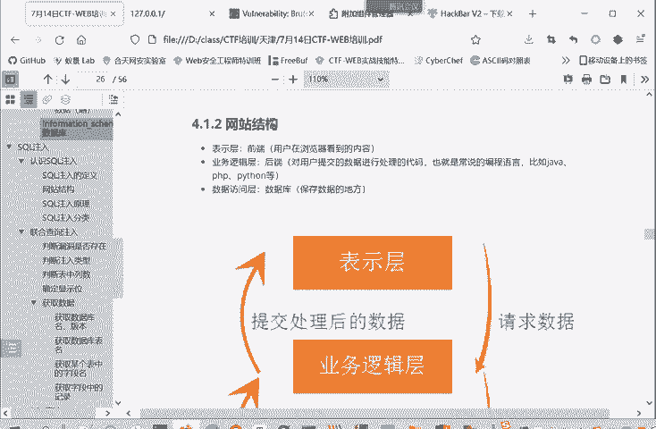
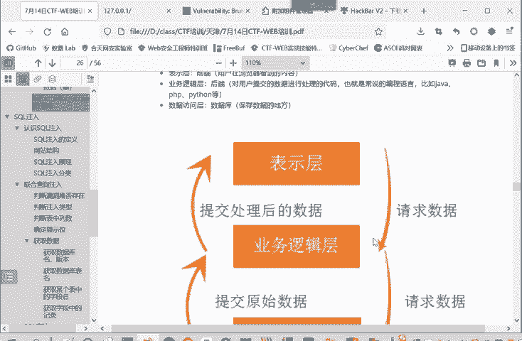
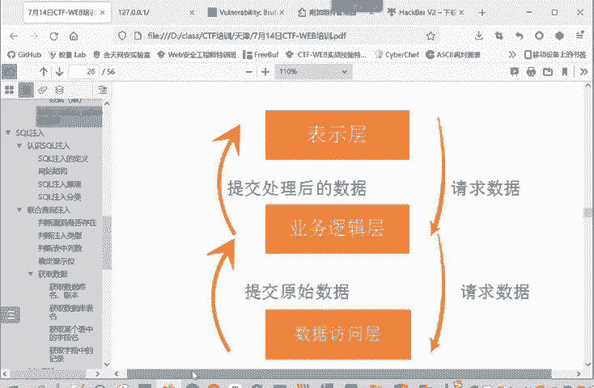
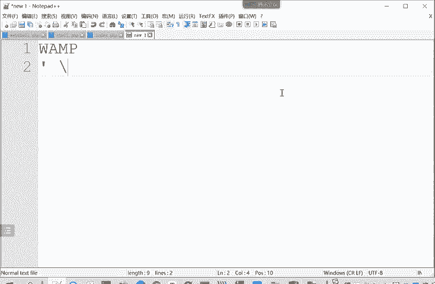
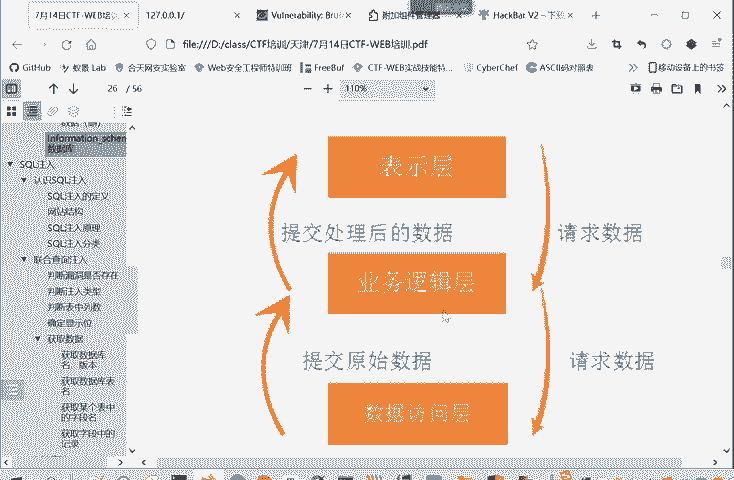
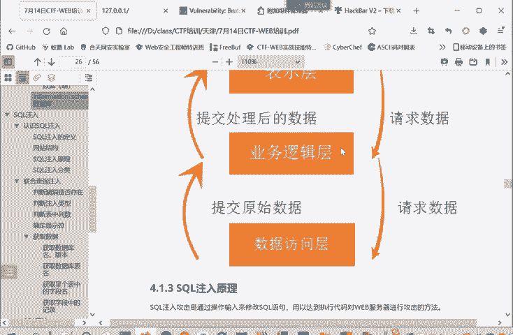
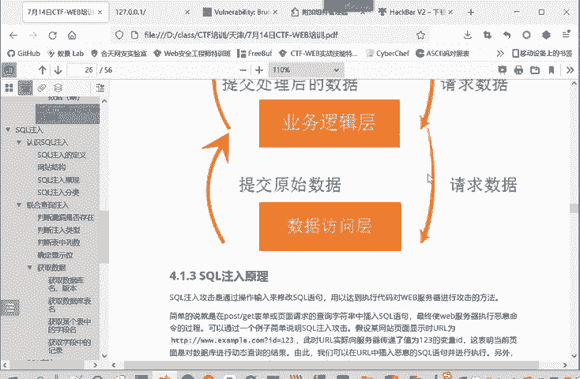
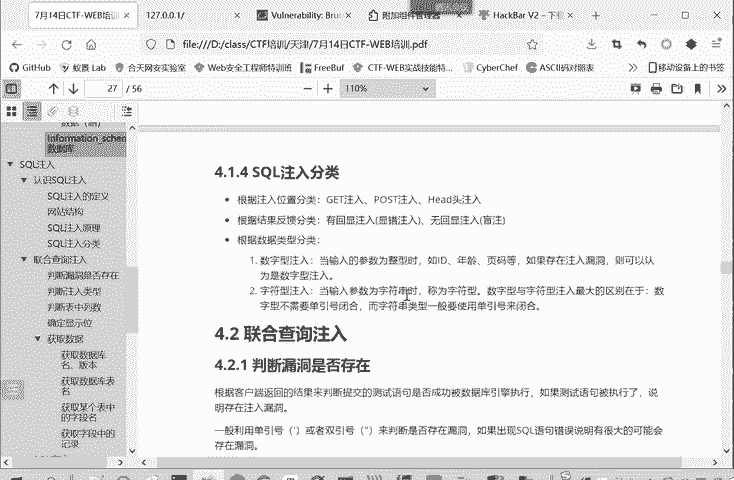

# 网络安全系统教学合集：P73：认识SQL注入 🎯



在本节课中，我们将要学习SQL注入漏洞的基本概念、原理及其分类。这是Web安全领域中最常见且重要的攻击方式之一。



## 网站结构概述

为了更好地理解SQL注入的逻辑，我们首先需要了解一个典型网站的三层结构。

*   **表示层**：也称为前端，即用户通过浏览器看到的界面。它负责将用户的请求发送给后端。
*   **业务逻辑层**：也称为后端，由Java、Python、PHP等编程语言编写。它处理用户提交的数据和业务逻辑。
*   **数据访问层**：即数据库。当业务逻辑层需要获取或操作数据时，会向数据库发起查询请求。

用户在前端输入的数据，会经由业务逻辑层处理，并可能被用于构造发送给数据库的查询语句。正是这个传递和处理过程，为SQL注入创造了条件。



## 什么是SQL注入？

SQL是用于操作数据库的结构化查询语言。绝大多数关系型数据库都支持SQL。

SQL注入是指攻击者通过修改Web页面中原始的URL、表单或数据包中的输入参数，将恶意SQL代码“拼接”或“注入”到完整的SQL语句中。当这个被篡改的语句被发送到Web服务器并执行时，攻击者就能实现对数据库的非法操作。



因此，SQL注入是目前黑客攻击数据库最常用的手段之一，也是最常见的Web漏洞之一。



## SQL注入原理



SQL注入的核心原理，是通过用户输入来篡改原本的SQL语句，从而达到欺骗服务器执行恶意命令的目的。



具体来说，当用户在GET、POST请求或Cookie中提交数据时，如果程序将这些输入数据**未经充分检查**就直接拼接到SQL语句中，那么攻击者输入的恶意SQL代码就会被服务器当作正常命令的一部分执行。

这通常发生在程序**动态构造**SQL语句时。例如，业务逻辑层根据用户输入的不同（如用户ID）来查询不同的数据，而不是查询固定的数据。这种灵活性带来了安全风险。

以下是一个简单的例子：



假设一个网站的URL是：`http://example.com/page.php?id=123`
后端用于查询的SQL语句可能是：
```sql
SELECT * FROM articles WHERE id = ‘$id’
```
这里，`$id` 的值来自用户输入的 `123`。所以实际执行的语句是：
```sql
SELECT * FROM articles WHERE id = ‘123’
```



但是，如果攻击者将输入改为 `123‘ OR ‘1’=‘1`，那么拼接后的SQL语句就变成了：
```sql
SELECT * FROM articles WHERE id = ‘123‘ OR ‘1’=‘1’
```
由于 `‘1’=‘1‘` 这个条件永远为真，这条语句可能会返回数据表中的所有文章，而不仅仅是ID为123的那一篇。这就成功实现了一次SQL注入攻击。

## SQL注入的分类

SQL注入可以根据不同的维度进行分类，了解这些分类有助于我们识别和利用漏洞。

### 按注入点位置分类
根据恶意输入被提交的位置，可以分为：
*   **GET型注入**：参数通过URL的GET方法传递。
*   **POST型注入**：参数通过表单的POST方法传递。
*   **Header头注入**：参数在HTTP请求头中传递，常见于Cookie注入。

### 按反馈方式分类
根据服务器是否返回详细的错误信息或查询结果，可以分为：
*   **有回显注入**：页面会直接显示SQL语句的执行结果或错误信息。包括报错注入、联合查询注入等。
*   **无回显注入（盲注）**：页面不会显示SQL执行结果，但攻击者可以通过其他方式（如页面响应时间、布尔状态）来推断信息。主要包括时间盲注和布尔盲注。

### 按参数类型分类
根据后端程序处理输入参数的方式，可以分为：
*   **数字型注入**：输入的参数被当作整数处理。例如：`WHERE id = $id`，这里的 `$id` 两边没有引号。
*   **字符型注入**：输入的参数被当作字符串处理，通常会用引号包裹。例如：`WHERE username = ‘$name‘`。

回顾之前的例子 `WHERE id = ‘$id’`，因为变量 `$id` 被单引号包裹，所以它属于**字符型注入**。攻击时通常需要闭合前面的引号。而对于数字型注入，由于参数两边没有引号，则无需考虑引号闭合问题。

---



本节课中，我们一起学习了SQL注入的基本概念、三层网站结构下的攻击原理，以及SQL注入的主要分类。理解这些基础知识是后续进行SQL注入漏洞挖掘、利用和防御的关键第一步。