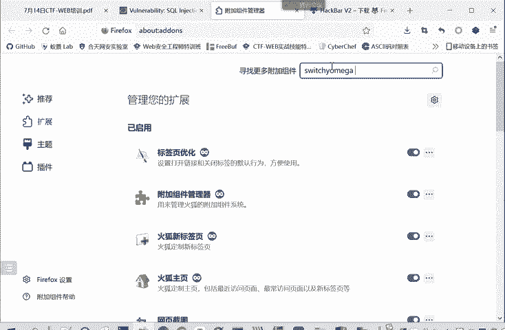
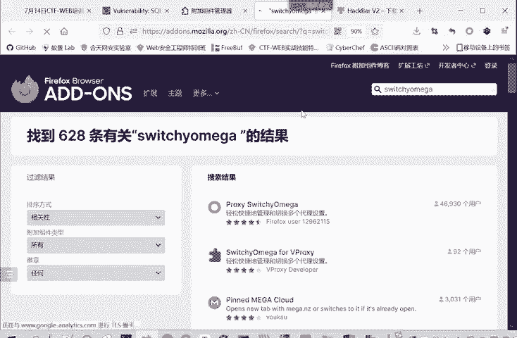
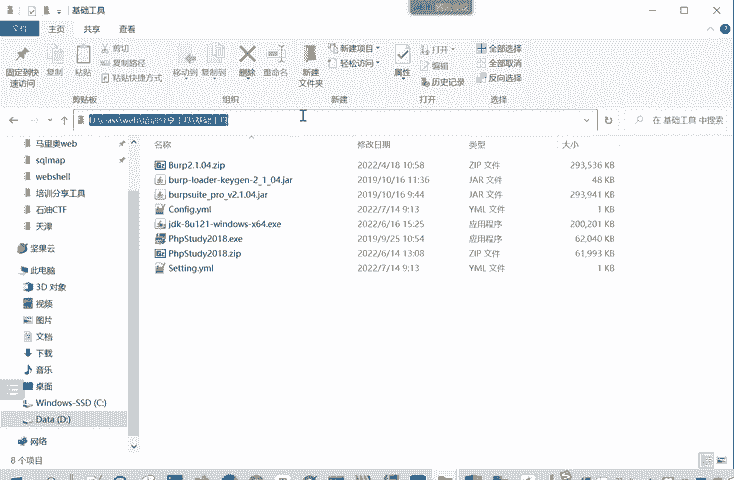
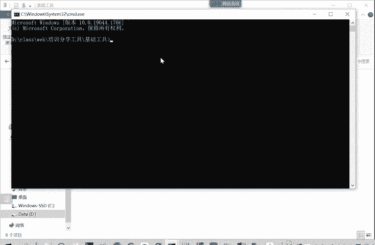
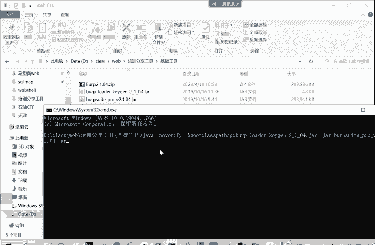
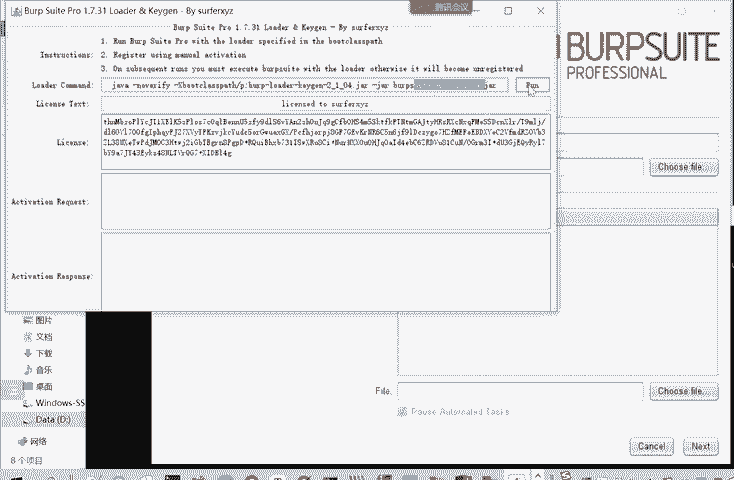
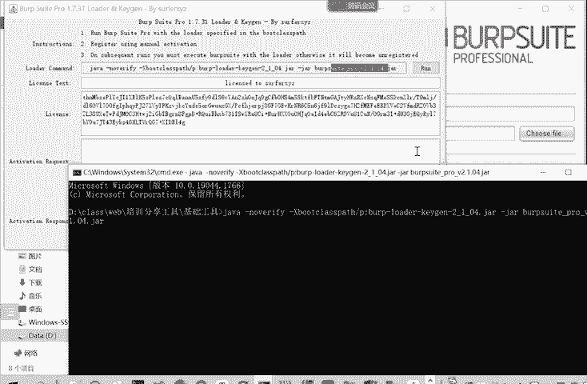
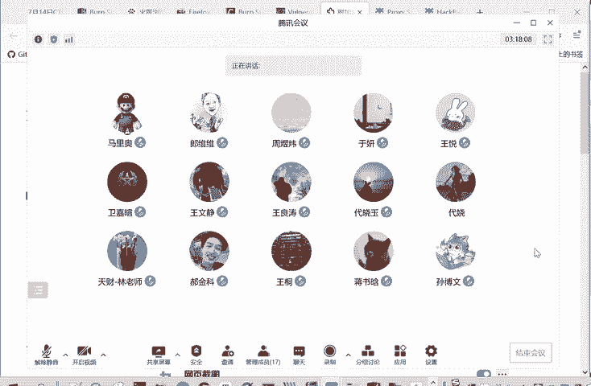

# Kali渗透测试与网络安全：P74：联合查询注入

在本节课中，我们将学习SQL注入攻击中的一种核心方法——联合查询注入。我们将从判断漏洞是否存在开始，逐步讲解如何确定注入类型、查询列数、定位显示位，并最终利用联合查询获取数据库信息。整个过程将结合DVWA靶场进行演示，确保初学者能够理解并掌握。

## 概述：什么是联合查询注入？

联合查询注入是一种SQL注入技术。攻击者根据客户端返回的结果，判断提交的测试语句是否被数据库引擎成功执行。如果语句被执行，则说明存在SQL注入漏洞。

通常使用英文的单引号 `‘` 或双引号 `“` 来判断是否存在漏洞。如果输入后页面返回SQL语句错误，则很大可能存在漏洞。

---

## 第一步：判断漏洞是否存在

我们首先需要判断目标是否存在SQL注入漏洞。

**方法**：在用户输入点（如ID参数）后添加一个英文单引号 `‘`。

**原理**：如果后端SQL语句是字符型（例如 `WHERE id=‘$id‘`），我们输入 `1‘` 会导致SQL语句变为 `WHERE id=‘1‘‘`，从而多出一个引号，造成语法错误。如果页面返回数据库错误信息，则表明可能存在漏洞。

在DVWA靶场的“SQL Injection”模块，输入用户ID为 `1‘`。
```
ID = 1‘
```
执行后，页面提示“You have an error in your SQL syntax”，这证实了漏洞的存在。

> **注意**：所有命令必须使用英文符号。使用中文符号可能导致难以排查的错误。

---

## 第二步：判断注入类型

发现漏洞后，需要判断注入点是数字型还是字符型。

**方法**：输入 `1 and 1=1` 和 `1 and 1=2`，观察页面返回结果是否相同。

**原理分析**：
*   **数字型注入**：SQL语句类似 `WHERE id=$id`。输入 `1 and 1=1`（真）和 `1 and 1=2`（假）会导致整个查询条件真假不同，从而返回结果**不同**。
*   **字符型注入**：SQL语句类似 `WHERE id=‘$id‘`。输入 `1‘ and ‘1‘=‘1` 和 `1‘ and ‘1‘=‘2`。由于MySQL的隐式类型转换，字符串 `‘1‘=‘2‘` 在比较时可能被转换为数字比较，或者因为逻辑错误而导致两者返回结果**相同**。

在DVWA中输入：
```
ID = 1‘ and ‘1‘=‘1
ID = 1‘ and ‘1‘=‘2
```
发现两者返回结果相同，说明这是**字符型注入**。

---

## 第三步：确定查询结果的列数

联合查询注入（UNION）要求前后两个SELECT语句查询的列数必须相同。因此，我们需要先确定原查询返回多少列数据。

**方法**：使用 `ORDER BY` 子句进行猜测。
`ORDER BY n` 表示按第n列排序。如果n超过实际列数，数据库会报错。

在DVWA中尝试：
```
ID = 1‘ order by 1 -- 
ID = 1‘ order by 2 -- 
ID = 1‘ order by 3 -- 
```
当输入 `order by 3` 时，页面报错，提示未知列。由此可知，原查询语句返回 **2** 列数据。

> **说明**：`-- `（后面有一个空格）是SQL注释符，用于注释掉原SQL语句中后续的代码，例如闭合的单引号。在URL中，需要将其编码为 `--%20`。

---

## 第四步：确定数据回显位

我们知道查询返回2列后，需要使用UNION查询来获取数据。但我们需要知道我们注入查询的结果会显示在页面的哪个位置（即“显示位”）。

**方法**：使用UNION SELECT连接一个简单的查询，用数字标记列的位置。

在DVWA中输入：
```
ID = -1‘ union select 1,2 -- 
```
**解释**：
*   `ID = -1‘` 确保前一个查询不返回结果，使得页面只显示我们UNION查询的结果。
*   `union select 1,2` 执行一个返回两列（值分别为1和2）的查询。

执行后，页面显示“1”和“2”。这表明：
*   原查询结果的**第一列**显示在页面“First name”区域。
*   原查询结果的**第二列**显示在页面“Surname”区域。

---

## 第五步：利用联合查询获取信息

确定了显示位，我们就可以替换 `select 1,2` 中的数字，来查询我们想要的数据库信息了。





**1. 查询数据库版本和当前数据库名**
```
ID = -1‘ union select version(), database() -- 
```
执行后，在“First name”位置显示MySQL版本号（如5.5.53），在“Surname”位置显示当前数据库名（如dvwa）。

**2. 查询数据库中的所有表名**
MySQL的 `information_schema.tables` 表存储了所有表的信息。
```
ID = -1‘ union select 1, table_name from information_schema.tables where table_schema=‘dvwa‘ -- 
```
执行后，在“Surname”位置会列出dvwa数据库中的所有表名（如guestbook, users）。

**3. 查询指定表的所有字段名**
知道了表名（例如users表），我们可以查询它的字段。
```
ID = -1‘ union select 1, column_name from information_schema.columns where table_name=‘users‘ -- 
```
执行后，会列出users表的所有字段名（如user_id, first_name, last_name, user, password）。





**4. 查询表中的具体数据**
最后，我们可以提取敏感数据，例如用户名和密码。
```
ID = -1‘ union select user, password from users -- 
```
执行后，即可在页面上看到所有的用户名和经过哈希加密的密码。





> **重要声明**：本教程所有操作均在授权的DVWA靶场中进行，仅用于网络安全技术学习。未经授权对任何真实网站进行渗透测试是违法行为，请务必遵守法律法规。



---

## 总结

本节课我们一起学习了联合查询注入的完整流程：
1.  **判断漏洞**：使用单引号触发SQL语法错误。
2.  **判断类型**：通过 `and 1=1` 和 `and 1=2` 测试区分数字型与字符型注入。
3.  **确定列数**：使用 `ORDER BY` 子句递增测试，直到报错。
4.  **定位显示位**：使用 `UNION SELECT 1,2,3...` 并结合一个不存在的ID（如-1）来查看数据回显位置。
5.  **获取信息**：逐步查询数据库版本、库名、表名、字段名和最终数据。



联合查询注入是一种高效、直观的SQL注入方法，但它依赖于页面能够直接回显数据库查询结果。在下午的课程中，我们将学习当页面没有直接回显时的注入技术——SQL盲注，以及自动化工具SQLmap的使用。