# 网络安全系统教学合集：P75：DVWA靶场搭建 🎯

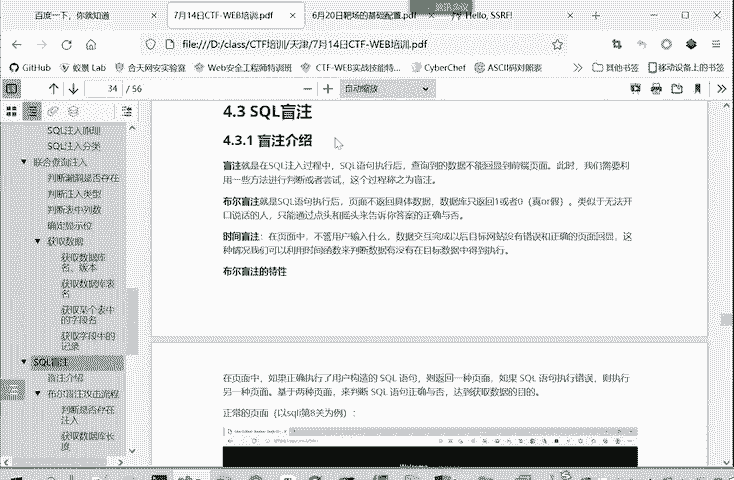

## 概述
在本节课中，我们将学习如何安装和配置DVWA（Damn Vulnerable Web Application）靶场。DVWA是一个著名的、全面的Web安全练习平台，用于学习和实践渗透测试技术。

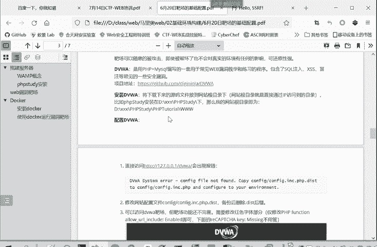

---

## 靶场文件准备
上一节我们介绍了课程背景，本节中我们来看看如何获取和放置DVWA文件。

首先，需要从课程群文件中下载DVWA的压缩包。下载完成后，文件名为`DVWA-master.zip`。

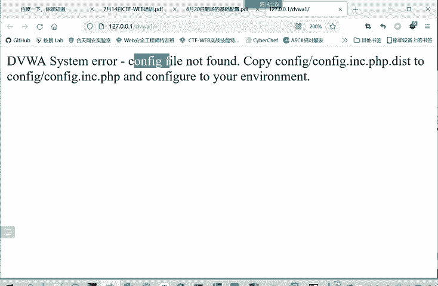

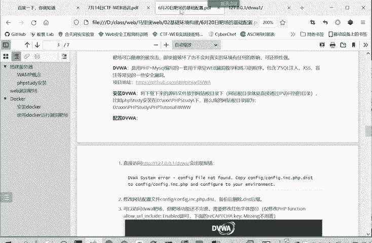

以下是文件处理的步骤：
1.  将`DVWA-master.zip`文件解压。
2.  将解压后的文件夹放置到PHPStudy的`www`目录下。你可以在`www`目录下新建子文件夹存放，但必须确保文件位于`www`目录内。
3.  为便于区分，可以将文件夹重命名，例如`DVWA1`。

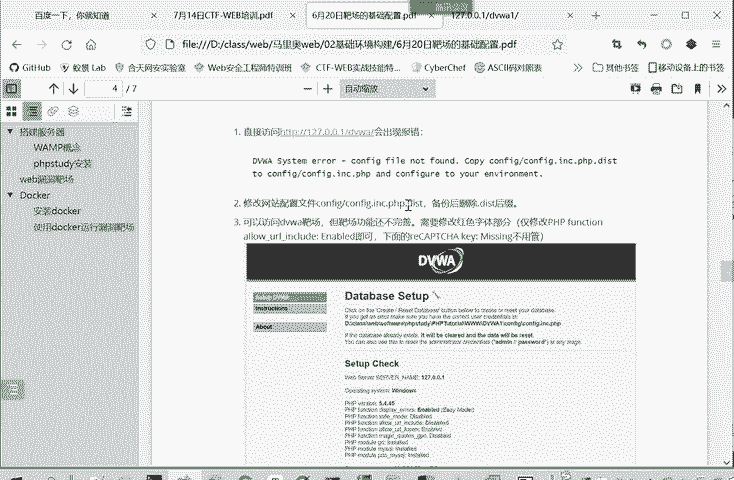

## 启动服务与初次访问
文件放置好后，我们需要启动Web服务并进行初次访问。

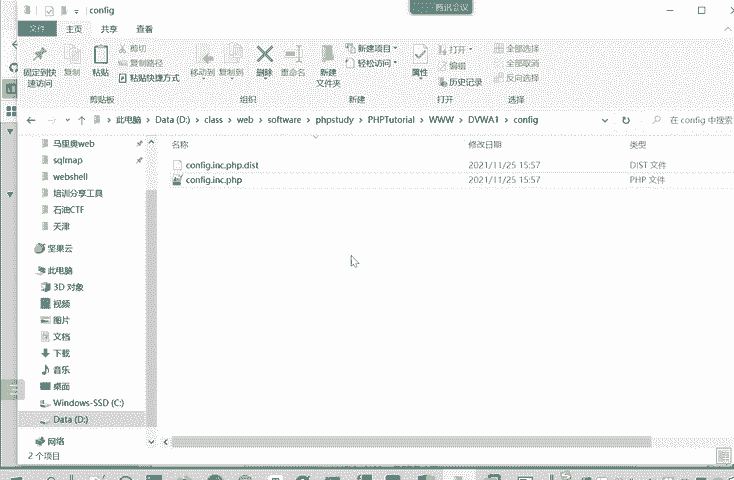

以下是启动和访问的步骤：
1.  打开并启动PHPStudy，确保Apache和MySQL服务显示为绿色（启动成功）。
2.  在浏览器中访问本地地址：`http://127.0.0.1/DVWA1`（请根据你实际的文件夹名称调整路径）。

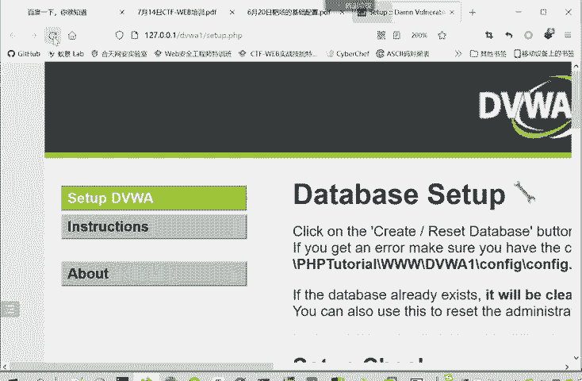

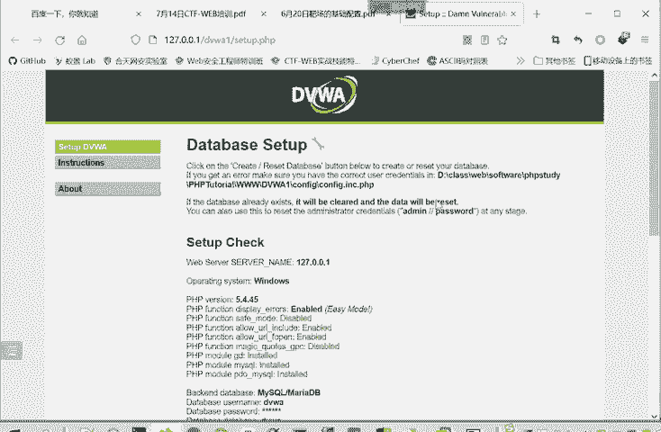

## 解决配置文件错误
首次访问时，通常会遇到一个系统错误提示：“配置文件未找到”。这是正常现象。

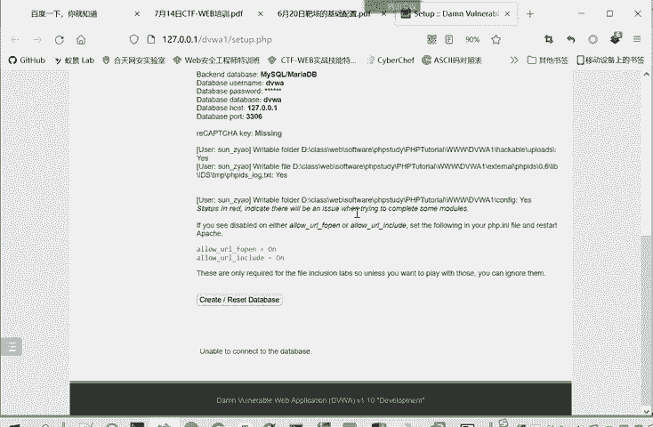

以下是解决此问题的步骤：
1.  进入DVWA文件夹的`config`目录。
2.  找到名为`config.inc.php.dist`的文件。
3.  将此文件复制一份，并将副本重命名为`config.inc.php`（即去掉`.dist`后缀）。为安全起见，建议保留原文件作为备份。
4.  完成重命名后，刷新浏览器中的DVWA页面，之前的错误提示将消失。

## 调整PHP配置以启用漏洞
此时页面可能显示一些红色警告信息，例如“PHP function allow_url_include: Disabled”。这会影响部分漏洞（如文件包含漏洞）的练习环境。

以下是调整PHP配置的步骤：
1.  在PHPStudy面板中，点击“其他选项菜单”。
2.  选择“打开配置文件” -> `php.ini`。
3.  在打开的配置文件中，找到 `allow_url_fopen` 和 `allow_url_include` 两项。
4.  将它们的值从 `Off` 修改为 `On`。
    ```ini
    allow_url_fopen = On
    allow_url_include = On
    ```
5.  保存文件，并回到PHPStudy面板重启服务，使修改生效。

> **注意**：如果暂不练习文件包含漏洞，此步骤可以跳过。

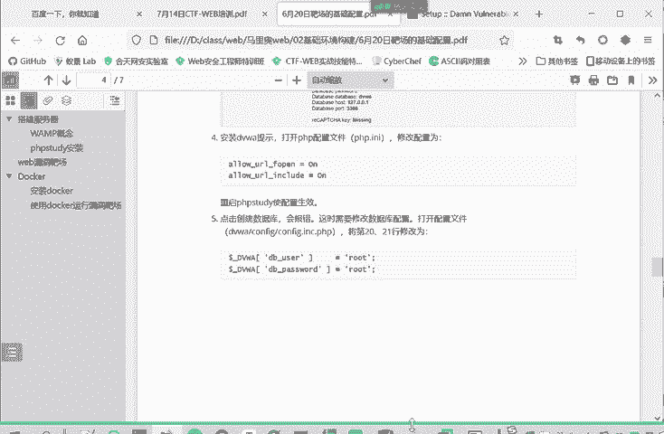

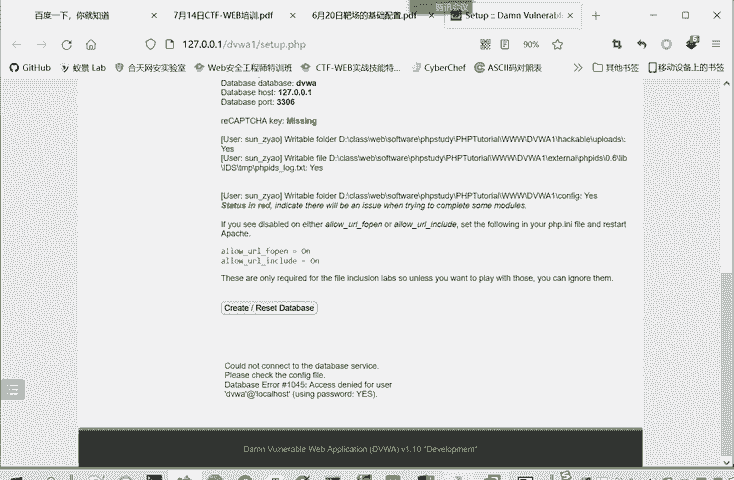

## 配置数据库连接
DVWA需要数据库支持。页面下方有“Create / Reset Database”按钮，但直接点击可能会报错，提示无法连接数据库。

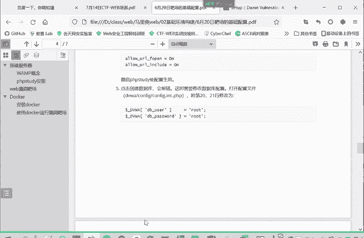

以下是配置数据库连接的步骤：
1.  打开我们之前修改的配置文件 `config/config.inc.php`。
2.  找到数据库配置部分，将数据库用户名和密码修改为PHPStudy的默认值（通常是`root`）。
    ```php
    $_DVWA[ 'db_user' ] = 'root';
    $_DVWA[ 'db_password' ] = 'root';
    ```
3.  保存文件。
4.  返回DVWA页面，再次点击“Create / Reset Database”按钮。此时系统将成功创建所需的数据库和数据表。

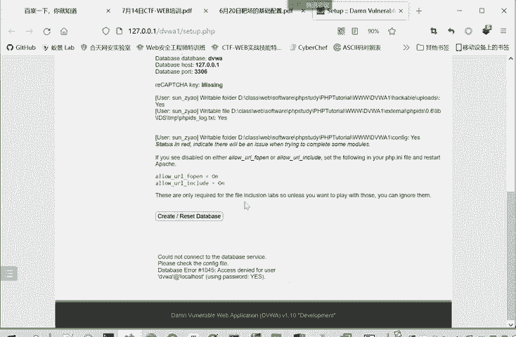

## 登录与使用靶场
完成以上所有配置后，DVWA靶场即可正常使用。

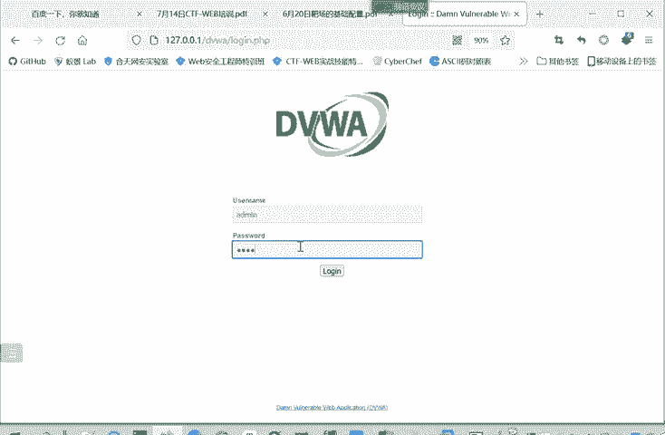

以下是登录和使用的步骤：
1.  访问DVWA首页，会显示登录界面。
2.  使用默认凭证登录：
    *   **用户名**：`admin`
    *   **密码**：`password`
3.  登录成功后，左侧菜单列出了各种可练习的漏洞类型，如暴力破解、SQL注入、文件上传等。
4.  页面上的 **“Security”** 选项用于设置漏洞的安全等级，包括：
    *   **Low**：低安全等级，漏洞利用最简单。
    *   **Medium**：中等安全等级，增加了部分防护。
    *   **High**：高安全等级，防护更强。
    *   **Impossible**：最高安全等级，漏洞通常已被完全修复，无法利用。
5.  选择不同的漏洞和安全等级，页面的挑战内容会相应变化。例如，SQL注入漏洞在Low等级下是输入框，在Medium等级下可能变为下拉菜单。

> **提示**：有时修改安全等级后页面未生效，可能是因为等级信息保存在Cookie中。可以尝试清除浏览器Cookie或使用无痕模式访问。

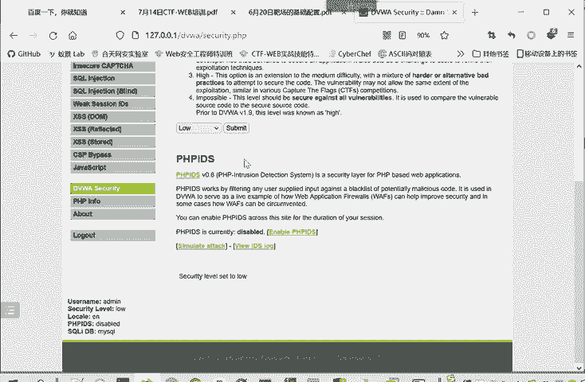

---

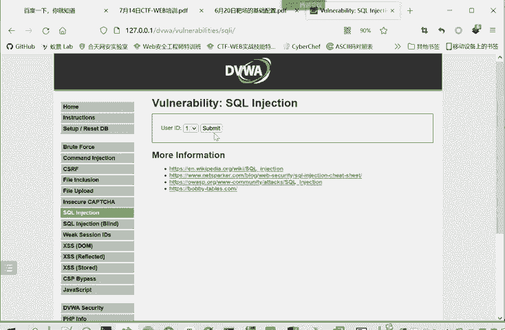

## 总结
本节课中我们一起学习了DVWA靶场的完整搭建流程。我们首先准备了靶场文件并放置到Web目录，接着解决了初次访问的配置文件错误，然后调整了PHP配置以支持特定漏洞，最后配置了数据库连接并成功初始化。现在，你已经拥有了一个功能完整的Web安全练习环境，可以开始对各种常见漏洞进行学习和实战演练了。如果在后续使用中遇到问题，可以在课程群中交流讨论。