# SQL注入：P76：10.SQL盲注和布尔盲注流程

在本节课中，我们将要学习SQL注入中的盲注技术，特别是布尔盲注和时间盲注。我们将了解它们与联合查询注入的区别，掌握其核心原理，并通过实战演示学习如何利用工具进行自动化测试。

---

## 什么是SQL盲注？

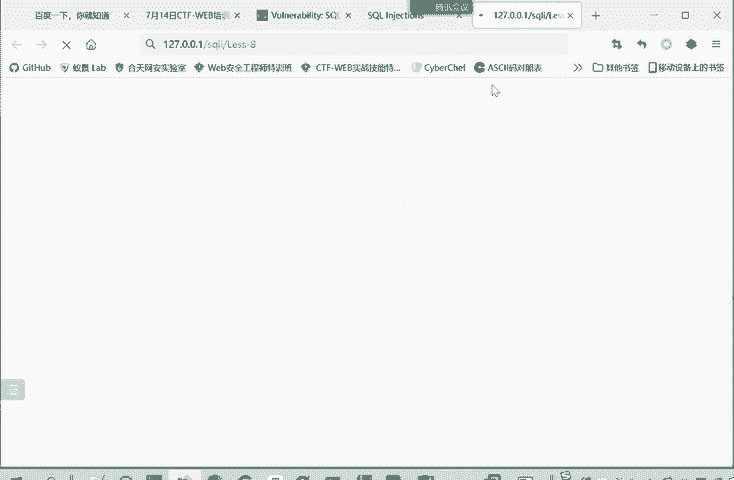

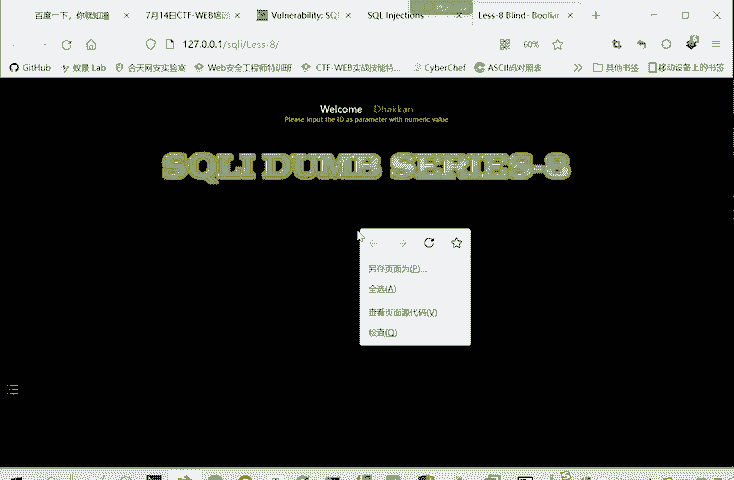

上一节我们介绍了联合查询注入，本节中我们来看看盲注。

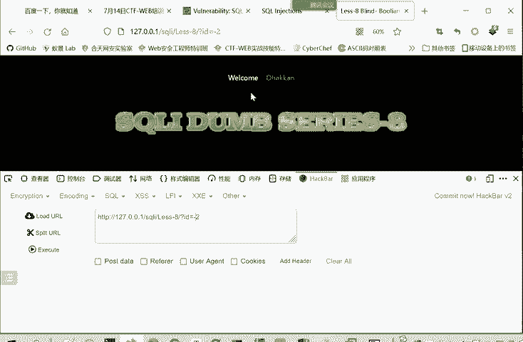

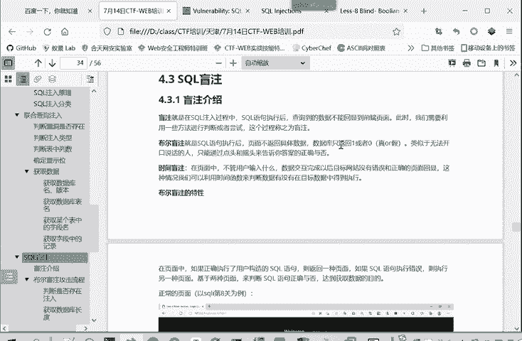

SQL盲注是指在SQL注入过程中，虽然注入的SQL语句能够成功执行，但查询到的数据**不能回显**到前端页面。此时，攻击者需要利用一些方法进行判断和尝试，这个过程就称为盲注。

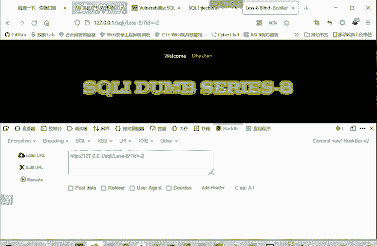

与联合查询注入相比，它们的共同点是都能注入并执行SQL语句。不同点在于，联合查询注入能看到执行结果，而盲注**看不到具体结果**。

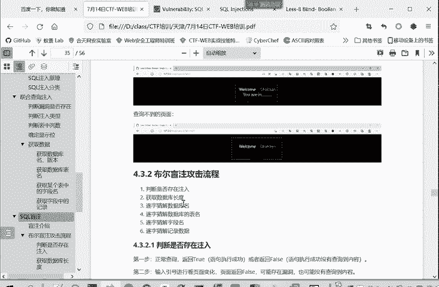

盲注主要有两种类型：
1.  **布尔盲注**
2.  **时间盲注**

---

## 布尔盲注详解

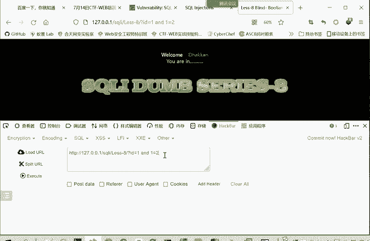

### 布尔盲注的核心概念

布尔盲注的特点是：SQL语句执行后，页面不返回具体数据，只反馈**真（True）** 或 **假（False）** 两种状态。即注入正确的SQL语句是一种页面，注入错误的SQL语句是另一种页面。

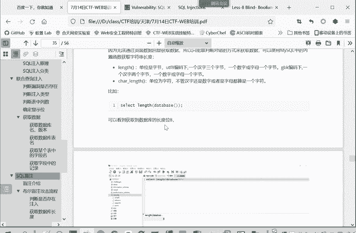

这就像一个无法说话的人，只能通过**点头或摇头**来告诉你答案是否正确，但不会告诉你具体答案是什么。

### 搭建测试环境

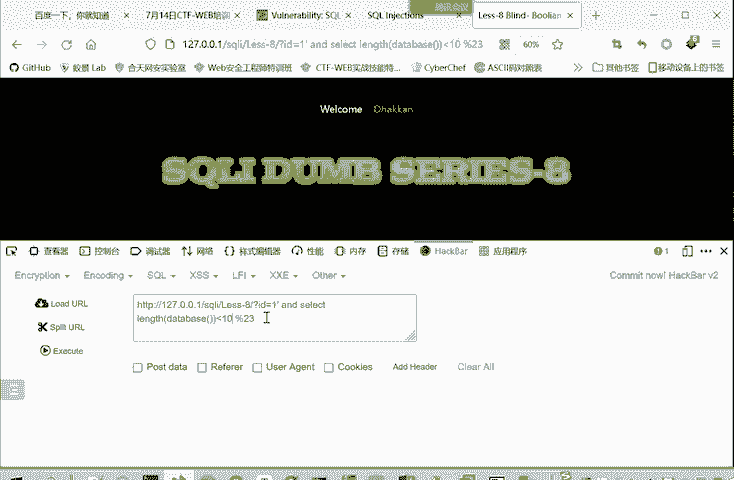

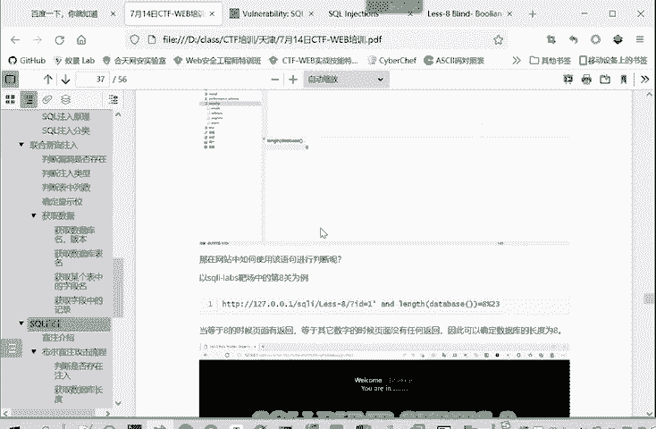

为了学习布尔盲注，我们需要一个专门的靶场。我们将使用 `sqli-labs` 靶场。

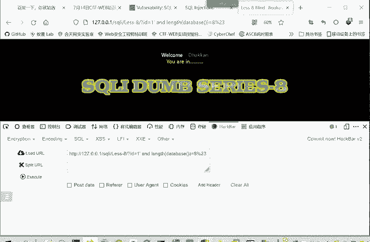

以下是搭建步骤：
1.  将 `sqli-labs` 文件夹放入Web服务器的 `www` 目录下。
2.  启动PHPStudy等集成环境。
3.  在浏览器中访问对应的文件夹路径（例如 `http://localhost/sqli-labs/`）。
4.  首次访问时，点击 `Setup/reset Database` 链接创建数据库。

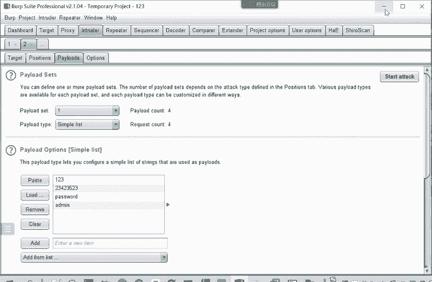

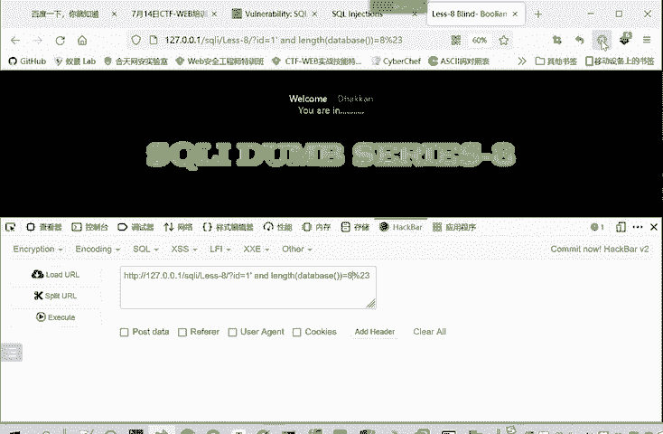

我们以第8关为例进行练习。这一关的提示是 `Blind- Boolian- Single Quotes- String`，即基于单引号字符串的布尔盲注。

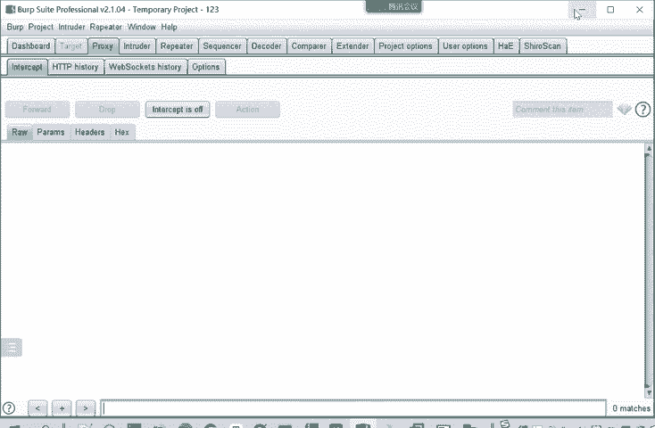

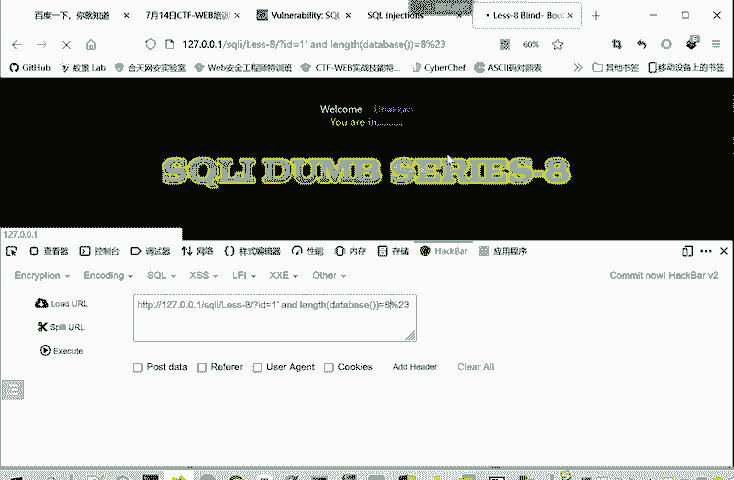

访问该关卡，URL中需要传入 `id` 参数。我们进行测试：
*   `?id=1`：页面显示 `You are in...........`
*   `?id=1'`：页面无 `You are in` 提示。
*   `?id=2`：页面显示 `You are in...........`
*   `?id=2'`：页面无 `You are in` 提示。

测试发现，页面只有两种状态：有 `You are in` 提示（真）和无此提示（假）。这完全符合布尔盲注的特征。

### 布尔盲注的攻击流程

由于无法直接获取数据，我们需要“猜解”信息。以下是标准攻击步骤：

1.  **判断注入点类型**：确认是数字型还是字符型注入。
2.  **获取数据库名长度**：猜解当前数据库名称的字符数。
3.  **逐位猜解数据库名**：猜解数据库名称的每一个字符。
4.  **猜解表名、字段名、数据**：依次猜解表、字段和具体记录。

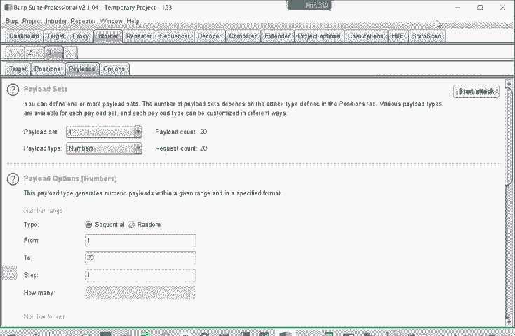

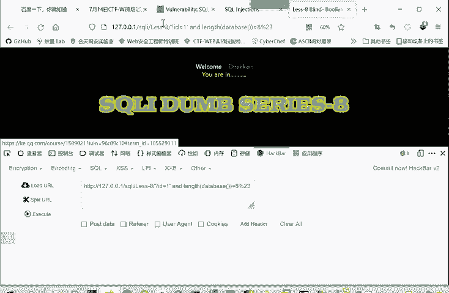

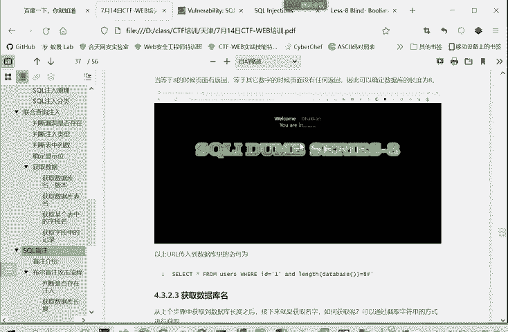

下面我们详细讲解每一步。

#### 第一步：判断注入点类型

首先，我们需要识别哪种页面代表“真”，哪种代表“假”。在本例中，有 `You are in` 代表真，反之代表假。

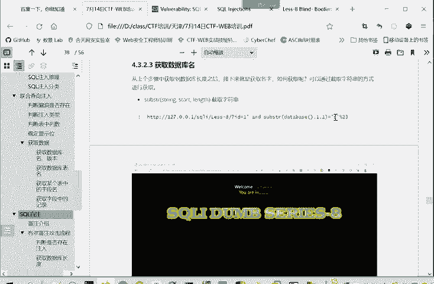

然后，我们通过 `and` 逻辑运算进行判断：
*   输入 `?id=1' and 1=1 --+`：页面为真。
*   输入 `?id=1' and 1=2 --+`：页面仍为真。

这说明注入点不是数字型。因为如果是数字型（`where id=1`），`and 1=2` 会导致整个条件为假，页面应变假。现在页面仍为真，说明我们构造的 `1' and 1=2 --+` 被当成了一个**字符串**与id进行比较，语法未报错但逻辑不相等，可能未查询到数据，从而返回了“假”页面。更准确的测试是：
*   输入 `?id=1' and '1'='1`：页面为真。
*   输入 `?id=1' and '1'='2`：页面为假。

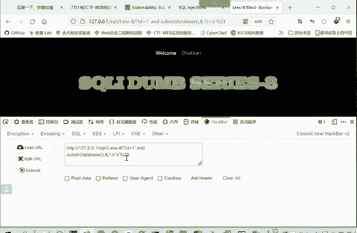

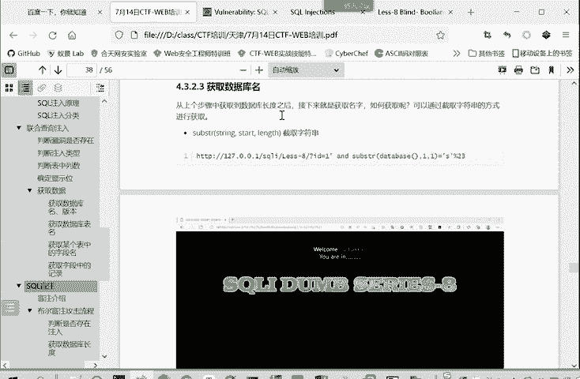

这证实了这是一个**字符型**注入，闭合方式为单引号。

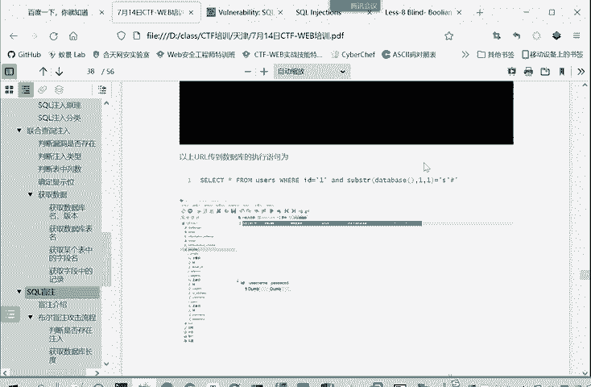

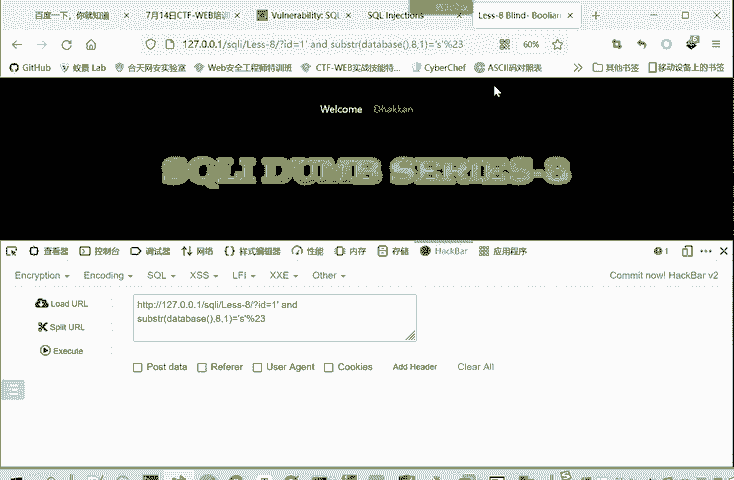

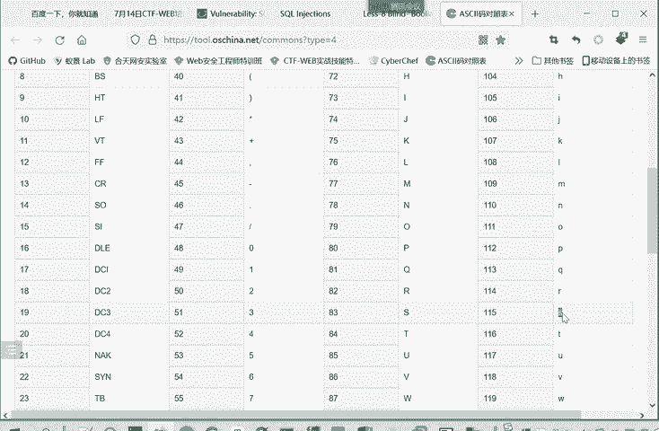

#### 第二步：获取数据库名长度

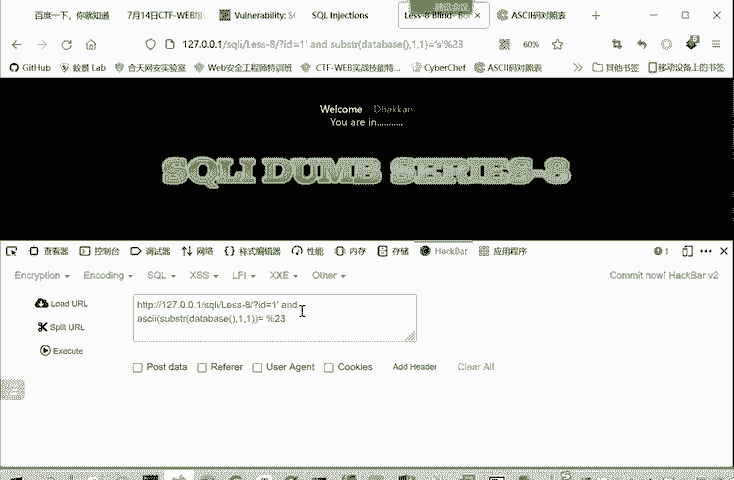

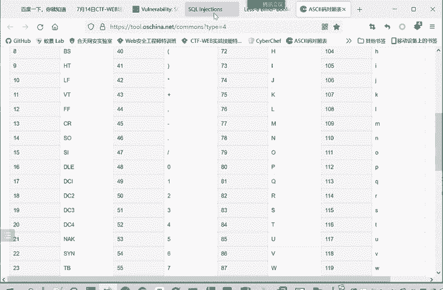

我们使用 `length()` 函数来猜解数据库名的长度。公式如下：
```sql
?id=1' and length(database())=1 --+
```
这条语句的意思是：判断当前数据库名称的长度是否等于1。如果等于，则页面为真，否则为假。

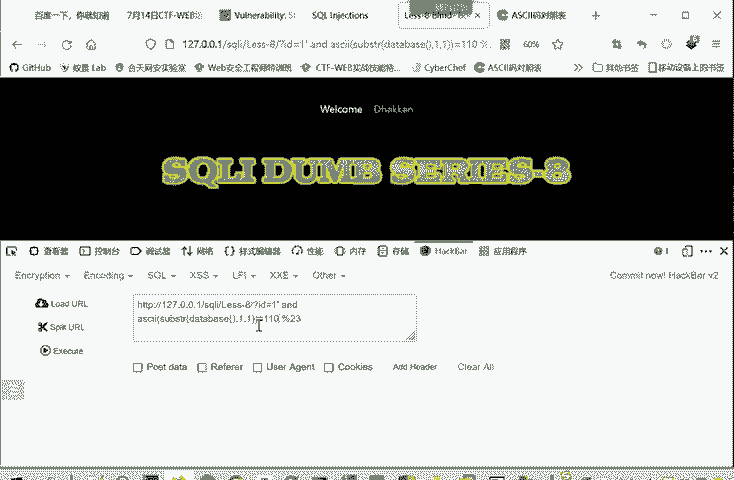

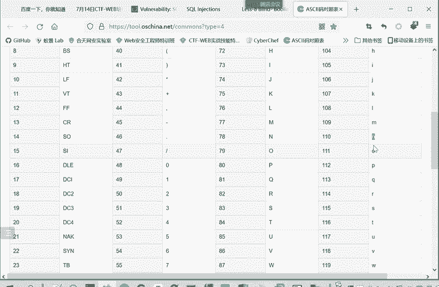

我们可以手动从1开始尝试，也可以利用Burp Suite的Intruder模块进行爆破。

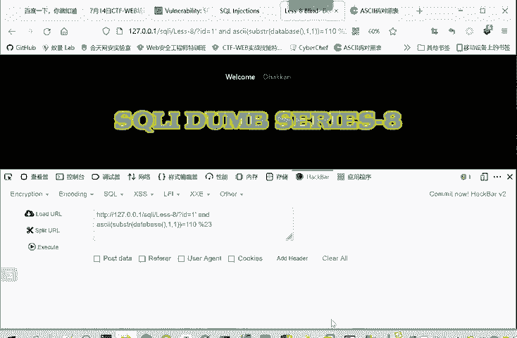

**使用Burp Suite爆破长度：**
1.  拦截浏览器发送的请求包（例如 `?id=1' and length(database())=8 --+`）。
2.  将请求包发送到Intruder模块。
3.  在Positions标签页，清除所有变量，只将 `=8` 中的数字 `8` 设置为变量，标记为 `§8§`。
4.  在Payloads标签页，选择Payload类型为 `Numbers`，设置从1到20，步长为1。
5.  开始攻击。攻击完成后，通过观察响应长度或状态码的差异，找出正确的长度。通常，正确的长度对应的响应包会与众不同（例如，只有长度为8时，响应中包含 `You are in`，其他长度则没有）。

通过此方法，我们得知当前数据库名长度为 **8**。

#### 第三步：逐位猜解数据库名

知道长度后，我们需要猜解数据库名的具体字符。这里用到 `substr()` 或 `mid()` 函数来截取字符串，并结合 `ascii()` 函数将字符转换为ASCII码进行猜解，效率更高。

`substr()` 函数语法：
```sql
substr(string, start, length)
```
*   `string`：要截取的字符串。
*   `start`：开始位置（从1开始计数）。
*   `length`：截取长度。

猜解第一个字符的Payload示例：
```sql
?id=1' and ascii(substr(database(),1,1))=115 --+
```
这条语句的意思是：判断数据库名第一个字符的ASCII码是否等于115（即字母‘s’）。

我们可以手动猜解，但更高效的方法是使用Burp Suite同时爆破**字符位置**和**ASCII码值**。

**使用Burp Suite爆破数据库名：**
1.  拦截上述猜解请求包。
2.  发送到Intruder模块。
3.  设置两个变量：
    *   变量1：`substr(database(),1,1)` 中的位置数字 `1`，代表从第几位开始截取。
    *   变量2：`=115` 中的ASCII码值 `115`。
4.  攻击模式选择 **Cluster bomb**（集束炸弹）。这种模式会对两个变量的所有Payload进行笛卡尔积组合测试。
5.  设置Payload集合：
    *   Payload set 1（对应位置）：类型为 `Numbers`，范围1到8（因为长度是8）。
    *   Payload set 2（对应ASCII码）：类型为 `Numbers`，范围65到122（覆盖大小写字母）。
6.  开始攻击。攻击完成后，筛选出响应为“真”（如包含 `You are in`）的请求。这些请求对应的位置和ASCII码，就是数据库名每个位置的字符。

通过此方法，我们可以得到ASCII码序列：115, 101, 99, 117, 114, 105, 116, 121。转换为字符即是：`security`。

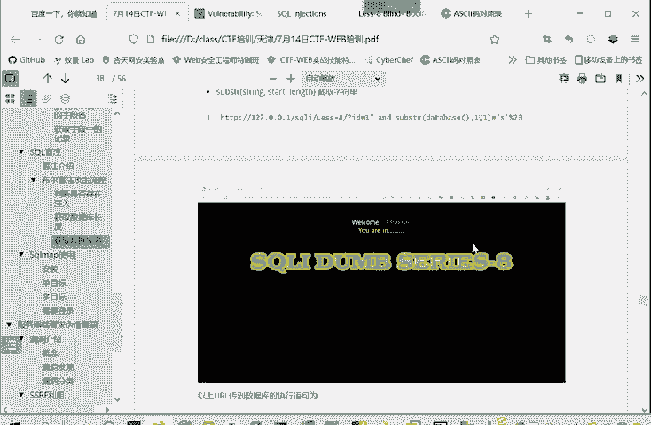

至此，我们成功获取了数据库名称，尽管页面没有任何直接回显。

---

## 时间盲注详解

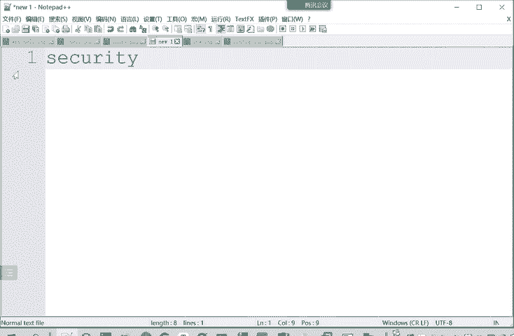

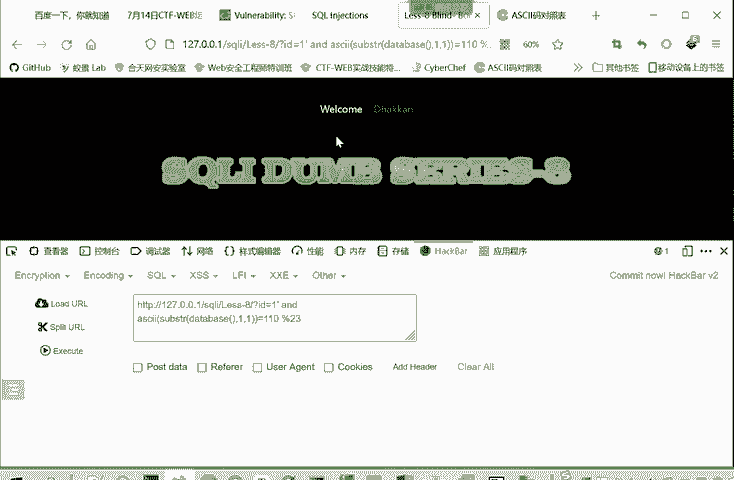

### 时间盲注的核心概念

时间盲注比布尔盲注更隐蔽。它的特点是：无论用户输入什么，页面都没有明显的正确或错误回显，**页面表现始终一致**。

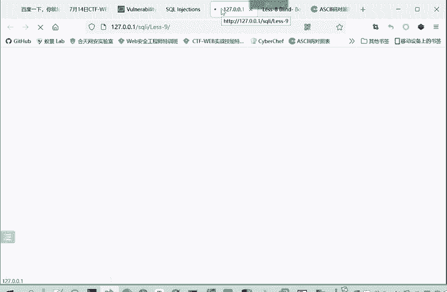

这时，我们需要利用时间函数（如 `sleep()`）来判断SQL语句是否执行。通过观察页面响应时间的差异来推断信息。

### 时间盲注实战

我们以 `sqli-labs` 第9关为例。无论输入 `?id=1` 还是 `?id=1‘`，页面显示都一样。

我们利用 `if()` 和 `sleep()` 函数构造Payload：
```sql
?id=1‘ and if(条件, sleep(5), 1) --+
```
*   如果`条件`为真，则执行 `sleep(5)`，页面响应会延迟5秒。
*   如果`条件`为假，则执行 `1`，页面立即响应。

例如，猜解数据库长度：
```sql
?id=1‘ and if(length(database())=8, sleep(5), 1) --+
```

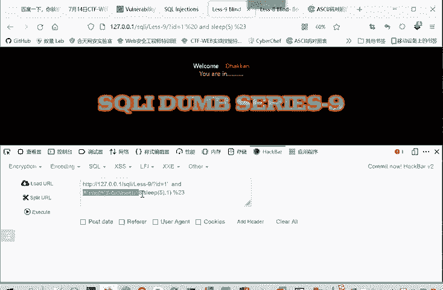

**判断方法：**
使用浏览器的开发者工具（F12），切换到 `Network`（网络）标签页。发起请求后，查看请求的 `Time`（耗时）。如果耗时约为5秒，则说明判断条件为真（数据库长度等于8）；如果耗时很短，则条件为假。

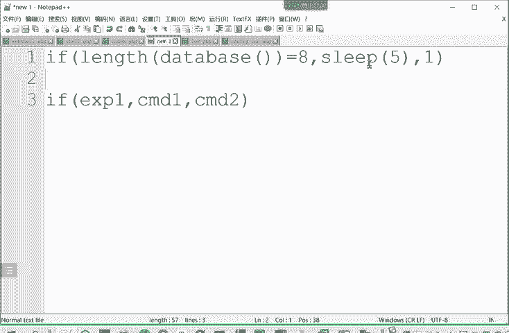

**使用Burp Suite自动化：**
1.  拦截时间盲注的请求包。
2.  发送到Intruder模块，将猜解的长度值设为变量。
3.  进行爆破。
4.  爆破完成后，在结果栏中，通过 `Columns` 菜单添加 `Response received` 和 `Response completed` 这两列，它们显示了响应时间。
5.  按响应时间排序，明显更长的那个请求对应的Payload，就是正确的猜解结果（例如，长度为8的请求耗时约5秒，其他请求耗时很短）。

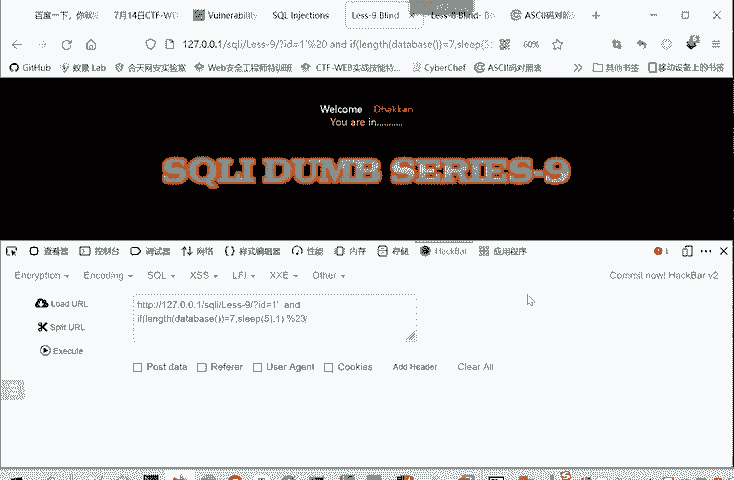

猜解数据库名、表名等后续步骤，原理与布尔盲注相同，只需将判断逻辑嵌套在 `if(条件, sleep(5), 1)` 中即可。

---

## 总结

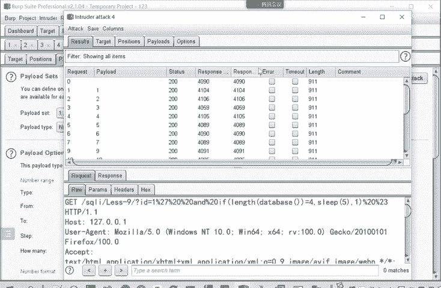

本节课中我们一起学习了SQL注入中两种重要的盲注技术：
1.  **布尔盲注**：通过页面返回的**真/假**两种状态来推断数据。我们学习了判断注入类型、获取数据库长度、以及使用 `substr()` 和 `ascii()` 函数逐位猜解信息的方法，并利用 **Burp Suite的Cluster bomb模式**进行高效自动化测试。
2.  **时间盲注**：在页面无任何状态回显时，通过 `if()` 和 `sleep()` 函数构造条件语句，根据**响应时间的差异**来推断数据。其攻击流程与布尔盲注类似，核心在于将判断条件转化为时间延迟。

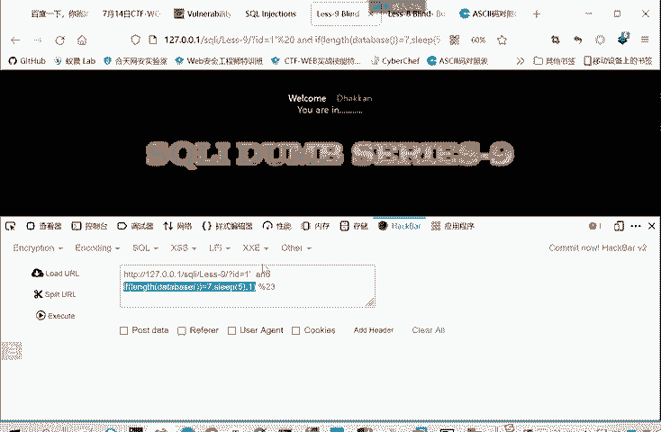

盲注虽然比联合注入步骤繁琐，但通过工具辅助和清晰的逻辑，我们依然可以有效地获取目标信息。理解这两种盲注的原理和流程，是深入Web安全测试的重要一步。