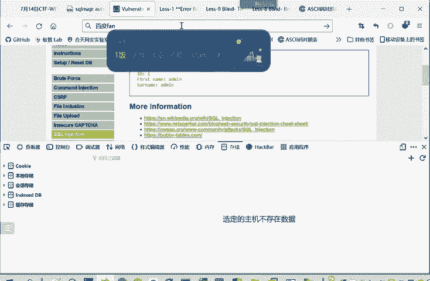
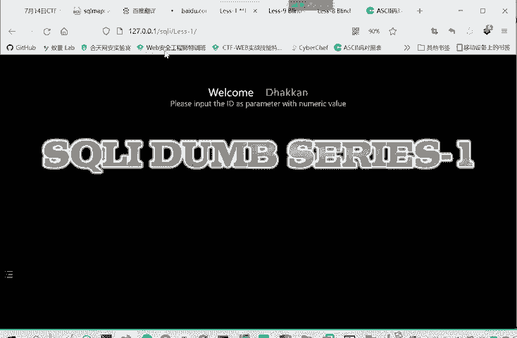
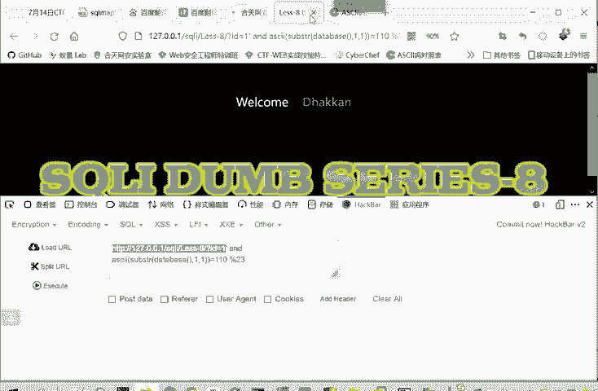
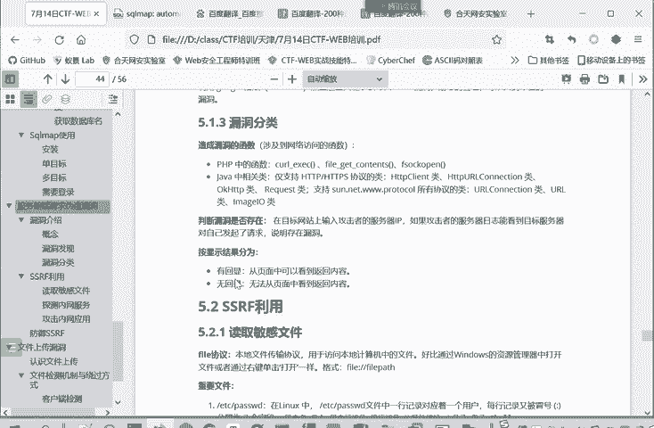

# 网络安全系统教学合集：P78：12.认识服务器端请求伪造漏洞 🔍

在本节课中，我们将要学习一种重要的Web安全漏洞——服务器端请求伪造。我们将了解它的基本概念、工作原理、危害以及如何发现它，为后续的深入学习和实践打下基础。

## 概述

服务器端请求伪造是一种由攻击者构造请求，诱使服务器向其他服务器发起非预期请求的安全漏洞。它通常被用来探测或攻击内部网络中的服务。

## 服务器端请求的概念

上一节我们介绍了数据库注入的相关知识，本节中我们来看看服务器端请求伪造。

服务器端请求是指从客户端发起一个请求到服务器，服务器再向另外的服务器发起请求的过程。例如，浏览器向百度发送请求。如果百度服务器能够按照攻击者的指令，将请求转发给其内部的其他设备，这就构成了一个服务器端请求。

## 服务器端请求伪造的定义

服务器端请求伪造是由攻击者构造形成，由服务器端发起请求的一种漏洞。

以下是攻击流程的说明：
*   攻击者通常利用此漏洞探测内网。
*   黑客想要攻击内网服务，但通常无法直接访问，因为公司有防火墙保护。
*   如果存在SSRF漏洞的外部Web服务器，攻击者就可以构造攻击链。
*   攻击者访问存在漏洞的Web服务器，并利用该服务器将请求转发到公司内部的设备或服务。
*   内部服务会认为请求来自受信任的内部服务器，从而允许访问，这就造成了信息泄露或内网被攻击的风险。

因此，SSRF需要服务器作为代理去发起请求，常被用于从外网探测或攻击内网服务。

## 攻击流程类比

这里也是一个攻击流程。攻击者和一个内网主机之间本来不可达。攻击者想攻击内网主机，就发送一个欺骗数据包到服务器A。服务器A响应了欺骗数据包，这个数据包包含向主机B请求的指令。然后服务器A就向主机B发起请求，主机B响应请求，服务器A再将响应返回给攻击者。通过服务器A，攻击者事实上实现了与主机B的连接。

主机B可以理解为一台内网机器，外网用户在设计上本应无法访问。我们可以类比另一个常见漏洞CSRF。服务端请求伪造是利用一个不安全的服务器作为代理。跨站请求伪造是利用网页客户端的身份进行伪造。两者都是利用第三方转发请求以达到攻击目的，只是利用的对象不同。

## 漏洞成因

那么这个漏洞的成立，是由于服务端提供了从其他服务器应用获取数据的能力，即服务端需要向其他服务器发送请求。但是，如果没有对请求的目标地址进行严格的过滤和限制，就会导致攻击者可以传入任意的地址或指定的恶意地址，让后端服务器对其发送请求，并返回目标地址的数据。

例如，攻击者可能传入一个未经验证的URL，后端代码如果直接请求这个URL，就会造成服务器端请求伪造漏洞。

## 漏洞危害

利用SSRF漏洞，攻击者可以访问到原本无法访问的内网。

以下是漏洞可能造成的具体危害：
*   读取内网的文件。
*   扫描内网的服务和端口。
*   收集内网应用的指纹信息，并根据这些信息寻找漏洞，进行下一步渗透。
*   攻击运行在内网中的系统或程序。

## 什么是内网

我们说了这么多内网，那么什么是内网呢？内网就是公司用防火墙保护起来，不让外网用户访问的网络。互联网上的用户在正常情况下是访问不到这个网络的。

以下是常见的内网IP地址段：
*   `10.0.0.0/8`
*   `172.16.0.0/12` (即 `172.16.0.0` 到 `172.31.255.255`)
*   `192.168.0.0/16`

这些是内网地址，其他则为公网IP地址。例如，你无法直接通过公网访问 `192.168.1.1`，因为它是一个内网IP地址。

## 如何发现SSRF漏洞

漏洞点在于能够对外发起网络请求的服务器，就可能存在SSRF漏洞。我们只是说有这个特征就可能存在，具体还需要经过测试。

以下是两个常见的特征，如果在寻找漏洞时发现它们，可以多加注意：

**1. 从Web功能角度**
服务器端请求伪造漏洞是在服务器端获取其他服务器相关信息的功能中形成的。因此，我们可以列举几种在Web应用中常见的、从服务端获取其他服务器信息的功能。

以下是可能包含此类风险的功能：
*   **分享URL功能**：分享时通常会获取目标URL的标题和文本，这需要读取URL内容。
*   **转码服务**。
*   **在线翻译**。

在线翻译是一个比较典型的例子。例如，百度翻译的“翻译网页”功能，它需要向用户输入的URL发起请求以获取网页内容。像这种功能，就可能存在SSRF漏洞。当然，大厂通常有完善的安全机制，但许多小公司如果未做充分防护，则风险较高。

**2. 从URL关键字角度**
允许加载外部资源的URL就可能存在SSRF漏洞。

以下是URL中经常包含的、可能指示外部资源加载的关键词：
*   `share`
*   `wap`
*   `url`
*   `link`
*   `src`
*   `source`

服务器需要从别的URL处请求资源，说明它本身要发出请求，这就存在请求被伪造的风险。注意，有这些关键字不一定就有漏洞，只是可能性更高。

## 漏洞分类与检测

漏洞的分类根据后端语言的不同，例如可以分为PHP和Java等。造成漏洞的函数也相应分为不同类别，这对开发者而言比较重要。

判断漏洞是否存在，可以在攻击中尝试让目标服务器向攻击者控制的服务器IP发起请求。如果攻击者的服务器收到了来自目标服务器的请求，就说明存在漏洞。

漏洞结果按回显情况分为有回显和无回显。即利用SSRF漏洞向内网发起请求后，结果是否显示出来。这类似于SQL注入中联合查询注入和盲注的区别，命令都能执行，只是一个会显示执行结果，另一个不会。

## 总结

本节课中我们一起学习了服务器端请求伪造漏洞。我们了解了它的基本概念、攻击者如何利用不安全的服务器作为代理来访问内网、漏洞的成因、其可能造成的严重危害，以及从Web功能和URL关键字两个角度来发现潜在的SSRF漏洞点。理解这些基础知识是进行后续漏洞挖掘和防护的关键第一步。