# Linux基础课程：P7：Linux环境准备

## 概述
在本节课中，我们将学习如何为后续的网络安全学习搭建基础的Linux环境。主要内容包括安装虚拟机软件VMware Workstation，并下载CentOS 7操作系统的镜像文件，为下一节课安装系统做好准备。

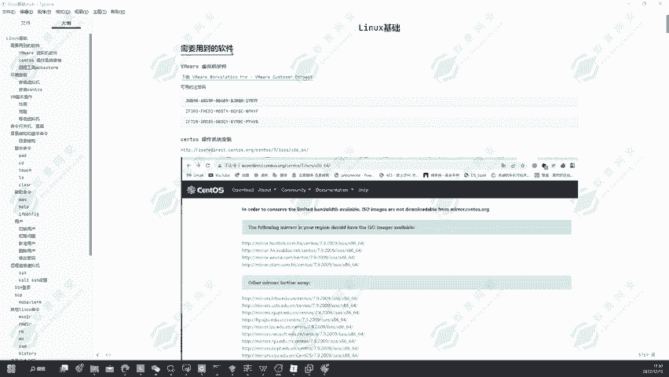

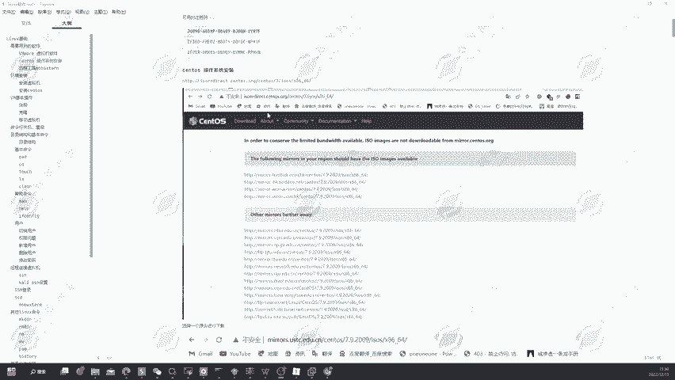

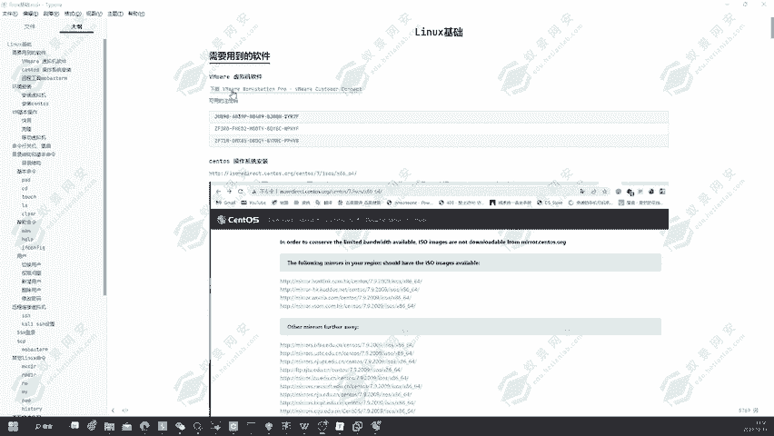

## 为什么需要学习Linux基础
当前，许多服务器都是基于Linux系统搭建的，例如Web服务、数据库（如MySQL）、FTP服务等。同时，我们常用的攻击测试系统Kali Linux也是基于Linux内核开发的。因此，掌握Linux基础是必要的。这包括基础命令、服务搭建以及靶机环境配置等知识。本课程旨在帮助大家了解Linux的基本命令、使用方式，以及通过虚拟机搭建系统的步骤。

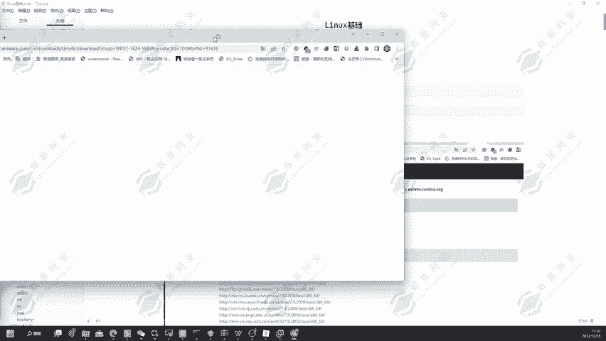

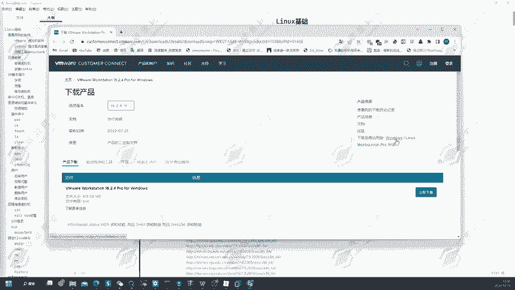

## 安装VMware Workstation
上一节我们介绍了学习Linux的重要性，本节中我们来看看如何安装虚拟机软件。

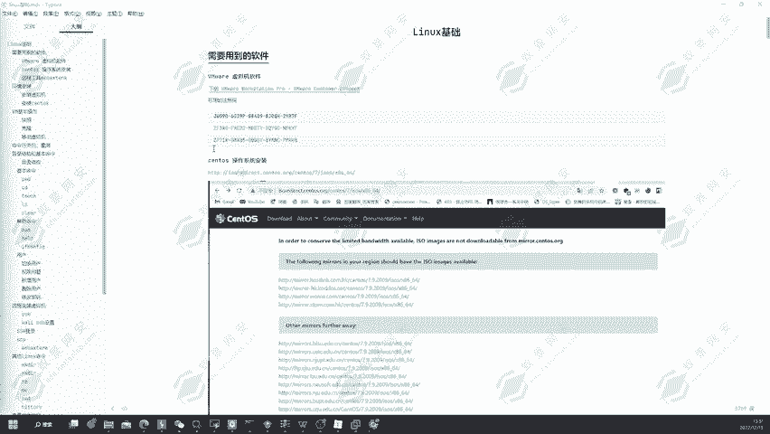

首先，我们需要从VMware官网下载其虚拟机软件。VMware目前已发布到第17版，我们将下载其免费的试用版本进行安装。

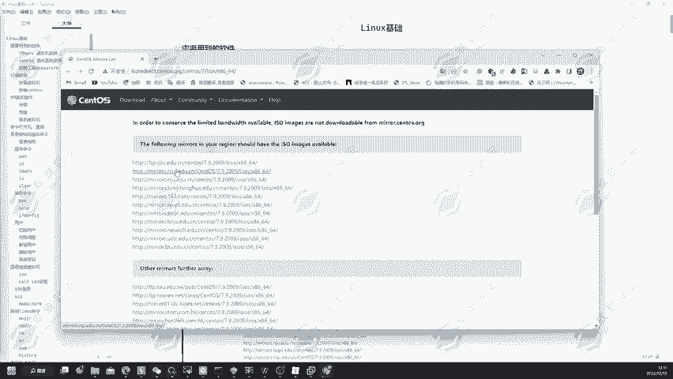

以下是下载VMware Workstation 17的步骤：
1.  访问VMware官方网站。
2.  在网站上找到“Download”选项，选择下载VMware Workstation 17版本。
3.  点击下载链接，浏览器会开始下载安装文件。点击“保留”即可完成下载。

## 下载CentOS 7镜像文件
安装好虚拟机软件后，我们还需要一个Linux操作系统镜像。这里我们选择CentOS 7。

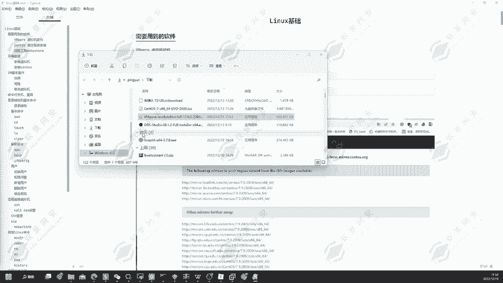

以下是下载CentOS 7镜像文件的步骤：
1.  打开CentOS官方镜像下载页面。
2.  在页面中选择一个可用的下载地址（例如列表中的第二个）。
3.  页面跳转后，会列出不同的版本。我们选择 **`CentOS-7-x86_64-DVD-2009.iso`** 这个版本进行下载。
4.  点击该版本链接，等待下载完成。

至此，我们已准备好两个关键文件：`VMware安装包` 和 `CentOS-7镜像文件(.iso)`。

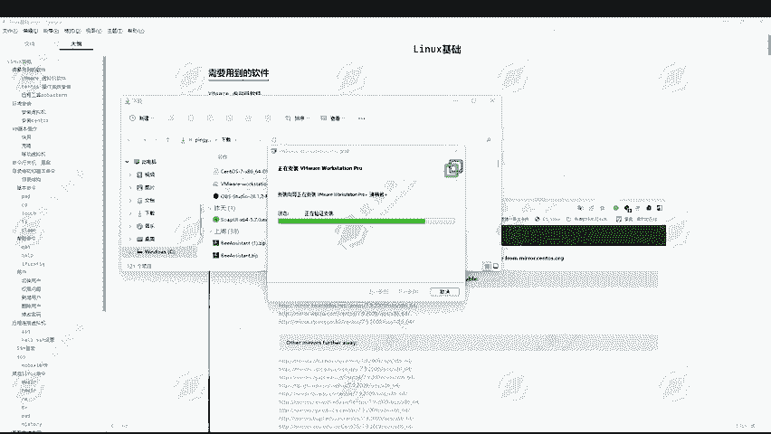

## 安装VMware Workstation
现在，我们开始安装已下载的VMware软件。

以下是安装VMware Workstation的具体步骤：
1.  双击运行下载好的VMware安装程序。
2.  在弹出的安装向导中，点击“下一步”。
3.  阅读并“接受”许可协议，然后点击“下一步”。
4.  选择安装位置。默认路径在C盘，你可以根据自己磁盘空间情况更改到其他位置（例如在D盘新建一个名为“VMware”的文件夹并选择它）。确认后点击“下一步”。
5.  点击“安装”或“升级”（如果电脑上已有旧版本，则会执行升级操作）。安装过程会同时安装虚拟网卡驱动，可能需要一些时间，请耐心等待。
6.  安装完成后，可能会提示输入许可证密钥。你可以暂时跳过，或使用提供的密钥激活软件。激活成功后，桌面会生成VMware的快捷方式。

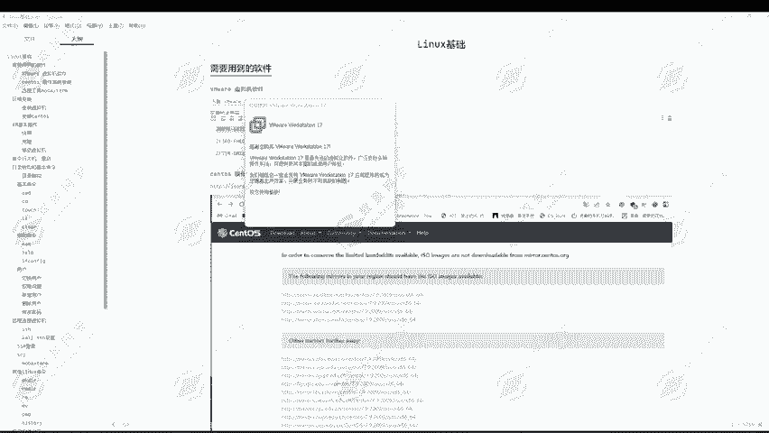

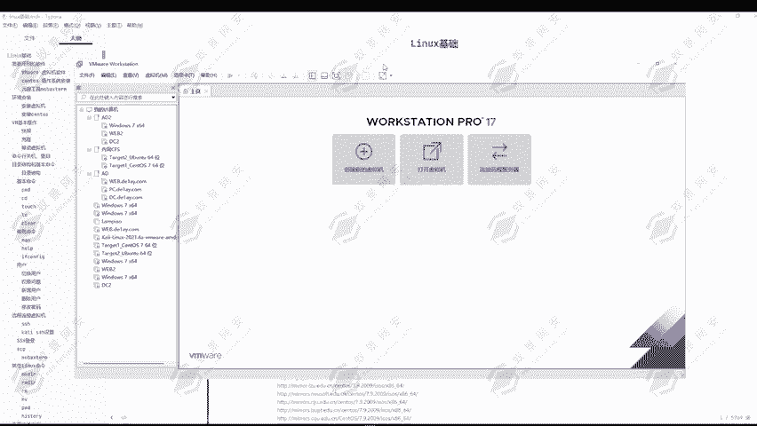

## 下载远程管理工具（可选）
为了方便后续管理安装好的CentOS 7或Kali Linux等虚拟机，我们通常需要一个远程连接工具，例如Xshell或MobaXterm。

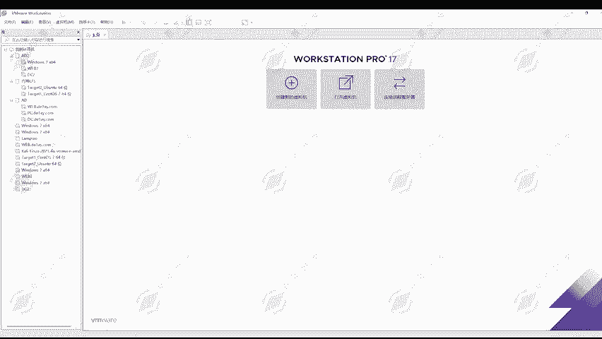

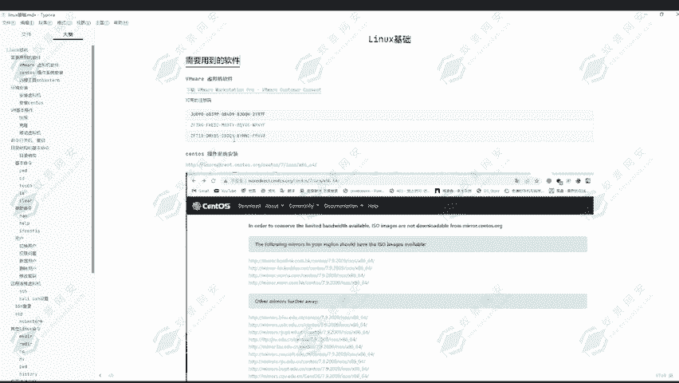

以下是获取远程工具的说明：
*   这类工具可以帮助我们通过SSH协议远程登录并管理Linux系统。
*   大家可以从其官方网站下载并安装适合自己的远程连接工具。

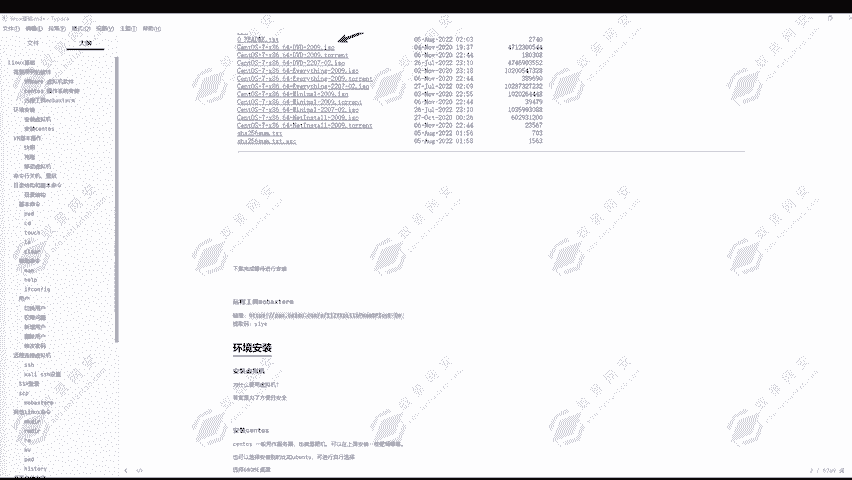

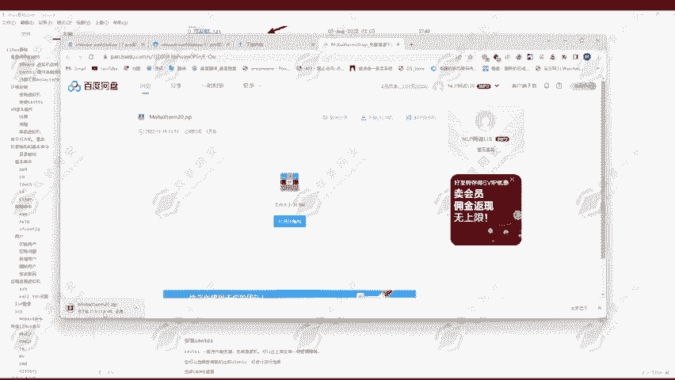

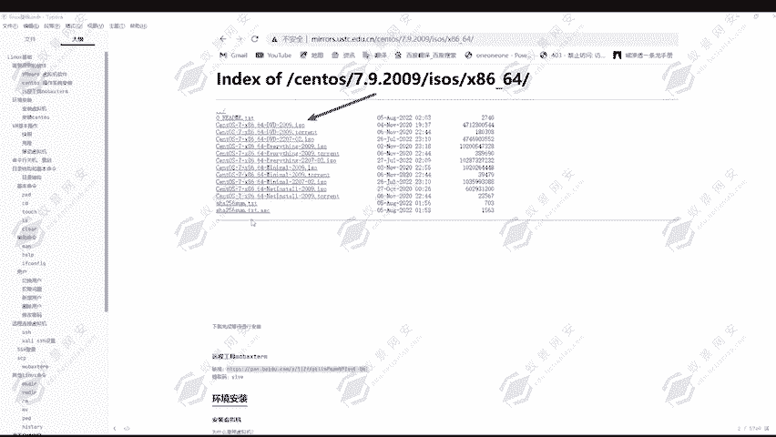

## 总结
本节课中，我们一起学习了搭建Linux实验环境的第一步：准备工作和软件安装。我们成功下载并安装了虚拟机软件VMware Workstation，获取了CentOS 7操作系统的镜像文件，并了解了远程管理工具的作用。下一节课，我们将利用这些准备好的工具，详细讲解如何在VMware中创建并安装CentOS 7虚拟机。