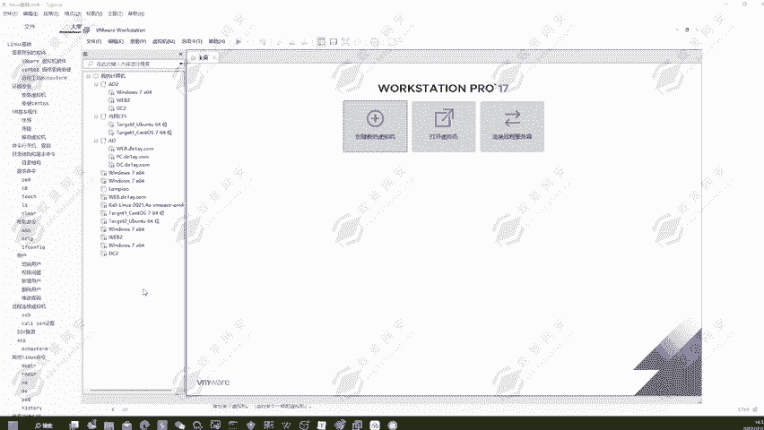
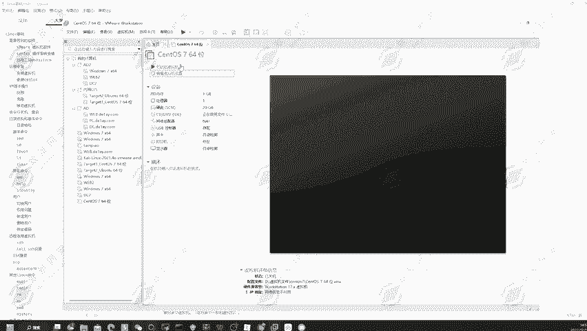
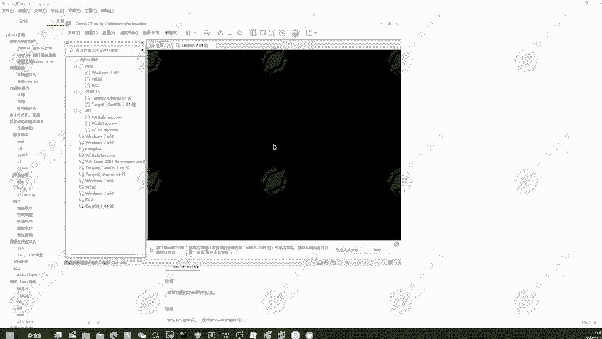
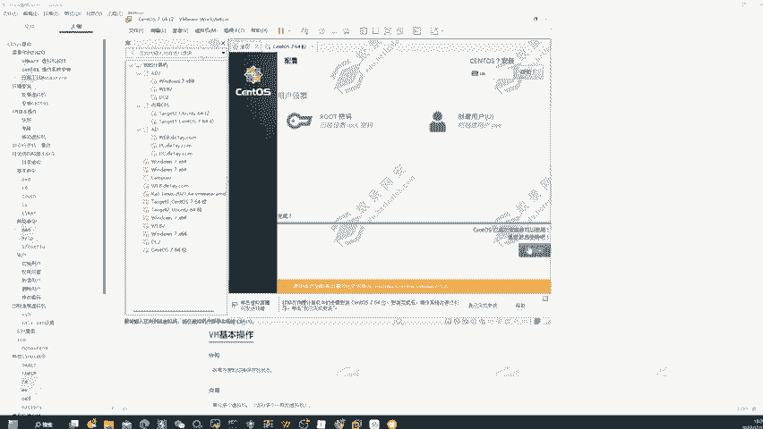
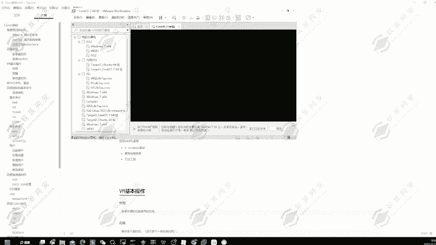
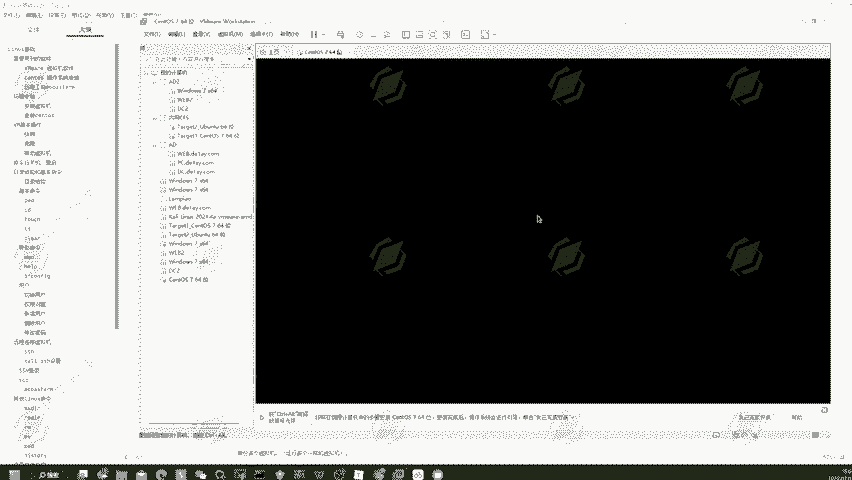
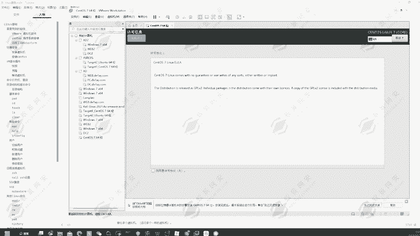
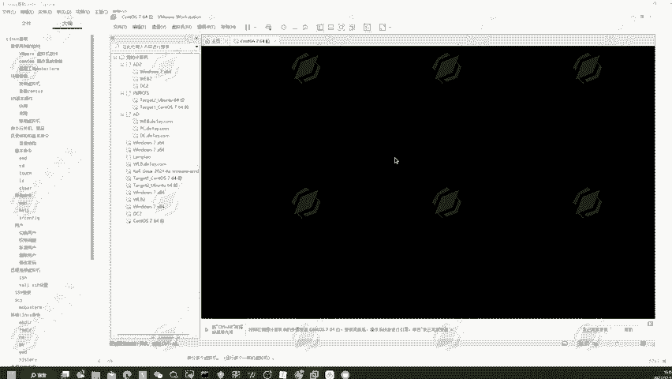
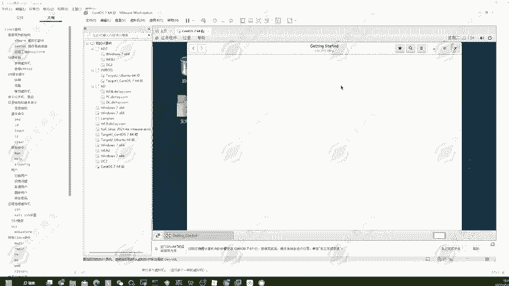

# 网络安全系统教学合集：P8：2.CentOS 7安装使用 💻

在本节课中，我们将学习如何在VMware虚拟机中安装CentOS 7操作系统。我们将了解使用虚拟机的优势，并一步步完成从创建虚拟机到系统初始化的全过程。

---

上一节我们介绍了VMware软件的下载与安装，本节中我们来看看如何用它来安装一个完整的操作系统。

使用虚拟机安装操作系统，主要基于**便捷性**与**安全性**两方面的考虑。

**便捷性**体现在：
*   虚拟机以文件形式存储在硬盘中，便于打包、移动和在不同电脑上快速部署。
*   一台物理机可以同时运行多个不同的虚拟机操作系统，满足多样化的测试或工作需求。

**安全性**体现在：
*   在进行渗透测试或搭建有漏洞的靶场环境时，攻击者即使控制了虚拟机，也无法直接访问物理主机，有效保护了本地数据和隐私。

下面，我们将以CentOS 7为例，演示在VMware中安装操作系统的完整流程。

以下是创建虚拟机的步骤：
1.  打开VMware，点击“创建新的虚拟机”。
2.  选择“典型”配置，点击“下一步”。
3.  选择“稍后安装操作系统”，点击“下一步”。
4.  客户机操作系统选择“Linux”，版本选择“CentOS 7 64位”，点击“下一步”。
5.  为虚拟机命名（例如“CentOS 7”），并点击“浏览”选择一个合适的安装位置（建议在非系统盘新建专用文件夹），点击“下一步”。
6.  指定磁盘容量（默认20GB即可），选择“将虚拟磁盘存储为单个文件”，点击“下一步”。
7.  点击“完成”，一个空的虚拟机“外壳”就创建好了。

虚拟机创建完成后，我们需要为其加载操作系统镜像。

以下是加载镜像并开始安装的步骤：
1.  在虚拟机设置中，找到“CD/DVD (SATA)”选项。
2.  选择“使用ISO映像文件”，并点击“浏览”，找到上一节课下载的CentOS 7 DVD镜像文件（`.iso`格式）。
3.  点击“确定”保存设置。
4.  回到VMware主界面，点击“开启此虚拟机”。

虚拟机启动后，将进入CentOS 7的安装界面。

以下是系统安装与初始配置的步骤：
1.  选择第一项“Install CentOS 7”并回车。
2.  等待加载后，进入语言选择界面，选择“中文” -> “简体中文”，点击“继续”。
3.  在“安装信息摘要”界面，进行关键配置：
    *   **软件选择**：点击进入。不要选择“最小安装”，因为它功能不全。请选择“GNOME 桌面”，并在右侧勾选“兼容性程序库”、“开发工具”和“图形管理工具”。完成后点击左上角“完成”。
    *   **安装位置**：点击进入。无需手动分区，直接点击“完成”即可。
    *   **网络和主机名**：可以稍后配置，此处暂时跳过。
4.  点击“开始安装”。
5.  在安装过程中，设置**ROOT密码**和**创建用户**：
    *   点击“ROOT密码”，设置密码（例如 `123456`）。若提示“密码过于简单”，可忽略并再次点击“完成”以确认。
    *   点击“创建用户”，输入用户名（例如 `yiyue`）和密码（例如 `123456`）。同样，若提示密码简单，可忽略并确认。
6.  等待安装进度条完成，然后点击“重启”。

系统重启后，需要进行最后的初始化设置。

以下是首次启动的配置步骤：
1.  重启后，在初始界面按回车键进入系统。
2.  进入“许可证信息”界面，勾选“我同意许可协议”，点击“完成”。
3.  点击“完成配置”，进入登录界面。
4.  选择你创建的用户（如 `yiyue`），输入密码登录。
5.  首次进入桌面可能会有初始设置向导，可以点击“前进”并选择“跳过”，即可正常使用CentOS 7桌面环境。

---

本节课中我们一起学习了在VMware虚拟机中安装CentOS 7操作系统的完整流程。我们理解了使用虚拟机的好处，并掌握了从创建虚拟机、加载镜像、系统安装到初始配置的每一步操作。现在，你已经拥有了一个可以安全、便捷地进行后续学习和测试的Linux环境。