# Kali渗透教程：P9：VMware基本操作 🖥️

在本节课中，我们将学习VMware虚拟机软件的两个核心功能：**快照**与**克隆**。掌握这些功能能帮助你在进行渗透测试等可能破坏系统的操作时，轻松保存和恢复系统状态，或快速创建多个相同的测试环境。

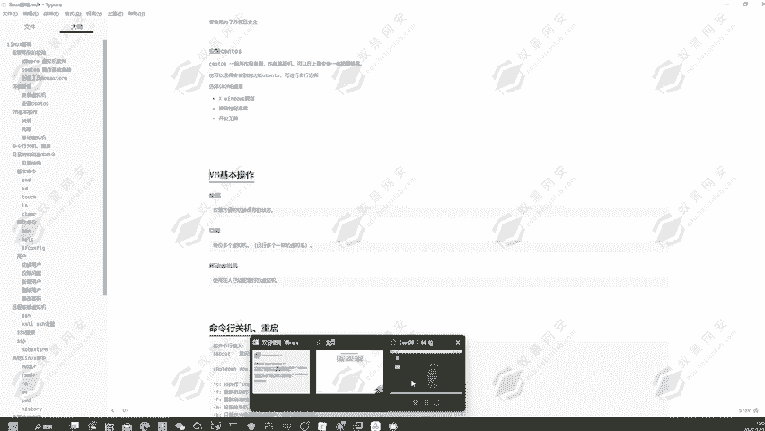

## 快照功能：系统的“存档”与“读档”

上一节我们介绍了虚拟机的安装，本节中我们来看看如何利用快照功能来保护我们的工作环境。快照功能类似于单机游戏中的存档，可以保存虚拟机在某个时间点的完整状态。

### 创建快照

以下是创建快照的步骤：

1.  在虚拟机列表中，右键点击目标虚拟机。
2.  在弹出的菜单中选择“快照” -> “拍摄快照...”。
3.  在弹出的对话框中，为快照命名（例如“初始状态”）并添加描述。
4.  点击“拍摄快照”按钮，系统将开始保存当前状态。

**代码示例：** 虽然VMware Workstation主要通过图形界面操作，但其底层命令类似于 `vmrun snapshot [虚拟机文件路径] “快照名称”`。

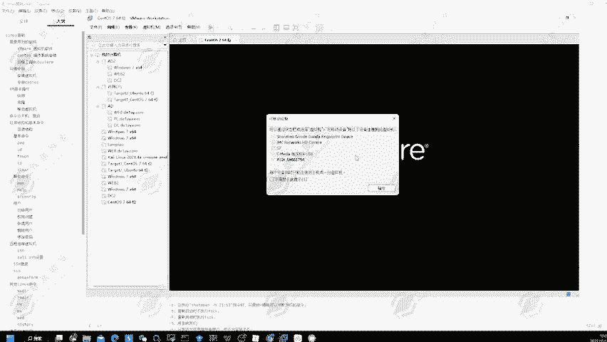

### 恢复与管理快照

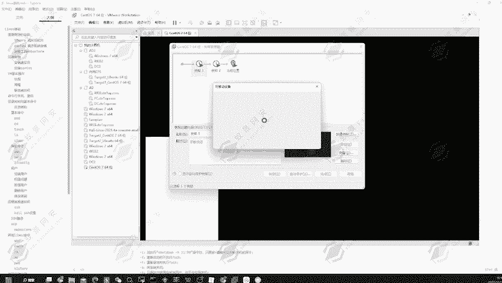

拍摄快照后，你可以随时将系统恢复到该时间点。

1.  右键点击虚拟机，选择“快照” -> “快照管理器”。
2.  在管理器中，你可以看到所有已创建的快照，它们以节点树的形式展示，清晰地显示了快照之间的衍生关系。
3.  要恢复到某个状态，只需在快照管理器中选择目标快照，然后点击“转到”按钮。

**核心概念：** 快照节点树。每次基于某个快照状态进行更改并创建新快照时，都会形成一个新的分支节点。这让你可以灵活地在不同的“时间线”上进行实验。

**作用：** 在执行可能使系统崩溃的危险命令或配置前，先拍摄一个快照。如果操作失败，只需恢复快照即可，无需重装整个系统。

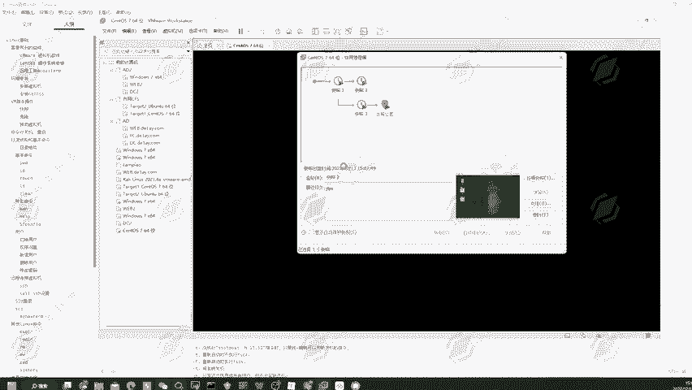

---

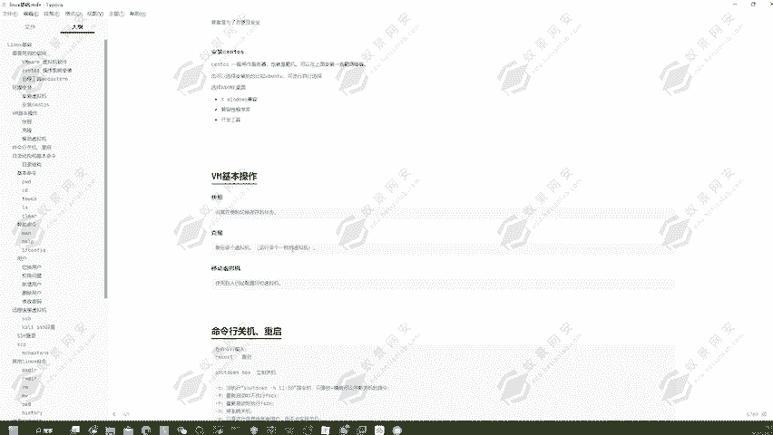

## 克隆功能：快速复制虚拟机

学会了如何保存单个系统的状态后，我们来看看如何快速创建多个相同的系统。克隆功能可以基于现有虚拟机，完整地复制出一个新的、独立的虚拟机。

### 创建克隆虚拟机

以下是克隆虚拟机的操作流程：

1.  确保源虚拟机处于**关机**状态。
2.  右键点击该虚拟机，选择“管理” -> “克隆...”。
3.  在克隆向导中，选择源（“虚拟机中的当前状态”）。
4.  选择克隆类型。这里有两个关键选项：
    *   **创建链接克隆**：新虚拟机与源虚拟机共享磁盘文件，节省空间，但依赖性较强。
    *   **创建完整克隆**：**推荐选择**。完全独立地复制所有文件，生成一个全新的、与源虚拟机无关的虚拟机。
5.  为克隆的虚拟机命名并选择存储位置。
6.  点击“完成”，等待克隆过程结束。

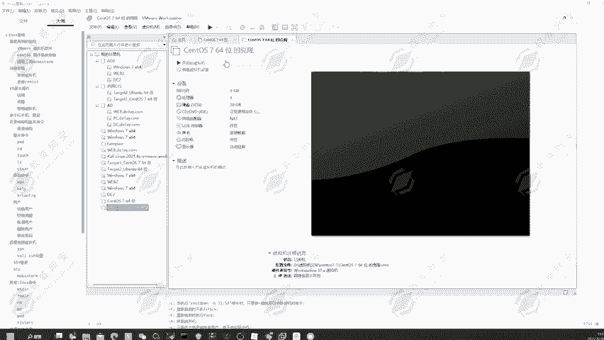

克隆完成后，你将在虚拟机列表中发现一台新的、配置完全相同的虚拟机。你可以同时启动它们，用于需要多台主机协作的复杂测试场景。

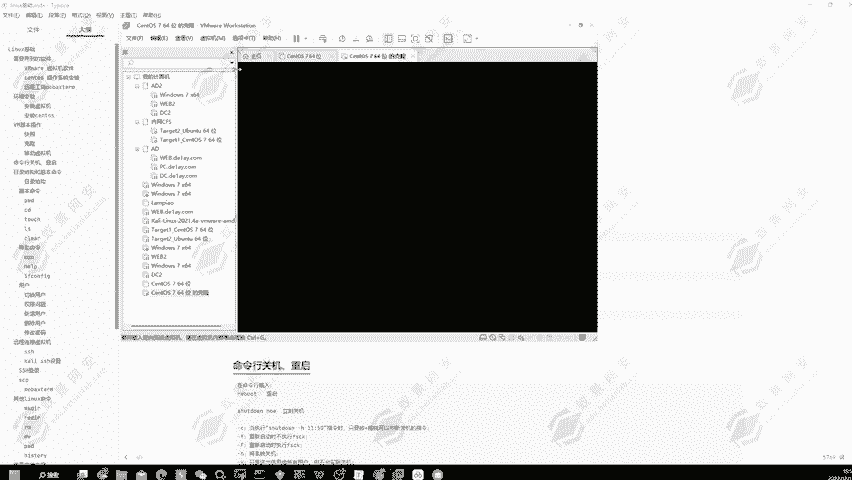

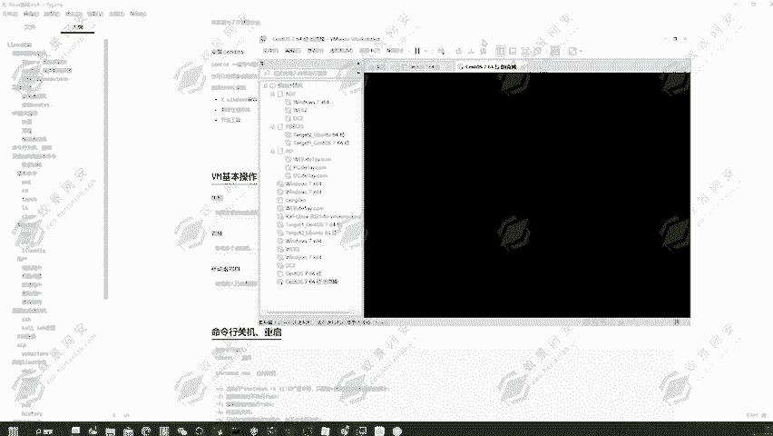

---

## 虚拟机的便携性

VMware虚拟机的另一个优势是其便携性。一个虚拟机本质上是一组文件（如 `.vmx` 配置文件、 `.vmdk` 虚拟磁盘文件）。

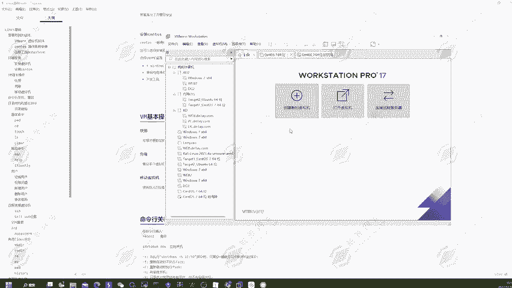

1.  你可以将这组文件**复制到移动硬盘或U盘**中，在其他安装了VMware的电脑上直接打开使用。
2.  你也可以将这组文件**打包成压缩包**（如ZIP或RAR），分享给他人。对方解压后，只需在VMware中点击“文件”->“打开”，选择解压后的 `.vmx` 文件即可运行。

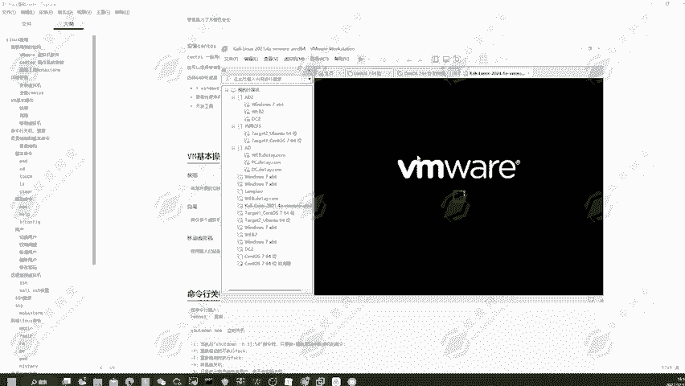

**公式：** `虚拟机便携性 = 虚拟机文件组 (.vmx, .vmdk等) + VMware软件环境`

这种特性极大地便利了环境的迁移、备份和团队协作。

---

## 课程总结

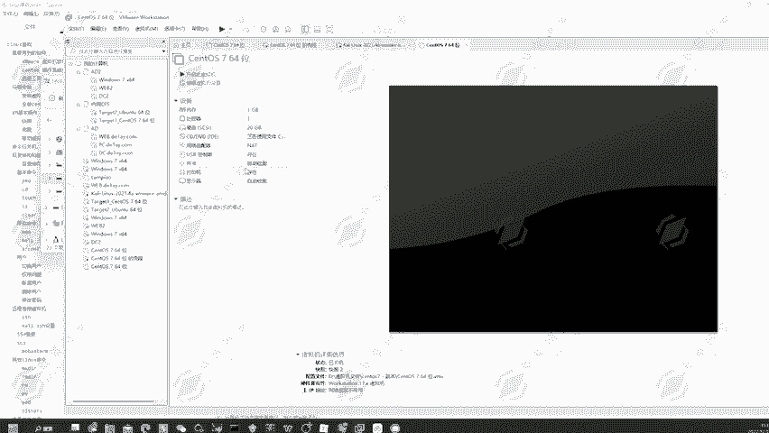

本节课中我们一起学习了VMware虚拟机的两个核心操作：
1.  **快照**：用于保存和恢复系统状态，是进行破坏性测试前的“安全网”。
2.  **克隆**：用于快速创建多个相同的测试环境，提升效率。
3.  **便携性**：虚拟机文件可轻松迁移、备份和共享。

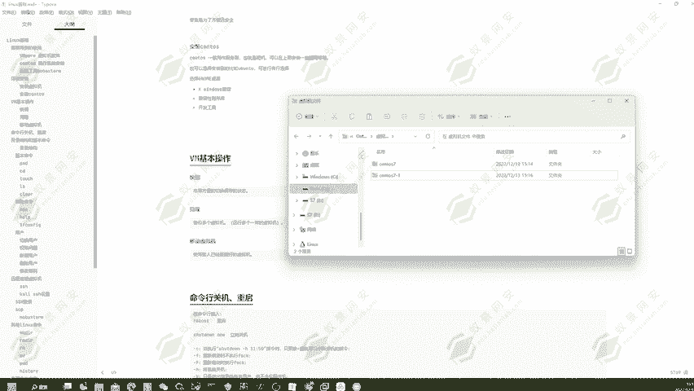

熟练掌握这些功能，将为后续的渗透测试和安全实验打下坚实的基础，让你能够更安全、更高效地进行学习与实践。下一节课，我们将开始学习Kali Linux系统中的基本命令。