# 2024年最强Kali渗透教程／网络安全／kali破解／web安全／渗透测试／黑客教程 ／代码审计／DDoS攻击／漏洞挖掘／CTF - P28：5_网站指纹识别 - 网络安全系统教学合集 - BV1Pe411C7Zb

那这里呢我们如何对网站的信息收集？今天我们就来一一的讲解。其实非常简单，无非就是这三种。网站指纹的识别敏感文件及网站目录的探测。网站waf的识别waf呢是外b应用防火墙的意思。

那我们首先来看网站指纹识别，什么是网站的指纹呢？我们首先要了解一个网站最基本的组成，就是由服务器中间件、脚本语言和数据库组成的。那么服务器也就是操作系统。

一般呢是有lin的操作系统和windows server这两种中间键为外部容器，也就是开启80端口的外部容器。有阿帕奇。tom cat等等。还有脚本语言JSPPHPISPP点net。

还有python dejgle和flask等等。数据库myscles serveroracaccess等等数据库。这些四个东西组成了我们的外博网站。为什么要了解网站的一个指纹呢？很简单。

如果我们发现一个漏洞文件读取漏洞，我们需要读取敏感文件，比如ETC passwordword。但是如果是windows系统，根本就不会存在这样一个文件，那我们就需要首先知道它的一个操作系统。

操作系统这里判别一般是通过三种方式。第一种P。拼之后之前也说过是以ICMP有1个TTL值windows的TTL值一般为128linux呢则为64。啊，一般为128。

那我们可以确定当TTL大于100一般啊我windows服务器而小于100的，一般为linux服务器，这里啊可以给大家去看一下，很简单，你就去拼一下就知道了。比如说我现在拼我们的本地这个记子啊。

本地就是回还地址127。0。0。1。

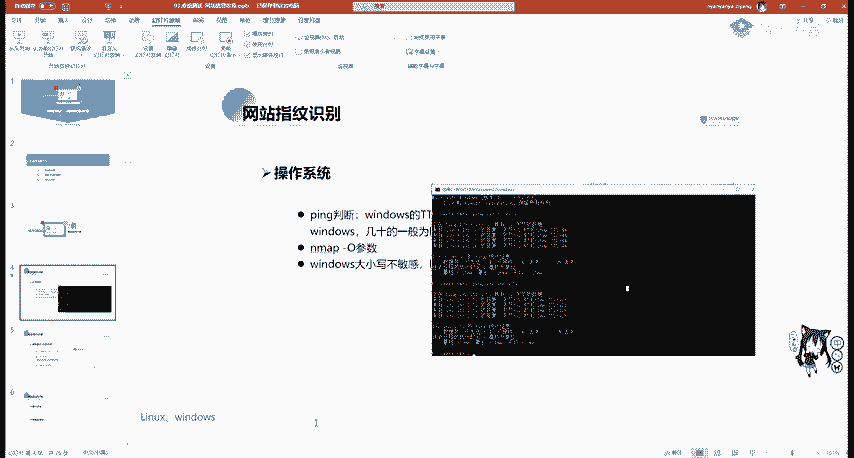

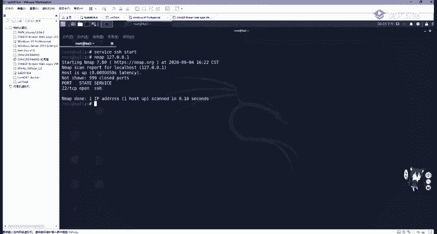

看是不是128128，说明我们win10啊是windows NT操作系统。

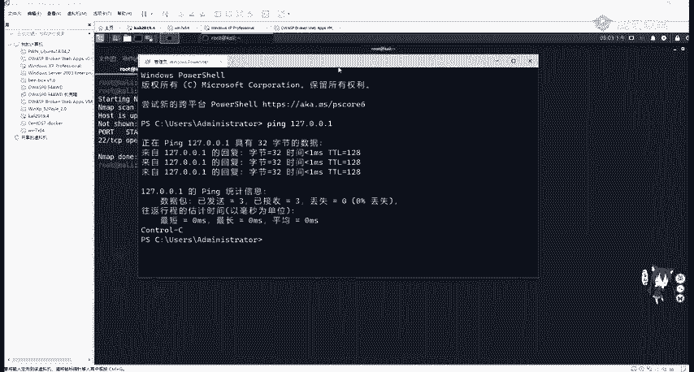

那我们去定卡里这卡里，我们来看一下他的1个IP地址。他的RB地址啊，这个135，我们把它给复制下来。

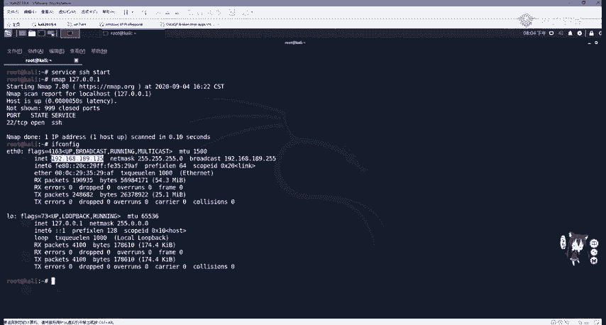

。进行聘。可以看到这里是64，也就是小于100的那就很明显。可以用一般，你不能说确定一般几时的就为00克4。第二个方法，使用我们昨天讲的N map杠O参数进行识别。n map杠O。

比如我们现在啊就是对189网段进行一个便利扫描，并判断每一个网的一个操作系统。那我们我先把这个一些虚拟机都打开。他们都是处于一个网段，用一个net网卡的那使用N map。

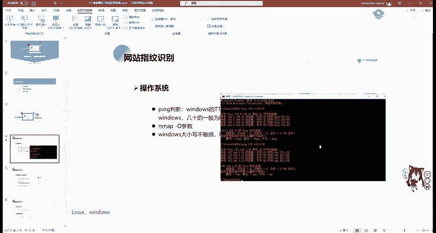

杠O在杠啊，可以杠PN，也就是不使用P。在杠T4。OK在杠。哎，也行，指定我们的192。168。189。0，加上我们的杠24子网源码，让他去扫描。来看一下。这些N map的参数大家不一定一定要去死记啊。

大家多敲两遍，你差不多就知道了。不知道的时候就翻出N map中文手册，或者是直接在命令行里面敲N map，它就会显示它的一个用法。OK让他先在这扫吧。先这扫，那我们继续看。

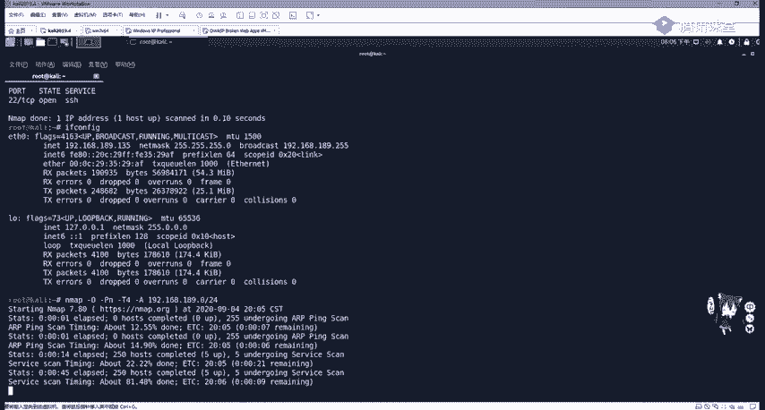

还有一种叫做windows大小写不敏感，而linux区分大小写。这里我们最直观的地方就是在UIL地址栏里面。这里我给大家啊举个例子。比如。这个windows叉P系统我们开启了PNPstar。

里面呢我装他的一个地址是133，那我们访问一下他。访问一下他里面我已经装好了DVWI。我们可以把它登进去。进去之后，我们啊随便点个地方，大家可以看到这上面的URL地址都是小写的。

我们windows服务器是大小写不敏感的那我们把这个DVWI，我随便改一个为大写啊，我改成D大V会发现访问的还是这里，那我把index改成个大写，访问的还是这里，这是最明显的区别。

windows大小不敏感。那我们再看linux操作系统呢。

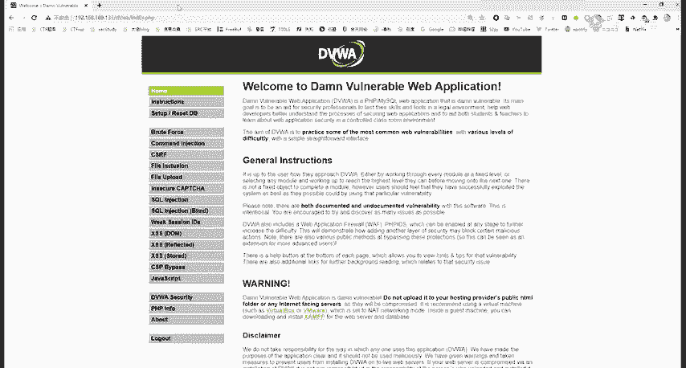

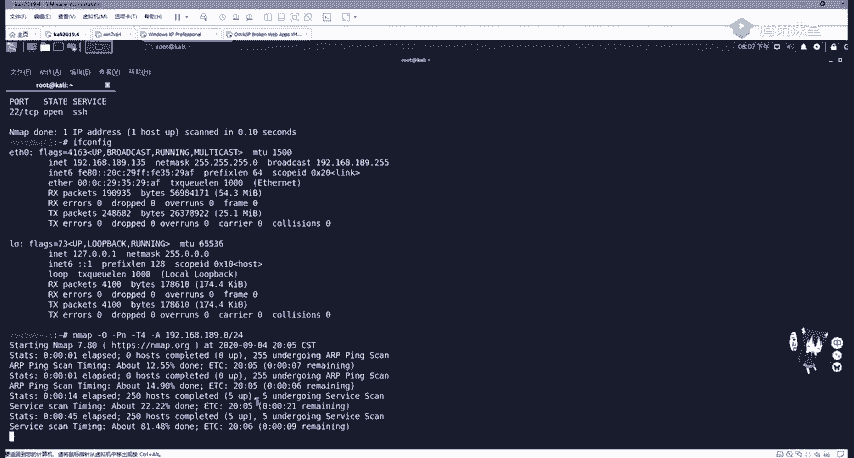

在看这个lin的操作系统。这个服务器地址是139，是OWSPBWI这一个操作系统。我们访问他的IP地址139。

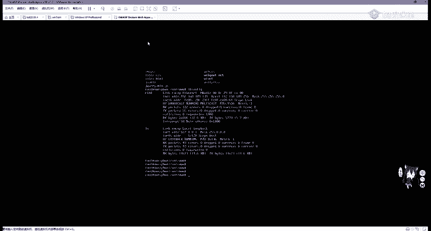

OK我们随便来到这个网站中，比如我们来到这个CILC这个地方。OK那我们去输大写。啊，这不行了。我们随便改一个，比如说把L改成大写。就会把自动转换成小写，就把我们自动转换成小写。让我们。

放下 d v道咧。没有了。你要自俾他咩。Yeah。

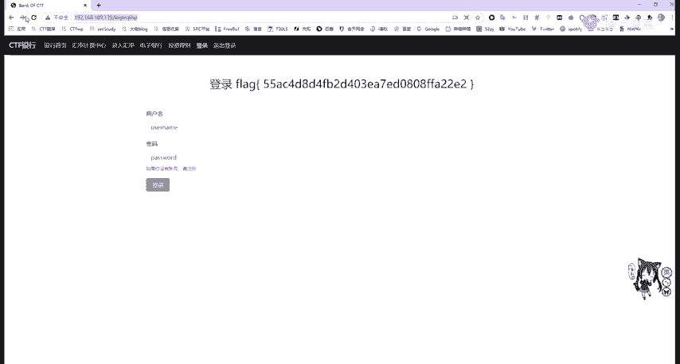

行吧，那这里就就是如果这里改成大写的话，那肯定是不能访问的。大家可以自己去尝试一下。

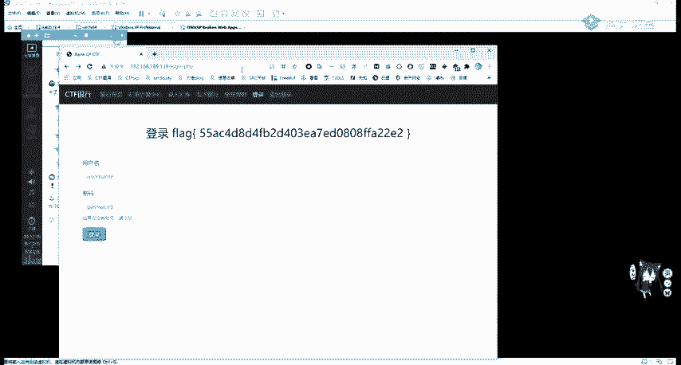

。

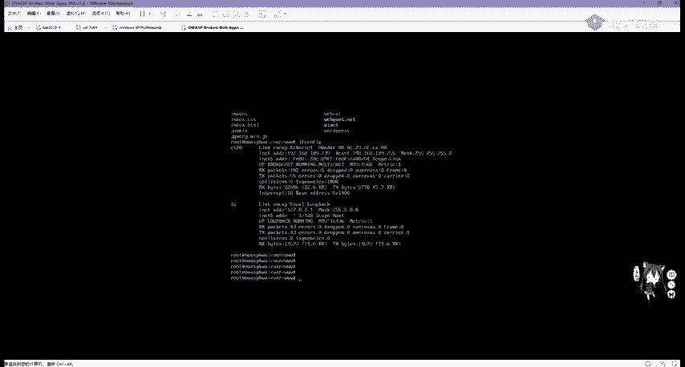

呃，我看这这还没撒啊。快餐号。操作系统判断之后，我们还可以对网站的服务，也就是容器编程语言中间件进行一个啊识别。而识别中间键为什么？因为阿帕奇这些中间键是有很多漏洞的。我们如果能正确的识别它的版本号。

包括一些啊库文件都是具有一个啊漏洞的。那我是不是就可以直接利用。那我们修查看网站的一个。服务或容器类型。第一种方法通过F12，这里我就拿和天网。作为一个测试，如何去看呢？在F12之后。

会调出我们chrome浏览器的一个呃调试界面。调试界面我们一般是属于这个叫竖状这个HTML前端页面还有network，我们选中network网络页面之后，按F5进行刷新刷新。

我们可以看在下面看到很多请求啊，我们看到点action其实这个就是用str to这个啊进行写的这个框架。然后第一个选中我们这个域名一样的地方，3W核心labcom使用它之后就会出现his。

pedersO这里能不能放可以放大。我们选中hiers之后，往下拉有个叫做response headers，然后下面有个servver engineer，可以发现它是这一个中间键。这是第一种方法。

第二种我们还可以利用。外b接口和web接口whats web这个接口我就不给大家演示了，就和站甲站长之家是一样的。第三种方法也就是最方便的也一般是使用这个浏览器插件。

这个浏览器插件大家可以啊去这个官网进行下载。大家可以去他的官网，也有外部接口可以一个查询的。然后他官网之后。那这一个look look up。嗯，在这里我们可以去查看他的一个。输入UIL之后。

他会分析它一个指纹信息。当然它也是有个浏览器插件的，可以在网上商店里面进行搜索。或者你打不开网上商店的话，可以去finfox火狐浏览器进行下载，或者是下载离线版，然后安装进chrome浏览器即可。

那我们打开它之后就非常方便了。只要点击我们浏览器右上角的这个。插件他就会告诉我们这个啊用了什么插件，包括中间件服务器，接que库，还有一些bone trapUI框架等等。Yeah。

通过插件也可以帮助我们判断脚本类型。比如PHPGSPP或pyython。

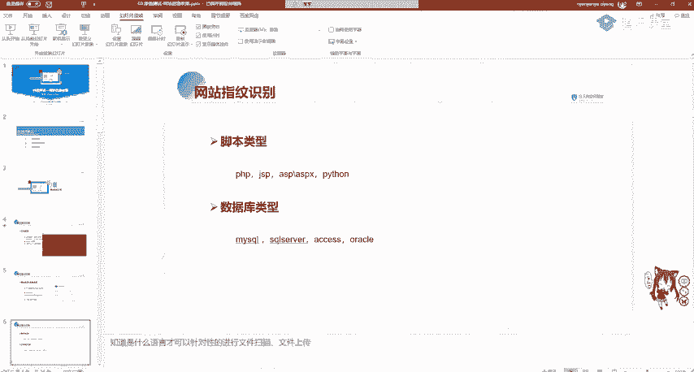

这里我们判断这个脚北类型一般是看网站的一个后缀啊，看后缀名像PA网站，它一般后面是点PAGSP的话啊。

就是比如这个框架str to我们随便点一个就发现它后面是GSP说明它是加va server page里面写的那我们再进行其他的呃进行一个点击。

可以看到是点度结尾，说明是使用的str to模块或点action结尾。我们可以通过经验进行一个查看SSPSPX是呃这个ISP和SP导net进行编写的。

数据库类型一般my circlecle super serverac orac可以进行一个指纹探测，在搜cle map也可以帮我们去探测这一个指纹信息。

我们需要知道是什么语言才能针对性的进行文件扫描、文件上传等一些后续渗透操作。比如PHP以及上传木马的话，要上传PHP吗。常见CMS识别CMS叫做内容管理系统，是通常用于网站内容的文章管理。

网站的管理员并不是每一个人都会写PP，比如一个新闻系统，或者是一个博客系统wordpress，那他并不要求你会复杂的前端代码或者是博客的交互代码。

我们只需要来到wordpress博客网站后台去用markdown或用自带的wordpress编辑器进行编写博客或者进行一个主题切换，进行网站设置用户创建权限修改等等功能。

那这个系统统称为CMSCMS框架是有很多漏洞的。可以说，CMS养活了大部分渗透测试工程师。如果没有这些CMS的存在，我们根本就不知道去挖什么漏洞。那常见的CMS有很多。

比如之梦discus PHBCMS等，我们可以通过在线识别工具进行识别，故事是通过网站的banner进行识别。那在线识别工具也是通过外部接口，我们可以。打开去看一下啊，我们在这输入UIL地址。

它会帮我们识别。但这里识别的不是很准确，一般我们还是要通过手动啊手动去查看。比如一个逆向的。破解啊52破解论坛。这个是如果大家对病毒分析逆向破解有兴趣的话，应该非常清楚。

这个论坛可以看到它最下面左下角的banner就会告诉大家how by discusscus，也就是用discuss论坛进行编写进行框架进行写的这个网站。那discuss到底是什么东西呢？

我们可以百度搜一下，可以发现它是一个啊。通用社区论坛软件系统。那它是有很多漏洞的。我们如何去寻找它应该还记得昨天讲的一个AexDB这网站或者是其他的一个历史漏洞网站进行查找。

我们在这里复制过来我们的discuss进行搜索，会发现这上面有很多。嗯，6。01。02。0版本的。包括啊这个注入。代码执行。任意密码重置嗯，都可以打开去看。然后这方旁边就有E叉P。

就是漏洞利用脚本或漏洞利用方法。同样我们的之梦，包括PHPCMS都可以这样去查找。那PHBCMS啊是一个内容管理系统。啊，这这网站怎么崩呢？OK他现在已经更新到V9了V9。

那我们可以看到直接去百度搜PHBCMS它就会有一个链接是嗯搜扣注入漏洞。那我们也可以在这个网站进行一个搜索。嗯。可以看到啊，他很多版本一个漏洞。

下面呢我们也可以利用其他的online toolss进行一个呃内容识别。

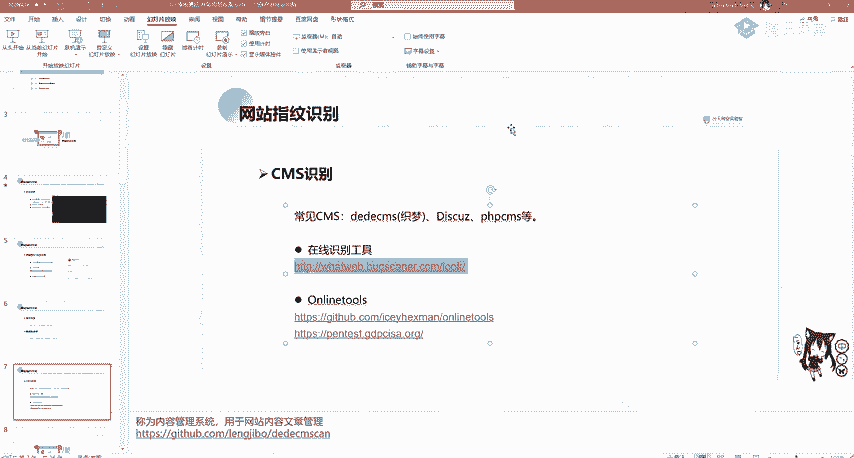