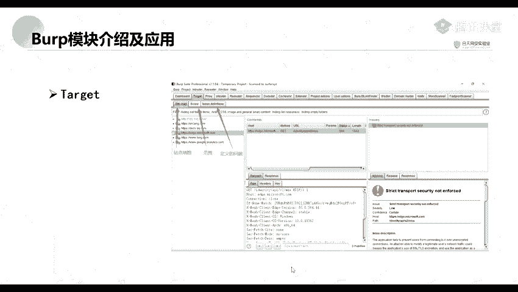
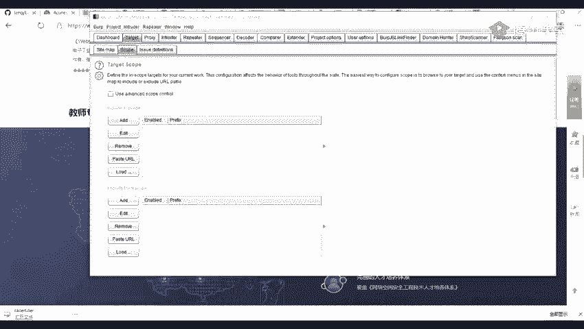
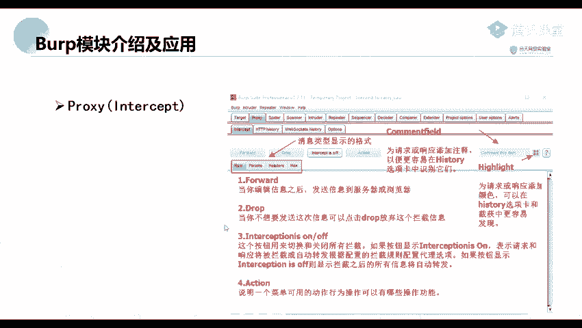
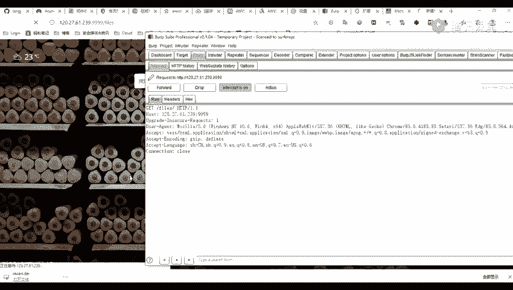
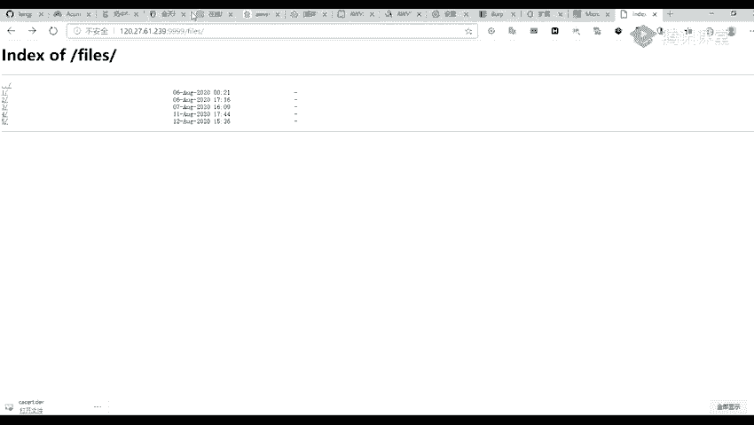
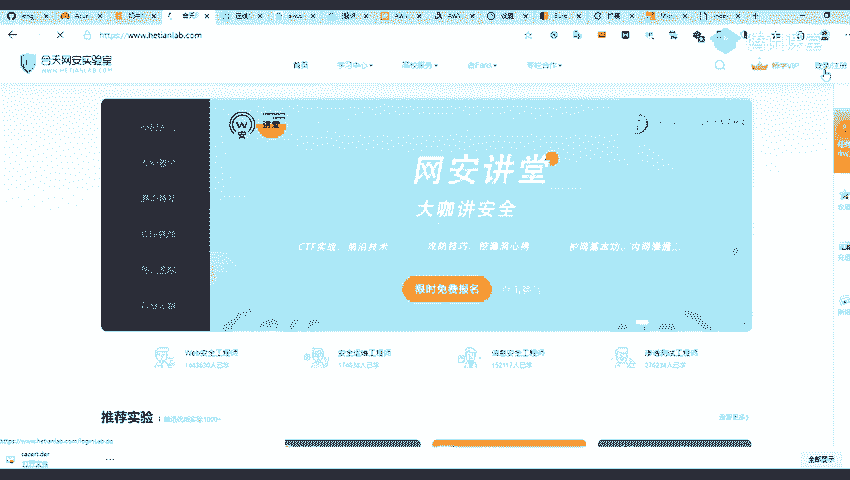
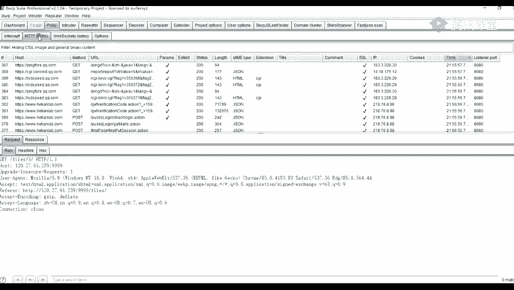
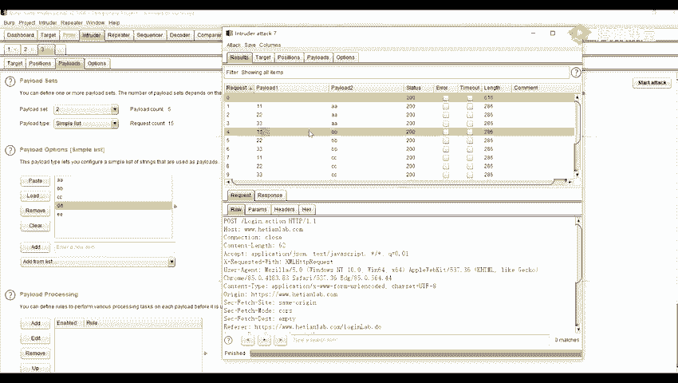
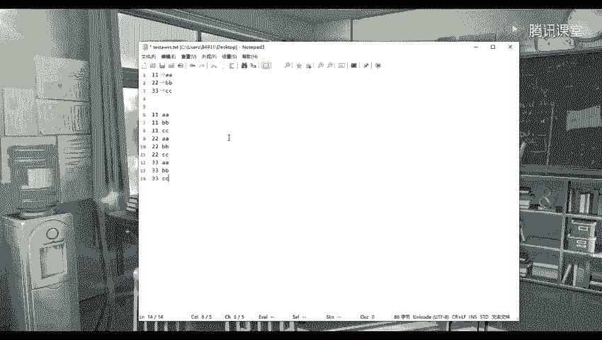
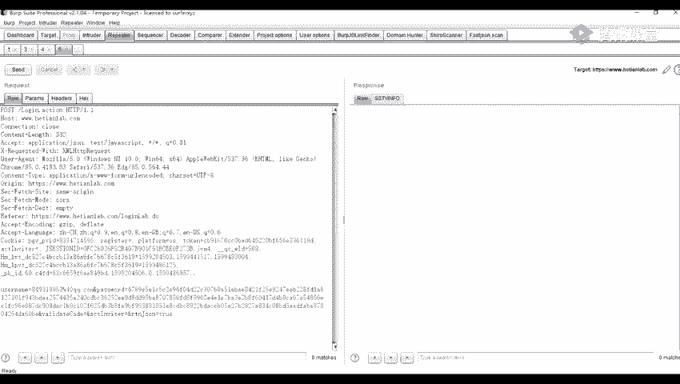

# 2024年最强Kali渗透教程／网络安全／kali破解／web安全／渗透测试／黑客教程 ／代码审计／DDoS攻击／漏洞挖掘／CTF - P36：6_Burp模块介绍及应用 - 网络安全系统教学合集 - BV1Pe411C7Zb

首先呢他是有他们他是有1个十1大11大模块。然后呢我们分会对这些模块会进行一个展开来讲，就是去讲我们常用的几个一个模块。所以呢我们最常用的话是只只有三个，就比较常用的。首先呢我们来看一下第一个部分。

F four这个呢也叫做一个仪表盘一。这仪表盘这里。嗯。要几个的一个窗口或者说一个界面。首先呢这个类 lake排这个就是这个一这一个就是一个爬虫，就爬虫的一个设置。就是在这个罚虫呢。

就是对我们经过的所有的一个流量进行爬重。那第二个就是这个liau。个li就是就是一个被动扫描，就是他的意思呢就是对经过的一个流量进行一个审计。Yeah。然后最上面。第三第三面这个。嗯。

这个呢就是我们我们的一个日志的一个界面，就是我们可能是我们启动我们的一个bo，或者是我们设置的一个代理，及可以及我们一些站点，就是不能访问或者是什么原因的一些日志日志的一个界面。

然后右上角呢这一个呢就是我们的一个问题活动界面，也可以理解成它的一个漏洞界面，就是大家所所找到的一个漏洞，就是这个。就就是这个被动扫描，就找到的这个漏洞。这个呢然后上面呢就是他的一个描述。

比如说我们我们有一些一些问题的一个描述。你们可以看到这边描出来有一些请求包以及他的一一个响应包。Yeah。うんうん。第二个呢就是我们的一个插件，就就是一个目标目标模块。目标模块呢它有有几个选在。

一个就是de man，就是一个站点地图以及一个。范围就是第二个。

范围还有一个定义的一个问题。比如说这站点地图就是我们前面的一个爬丛。是爬虫爬道的一个站点目录。还有就是一个。第三个就是一个经议的一些问题。比如说我们。我们里面可以看到他这里呢有许多的一个漏洞。

漏洞的一一些描述。还有呢就是就是一个范围范围就是说我们的爬取的一个范围，就是我们爬虫爬取的一个范围。下面呢我们这这两前面两个呢都简单的讲一下。下面呢我们我们讲了一下这个是最常用的。lo这个模块。

没事。pl这个模块呢，它有它里面呢也有几几个角的一个功能。第一个呢就是一个intercept intertercept这个。这个应该说是一个小模块，比如说我这里有一个地址，我们我们我这里呢还没有访问。

原来我这里开启进行抓包，这个呢是一个无用的一个数据包啊，这不用理他。那么我们。

啊点击就是访问，你要发送。这个呢这这个呢就是我们抓要提到的一个数据包。我们我们可以点击播放的，播放的就是一个放行。放屏的一个功能。然后我们第二个呢，这个d drop就是将它进行一个丢弃。

比如说我们这里丢弃了之后，我们可以看到他这里是就没有去进行访问到我们我们的这1个120点27。61这1个网网站，或者说是1个IP。

那在我们我们快者，我们再重新访问一下。在这里进行一个抓取到这一个包，然后我们点击这个包啊。点击了之后，点击了这个forword之后呢，我们是不是就可以进行一个访问了？Oh。然后呢嗯。

还有这一个inter set is on这个选就是选项，但是有一个on也还有一个on。他的一个意思呢就是这个按钮就是用来打开拦截或者是关闭拦截的。比如说我们这里打开拦截之后。

我们访问我们再点击这个一之后，我们是不是就可以拦截，拦截到我们的这一个。就是单去访问我我们的这个异议的这个路径这里的。么点击宝放啊。那在我们还有呢，我们可以关闭拦截，关闭拦截。那呢就是他的意思呢。

就是我们可以随意的进行访问。我们可以看到，比如说我们点击二也可以进行访问，点击三也可以。他他并没有进行他在这个。在这一个因现在这里，他并没有进行一一个数据包在里面进行检测的。但是呢。如果如果说。

我们设置了代理之后，因这个我们这里已经设置了一个代理的核对吧。那那我们这里呢也将我们的这个拦截进行关闭。完毕了之后。我们可以在我们这个hiyle里。

我们可以在这个hi里这个权限可以看到我们的一个HDDP的一个历史。可见呢。这里呢是我自家里面的一个住宿。这个HDDBS林呢当这个选项是用来显示所有请求产生的一个细节。啊。

比如说显示所有的一个目标服务器的一个端口。还有他的1个HTDDP的一个方法，以及1个UIL以及请求中是否包含参数或者是被人工修改HDTP的响应状态码等等。比如说我们这里找到我们的一个。进行出具。嗯。

我们这里呢是不是可以看到？我们可以看到我们的一个目标服务器，还有它的一个端口，以及它的一个map，这个方法是get还是post，还有的一个请求的一个URL。

还有的就是我们的一个请求的请请求中是否包含参数。比如说我们这里。是不是有一个问号，问号V等于一，这个呢就是我们的一个参数，这V就是它的一个参数。然后面这里没有没有这个问号，后面都这么多，在这里呢。

就是没有这个这个参数。然后后面呢就是。嗯。他是否被人工进行一个修改过？就到我们这里。毕定0抓到结到。还有呢就是他的一个状态码。比如说我们有有一些是200的，有一些是204的，有一些是304的等等。

一些还有一些101的一些状态码。还有它的一个长度，就是它的一个返回包的一个长度。嗯。看一下。是返返回过还是请邮包啊？嗯。哦，就是它的一个响应字节的一个大小。还有它的一个响应的1个MIME的一个类型。

比如说它是1个HHTML的一个类型，还是1个TST的一个类型，以及一个jason的的一个类型。还有一些其他的一些信息，比如说IP啊、hoook啊、时间啊等等。你从哪个端口监梯来的？

然后呢我们在这里呢点开这里，我们就是他的一个点击这里进行一个过滤。比如说我们这里呢是以按一个请求。按请求类型过滤的，还是按1个MIME类型过滤的。这个呢就是说我们抓取的包啊，比如说我们这里。

我们这里一个hiory里这里比如说我们这里将我们设置我们这个包，就是将我们这jason格式的一个包进行一个过滤了之后，那么他那么他就会他就不能抓取到我们我们的那一个包。

比说我们这里将我们的1个HDML的一个包进行一个过滤。就是去抓去抓取，就是抓取我们这个HTMM的一个包。还有呢就是我们的一个按一些正则表达式啊，或者是一些按状态码等等。我这里呢也也进行一个注释了。

这就是呢也写写的很详细。你们可以就是待会你们可以看这一个都是。那第三个呢就是一个这个pl上面的这个web stock这个history。这个权限呢主要是用来记录web的一个数据包。

这个web webb so是我们的1个HTML5中最强大的一个通信功能。它定义定义了一个原双功的一个通信公道，通信公道。这个中心那他只需要在我们的一个we上面的一个点。即可进行一个通信。

它可以减少不必要的一些网络流量，并且降低网络延迟。这个呢我们就简单的讲一下。然后我们点一下第二个模块，研修的这个模块。这模块它它主要是对于我们的一个web应用程序进行一个自定义的攻击。

比如说我们可以推近您一个嗯。暴力破解啊或者一些其实这工具呢都我们都可以去统称为一个暴力破解，或者说这一个可以去包包破我们的一个网站一些登录登录用户名啊，还有一些密码等等。以及可去媒体我们的一一些。

攻击了一些一些那个POC。肯定呢我们。这里我给大家举个例子啊。

比如说我们这里呢这个和天和天官网这里我们点击这个登录。

我这里呢呃就不定点一个算了还是抓包吧。

现我我打开拦截拦截之后，我这里有一个用户名，还有一个密码。那我进行一个登录。

我先将这些包给丢掉。嗯，登录我们可以看到这个呢就是我的一个。登录的一个包。那那我们可以点击这个a，点击这个a将我们这个包去发送到我们的这个inQ的inQ的这个模块这里你可以。对通过一个右键。

就是这个sN，其实跟我们的一个右键是一样的一个功能，就将它发送到我们这个intail的这个模块。也可以去发送到其他的一些模块。嗯，他简单简单的来讲，这个H这个按钮就是进行一个交互的一个按钮就是。

跟其他的一些这个模块进行一个交互的按钮。我们这里呢发送到了这里之后，我们这个第一步呢是通常呢是不用去进行选选择的。就是这个搭概。他概这个这一步呢是不用选择的。我们来看一下第二步。

只要是在我们第二步进行一个测试就可以了。店二铺设置这里嗯。Okay。他有许多的一些选项，比如说他这个攻击类型。O type这里呢就是我们的一个攻击模式的一个设置。那里面呢它有4个4个的一个设置。

第一个snipleniple这个呢就是对变量依次进行一个破解。要多的多个标记就依次进行。比如说我们这里有多个的一个标记。就会依次进行。那后面呢这里有个有一个艾lealea。哦。

还有一个le life这个。这这是个按钮。第一个这个艾是一个。先插入一个新的标记。比如说我们在这里。现我们抓到的这个包发送到我们这个Q的这个模块之后。

它会自动对我们的一个等于号后面的一些参数参数的一个值进行一个标记。我们先就是到这一步，我们先将它这个标记进行一个删除。单独之后，我们就在我们。需要标记的地方进行一个添加标记。

比如说我们这里在这个username这里。添加一个标记。ad添加一个标记，以及在我们这个fassword这里也添加一个标记。我这里呢是举个例子啊。添加一个标记。现在我们也可以去删除这个标记。点击可啊。

这个这个哦。这个按钮呢就是它自动为我们参数值进行一个标记。比如说我们点击这个哦。那是不是就对我们等于后后面的一那些参数的值进行自动的标记了？看到我们在澄听。可去进请一个清属标记。

那我们点选择我们的一个user name，这里添加一个标记。呃，在我们的一个爬sword这里也添加一个标记。嗯。那我们前面讲到我们这个niple，就是我们对我们的一个变量依次进行破解。

如果说我们多个标记也进行一个依次进行。比如说我们这里有两个标记，对吧？现在我们在这里拍lo。这里呢我们就是是一个。这是我们的一个设置的一个字点。比如说我们前面设置一个，我们待会呢我们先讲这些吧。

先讲前面的吧，先讲这一部分的内容。那第二个第二个就是就是对变量同时进行破解。比如说我们前面这里呢选两个标记。那么就会对这个两个标记进行同时的一个破解。然后第三个第三个就是对每一个变量标记对应一个字点。

比如说我们这里选择第三个，我们这里，然后我们这里呢是选择两个标，选择两个标记了，对吧？那么他就会对每一个变量，就是取我们我们每一个字典的一个对应项进行包括。待会呢我会给大家进行一个演示。嗯。😊。

第四个第4个我们也结可以叫他为一个嗯减速炸弹。是一个极速大弹。就是他大就是每一个变量对应一个字点。比如说这里这这一个是一个变量一，我们我们选择第四个，然后这里这个变量一变量一是对应一个字点。

和变量二也对应一个字点。然后呢他就会对对这两个变量去进行一个交集的破解。我们最常用呢就是在用于我们的一个用户名以及密码的破解。比如说我们这里破解我们我们的一个用户名以及密码。

我们来先来看一下这个Ilo这个测置这里。嗯。嗯嗯。我这里呢也设置了就进行一个比较详细的一些注释。我们呢我这里呢就不讲这个了，我们直接进行一个演示。比如说我们。前面的第一个先选第一个，我们先选择第一个。

啊，我们就选择一个一个标记吧。比如说我们这里呢选择选择这个标记，选择第一个sniple。然后我们在这个p这里我们就可以随意添加一个。我们这里呢就简单的添加一个。比如说一些pa就是。就是一个粘贴。

就是粘贴我们的一些字典等等。那这个艾就是添加一些字典。比如我这里呢就随意的输入啊，还有一些移除以及清除等等。或者是我们去移除我们这个第一个，或者是清除两个。好。测置了之后呢，然后呢我们就可以。

进行一个报破。因为我我这里呢是是随便设置的一个参数啊，然后呢我们可以装到这里是一个包包破娃的。播报完了之后，我们可以看到他这这里他这个username是不是就是我们这个参数。

是不是就是我们前面所设置的一个字典？分面是1个112233，就这里。1233。那么我们来看一下选择第二个第二个进行一个爆破。那讲下第二个如果。就是对我们的一个标记。这多个标记就对变量依次进行一个破解。

就同同时进行破解，就是对我们这个变量同时破解。就如果说有多个标记的话，比如说我们这里也有一个标记。现在也会进行一个同时的一个破解。现在我们进入到我们这个piload这个设置这里。

我们可以看到它这里呢其实也是只在我们这个pload setpload set这个那只是也有一个只有一个标记，就是只有一个一这里。那我我们还是使用我们的这个字点来进行一个包括。

现在我们可以看到他是不是他其实他是不是在这里他的一个。你将这里发送到我们这里吧。这个呢就就是我们报破的一个就是参数值值一个username，还有一个password。前面前面我们设是设置了1个11。

1设置了1个11，这里呢，它就它就就对我们的一个这个11同时进行一个破解。那这里呢1个22。然后呢，这里呢也是对我们的1个22进行一个同时的破解。哎呀就是33。嗯。那那我们来看一下第三个。第三个。

我们选择第三个。第三个呢就是嗯。对每一个变量标记对应一个字点。比如说我们这里有两个变量，这个前面这个username是一个变量一，这个把sword是一个变量2。让呢它就是每一个变量就对应一个字点。

要取每一个字典的对应的一个项。让他钉进我们选择了这个之后，我们进入到我们拍到的这里。我们可以看到我们我们的一个pilo set，这里我们有1个112233，这一字1字联的是这一个第一号标记。这一个。

那么我们进入到第二第二个标记，第个标记我们点一个随便输入1个AI。哔 b。滴啲。滴啲。一。嗯。😊，选择了之后，我们可以看觉进行一个攻击。攻击了之后，我们可以发现为什么这个这里呢就是第二呃第二个标记。

这里输入5个字典，但是它实际上只包括了3次呢，这里呢就是我们的这个需要注意的一个地方，就是它只取我们最短的一个字典。比如说我们有一个字典，有一个1001个另一个字点是50。那么它是只包破50次而已。啊。

原来我们我们可以看到这里一这里一就是一号标记也要对应。Yeah。对应了1个112号标记2号标记了就是对应1个AI我们这里呢可以看到。

要分别是一对应AI1后2对应BB33然后对应CC然后后面呢这些DD1并没有进行爆破，因为它并没有一个数值进行一个对应。如果说我们在这里1个1号字点也添加1个44，还有1个55。

那么他也会进就会对我们的一个2号字点就会进行一个包括完毕。还有呢就是一个最后一个。嗯。最后一个就是每一个变量对应一个字典，要并行，并且进行一个标题的包括尝试各种组合。比如说我们这里呢设置了两个标记。

对吧？让他每一个标记对应一个字点，比如说我们这里标记一。编记一有一个一字一字典，要标记二，有一个标二字典。标掉有一个二字的。那么他就就会进行一个交集，就是交叉的一个爆破。现到我们点击大进行一个爆破。

那报括之后，我们可以看到他这里。一共有包括了15次。分别是1个11，1要对应AI12对应也是对应AA33对应AI111对应BB也就是这样子的一个。

证据。比如说这个11，然后后面有1个AA。啊。呢啲。单山。嗯有翻翻。清然后他实际上包括呢是这样子一个组合，要11AA然后11。哔啲。到11。CC要到2AA。啊。哦好啊。拜晒哎你。Yeah。Yeah。

但实际实际上是这种的。嗯。嗯。但是在这里呢是不是就会我们本来是只有只有三个字典，但是他实际上爆破了许多的许多次，爆破了9次，对吧？是不是就会很繁琐了？就是我们的一个字点量就进行就会很庞很庞大。所以呢嗯。

如果是使用这一个的话，我们一般的话那个字典就可能达到就几十万或者是几百万。如果说我们一个字分别是一个一号字点，就是一号字典是只有有100个参数，里面有1个100个参数值。12号字典也有100个参数值。

这110乘10是不是就到1万了。要这样子的一个字点就会进行很庞大。Yeah。然后第三个呢就是一个repeat的一个。等一下这个模块。这里pi呢我们可以从这个pl history里先卖。

以及一个scanner的模块中，通过我们的一个右右键菜单或者是是一个。分曹啊分曹站啊。的一个组合发送到我们这个repe这个模块。这个模块呢我们可以对比如说我们这里这个模块我们可以对这个模块进行一个修改。

就是说将我们这个Uuser name改为一个。P case。或者是一个password。你改为一个。pa要那我们有一个stand send就是进行一个发送。就是发着我们就这一个包。嗯。

或者是我们人就是你这里。原来原来我们这里呢刚修改了两次，然后我们点击这一个可以返回上一次的修改，或者是点击右边这个。就进行上一次。后一致的一个修改。那么这个也是我们最常见的一个模块。

他主要是用来手动修改，并且。荷花。个别的1个HTTP请求，并且分分析他他们的一个响应工具。就是左边呢是我们我们的一个请求包，右边呃是一个感应包。那我们可以从我们这个plus。

就是这个里通过一个右键菜单发送到我们的can头 repeat。也可以在我们的这些发盖。这个站点地图将我们的这个包进行一个发送。要发也是发送到这个repe这里。还可以从这个0Q的这里进行一个发送。

因这个他的一个快捷键都是一个cuntl加啊。这个模块呢也是我们最常见的一个模块。

然那我们这节课呢就讲到这里啊。你们有什么不懂的话，就私底下问我吧，还有就是。或者是在群里就是提出那个问题。

