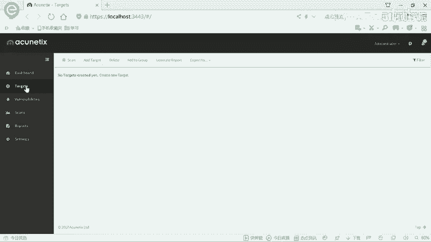
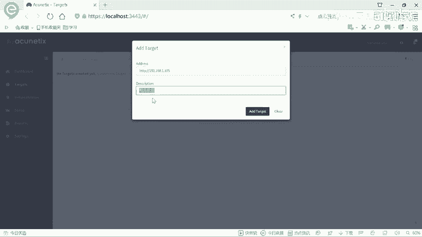
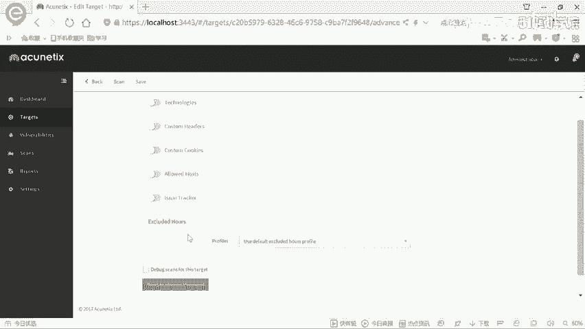
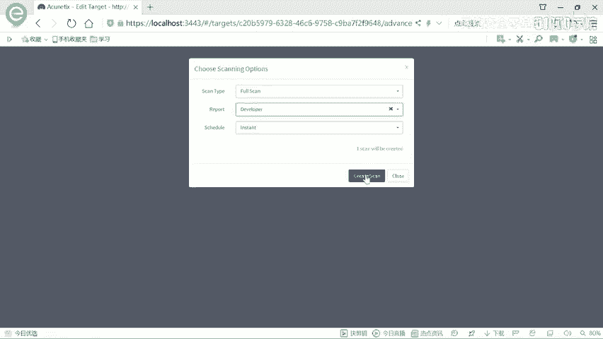
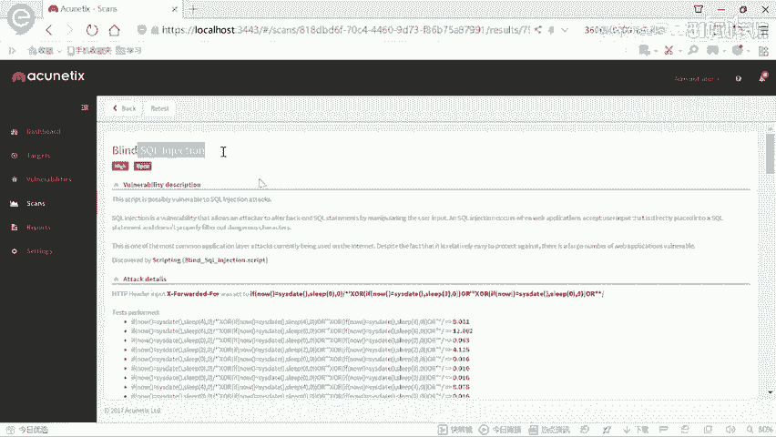
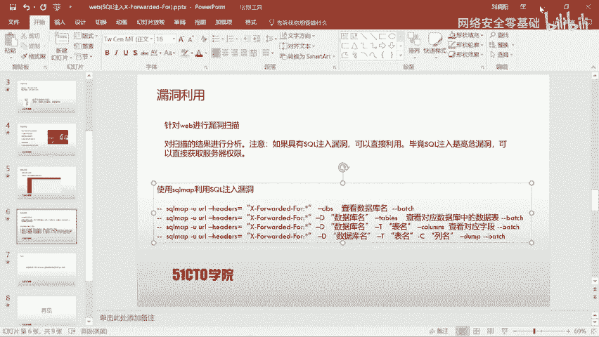
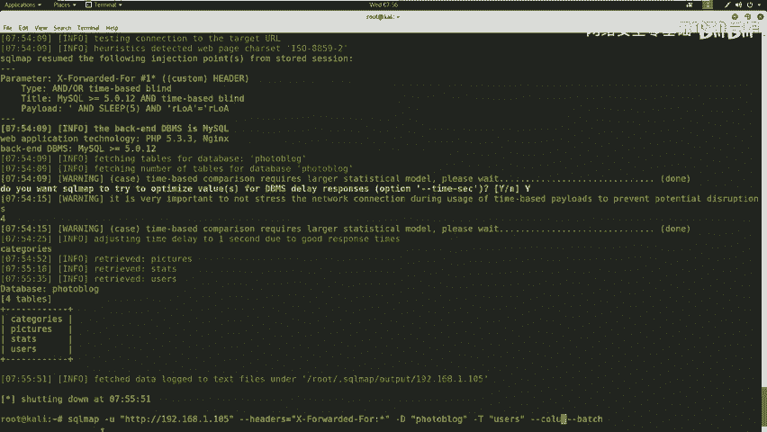
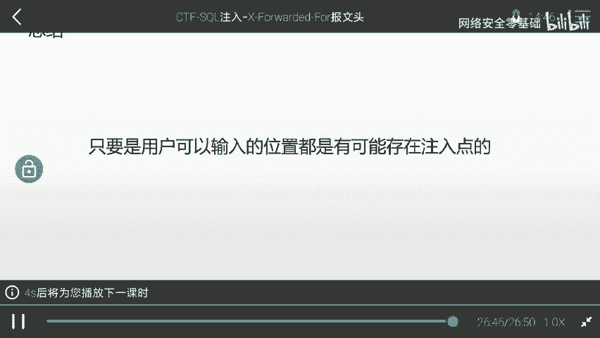

# CTF入门教程：P12：CTF夺旗 - SQL注入(X-Forwarded-For) 🚩

## 概述
在本节课中，我们将学习CTF比赛中一种常见的Web安全漏洞——SQL注入。我们将通过一个具体的实战案例，演示如何利用HTTP请求头中的`X-Forwarded-For`字段进行SQL注入攻击，并最终获取系统后台的访问权限。课程将涵盖信息收集、漏洞扫描、工具利用等完整流程。

---

## SQL注入漏洞介绍
上一节我们介绍了CTF比赛的基本概念，本节中我们来看看SQL注入漏洞。

SQL注入漏洞是指攻击者通过构建特殊的输入作为参数传入Web应用程序中。Web应用程序执行了这些传入的参数，导致执行了非预期的SQL语句，从而使非法数据侵入系统。

这里需要强调一点：**任何用户可以输入的位置，都可能存在SQL注入点**。例如：
*   URL中的参数（如 `?id=1`）。
*   HTTP报文中的各个字段。

攻击者可以在这些位置构造恶意的SQL语句，提交给应用程序，从而实施注入攻击。

---

## 实验环境搭建
在开始实战之前，我们需要了解本次实验的网络环境。

*   **攻击机 (Kali Linux)**：IP地址为 `192.168.1.104`。
*   **靶场机器**：IP地址为 `192.168.1.105`。


我们的目标是挖掘该靶场Web应用的漏洞，最终登录系统后台，获得控制权。

---

## 第一步：信息探测
我们首先需要探测靶场系统开放了哪些服务。我们将使用`Nmap`工具进行扫描。

以下是使用Nmap进行扫描的基本命令：
```bash
# 扫描服务及版本信息
nmap -sS -sV 192.168.1.105

# 进行全面扫描（加载所有脚本，输出详细信息）
nmap -T4 -A -v 192.168.1.105
```
*   `-T4`：设置扫描速度为最快。
*   `-A`：启用操作系统检测、版本检测、脚本扫描和路由跟踪。
*   `-v`：输出详细过程。



扫描结果显示，靶场只开放了**80端口**的HTTP服务，服务器为Nginx。



---



## 第二步：探索Web应用
发现HTTP服务后，我们需要探索其具体的Web页面。我们使用`Nikto`工具来扫描Web服务器的敏感文件和目录。



以下是使用Nikto扫描的命令：
```bash
nikto -host http://192.168.1.105
```
扫描结果中，我们发现了一个管理员登录界面 (`/admin/login.php`)。

访问该登录页面后，我们尝试了常见的弱口令（如`admin/admin`, `admin/123456`），但均未成功。因此，我们放弃弱口令爆破，转向寻找网站漏洞。

---



## 第三步：漏洞扫描
为了系统性地发现Web应用漏洞，我们使用功能强大的漏洞扫描器**AWVS**。

AWVS是一款专注于Web安全的扫描器，它集成了大量漏洞检测模块，更新迅速，能够发现多种Web安全漏洞。



操作流程如下：
1.  打开AWVS，添加扫描目标：`192.168.1.105`。
2.  选择“Full Scan”（完全扫描）模式，并生成报告。
3.  启动扫描。

在扫描结果中，我们注意到了一个**高危漏洞**：在HTTP头的`X-Forwarded-For`字段处存在一个**基于时间的SQL盲注**漏洞。AWVS提供了漏洞描述和攻击细节，确认了该注入点的可利用性。

---

## 第四步：利用SQL注入漏洞
发现SQL注入点后，我们使用自动化SQL注入工具**SQLMap**来利用该漏洞，获取数据库信息。

由于注入点位于HTTP头中，我们需要指定`X-Forwarded-For`字段为注入点。以下是核心利用命令：
```bash
sqlmap -u "http://192.168.1.105" --headers="X-Forwarded-For: *" --dbs --batch
```
*   `-u`：指定目标URL。
*   `--headers`：指定存在注入的HTTP头，`*`号表示注入位置。
*   `--dbs`：枚举数据库。
*   `--batch`：以非交互模式运行，自动选择默认选项。

SQLMap成功识别出注入点，并开始逐个字符地枚举数据库名。我们发现了两个数据库：`information_schema`（系统库）和 `photoblog`（用户库）。

---

## 第五步：获取后台凭证
我们的目标是获取后台登录凭证，因此需要深入挖掘`photoblog`数据库。

以下是后续操作命令：
```bash
# 1. 枚举 photoblog 数据库中的所有表
sqlmap -u "http://192.168.1.105" --headers="X-Forwarded-For: *" -D photoblog --tables --batch



# 2. 枚举 users 表中的所有列（字段）
sqlmap -u "http://192.168.1.105" --headers="X-Forwarded-For: *" -D photoblog -T users --columns --batch

# 3. 导出 users 表中 login 和 password 字段的数据
sqlmap -u "http://192.168.1.105" --headers="X-Forwarded-For: *" -D photoblog -T users -C "login,password" --dump --batch
```
通过以上步骤，SQLMap最终从`users`表中提取出了管理员账户和密码：
*   **用户名**：`admin`
*   **密码 (MD5哈希)**：`P4SSW0RD`（SQLMap自动破解了MD5密文）

---

## 第六步：登录系统后台
获得凭证后，我们返回之前发现的登录页面 (`/admin/login.php`)，使用用户名 `admin` 和密码 `P4SSW0RD` 进行登录。

登录成功！我们进入了系统后台管理界面，至此，本次SQL注入攻击实战完成。

---

## 总结
本节课中，我们一起学习了如何利用HTTP头中的`X-Forwarded-For`字段进行SQL注入攻击。我们完成了从信息收集、漏洞扫描、到利用SQLMap自动化工具获取数据库信息、最终登录后台的完整流程。

核心要点总结：
1.  **SQL注入点无处不在**：任何用户可控的输入点（URL参数、HTTP头、Cookie等）都可能存在注入风险。
2.  **工具链配合**：熟练使用`Nmap`、`Nikto`、`AWVS`、`SQLMap`等工具，能极大提高渗透测试效率。
3.  **思路重于手工**：在CTF比赛或实际工作中，应优先使用自动化工具快速验证和利用漏洞，讲究效率，避免“为了手工而手工”。



通过这个案例，希望大家能深刻理解SQL注入的原理和危害，并在实践中掌握发现和利用此类漏洞的基本方法。