# CTF网络安全教程：P19：17.19. 命令注入1 🔍

在本节课中，我们将学习Web安全中的命令注入漏洞。我们将了解如何通过Web应用程序从外部运行主机系统命令，最终目标是获得主机的访问权限，提升至root权限，并获取对应的flag值。

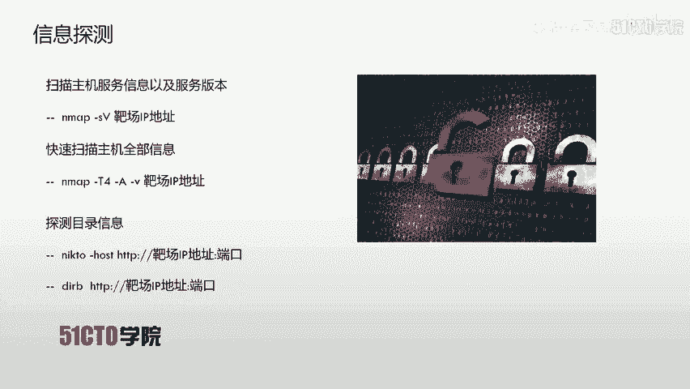

下面我们介绍一下今天的实验环境。

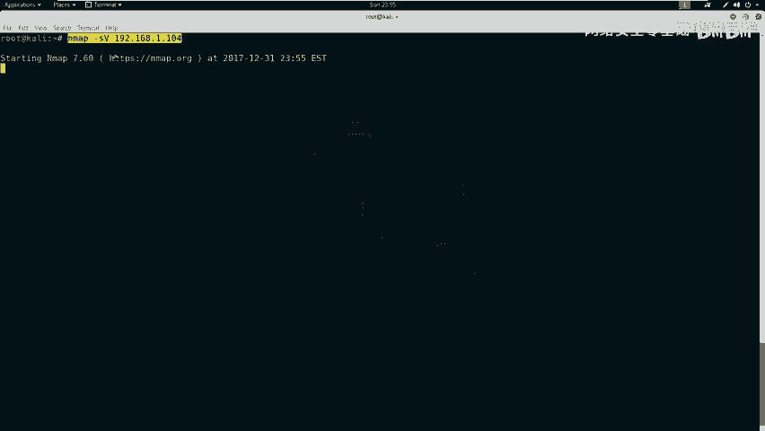

攻击机是Kali Linux，其IP地址是`192.168.1.106`。靶场机器的IP地址是`192.168.1.104`。

在CTF比赛中，主要目的是获取靶场机器上的flag值。我们所有的操作都将围绕这个目标展开，即获取flag值并控制靶场机器。

## 第一步：信息收集与探测

上一节我们明确了目标，本节中我们来看看如何对靶场机器进行初步的信息探测。

首先，我们使用Nmap来扫描靶场机器的服务信息及版本。

使用命令：
```bash
nmap -sV 192.168.1.104
```
这时Nmap开始对靶场机器进行扫描。

在扫描过程中，它会发送大量数据包给靶场机器，并根据返回的响应分析结果。

除了扫描版本信息，我们还可以使用以下命令扫描主机的更全面信息：
```bash
nmap -A -v -T4 192.168.1.104
```
参数`-T4`表示Nmap以较高的效率发送数据包，从而加快扫描速度。

探测完主机的基本信息后，如果发现开放了HTTP服务，我们可以使用Nikto和Dirb等工具来扫描靶场HTTP服务开放的目录信息。

以下是使用Nikto进行扫描的命令：
```bash
nikto -h http://192.168.1.104
```
Nikto会分析服务器的响应，并列出发现的目录、文件及潜在风险。例如，它可能发现`/robots.txt`、`/tmp/`、`/uploads/`等目录。

我们也可以使用Dirb进行目录扫描：
```bash
dirb http://192.168.1.104
```
Dirb会尝试枚举服务器上的目录和文件。

## 第二步：分析扫描结果并挖掘信息

上一节我们收集了靶场的信息，本节中我们来看看如何从这些信息中挖掘出有用的线索。

分析扫描结果的主要目的是找到可以利用的入口点。例如，如果开放了HTTP服务，我们就应该用浏览器访问扫描到的敏感页面。

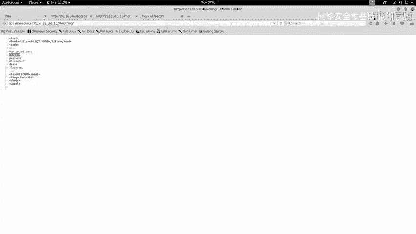

访问靶场主页（`http://192.168.1.104`）可能没有直接收获。接着，我们访问扫描到的`/robots.txt`文件。该文件通常用于指示网络爬虫哪些目录不应访问，但其中也可能包含开发者留下的注释信息。

在访问`/no/`目录时，页面显示“Not Found”。但与随机构造的404错误页面对比后，我们发现两者略有不同。这提示我们查看该页面的源代码。

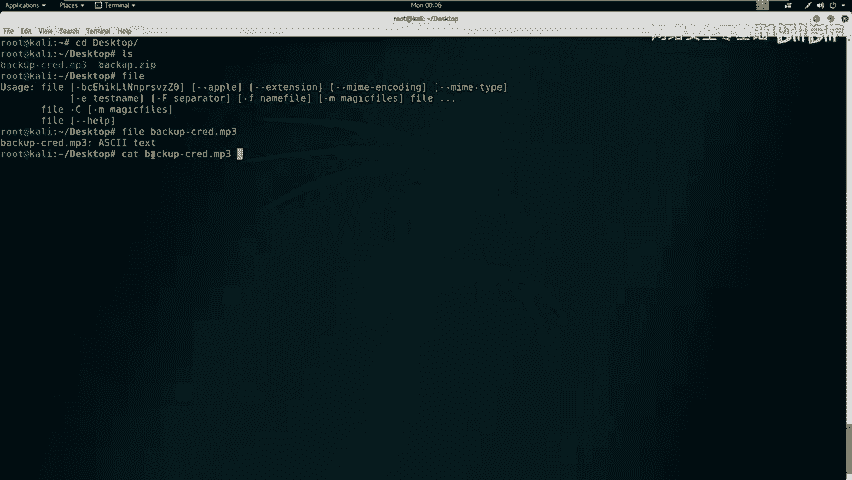

在HTML源代码的注释中，我们发现了关键信息：
```html
<!-- my secret pass is: freedom, password, hello world!, i love root -->
```
这些字符串可能是后续步骤中需要用到的密码。

此外，在扫描结果中，我们还发现了一个名为`/secret/`的目录。访问该目录，我们找到了一个名为`backup.zip`的备份文件，并将其下载到本地。

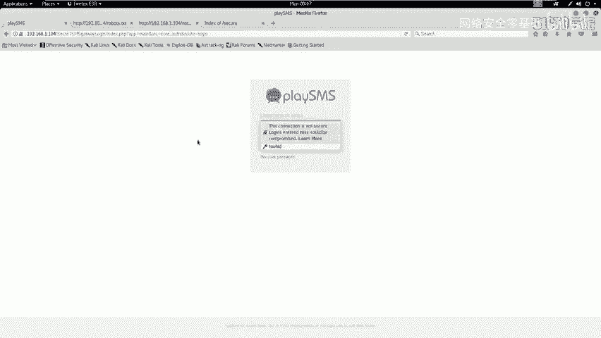

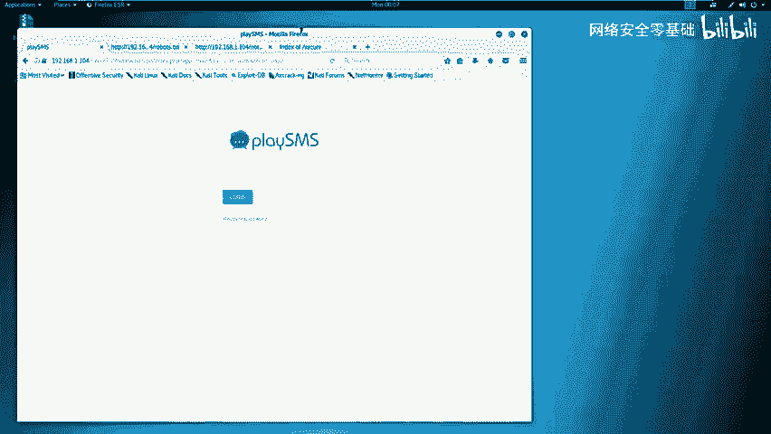

## 第三步：分析备份文件并获取凭证

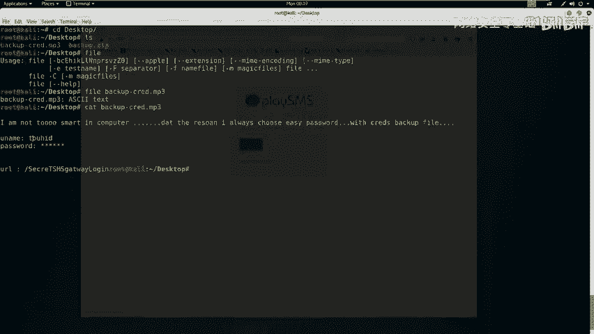

上一节我们找到了一个备份文件，本节中我们来看看如何从中提取有用信息。

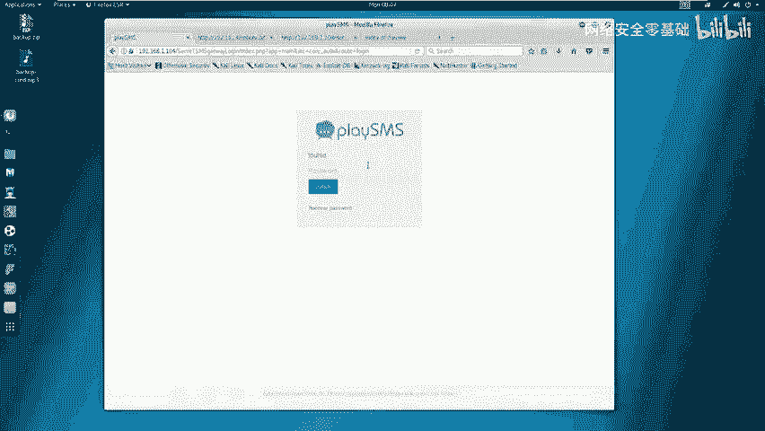

解压`backup.zip`文件需要密码。我们尝试使用在`/no/`页面源代码中找到的字符串作为密码。使用密码`freedom`成功解压，得到一个名为`backup.mp3`的文件。

在CTF中，文件扩展名可能具有欺骗性。我们使用`file`命令检查其真实类型：
```bash
file backup.mp3
```
输出显示它实际上是一个ASCII文本文件。因此，我们可以用`cat`命令查看其内容：
```bash
cat backup.mp3
```
文件内容显示了一段提示，表明使用了一个简单密码对备份文件进行了加密。更重要的是，我们找到了疑似登录凭证的信息：
```
username: toorid
password: *****
```
以及一个URL地址。我们将这个URL（`http://192.168.1.104/playsms/`）在浏览器中打开，发现了一个登录界面。

## 第四步：登录系统并寻找漏洞

上一节我们获得了潜在的登录地址和用户名，本节中我们尝试登录系统。

我们将用户名`toorid`填入登录表单。密码则需要尝试之前在注释中找到的几个字符串。尝试`password`和`hello world!`均失败，但使用`i love root`作为密码成功登录系统后台。

登录系统后，我们需要判断该系统是否存在已知漏洞。该系统名为“playsms”。我们可以使用`searchsploit`工具搜索其公开漏洞：
```bash
searchsploit playsms
```
搜索结果显示存在一个编号为`42038.txt`的漏洞文档，描述了一个“不严格的文件上传”漏洞，允许注册用户上传任意文件。

根据漏洞描述，关键文件是`sendfromfile.php`。我们尝试在已登录的系统中访问这个路径（例如`http://192.168.1.104/playsms/?app=main&inc=core_sendfromfile&op=upload`），找到了文件上传功能点。

## 第五步：利用文件上传漏洞执行命令

上一节我们找到了可能存在漏洞的上传点，本节中我们尝试利用它执行系统命令。

根据漏洞POC（概念验证），我们需要先上传一个文件（如CSV格式），然后拦截HTTP请求，修改上传文件的文件名（`filename`参数）为包含PHP代码的格式。

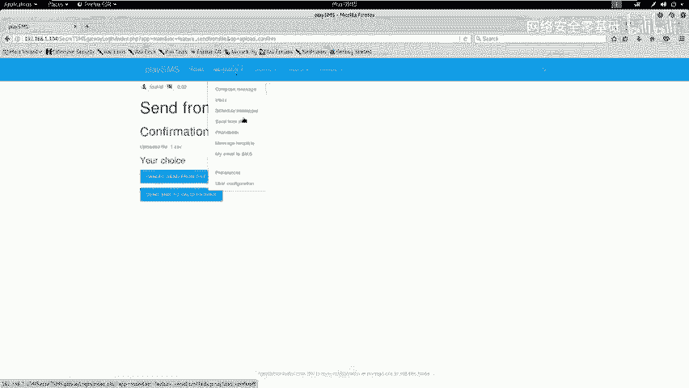

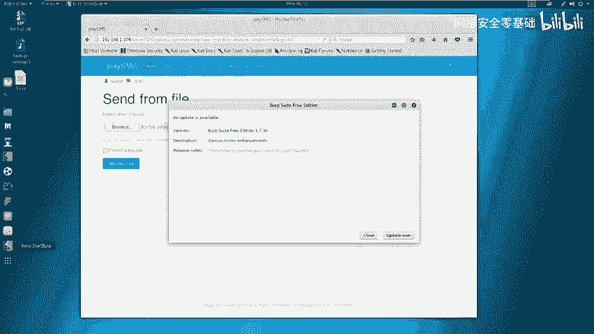

首先，在Kali上创建一个测试文件：
```bash
touch test.csv
```
然后，在浏览器中打开上传页面，选择此文件进行上传。

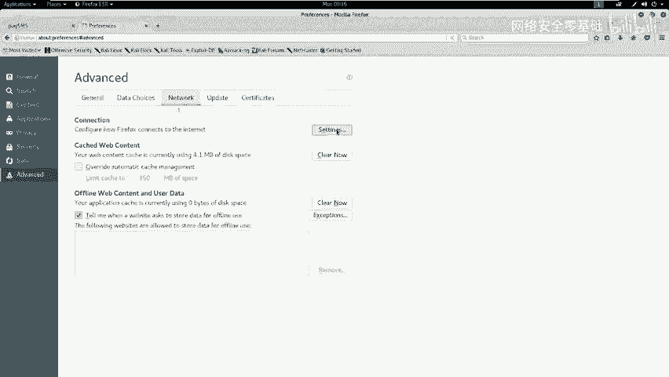

为了拦截和修改HTTP请求，我们使用Burp Suite工具。配置浏览器代理指向Burp Suite（默认端口8080），然后进行上传操作。

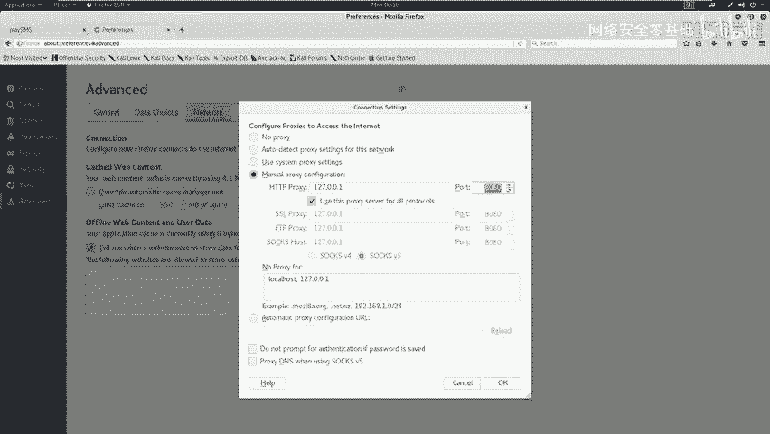

在Burp Suite的“Proxy”模块截获上传请求，并将其发送到“Repeater”模块进行修改。我们将`filename`参数的值从`test.csv`修改为包含PHP代码的格式，例如：
```
test.php; system(“uname -a”);
```
点击“Send”发送修改后的请求。查看响应，如果成功，会在页面中看到`uname -a`命令的执行结果（如Linux内核版本、主机名等信息）。

这证明了我们可以通过修改`filename`参数注入并执行任意系统命令。

## 总结

本节课中我们一起学习了命令注入漏洞的初步利用流程。

我们首先对靶场进行信息收集，使用Nmap、Nikto、Dirb等工具探测服务和目录。接着，通过分析`robots.txt`和页面源代码，挖掘出潜在的密码信息。利用找到的密码，我们解压了备份文件，获得了系统后台的登录凭证。

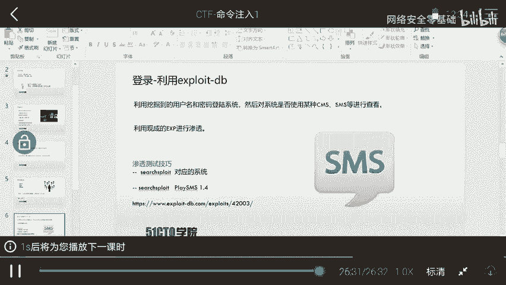

成功登录后，我们通过搜索发现该系统存在已知的文件上传漏洞。最后，我们利用Burp Suite拦截并修改文件上传请求，通过注入PHP代码成功在靶场上执行了系统命令，验证了漏洞的存在。

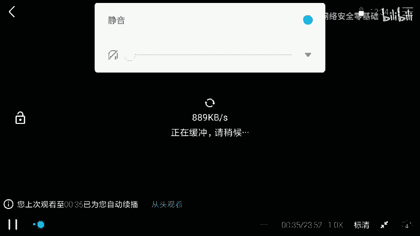

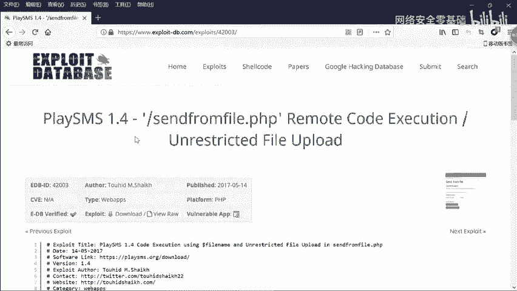

这个过程涵盖了从信息收集、漏洞发现到初步利用的完整链条，是CTF比赛中Web类题目的典型解题思路。下节课我们将深入讲解如何利用此漏洞获得一个反向Shell，从而完全控制靶场服务器。