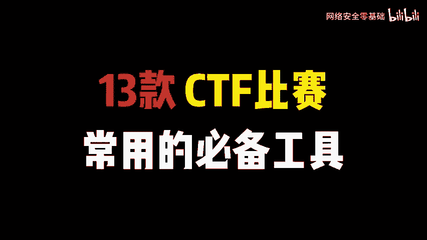
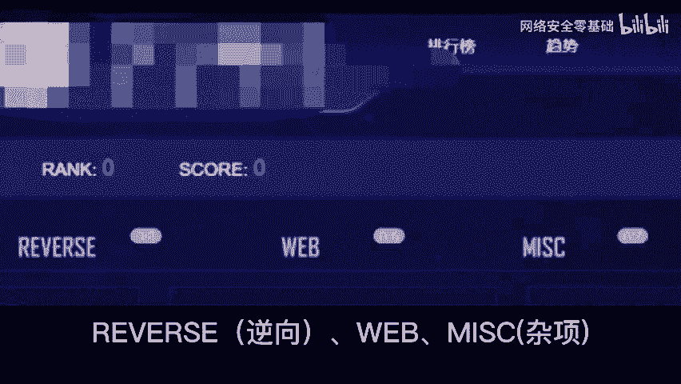
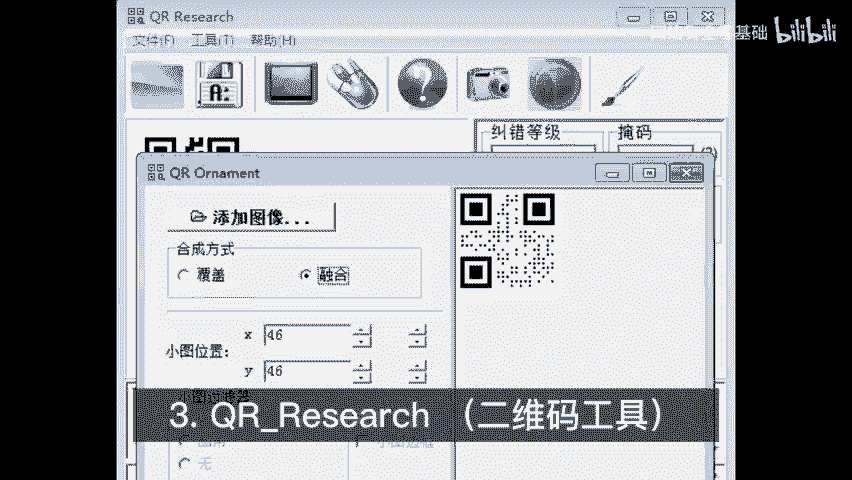
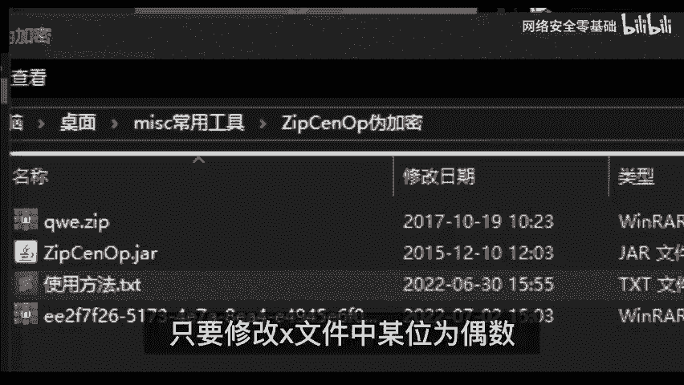
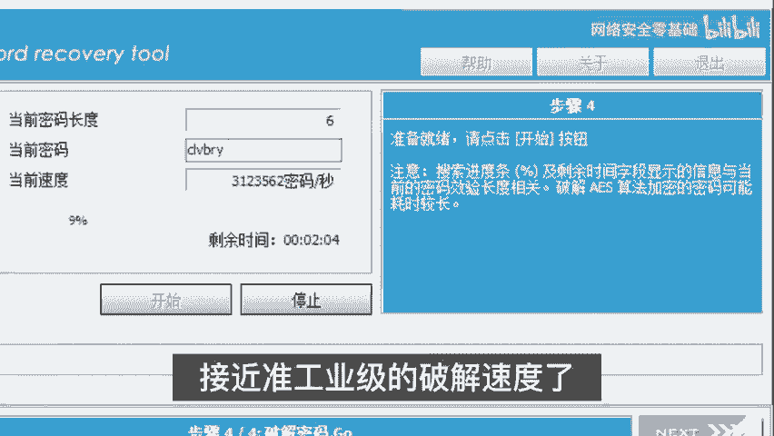
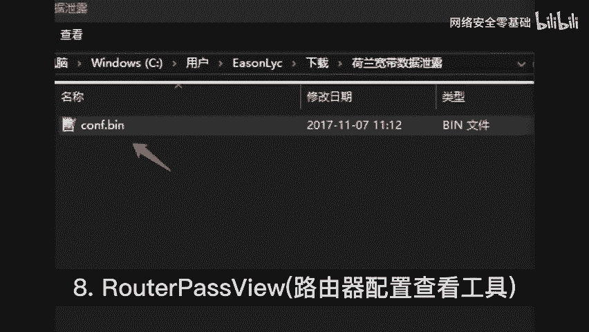
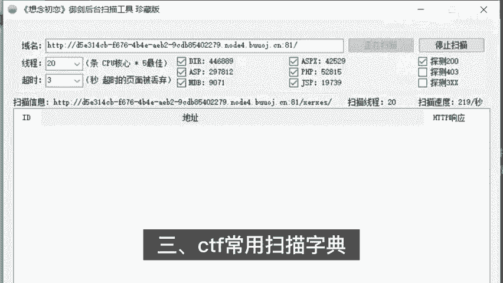
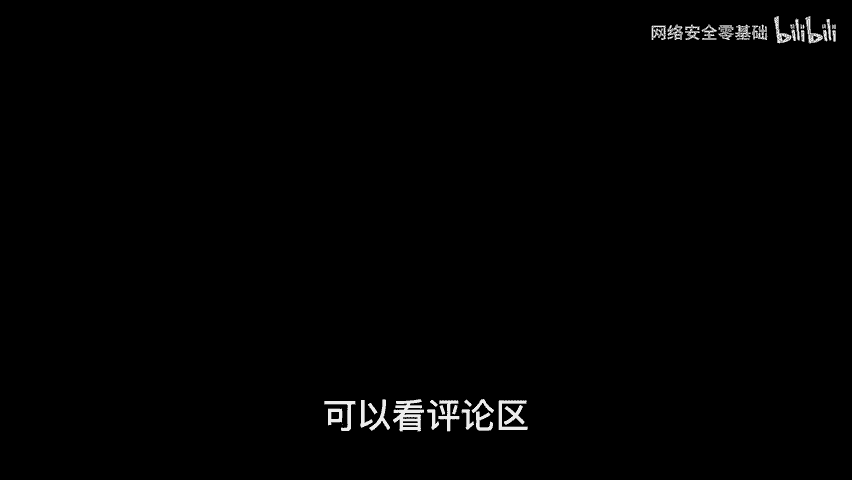

# 网络安全CTF全套教程：P1：CTF必备工具 🛠️

在本节课中，我们将要学习CTF比赛中最常用、最核心的六大类工具。掌握这些工具是入门网络安全和参与CTF竞赛的基础。我们将逐一介绍每类工具的功能、用途和基本使用方法，帮助你快速上手。

## 概述

CTF竞赛涉及密码学、逆向工程、Web安全、杂项等多个领域，合适的工具能极大提升解题效率。本节将为你介绍13款必备工具，涵盖杂项分析、逆向工程、密码破解等核心场景。

---

## 杂项分析类工具 🧩

上一节我们介绍了课程概述，本节中我们来看看第一大类工具：杂项分析工具。这类工具主要用于处理CTF中常见的“杂项”题目，如隐写术、编码解码、文件分析等。

以下是五款常用的杂项分析工具及其功能：

1.  **莫斯密码辅助工具**
    *   **功能**：用于提取和解码莫斯密码。
    *   **使用方法**：将包含莫斯密码的音频文件直接拖入软件，即可自动解析出对应的文本信息。

2.  **图片隐写分析工具**
    *   **功能**：用于分析图片中可能隐藏的信息。
    *   **使用方法**：选中可疑图片并打开，利用软件提供的四个核心功能（如查看文件结构、提取数据等）来发现隐藏的文本、文件或密码。

3.  **二维码工具**
    *   **功能**：用于识别和解析二维码。
    *   **使用方法**：使用工具中的截图功能获取二维码，软件会自动识别并显示其内容，帮助你判断是否为加密信息。

4.  **伪加密压缩包破解工具**
    *   **功能**：用于破解ZIP文件的伪加密防护。
    *   **原理**：ZIP文件头中有一个标记位决定是否加密。伪加密只是修改了这个标记，并未真正加密数据。
    *   **使用方法**：将伪加密的ZIP文件拖入此工具，软件会自动将加密标记位（`X`）修改为偶数（例如，将 `0x09` 改为 `0x00`），即可无需密码直接打开。核心操作可表示为修改文件头特定字节：`encryption_flag = 0x00`。

5.  **密码破解工具（针对压缩包）**
    *   **功能**：用于暴力破解加密压缩包的密码。
    *   **使用方法**：当遇到加密的RAR或ZIP文件时，使用此工具加载文件并选择字典或暴力破解模式，即可尝试破解密码。

---

## 逆向工程类工具 ⚙️

在熟悉了杂项分析工具后，我们进入CTF的另一个核心领域：逆向工程。逆向工程要求我们分析程序的二进制代码，理解其逻辑。

以下是逆向工程中必备的工具：

1.  **反汇编与调试工具（32位/64位）**
    *   **功能**：用于静态分析和动态调试可执行文件。
    *   **选择依据**：需要根据目标文件的架构选择对应版本。如果文件是64位的，就必须使用64位版本的工具打开；如果是32位的，则使用32位版本。
    *   **关键特性**：无论是32位还是64位版本，这些工具都集成了强大的**伪代码生成功能**（如将汇编代码转换为更易读的C语言风格伪代码），这大大降低了逆向分析的难度，初学者可以放心使用。

---

## 辅助资源类工具 📚

除了直接的分析工具，一些辅助资源在CTF比赛中也至关重要，它们能帮助我们发现漏洞入口。

以下是一个重要的辅助资源：

1.  **CTF常用扫描字典**
    *   **特点**：这个字典文件体积小，但精准度高。
    *   **设计理念**：在CTF比赛中，通常没有大量时间进行全端口或全路径的暴力扫描，因此字典力求“短小精悍，准确率高”。
    *   **内容**：目前收录了247个路径或文件名，它们全部来源于历年CTF比赛真题中出现过的敏感路径、备份文件或常见入口点。
    *   **使用建议**：你可以以此字典为基础，在实际做题和训练中，根据遇到的新题目不断添加新的、有效的路径，逐步完善属于自己的专属字典。

---

## 总结

本节课中我们一起学习了CTF竞赛必备的三大类核心工具。
*   我们首先介绍了**杂项分析工具**，用于处理隐写、编码和文件修复。
*   接着，我们探讨了**逆向工程工具**，学会了如何根据文件架构选择正确的工具进行反汇编和调试。
*   最后，我们了解了**辅助资源工具**，认识到一个精准的扫描字典在Web等题型中的重要性。

熟练掌握这些工具是迈向CTF高手的第一步。建议你根据教程中的介绍，亲自下载并尝试使用这些工具，在实践中加深理解。如果需要文中提到的CTF比赛工具安装包，可以查看课程相关的评论区获取资料。