# CTF网络安全教程：P22：20.22.CTF综合测试(高难度)WEB安全初级入侵 🚀

在本节课中，我们将学习如何对一个Web应用程序进行安全漏洞测试，目标是实现初步入侵，最终获取主机的最高权限（root）或找到CTF比赛中的flag值。我们将从信息收集开始，逐步分析并利用发现的漏洞。

---

## 实验环境介绍

上一节我们介绍了Web安全的基本概念，本节中我们来看看具体的实验环境。

攻击机IP地址：`192.168.253.12`
靶场机器IP地址：`192.168.253.13`

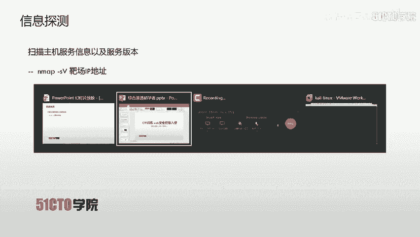

我们的目标是获取靶场机器的root权限。在CTF比赛中，目标则是找到靶机上的flag值。

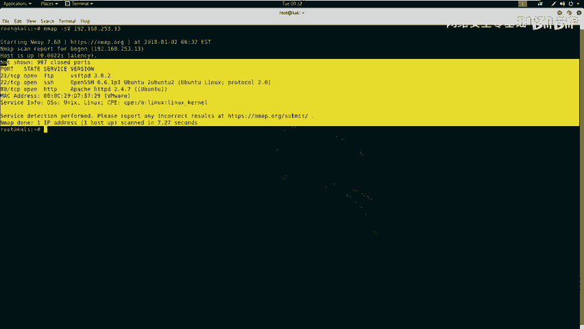

---

## 第一步：信息探测


在开始渗透测试前，必须对目标进行全面的信息收集。这有助于我们了解目标系统开放的服务和潜在的攻击面。

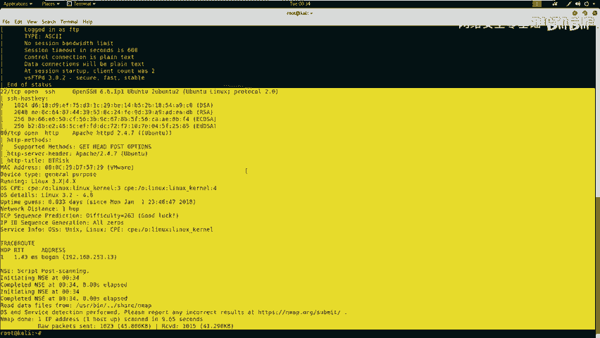

以下是信息探测的常用方法：

### 使用Nmap扫描服务与版本

我们可以使用Nmap工具扫描靶机IP地址，以发现其开放的服务及版本信息。

**命令示例：**
```bash
nmap -sV 192.168.253.13
```
执行此命令后，Nmap会向目标发送数据包并分析返回的信息，将结果显示在标准输出中。

### 使用Nmap进行全方位扫描

除了基础扫描，我们还可以使用Nmap的“-A”参数进行更全面的探测，这包括操作系统识别、版本检测、脚本扫描和路由追踪。

**命令示例：**
```bash
nmap -A -v -T4 192.168.253.13
```
参数顺序可以调整。执行后，Nmap会将详细的扫描结果返回。

### 使用其他工具扫描Web目录

我们还可以使用专门针对Web服务的工具来探测网站的目录和敏感文件。

**使用Nikto扫描：**
```bash
nikto -h http://192.168.253.13
```
Nikto会扫描目标Web服务的常见漏洞和敏感文件。

**使用Dirb扫描：**
```bash
dirb http://192.168.253.13
```
Dirb是一个Web内容扫描器，通过字典攻击来寻找隐藏的目录和文件。

---

## 第二步：分析扫描结果

在收集到大量信息后，下一步是从中挖掘出可利用的线索。这需要敏锐的观察力和经验。


以下是分析扫描结果时需要注意的几个关键点：

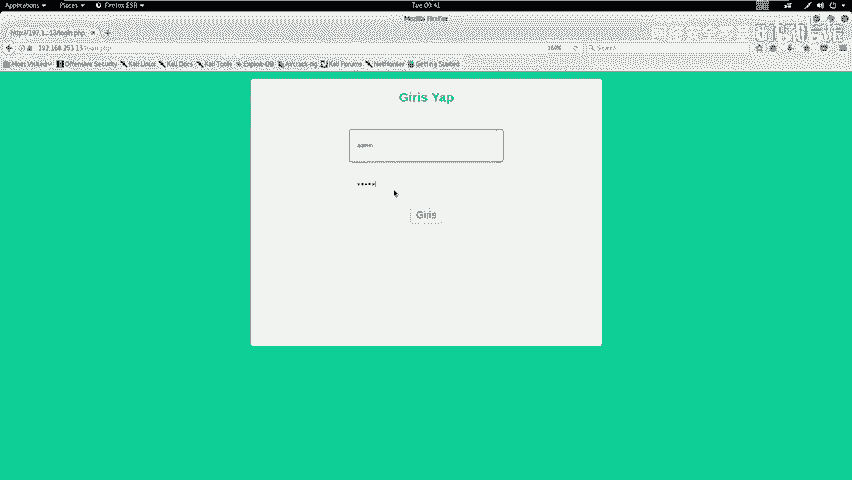

*   **寻找登录界面**：检查是否存在如 `login.php` 的登录页面，这可能是SQL注入的入口。
*   **检查敏感信息泄露**：留意如 `config.php` 之类的配置文件，它们可能包含数据库凭据等敏感信息。
*   **识别CMS或框架**：判断网站是否由已知的内容管理系统（如WordPress）或框架搭建，这些系统可能存在公开的漏洞。
*   **注意备份文件**：寻找如 `.bak`, `.old` 等备份文件，它们可能包含源代码或配置信息。
*   **保持开阔思路**：在CTF比赛中，尤其需要“脑洞大开”，不放过任何看似不寻常的文件或目录。

根据我们的扫描结果，目标开放了21（FTP）、22（SSH）、80（HTTP）端口。在Web目录中，我们发现了 `login.php` 和 `config.php` 等文件。

---

## 第三步：测试登录界面

我们访问发现的登录页面 `http://192.168.253.13/login.php`。

首先尝试使用弱口令（如 admin/admin）登录，但失败了。接下来，我们需要尝试绕过登录认证机制。

### 分析页面源代码

查看页面源代码是发现隐藏信息的重要步骤。我们在源代码底部发现了一段JavaScript代码：

```javascript
// 示例代码逻辑
var user = document.getElementById('user').value;
var pwd = document.getElementById('pwd').value;
var str = user.substring(user.lastIndexOf('@')+1);
if(pwd == '\''){
    alert('黑客攻击！');
} else if(pwd != '\'' && str != 'btrisk.com'){
    alert('用户名需以@btrisk.com结尾');
} else {
    // 执行登录
}
```
这段代码的逻辑是：
1.  提取用户名和密码。
2.  检查密码是否为单引号 `‘`，如果是则弹出警告。
3.  检查用户名域名部分是否为 “btrisk.com”。
4.  上述检查都通过后，才提交登录。

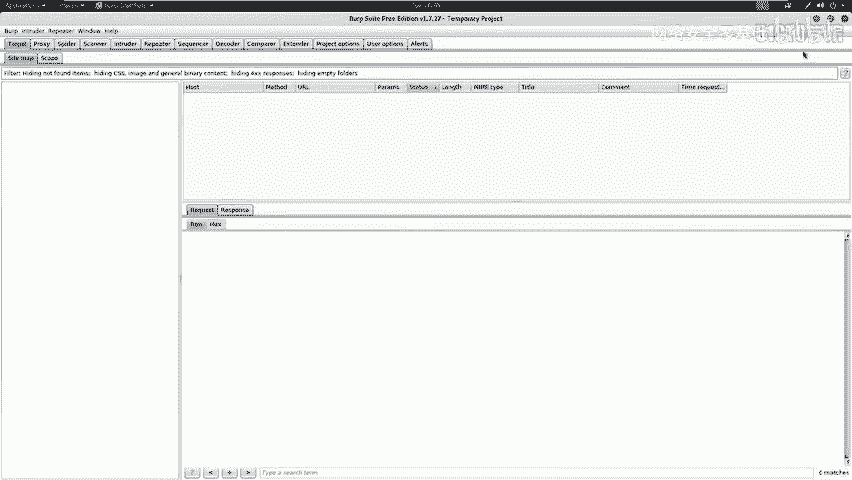

密码检查单引号的行为强烈暗示后端可能存在 **SQL注入** 漏洞。同时，用户名需要以 `@btrisk.com` 结尾。

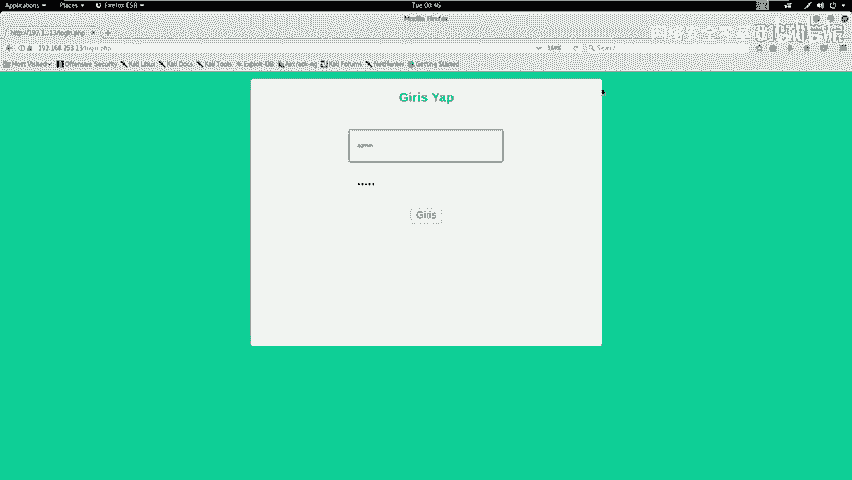

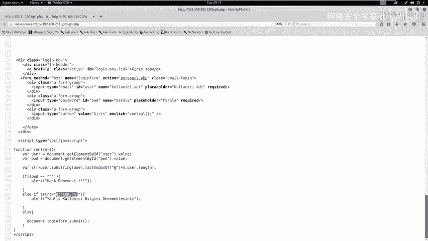

---

## 第四步：进行模糊测试（Fuzzing）

为了验证SQL注入漏洞，我们可以对密码字段进行模糊测试。其原理是：通过发送大量不同的测试载荷（Payload），并根据服务器返回的响应长度或内容差异，来判断哪些输入是“正确”的。

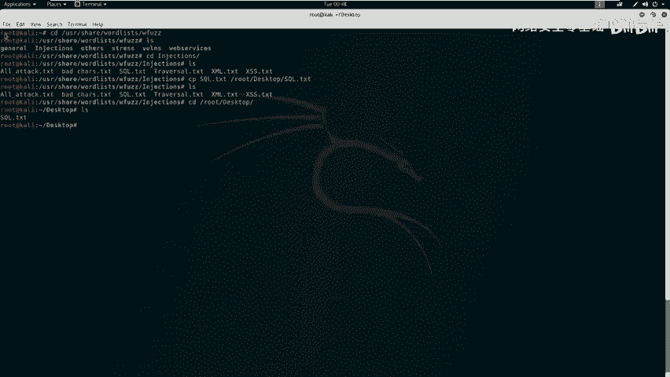

以下是进行模糊测试的步骤：

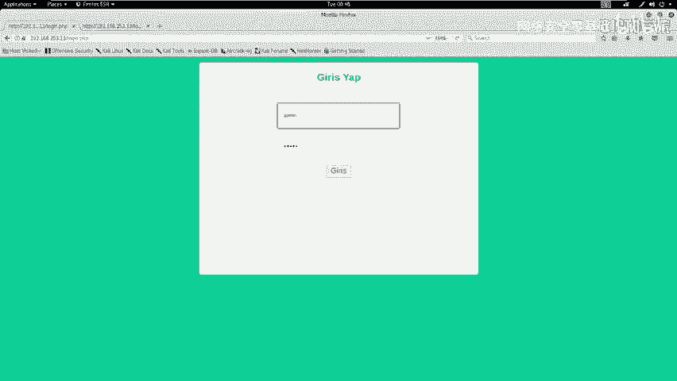

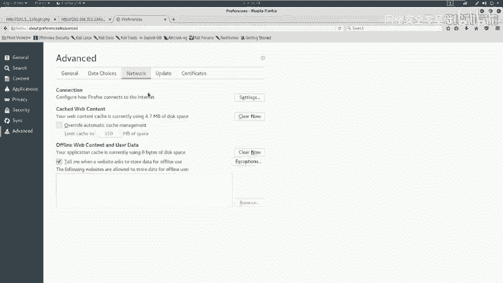

1.  **准备测试字典**：Kali Linux系统中自带了许多测试字典，位于 `/usr/share/wordlists` 目录下。我们使用SQL注入专用的字典：`sql.txt`。
    ```bash
    cp /usr/share/wordlists/sql.txt ~/Desktop/
    ```

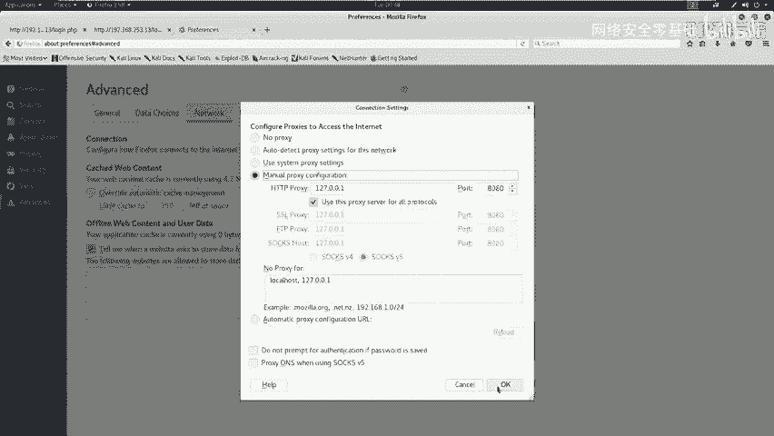

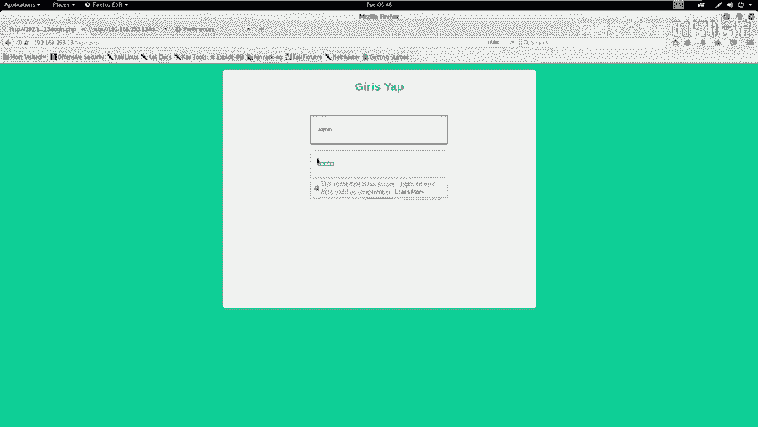

2.  **配置代理工具**：我们使用Burp Suite作为代理，拦截浏览器发送的登录请求。配置浏览器代理为Burp Suite监听的端口（如127.0.0.1:8080）。

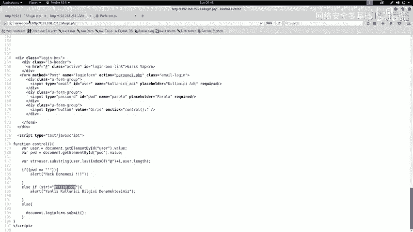

3.  **拦截并修改请求**：
    *   在登录页面输入用户名 `test@btrisk.com` 和任意密码（如123456）。
    *   点击登录，请求会被Burp Suite拦截。
    *   在Burp Suite的Proxy模块中，将请求发送到Intruder模块。

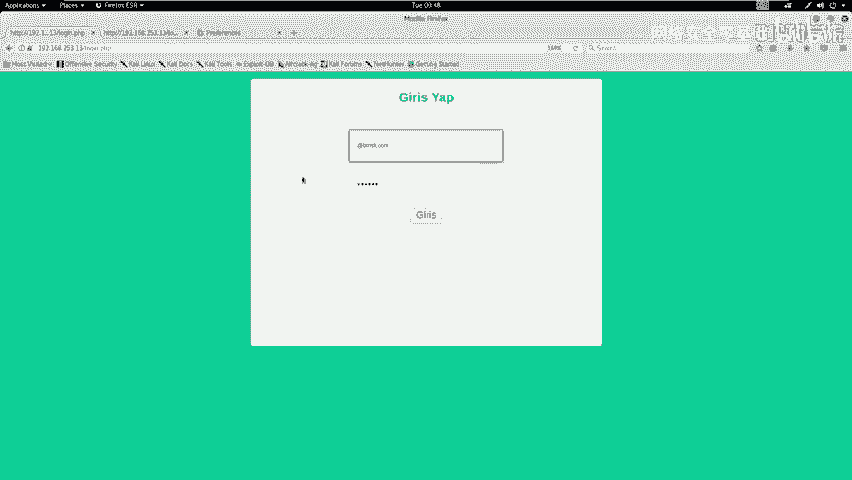

4.  **设置Intruder攻击**：
    *   在Intruder的Positions标签页，清除所有变量，仅将密码（`pwd`）的值设为攻击变量。
    *   在Payloads标签页，选择Payload类型为`Simple list`，并加载我们准备好的 `sql.txt` 字典文件。
    *   开始攻击。

5.  **分析结果**：攻击开始后，Intruder会显示每个Payload对应的响应长度。我们发现，大多数请求返回长度为2044或2203（登录失败），但有一个Payload返回了2900的长度，这很可能表示登录成功。

---

## 第五步：利用漏洞进入系统

我们查看返回长度为2900的那个请求的响应内容，发现其中包含一个文件上传界面。在浏览器中直接访问该请求的路径，我们成功进入了系统后台，并看到了上传功能。

我们尝试上传一个图片文件（如 `.jpg`），成功。但当我们尝试上传一个PHP文件时，被阻止了。这说明系统对上传的文件类型进行了检测。

---

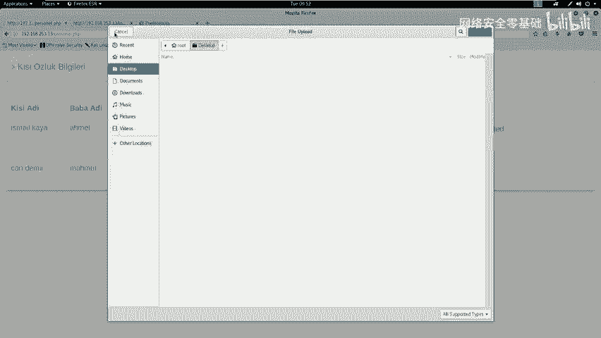

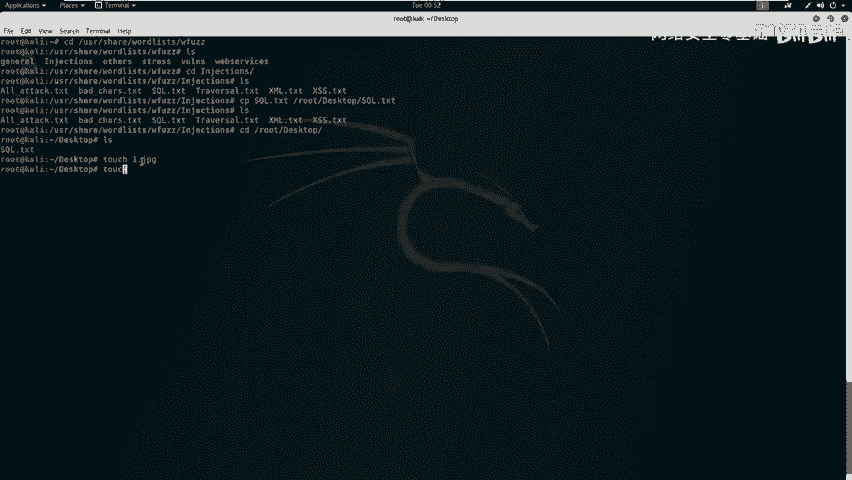

## 总结与下节预告

本节课中我们一起学习了Web安全初级入侵的完整流程：

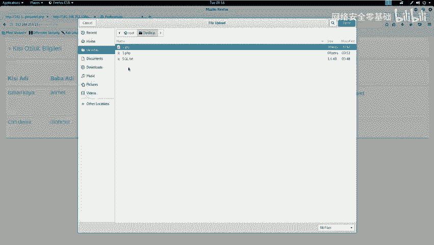

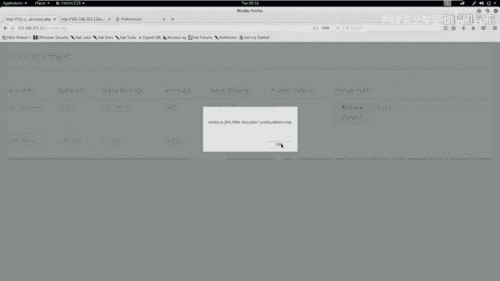

1.  **信息收集**：使用Nmap、Nikto、Dirb等工具探测目标信息。
2.  **漏洞分析**：从扫描结果中寻找敏感文件、登录入口等潜在攻击点。
3.  **代码审计**：通过分析前端JavaScript代码，发现了SQL注入的线索和用户名格式要求。
4.  **漏洞验证**：使用Burp Suite Intruder模块对登录接口进行模糊测试，成功绕过认证进入后台。
5.  **发现新攻击面**：在后台发现了文件上传功能，但存在类型限制。

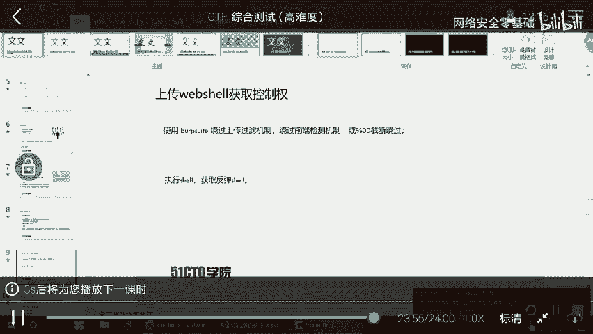

我们成功突破了第一道防线——登录认证。然而，在利用文件上传功能时遇到了障碍。**如何绕过上传文件类型的检测机制，从而上传我们的Webshell并获取系统权限，这将是我们下节课要解决的核心问题。**