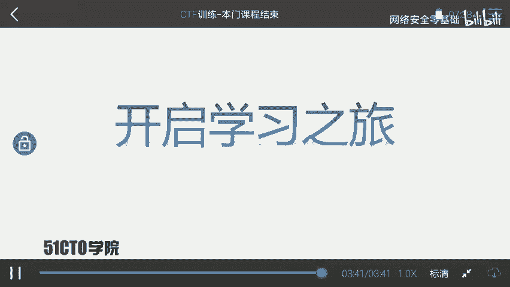
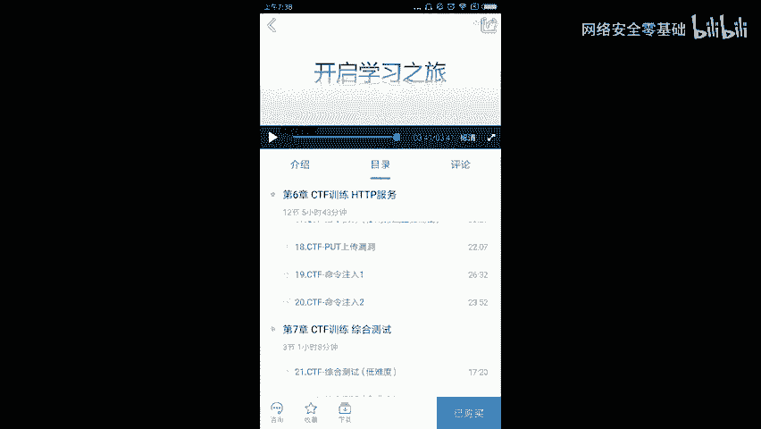

# CTF训练课程：P23：课程总结与展望 🎯

在本节课中，我们将对之前所学的CTF知识进行总结，并展望未来的学习路径。

## 课程内容回顾

上一节我们介绍了CTF比赛的多种题型，本节中我们来对整个课程进行梳理。

首先，我们回顾CTF的核心概念。CTF是一种流行的信息安全竞赛形式，其英文全称Capture The Flag可译为“夺旗赛”。其大致流程如下：参赛团队之间通过进行攻防对抗、程序分析等形式，率先从主办方给出的比赛环境中得到一串具有一定格式的字符串或其他内容，并将其提交给主办方，从而夺得分数。为了方便称呼，我们把这样的内容称之为`flag`。

在CTF比赛中，涉及的内容比较繁杂。我们需要利用所有可以利用的方法获得对应的`flag`。这里强调需要有很大的“脑洞”来挖掘对应的信息。

通过本门课程的学习，大家基本掌握了CTF比赛中的一些基本套路，可以完成一定难度靶场中`flag`的寻找。

## 持续学习与进阶

然而，本门课程并不能确保并指导你成为一名顶尖高手。大家距离成为高手的路还相当远。在接下来的时间里，大家需要不断学习，不断进步，以缩短与高手的距离。

在信息安全或CTF学习中，我们需要不断实践，不断尝试才能更快地进步。同时，学习时需要有一定的方法、对应的课程以及训练环境。

## 未来课程预告

以下是作者计划在未来推出的一系列进阶课程，旨在帮助大家深化学习：

*   **代码审计课程**：专门教授如何挖掘软件中的漏洞，并编写对应的概念验证代码（`POC`）。
*   **WiFi安全课程**：课程中将使用一些高度集成的工具测试WiFi安全性，并涉及最新的测试方法，例如中间人攻击（MITM）和直接修改`WPA/WPA2`密码的技术。
*   **Metasploit模块编写课程**：教授如何编写一个Metasploit模块来进行自动化渗透测试。
*   **CTF高端训练课程**：最后，将提升课程难度，发布一门CTF训练的高端课程，旨在使大家对CTF有更深入的了解，并全面提升安全实战能力。

学习尚未成功，大家仍需努力。让我们一起开启接下来的学习之旅吧。

---

本节课中，我们一起学习了CTF比赛的基本概念与流程，总结了课程要点，并了解了未来可继续深造的技能方向。记住，安全之路需要持之以恒的实践与探索。