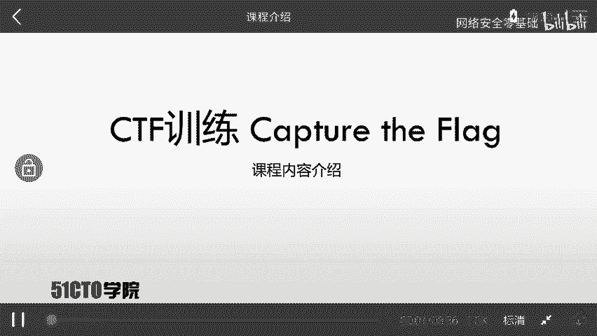
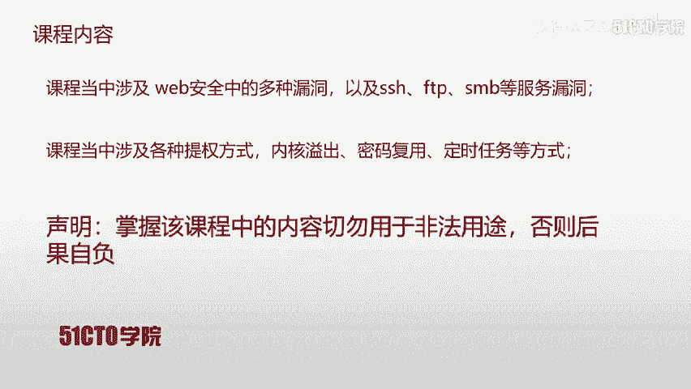
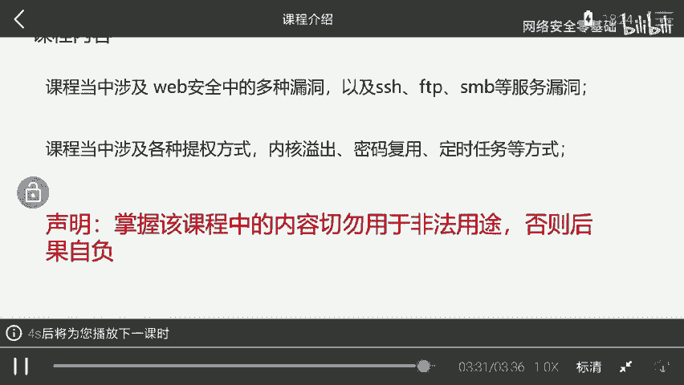
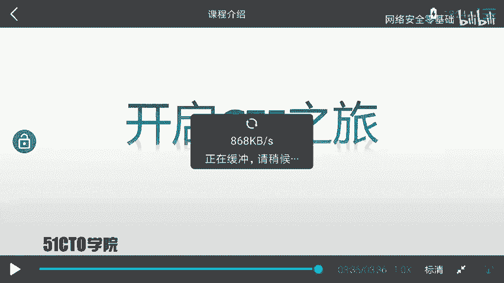
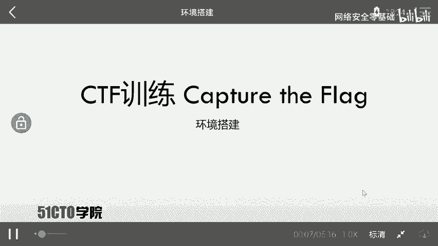
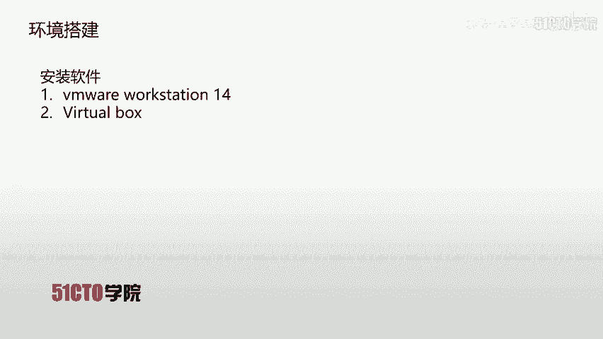
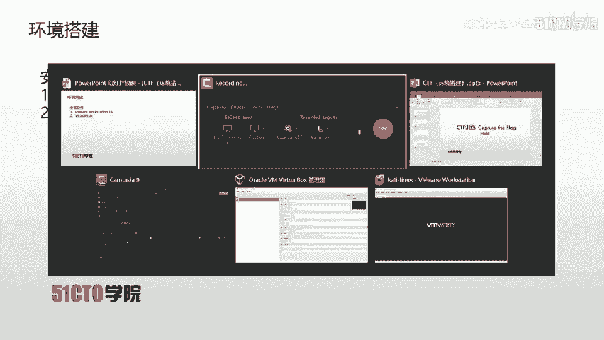

# CTF网络安全入门：P3：1.1.2：课程介绍 🚩

在本节课中，我们将要学习本门CTF入门课程的整体介绍，包括课程定位、所需基础、实验环境以及核心内容概览。

---

## 什么是CTF？

CTF是一种流行的信息安全竞赛形式，其英文全称为“Capture The Flag”，中文可译为“夺旗赛”。

其大致流程是：参赛团队之间通过攻防对抗、程序分析等形式，率先从主办方给出的比赛环境中得到一串具有一定格式的字符串或其他内容，并将其提交给主办方，从而获得对应分数。为了方便称呼，我们把这样的目标内容称之为 **`flag`**。

在CTF比赛中，涉及内容繁杂，参赛者需要利用所有可用的方法来获取对应的 **`flag`**。

---

## 实验环境说明

上一节我们介绍了CTF的基本概念，本节中我们来看看本课程所使用的实验环境。

每节课都会提供对应的攻击机（Kali Linux）和靶场机器（Linux）镜像。学员需要自行下载这些镜像文件，并在本地搭建测试环境。

以下是搭建好环境后需要完成的核心任务：
*   **目的**：对靶场机器进行渗透测试，最终获取其上的 **`flag`** 值。

---

## 课程定位与所需基础

本课程定位为中等难度，要求学员具备一定的基础知识。

以下是学习本课程前建议掌握的内容：
*   了解基本的网络协议，例如 **HTTP协议**。
*   会使用一些基本的安全工具，例如：
    *   **Burp Suite**
    *   **Nmap**
    *   **Metasploit**

无论你是想要入门的CTF新手、具备一定经验的选手，还是网络安全爱好者，本课程都是一份有价值的学习资料。

---

## 课程核心内容概览

本课程完全以实战为导向，内容主要涵盖以下几个方面：

首先，课程涉及Web安全中的多种漏洞（如SQL注入、XSS等），以及SSH、FTP、SMB等服务的漏洞利用。通过这些漏洞，我们通常可以获取到靶场机器的shell访问权限。

但是，初始获取的shell往往不是最高权限（root）。这时，我们就需要进行权限提升。

以下是课程中讲解的几种提权方式：
*   **内核漏洞提权**
*   **密码复用提权**
*   **定时任务提权**

**重要声明**：学员在掌握课程内容后，切勿将其用于任何非法用途，否则需自行承担一切后果。

---

## 总结

本节课中，我们一起学习了CTF比赛的基本形式，了解了本课程的实验环境搭建要求、所需的前置知识以及课程将涵盖的核心实战内容，包括漏洞利用和权限提升技术。

现在，让我们正式开启CTF学习之旅。