# CTF网络安全教程：P4：2.3：CTF-SSH私钥泄露 🗝️

在本节课中，我们将学习CTF比赛中一种常见漏洞——SSH私钥泄露。我们将学习如何通过泄露的私钥，从外部访问靶场主机，并最终获取其root权限，从而取得目标flag。

## 概述

CTF比赛环境通常分为两种。第一种是在同一局域网内提供攻击机和靶场机器。选手通过Web方式访问攻击机，并使用攻击机对靶场机器进行测试，最终获取flag。通常，攻击机是Kali Linux，选手无需自备设备。

第二种方式是提供一个网络接口。选手需要自备个人电脑及所需工具。选手的电脑可以接入互联网查询资料。最终目标同样是渗透靶场机器，其IP地址由举办方提供。

## 实验环境搭建

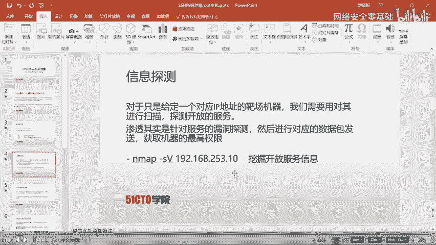

我们的实验环境如下：
*   **攻击机 (Kali Linux)**：IP地址为 `192.168.253.12`
*   **靶场机器**：IP地址为 `192.168.253.10`

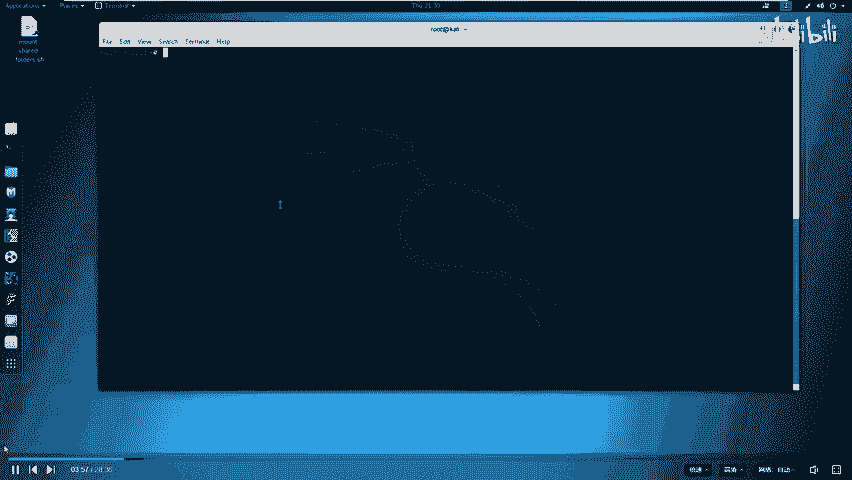

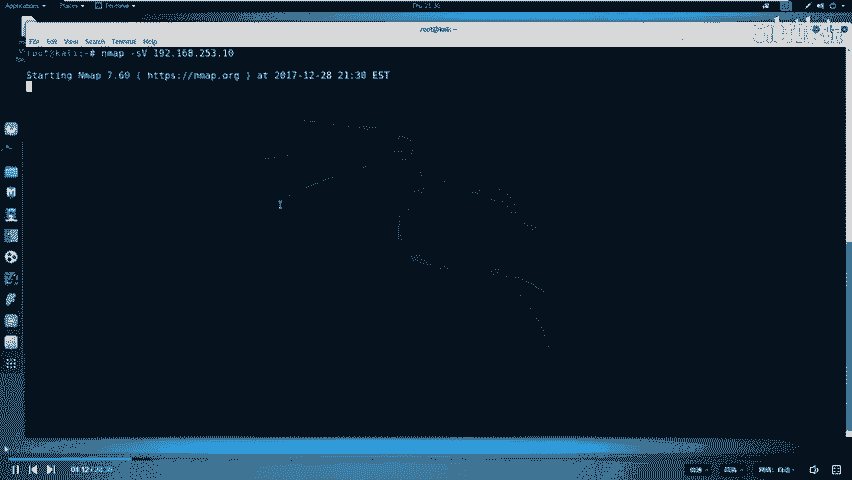

我们的目标是获取靶场机器上的flag值。

## 第一步：信息探测

在CTF比赛中，拿到靶场IP后的第一步是进行信息探测，即扫描靶场机器开放了哪些服务。渗透测试的本质就是对目标服务进行漏洞探测。

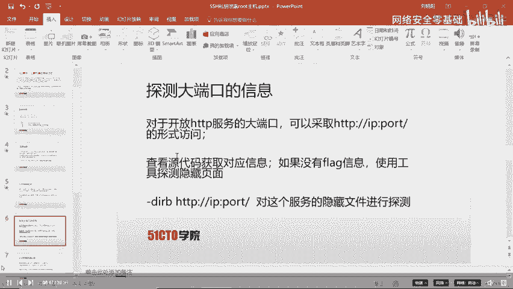

我们使用Nmap工具进行服务版本探测。

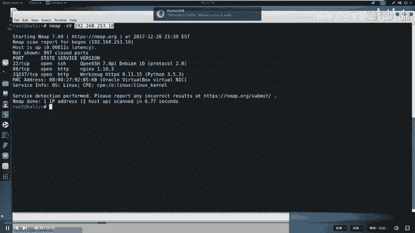

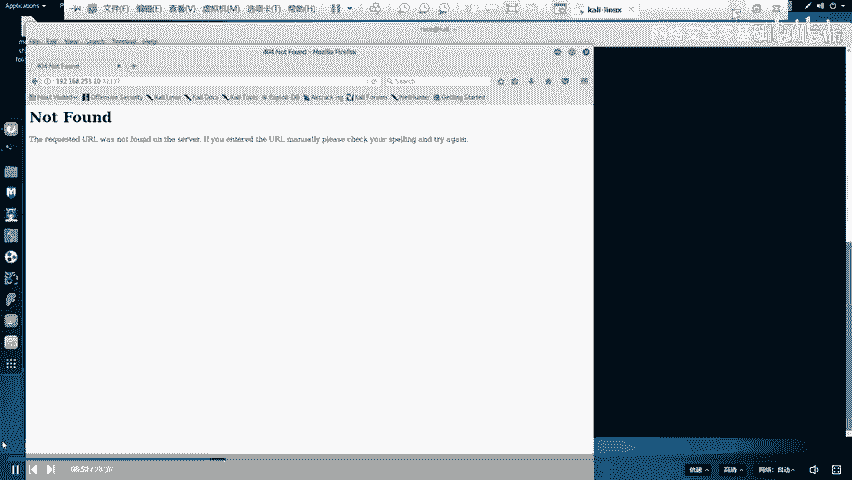

**命令**：
```bash
nmap -sV 192.168.253.10
```

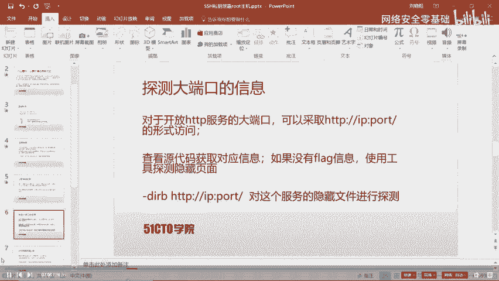

扫描结果显示，靶场机器开放了SSH服务以及两个HTTP服务（端口80和31337）。每个服务都对应计算机的一个端口，端口是服务间通信的通道。常见服务使用0-1023的知名端口，但也有很多服务使用其他端口，例如MySQL使用3306端口。

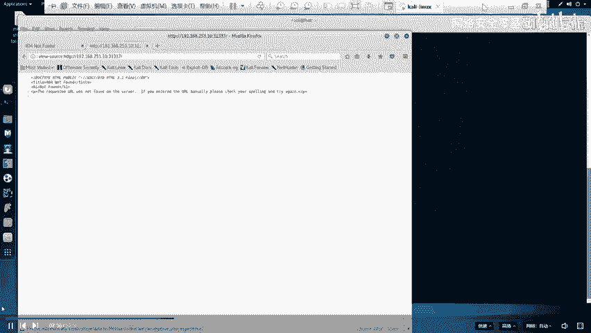

## 第二步：Web服务深入探测

从扫描结果中，我们发现了一个不常见的HTTP服务端口31337。对于HTTP服务，最直接的探测方式就是使用浏览器访问。

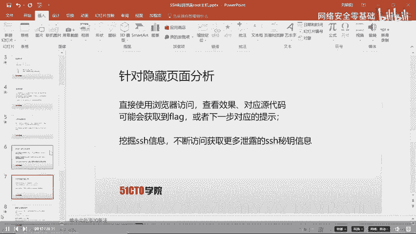

我们打开浏览器，访问 `http://192.168.253.10:31337`。页面显示了一个普通界面，没有明显的flag信息。

在CTF中，大量信息可能隐藏在HTML源代码中。我们右键点击页面，选择“查看页面源代码”。然而，源代码中也没有暴露有用信息。

既然页面和源代码都没有收获，我们需要探测该Web服务下是否还有其他隐藏的文件或目录。这时，我们使用`dirb`工具进行目录爆破。

**命令**：
```bash
dirb http://192.168.253.10:31337/
```

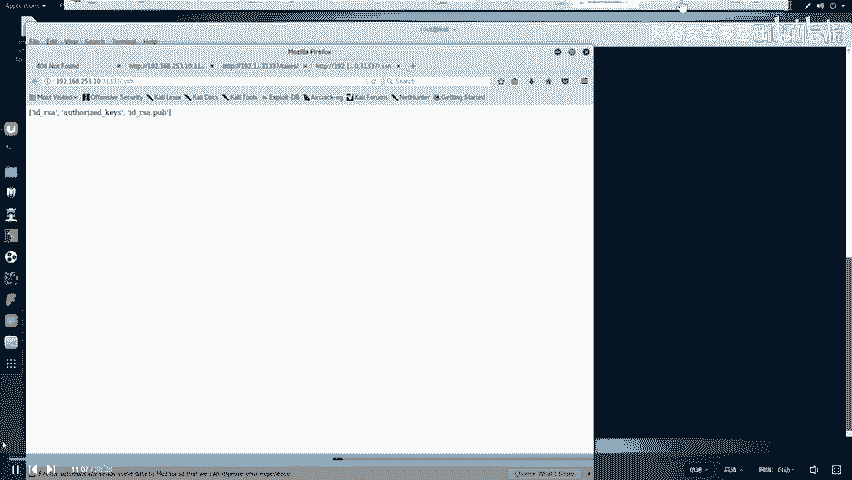

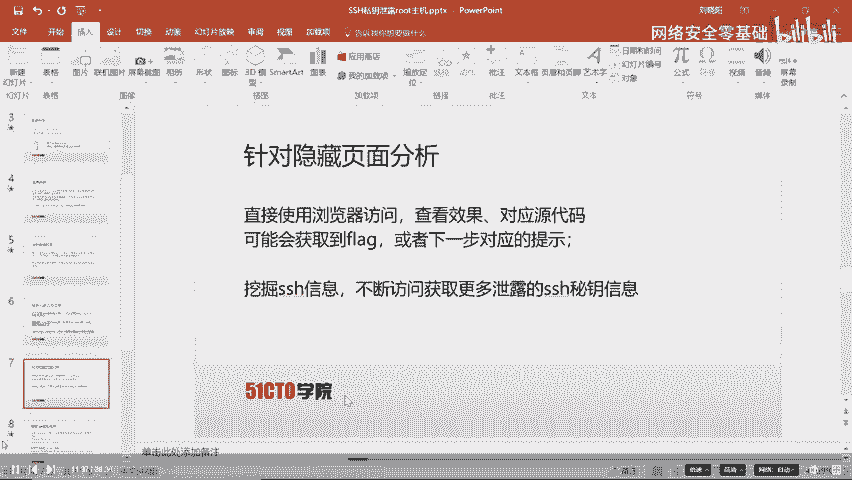

探测结果显示有5个结果，其中 `/ssh` 和 `/robots.txt` 最为醒目。接下来，我们将对它们进行深入分析。

## 第三步：分析敏感文件

首先，我们访问 `/robots.txt` 文件。`robots.txt` 文件用于告知搜索引擎哪些目录或文件不应被爬取。

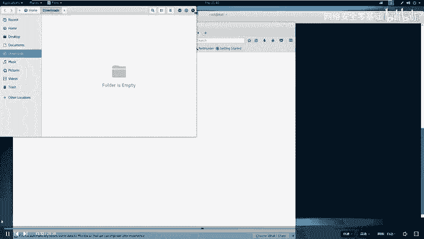

我们在浏览器中打开 `http://192.168.253.10:31337/robots.txt`。文件内容显示，它不允许爬取 `.bashrc`、`.profile` 和 `/taxes` 文件。

`/taxes` 这个被禁止爬取的路径引起了我们的注意。我们直接访问 `http://192.168.253.10:31337/taxes`。

**发现**：我们成功找到了第一个flag！

在 `/robots.txt` 上方，我们还看到了 `/ssh` 目录。同样地，我们访问它。页面显示了一些文件信息，这需要我们进一步探测。

## 第四步：SSH私钥泄露与利用

SSH服务允许远程客户端通过密钥对进行认证登录。认证过程需要私钥（如 `id_rsa`）与服务器上的公钥（`id_rsa.pub`）匹配。

我们看到 `/ssh` 目录下列出了 `id_rsa`（私钥）和 `authorized_keys`（授权密钥文件）等。我们尝试访问 `http://192.168.253.10:31337/ssh/id_rsa`，浏览器提示下载。我们将私钥文件保存到攻击机桌面。

我们不需要下载公钥，因为它通常存储在服务器端。现在，我们尝试使用这个私钥登录靶场机器。

首先，切换到桌面目录，并查看私钥文件的权限。
**命令**：
```bash
cd ~/Desktop
ls -lah id_rsa
```
文件具有可读可写权限。接着，使用SSH命令尝试登录。
**命令**：
```bash
ssh -i id_rsa [用户名]@192.168.253.10
```
但我们不知道用户名。这时，我们想起 `authorized_keys` 文件。打开下载的 `authorized_keys` 文件，发现其中包含一行记录，指明了用户名为 `cmore`。

我们再次尝试登录：
**命令**：
```bash
ssh -i id_rsa cmore@192.168.253.10
```
系统提示需要接受指纹，输入`yes`后，却提示“权限拒绝”。这是因为SSH私钥文件权限过于开放。我们需要将其权限设置为仅所有者可读。
**命令**：
```bash
chmod 600 id_rsa
```
再次执行登录命令，这次系统提示需要输入私钥的密码。我们尝试输入`cmore`，登录失败。这说明私钥本身被密码保护着，我们需要破解这个密码。

## 第五步：破解SSH私钥密码

我们使用 `ssh2john` 工具将私钥转换为John the Ripper可识别的格式，然后使用字典进行破解。

1.  **转换私钥格式**：
    ```bash
    ssh2john id_rsa > rsa_crack
    ```
2.  **使用字典破解**：
    ```bash
    zcat /usr/share/wordlists/rockyou.txt.gz | john --pipe --rules rsa_crack
    ```
    破解成功后，显示密码为 **`starwars`**。

## 第六步：登录与权限提升

现在，我们使用破解出的密码进行SSH登录。
**命令**：
```bash
ssh -i id_rsa cmore@192.168.253.10
```
输入密码 `starwars` 后，成功登录到靶场机器。

我们当前在 `cmore` 用户的家目录下。查看后没有发现flag文件。我们切换到根目录 `/` 进行查找。
**命令**：
```bash
cd /
ls -la
```
我们发现了一个 `flag.txt` 文件，但使用 `cat` 命令查看时，提示权限不足。这说明 `cmore` 只是一个普通用户，需要提升到root权限。

我们查找系统中所有具有SUID权限（即以文件所有者权限运行）的文件，这通常是提权的突破口。
**命令**：
```bash
find / -perm -4000 2>/dev/null
```
在输出列表中，我们发现 `/read_message` 这个程序比较可疑。查看其源代码：
**命令**：
```bash
cat /read_message.c
```
源代码显示，程序定义了一个数组 `message`，其值为 `/root/message`。程序会询问用户名，如果输入的用户名前5个字符与预设值匹配，则会执行 `message` 变量指向的程序。

我们运行 `/read_message`，并尝试输入正确的用户名（通过审计代码可知）。程序成功执行，并进入了 `/root/message` 程序。该程序似乎是一个简单的消息板。

关键点在于，`/root/message` 程序具有root权限。我们尝试通过输入超长字符串（如10个‘A’）造成缓冲区溢出，并在溢出后注入命令 `/bin/sh` 来启动一个shell。
**操作**：
1.  运行 `/read_message`。
2.  输入用户名（例如 `cmore`）。
3.  在程序等待输入消息时，输入一长串字符（如10个‘A’），然后输入 `/bin/sh`。

执行后，我们获得了一个具有root权限的shell。验证权限：
**命令**：
```bash
whoami
# 输出应为 root
```
现在，我们可以读取最终的flag了。
**命令**：
```bash
cat /flag.txt
```

## 总结

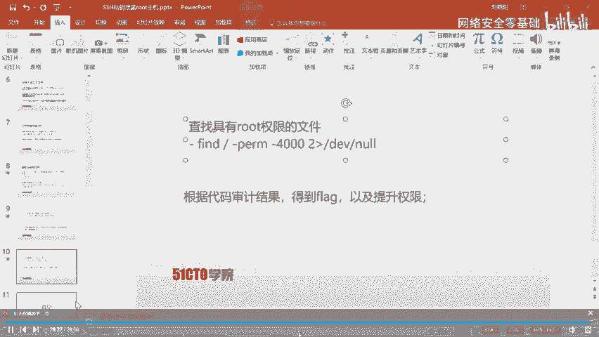

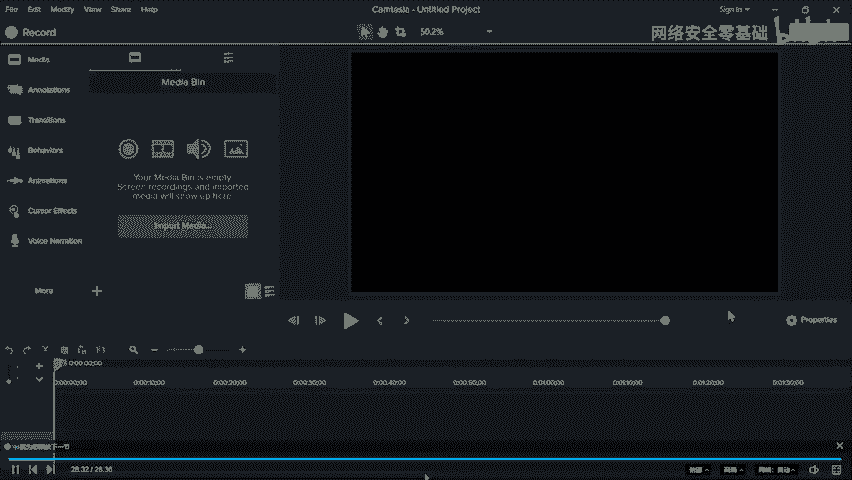

本节课我们一起学习了CTF中SSH私钥泄露漏洞的完整利用流程。我们从信息收集开始，通过端口扫描发现异常服务，利用目录爆破找到敏感文件，下载泄露的SSH私钥。在私钥被密码保护的情况下，我们使用工具破解了密码，成功登录靶场主机。最后，通过审计具有SUID权限的程序并利用其逻辑缺陷，我们完成了权限提升，最终以root身份获取了flag。这个过程强调了在CTF比赛中逐步深入、不放过任何细节的重要性。