# CTF夺旗：3.4：SSH服务渗透（获取首个用户权限）🔑

在本节课中，我们将学习如何对SSH服务进行渗透测试，从外部主机进入靶场机器，最终获取root权限并找到flag。首先，我们来介绍SSH协议。

## SSH协议简介

SSH协议是Secure Shell的缩写，由网络小组制定。其目标是在应用层基础上建立安全协议。目前，SSH广泛用于远程登录操作，提供安全性保障。

这种安全性源于SSH协议对用户名、密码以及发送到远程服务器的信息都进行了加密。这在一定程度上避免了信息泄露问题。SSH协议最初是Linux上的一个程序，后来因其功能强大被移植到其他平台。Windows和各种Linux发行版都支持运行SSH服务。

SSH服务基于**TCP 22端口**。

## SSH认证机制

上一节我们介绍了SSH协议，本节中我们来看看它的两种主要认证机制。

### 基于口令的安全验证

只要知道账户和对应密码，就可以使用SSH客户端登录到开放SSH服务的远程主机。在此过程中，所有发送的用户名、密码和数据都被加密，这在一定程度上能防止中间人攻击嗅探凭据。

然而，这种机制无法防止服务器被冒充的中间人攻击。

### 基于密钥的安全验证

这种验证方式需要依靠密钥。用户需要自己创建一对密钥，并将公钥放在需要访问的服务器上。登录时，使用自己的私钥与远程服务器的公钥进行匹配。如果匹配成功，则登录服务器获取权限；如果失败，则登录失败。

以下是密钥文件的常见命名规则：
*   **私钥**通常命名为 `id_rsa`
*   **公钥**通常命名为 `id_rsa.pub`

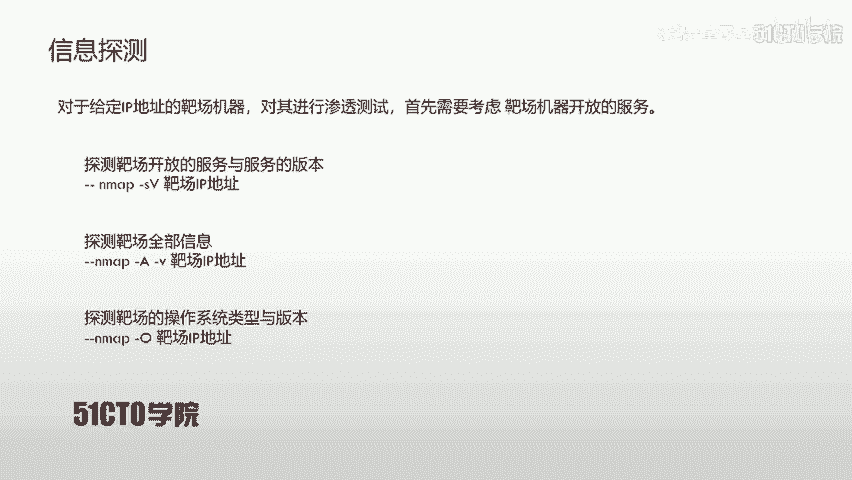

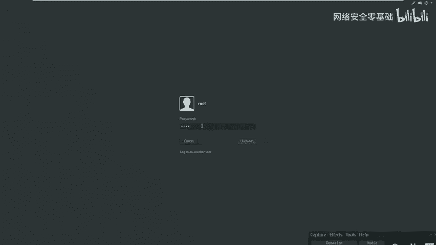

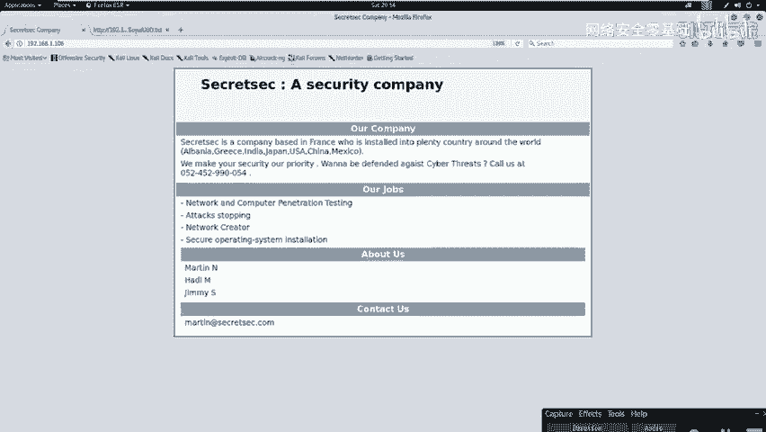

## SSH认证机制的安全弱点

以上我们已经对SSH协议认证机制有了初步认识。下面我们来看看这两种认证机制存在哪些安全弱点。

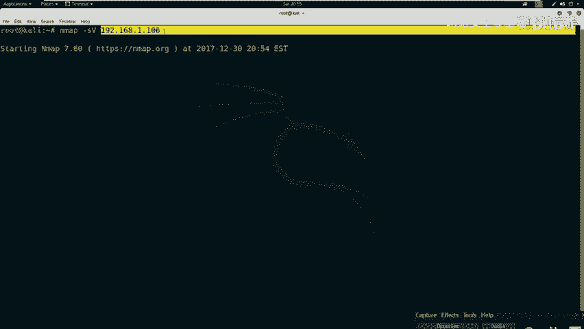

### 基于口令验证的弱点

基于口令和密码的验证无法避免暴力破解攻击。如果用户名存在弱口令，攻击者可以使用安全工具快速破解密码，然后通过SSH客户端连接服务器，实现对服务器的控制。

需要注意的是，通过这种方式获取的服务器权限不一定是root权限。如果不是，则需要进行权限提升。

### 基于密钥验证的弱点

我们需要对目标主机进行大量信息收集。如果能够获取到泄露的用户名及其对应的私钥，就可以使用该用户名和私钥进行远程登录。此过程可能不需要用户的密码。

以下是利用私钥登录的典型过程：
1.  修改私钥文件的权限为`600`（仅所有者可读写）。
    ```bash
    chmod 600 id_rsa
    ```
2.  使用SSH客户端指定私钥文件进行登录。
    ```bash
    ssh -i id_rsa username@target_ip
    ```

同样，通过此方式登录获得的权限也不一定是root权限，可能需要进一步提权。

## 实验环境与信息探测

下面我们介绍一下本次CTF的实验环境。
*   **攻击机**：Kali Linux，IP地址为 `192.168.1.105`
*   **靶机**：Linux机器，IP地址为 `192.168.1.106`

我们的目标是获取靶机上的flag值并提升至root权限。所有操作都应围绕此目的展开。首先，我们需要进行信息探测。

对于给定IP地址的靶机，渗透时首先要考虑其开放的服务。我们可以使用Nmap工具进行探测。

以下是常用的Nmap扫描命令：
*   探测开放服务及版本：`nmap -sV target_ip`
*   探测靶机全面信息：`nmap -A -v target_ip`
*   探测操作系统类型：`nmap -O target_ip`

通过对靶机`192.168.1.106`的扫描，我们发现了以下开放端口：
*   **22端口**：SSH服务
*   **80端口**：HTTP服务（Apache 2.4.10）
*   **111端口**：RPCbind服务

## 信息分析与敏感信息挖掘

我们对收集到的信息进行分析，寻找其中的敏感信息和安全弱点。

对于开放SSH服务（22端口）的靶机，主要考虑两点：
1.  是否可以通过暴力破解用户名和密码，直接使用SSH客户端登录。
2.  服务器是否存在私钥泄露。如果存在，则需考虑私钥是否加密（若加密需破解），并找到对应的用户名。

对于开放HTTP服务（80端口）的靶机，则考虑：
1.  通过浏览器访问服务，获取页面展示信息。
2.  使用目录探测工具，扫描敏感目录和文件。

接下来，我们对扫描结果进行深入挖掘。

首先，使用浏览器访问靶机的HTTP服务（`http://192.168.1.106`）。在“About Us”页面中，我们发现了一些人名，如`martin`、`jen`、`jim`，这些很可能就是系统上的用户名。

其次，使用目录扫描工具`dirb`探测隐藏目录和文件。
```bash
dirb http://192.168.1.106
```
在扫描结果中，我们访问了一个名称奇特的文件，发现其内容包含“RSA PRIVATE KEY”，即SSH私钥。我们成功挖掘到了敏感信息。


此外，也可以使用`nikto`扫描器挖掘敏感信息。
```bash
nikto -host 192.168.1.106
```
需要特别注意`config`类配置文件以及其他标注为`interesting`的文件。

## 利用私钥登录靶机

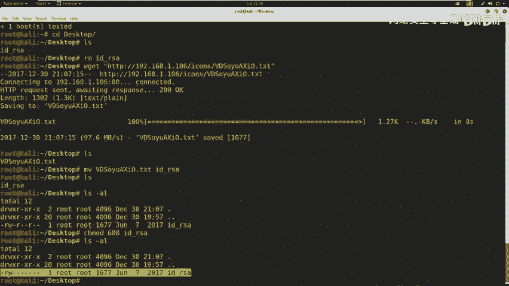

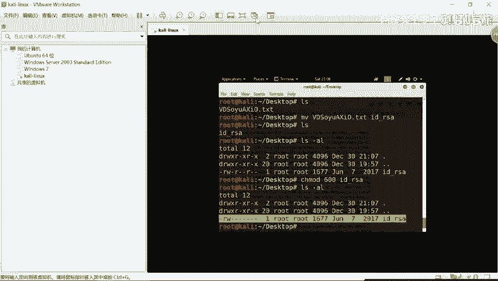

挖掘到敏感信息后，我们就可以利用这些弱点进行渗透。我们已获得SSH私钥，接下来利用它远程登录服务器。

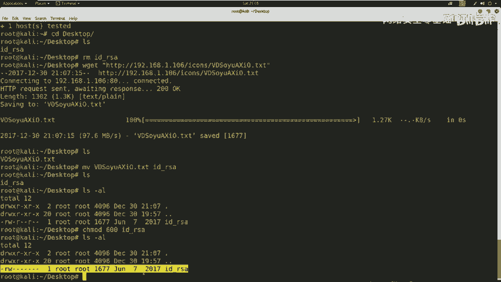

操作步骤如下：
1.  将私钥文件下载到本地。
    ```bash
    wget http://192.168.1.106/.../id_rsa
    ```
2.  重命名私钥文件（可选），并修改其权限为`600`。
    ```bash
    mv [downloaded_file] id_rsa
    chmod 600 id_rsa
    ```
3.  使用私钥尝试登录。结合之前信息收集到的用户名（如`martin`）进行尝试。
    ```bash
    ssh -i id_rsa martin@192.168.1.106
    ```
4.  成功登录到靶机，当前用户为`martin`。

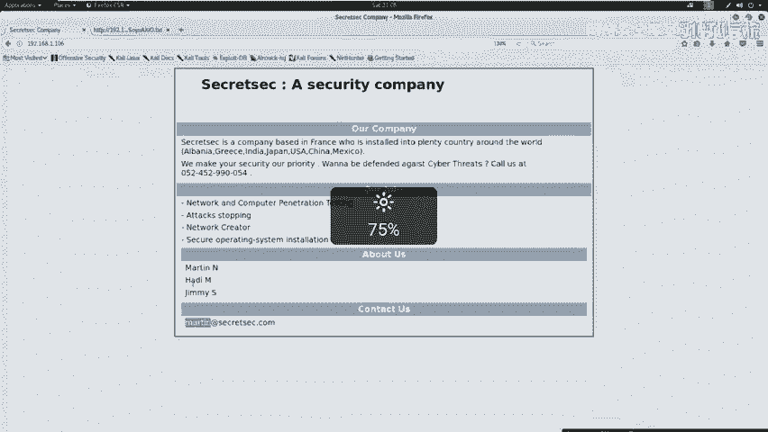

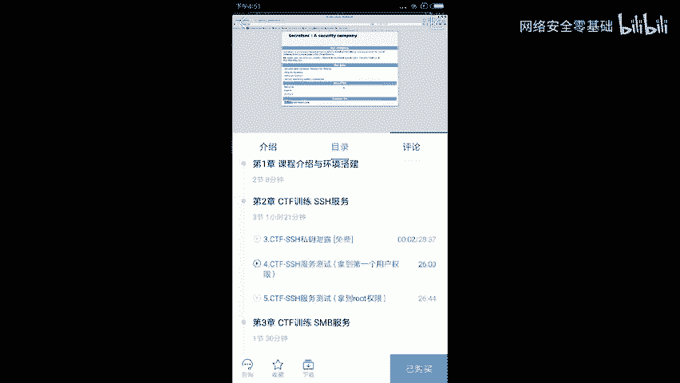

## 登录后操作与权限确认

成功登录后，我们需要评估当前权限并寻找flag。
*   使用`id`命令查看当前用户权限，确认是否为root。
*   切换到根目录，查看是否存在flag文件。
    ```bash
    cd /
    ls -la | grep flag
    ```

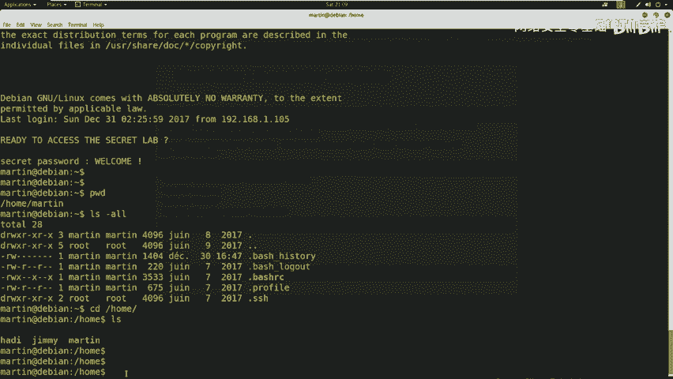

在本例中，`martin`只是一个普通用户，不具有root权限。因此，我们需要进一步进行权限提升，这将在后续课程中讲解。

## 总结

本节课中，我们一起学习了SSH服务渗透的基本流程。
1.  我们介绍了SSH协议及其两种认证机制（口令和密钥）。
2.  我们分析了这两种机制可能存在的安全弱点。
3.  我们使用Nmap、浏览器、Dirb、Nikto等工具对靶机进行了信息探测和敏感信息挖掘。
4.  我们利用发现的泄露私钥和用户名，成功通过SSH登录到靶机，获得了第一个用户权限。
5.  我们确认了当前权限并非root，为后续的权限提升操作做好了准备。

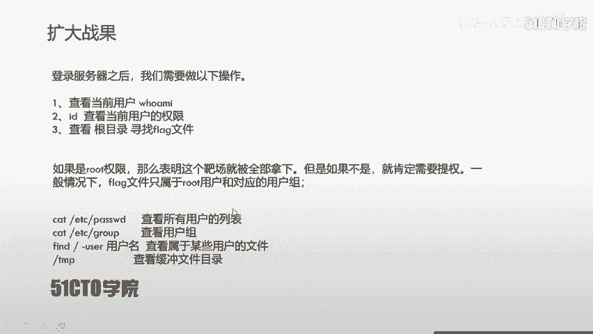

关键点在于：渗透测试是一个有目的的过程（获取flag），并且需要综合利用各种信息收集手段发现弱点（如泄露的凭据）。