# CTF入门教程：P9：7.8：CTF夺旗实战演练 🚩

在本节课中，我们将学习CTF夺旗赛的基本流程和实战技巧。我们将从一个模拟的靶场环境出发，演示如何通过信息收集、服务探测、漏洞利用等一系列步骤，最终找到并提交隐藏的Flag。

---

## 概述

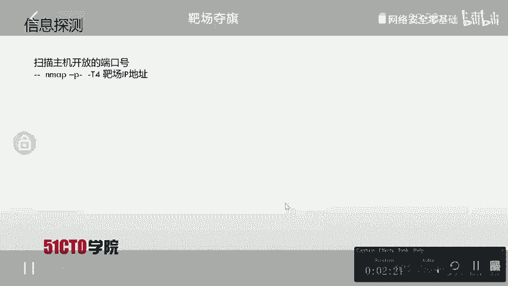

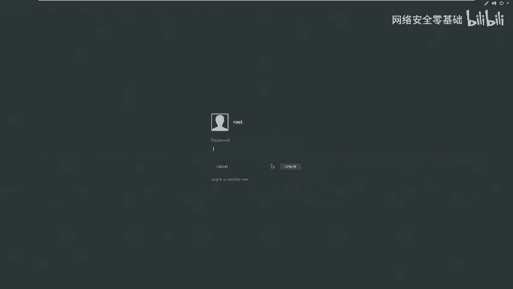

CTF是一种流行的信息安全竞赛形式，其英文名可直译为“夺得旗帜”，也可意译为“夺旗赛”。其基本流程是：参赛团队之间通过进行信息对抗、程序分析等形式，率先从主办方给出的比赛环境中得到一串具有一定格式的字符串或其他内容，并将其提交给主办方，从而获得分数。为了方便称呼，我们把这样的内容称之为**Flag**。

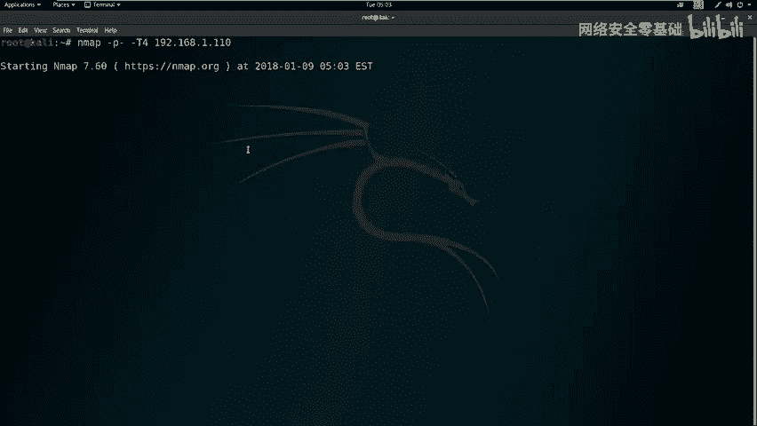

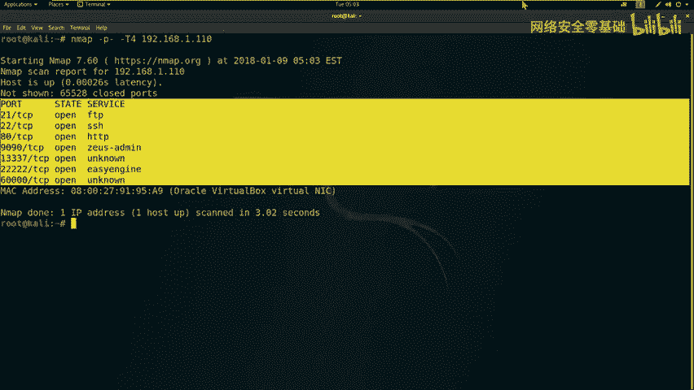

在CTF比赛中，涉及内容比较繁杂，我们需要利用所有可以利用的方法获得对应的Flag。

## 实验环境介绍

本次实验环境如下：
*   **攻击机**：Kali Linux，IP地址为 `192.168.1.111`。
*   **靶场机器**：Linux系统，IP地址为 `192.168.1.110`。

我们的所有操作都围绕一个核心目标：获得靶场机器上的Flag值。

## 第一步：信息探测

在拿到靶场机器的IP地址之后，我们需要进行第一步操作：信息探测。目标是发现靶机开放了哪些服务。

### 端口扫描

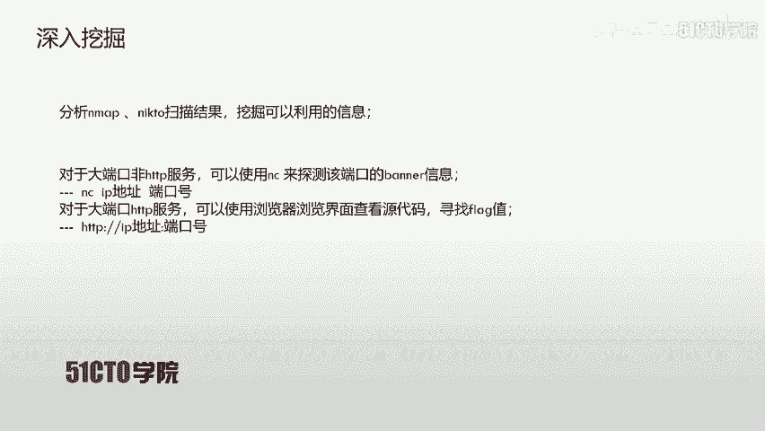

首先我们来探测一下靶场机器开放的端口号。这里我们可以使用Nmap工具。

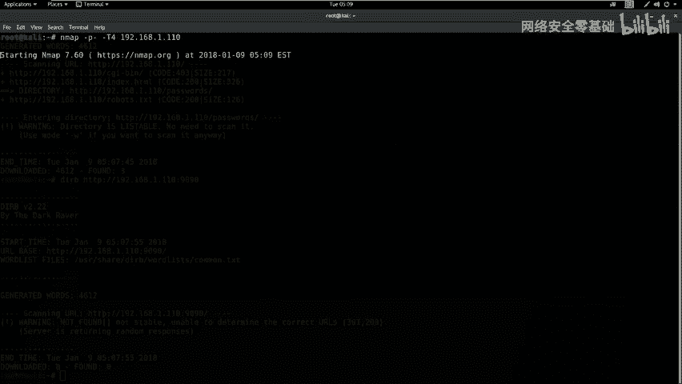

以下是扫描所有端口的命令：
```bash
nmap -p- -T4 192.168.1.110
```
*   `-p-`：表示扫描所有端口号（从0到65535）。
*   `-T4`：表示使用Nmap的最大线程数，即最快速度。

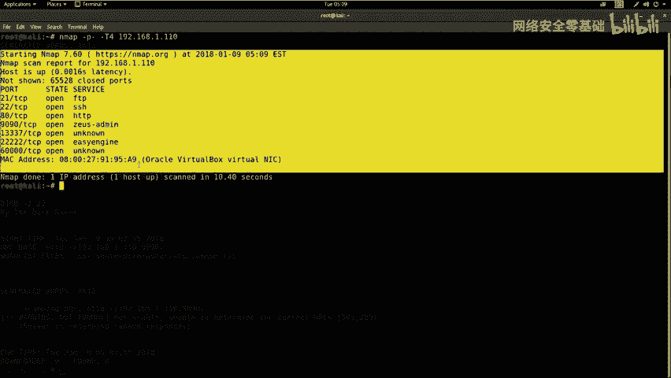

扫描完成后，Nmap会显示开放的端口号及其对应的服务。

除了扫描端口，我们还可以使用更全面的扫描命令来获取主机信息：
```bash
nmap -T4 -A -v 192.168.1.110
```
*   `-A`：启用操作系统检测、版本检测、脚本扫描和路由跟踪。
*   `-v`：显示详细输出。

需要注意的是，有时全面扫描可能会遗漏某些端口。因此，在实际操作中，建议结合使用以上两条命令，以确保探测到所有开放的端口。

### Web服务敏感信息探测

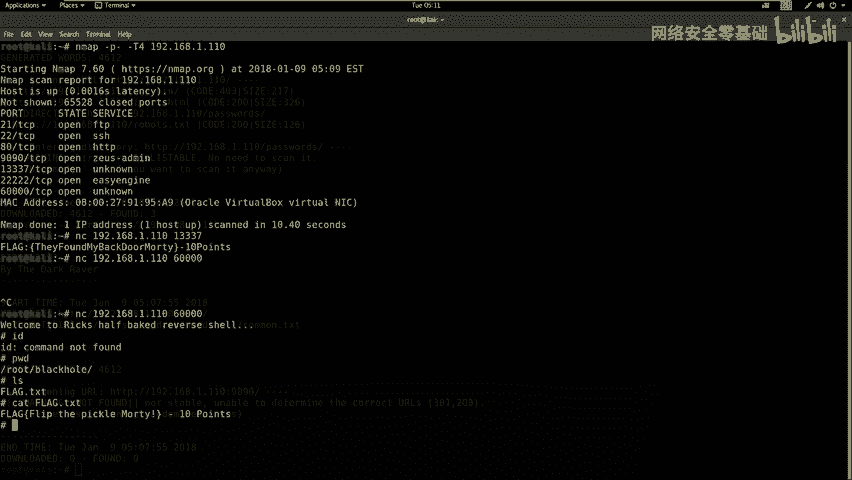

对于开放了HTTP服务的靶机，我们可以使用其他工具进行更深入的探测。

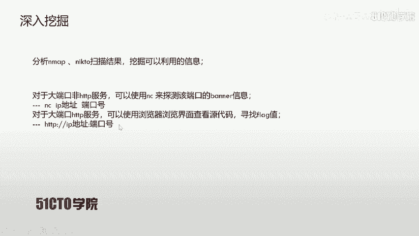

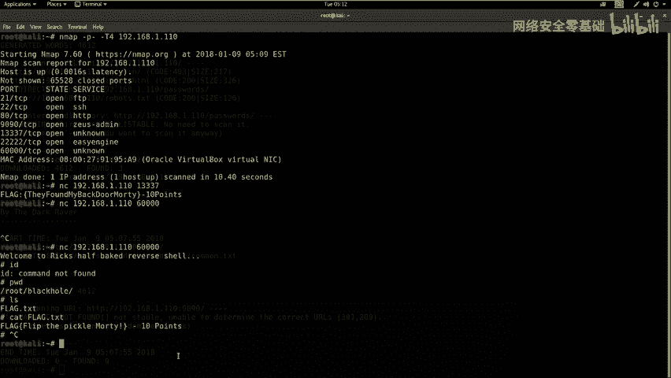

以下是使用`nikto`进行Web漏洞扫描的命令：
```bash
nikto -host http://192.168.1.110
```
如果HTTP服务运行在非80端口（例如9090），则需要指定端口号：
```bash
nikto -host http://192.168.1.110:9090
```

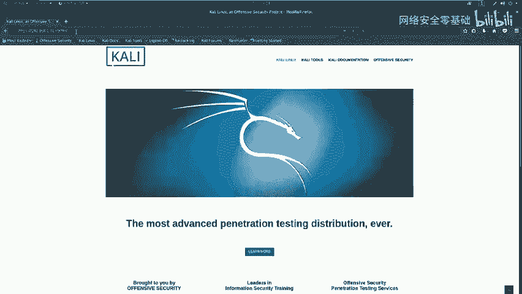

另一个有用的工具是`dirb`，它可以探测Web目录和文件：
```bash
dirb http://192.168.1.110
```
同样，对于非80端口的服务：
```bash
dirb http://192.168.1.110:9090
```

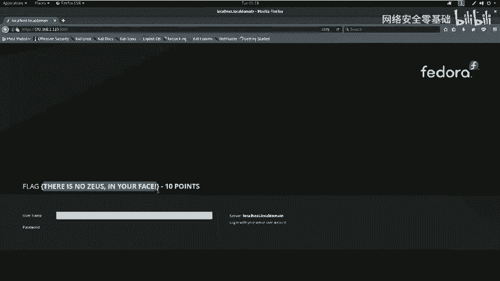

## 第二步：分析结果与深入挖掘

在信息探测完毕之后，我们就可以对探测到的信息进行深入挖掘。

### 探测未知服务的Banner信息

分析Nmap扫描结果时，可能会发现一些运行在非常见大端口上的未知服务。我们可以使用`netcat (nc)`工具来连接这些端口，获取服务的Banner信息，其中可能直接包含Flag。

命令格式如下：
```bash
nc 192.168.1.110 <端口号>
```
例如，探测13337端口：
```bash
nc 192.168.1.110 13337
```
执行后，服务返回的Banner信息中可能就包含了第一个Flag。

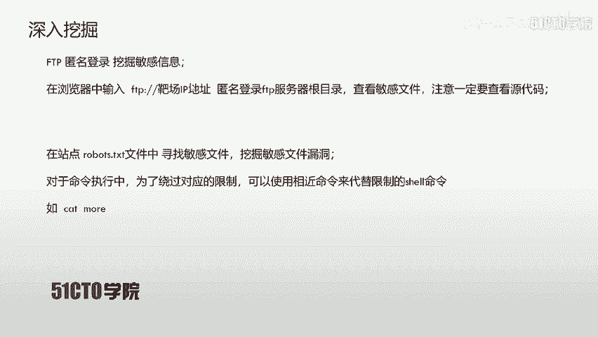

### 利用Web服务

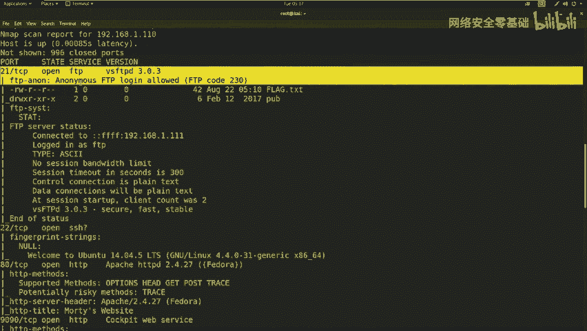

如果扫描结果显示存在大端口的HTTP服务（例如9090），我们可以直接使用浏览器访问。
访问URL时需要加上对应的端口号，例如：`http://192.168.1.110:9090`
在打开的页面或查看网页源代码时，可能会直接发现Flag。


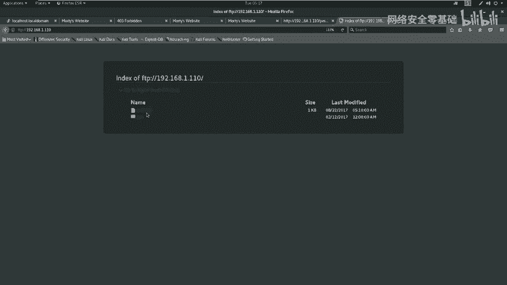

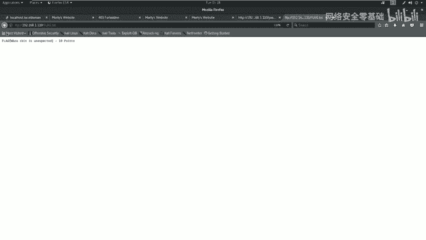

对于常见的80端口HTTP服务，我们可以结合`dirb`的扫描结果进行访问。例如，扫描发现存在 `/passwords/` 目录，访问后可能找到 `flag.txt` 文件，从而获得Flag。同时，也要注意查看页面源代码中的注释等信息，可能会发现有用的提示（如密码`winter`）。

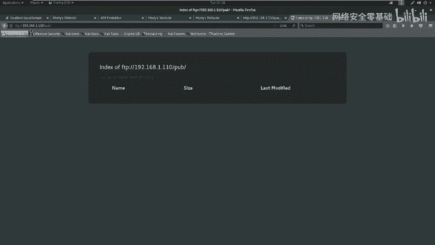

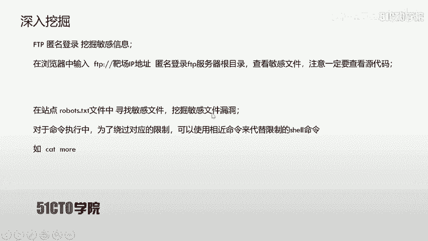

### 检查其他开放服务

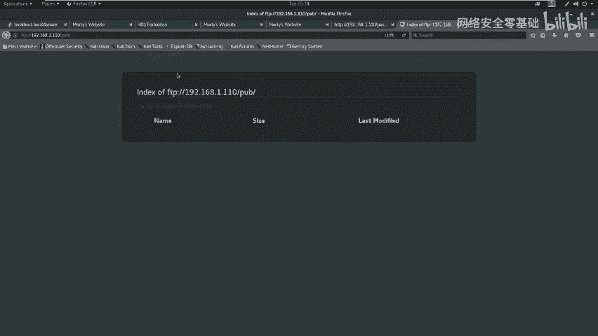

不要放过任何一个开放的服务。例如，扫描结果显示21端口（FTP服务）支持匿名登录。
我们可以在浏览器中直接访问：`ftp://192.168.1.110`
在FTP服务器的根目录下，可能会发现 `flag.txt` 文件，打开即可获得Flag。

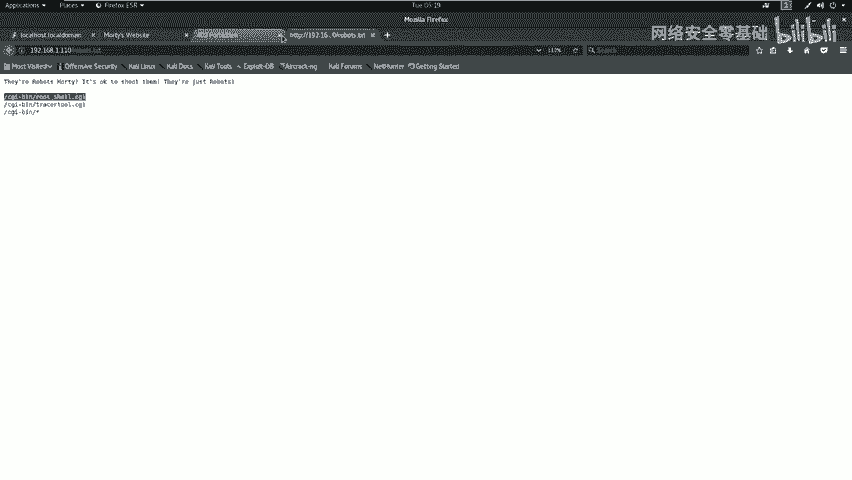

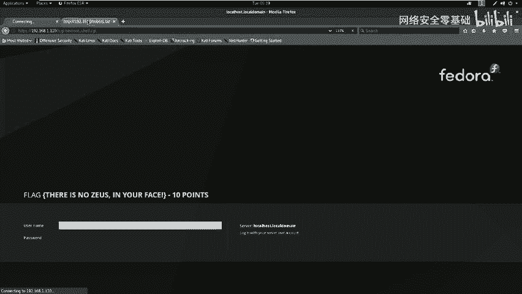

### 利用Robots.txt文件

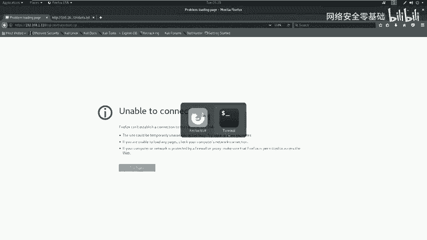

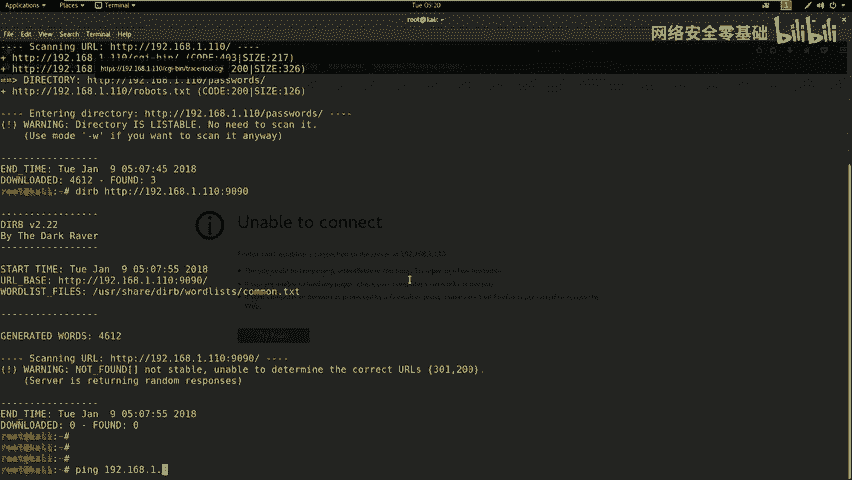

对于Web站点，`robots.txt` 文件通常指明了搜索引擎不应访问的目录。这些目录有时会包含敏感信息或测试页面。
访问 `http://192.168.1.110/robots.txt`，根据其中列出的目录进行访问，可能会发现新的入口点或漏洞。

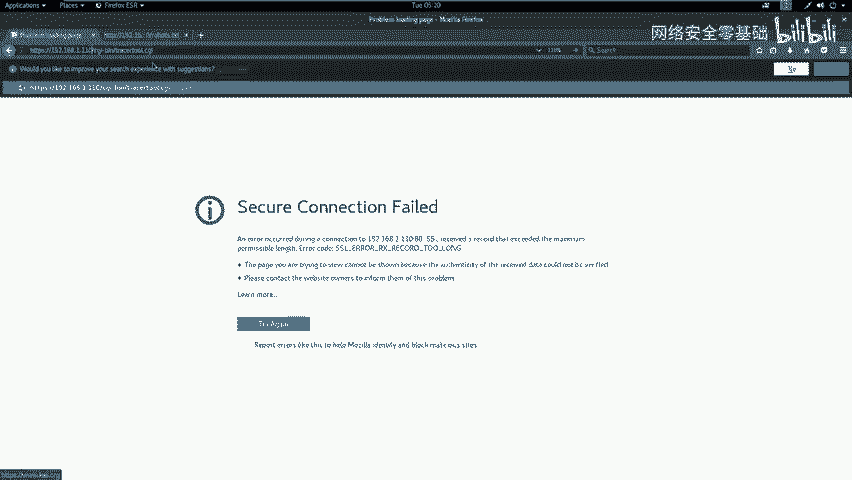

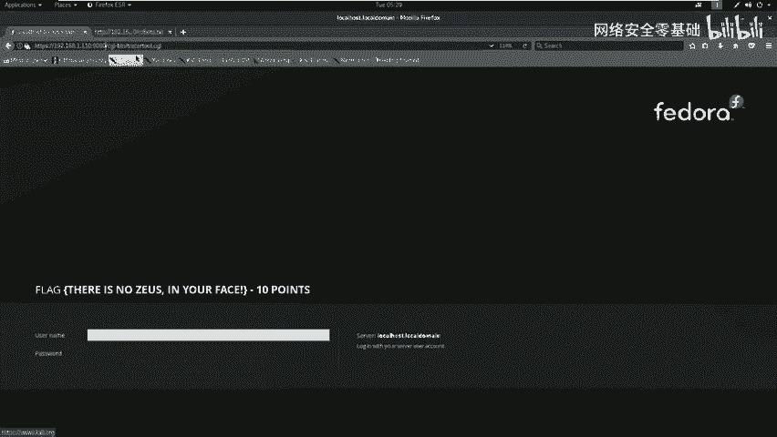

## 第三步：漏洞利用与权限提升

通过深入挖掘，我们可能会发现漏洞点。

### 命令注入漏洞

例如，在访问 `robots.txt` 发现的 `/cgi-bin/traceroute.cgi` 页面时，发现一个用于路由追踪的输入框。提交 `127.0.0.1` 后，页面返回追踪结果，这暗示可能存在命令注入漏洞。

我们可以尝试注入命令进行测试：
输入：`127.0.0.1; id`
如果页面返回了当前用户的权限信息（例如`apache`），则证实存在命令注入漏洞。

### 绕过限制与信息收集

当尝试使用 `cat /etc/passwd` 命令读取系统用户列表时，发现 `cat` 命令被过滤。此时可以尝试使用功能相近的命令如 `more` 来绕过限制：
输入：`127.0.0.1; more /etc/passwd`
成功读取 `/etc/passwd` 文件后，我们找到了一个用户名 `snow`。

结合之前在网页源代码中发现的密码 `winter`，我们尝试进行远程登录。

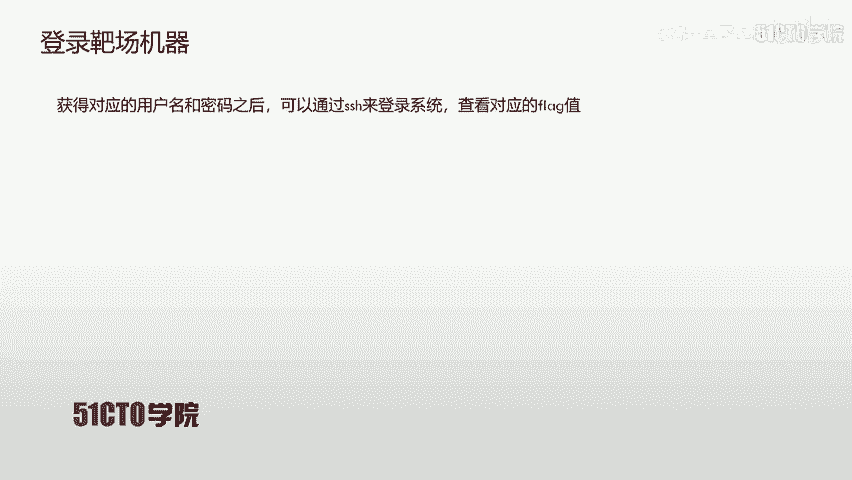

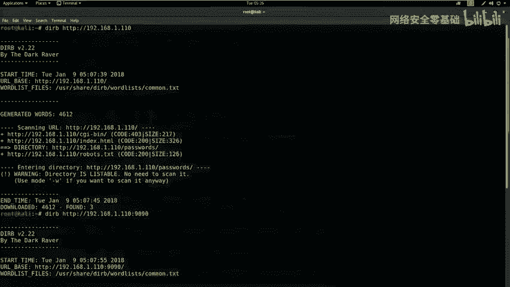

### 远程登录与获取Flag

扫描结果显示靶机开放了SSH服务，但标准22端口连接被拒。我们发现它运行在另一个端口 `2522` 上。
使用以下命令尝试登录：
```bash
ssh snow@192.168.1.110 -p 2522
```
输入密码 `winter` 后，成功登录到靶机。

登录后，通过基本命令操作寻找Flag：
1.  `pwd`：查看当前目录。
2.  `ls`：列出文件，发现 `flag.txt`。
3.  由于 `cat` 命令被过滤，使用 `more flag.txt` 查看文件内容，成功获得最终的Flag。

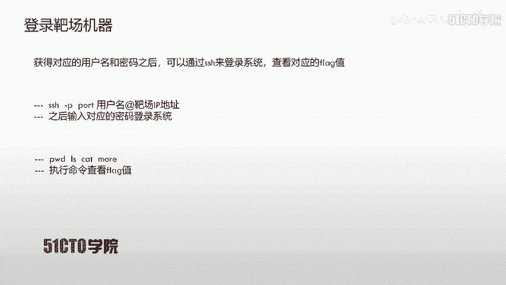

## 总结与核心要点

本节课我们一起完成了一次完整的CTF夺旗流程演练。以下是需要掌握的核心要点：

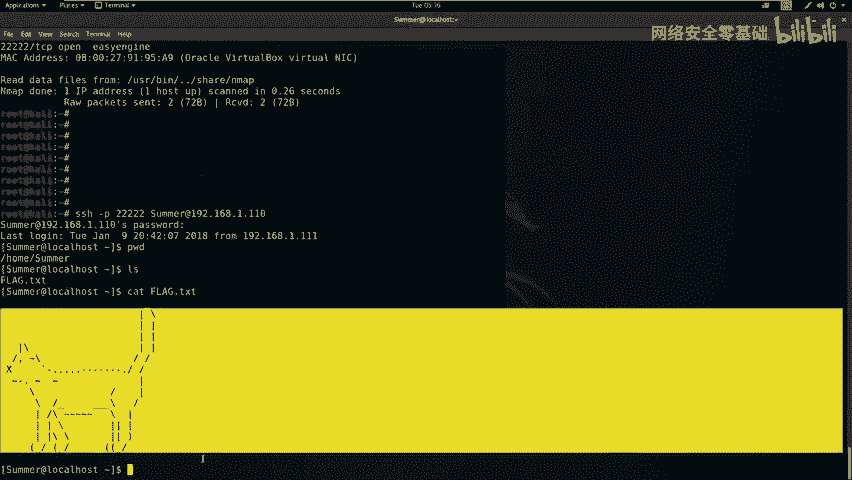

1.  **探测未知服务**：对于未知服务的大端口，一定要使用 `nc` 等工具获取其Banner信息，其中可能直接暴露Flag。
2.  **灵活使用命令**：在测试或利用漏洞时，如果某个常用命令被过滤，尝试使用功能相近的命令进行绕过（例如用 `more` 代替 `cat`）。
3.  **全面探测，不遗漏任何服务**：对每一个开放的服务（如FTP、SSH、HTTP及其各种端口）都需要进行细致的探测。任何一个不起眼的服务都可能成为突破口。
4.  **信息关联**：将从不同地方收集到的信息（如用户名、密码、隐藏端口）关联起来，是完成渗透的关键步骤。

在CTF比赛或实际渗透测试中，需要保持耐心和细心，仔细挖掘每一个服务中的弱点信息，才能最终成功夺取Flag。

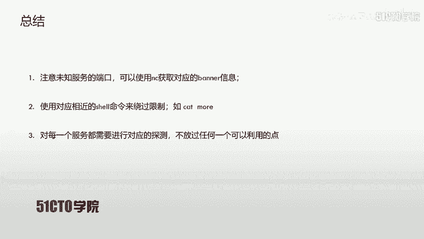

---
**本节课中，我们一起学习了从信息收集到漏洞利用的完整CTF夺旗流程。** 记住这些步骤和思路，将有助于你在未来的网络安全学习和实践中更快地入门。