# 网络安全入门教程：P10：08. 给Kali新系统的第二件事情 - 编辑器的配置 🛠️

在本节课中，我们将学习如何在Kali Linux系统中安装和配置一个功能强大的代码编辑器——Visual Studio Code（VS Code）。这是进行网络安全学习和CTF比赛时编写脚本、查看代码的重要工具。

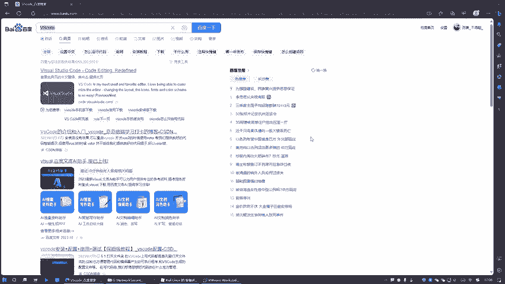

## 概述

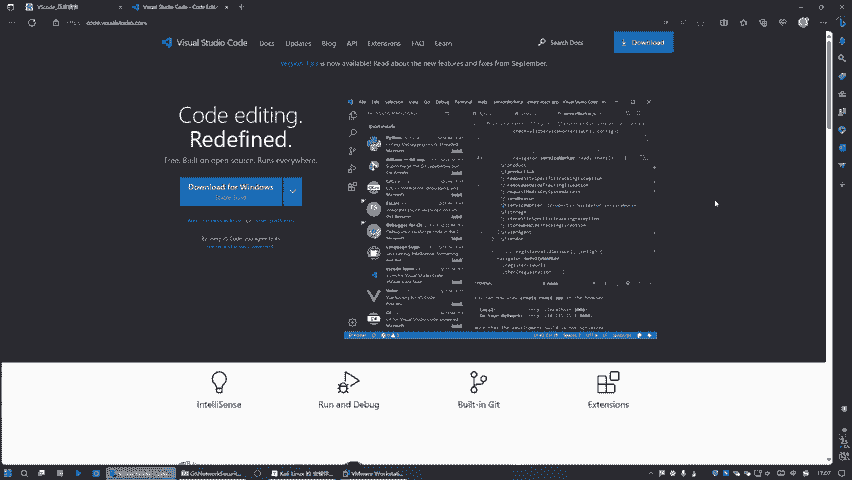

上一节我们介绍了Kali Linux的基本设置，本节中我们来看看如何配置一个高效的代码编辑器。Kali系统自带的编辑器功能较为简陋，因此我们需要安装一个更专业的工具。

## 下载VS Code安装包

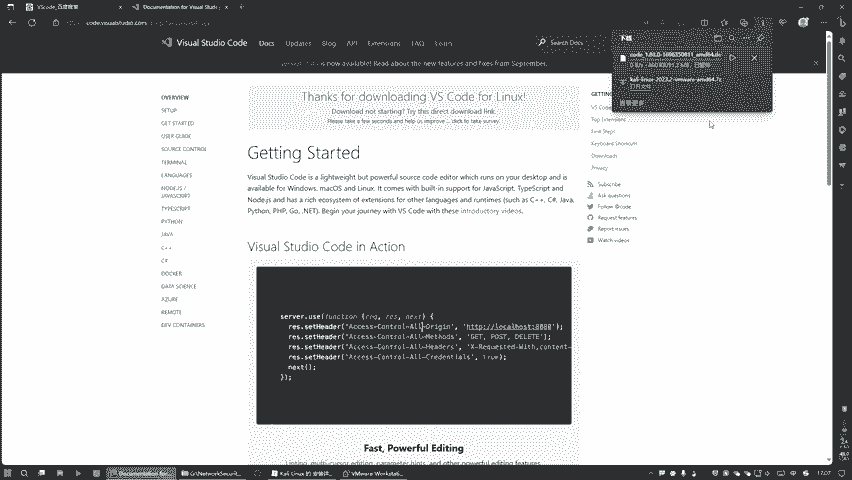

首先，我们需要获取VS Code的安装文件。由于Kali Linux基于Debian，我们需要下载适用于Debian系统的`.deb`格式安装包。

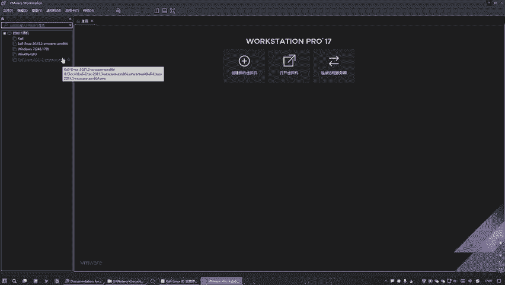

以下是获取安装包的步骤：
1.  打开浏览器，访问VS Code官方网站或通过搜索引擎搜索“VS Code”。
2.  在下载页面，选择适用于Linux的版本，并找到后缀为`.deb`的安装包进行下载。
3.  如果网络环境允许，可以直接点击下载。如果下载速度较慢，可以复制该安装包的下载链接地址，以便后续在终端中使用命令下载。

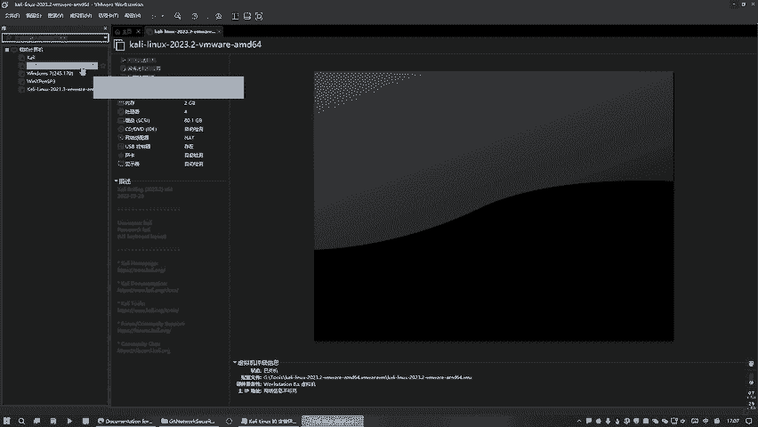

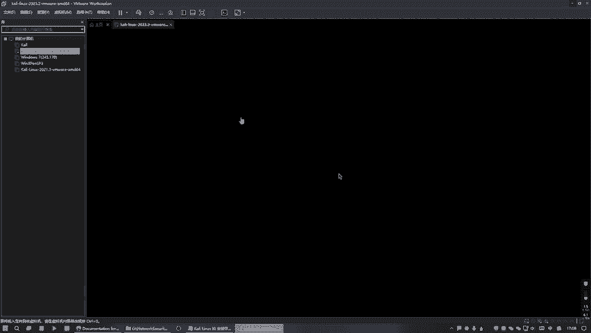

## 在Kali Linux终端中下载

如果浏览器下载不顺利，我们可以回到Kali Linux系统中，使用终端命令进行下载。

我们需要使用`wget`这个命令行下载工具。首先，请检查你的系统是否已安装该工具。在终端中输入以下命令并按`Tab`键尝试补全：

```bash
wget
```

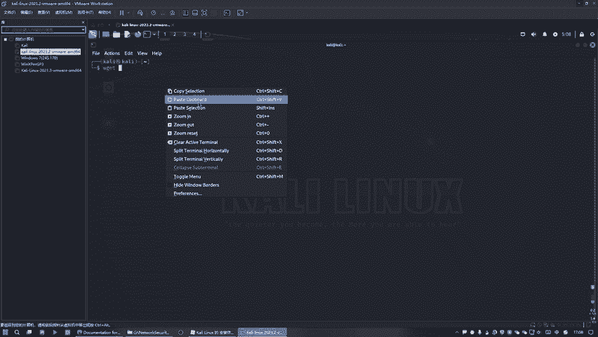

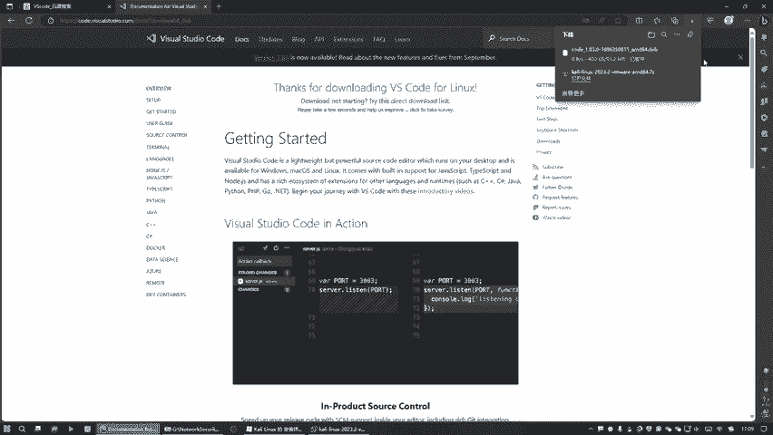

如果系统提示“命令未找到”，则需要先安装`wget`。安装命令如下：

```bash
sudo apt install wget -y
```

安装完成后，使用`wget`命令加上你之前复制的下载链接，即可开始下载VS Code的安装包。命令格式如下：

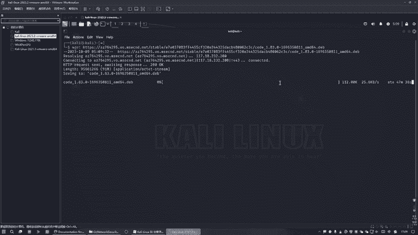

```bash
wget [你复制的VS-Code-.deb-安装包链接]
```

> **注意**：下载速度取决于你的网络环境。如果下载过程非常缓慢或长时间没有进度，可能是网络问题，可以稍后再试或寻找其他下载源。

## 安装VS Code

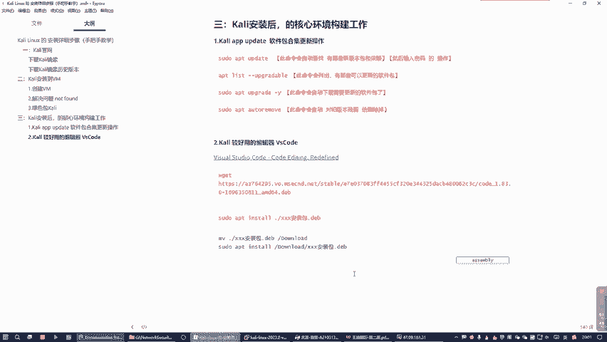

成功下载`.deb`安装包后，我们就可以在终端中安装它了。请确保终端当前目录位于安装包所在的文件夹，然后执行以下安装命令：

```bash
sudo dpkg -i code_*.deb
```

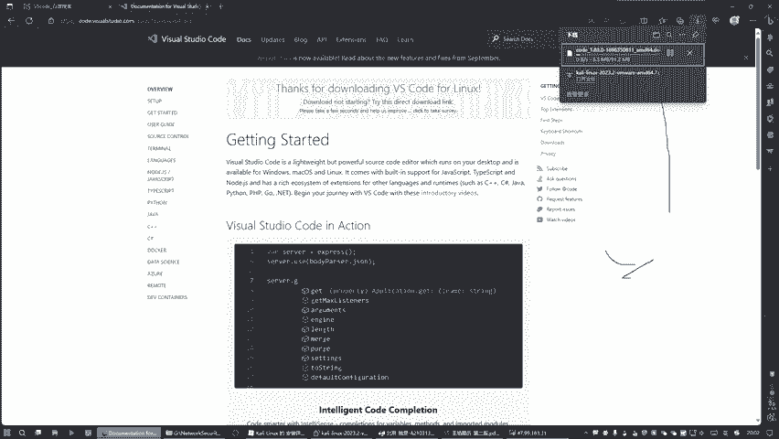

或者，你也可以使用`apt`命令来安装本地deb包：

```bash
sudo apt install ./code_*.deb
```

安装过程可能需要一些时间，请耐心等待。如果安装过程中报告依赖关系错误，可以运行以下命令修复：

```bash
sudo apt --fix-broken install
```

## 启动与使用VS Code

安装完成后，有多种方式可以启动VS Code：
*   在应用程序菜单中搜索“Visual Studio Code”并点击打开。
*   在终端中，直接输入命令`code`来启动。
*   在终端中进入某个项目目录，输入命令`code .`，即可用VS Code打开当前目录，这是一个非常高效的工作方式。

启动后，你将看到一个功能丰富的代码编辑器界面。关于VS Code的具体使用方法，例如如何安装扩展、配置主题、使用快捷键等，网络上有大量详细的教程和指南。

## 总结

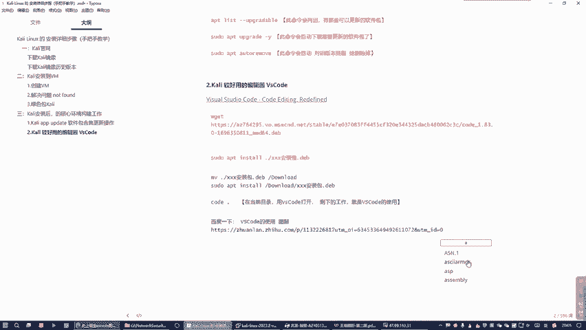

本节课中我们一起学习了为Kali Linux系统配置专业代码编辑器VS Code的完整流程。我们了解了如何获取安装包、使用`wget`命令下载、通过`dpkg`或`apt`命令进行安装，以及最后如何启动和使用它。拥有一个得力的编辑器，将为你后续的网络安全学习和CTF解题打下坚实的基础。下一节，我们将开始探索Kali Linux中的其他重要工具。