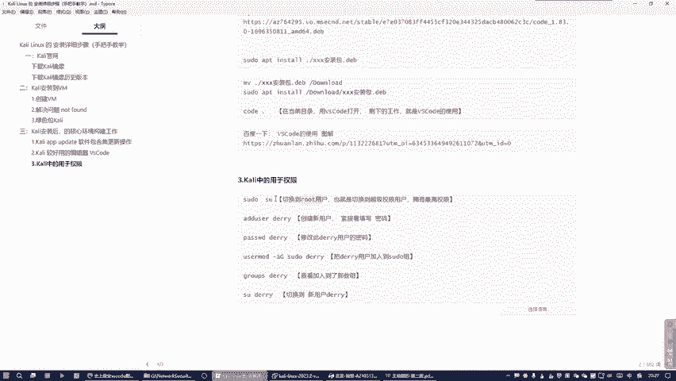
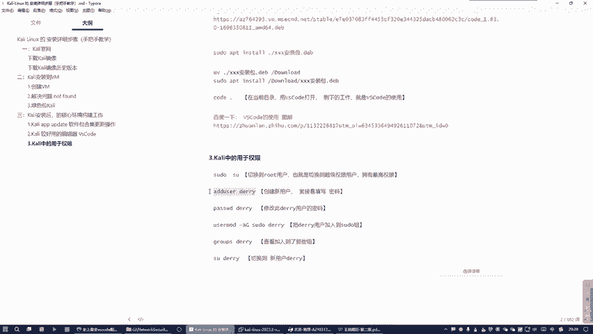
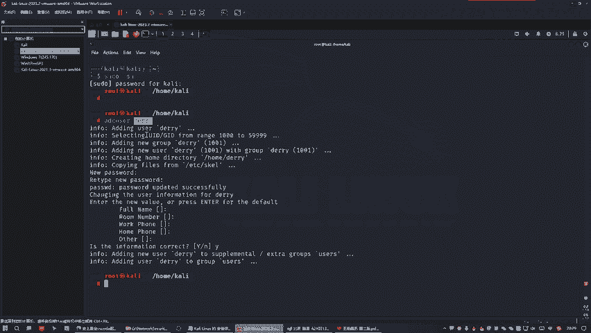
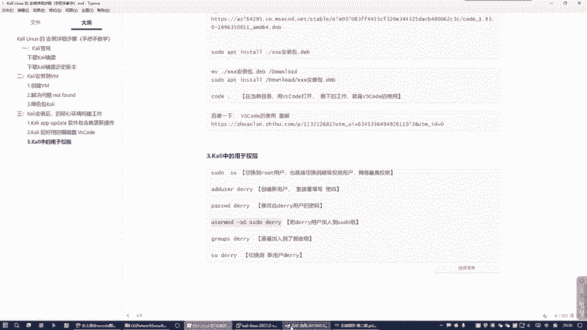
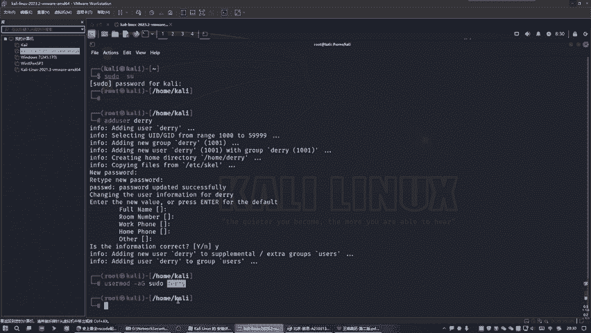
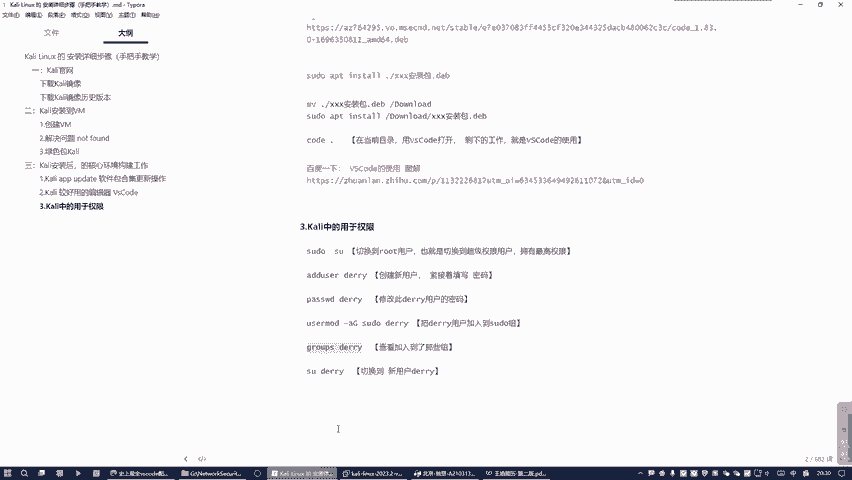
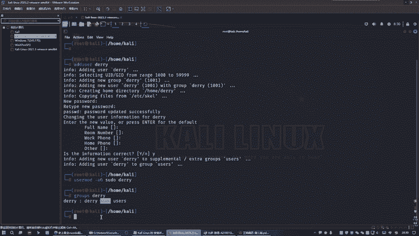
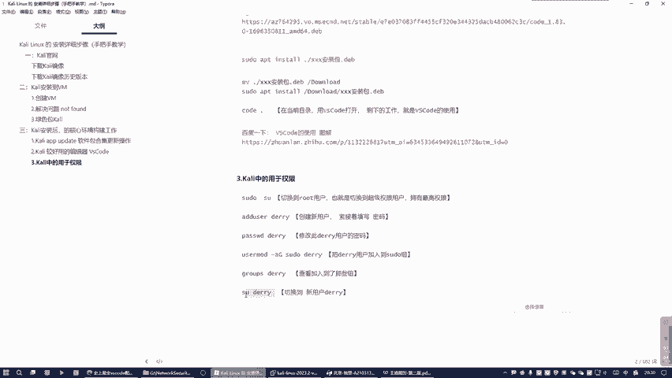
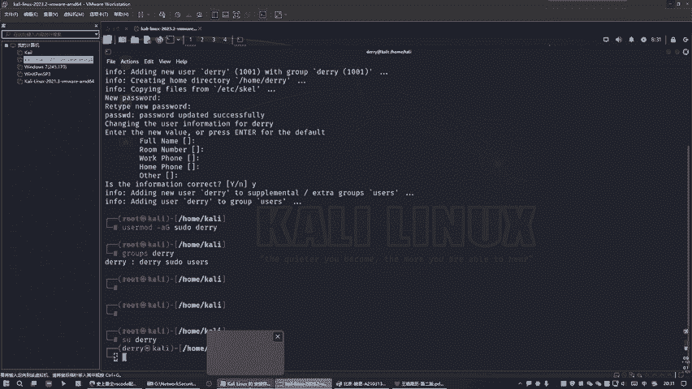
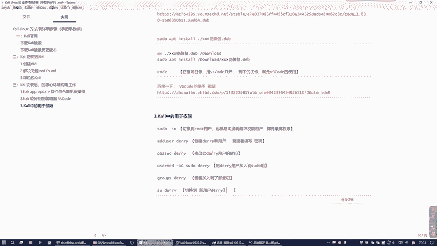

# 网络安全入门：P11：09.Kali中的用户权限

在本节课中，我们将学习Kali Linux中至关重要的用户权限管理。理解权限是掌握Linux系统操作的基础，它决定了你能执行哪些操作。我们将从识别当前权限状态开始，学习如何切换到最高权限，以及如何创建和管理新用户。

## 权限基础与切换

Kali Linux基于Linux系统，因此理解其权限体系是重要环节。

首先，我们登录到Kali系统。请注意终端命令行前的提示符，它表明了当前的用户权限级别。




当提示符是美元符号 `$` 时，这代表你处于**普通用户**权限级别。在此权限下，你只能执行约百分之七八十的常规操作，许多需要更高权限的系统级操作无法完成。

为了执行所有操作，你需要获取**超级用户权限**，即切换到 `root` 用户。


使用以下命令切换到 `root` 用户：
```bash
su -
```
执行命令后，系统会要求你输入 `root` 用户的密码。输入时屏幕不会有任何提示，输入完成后按回车即可。



切换成功后，你会发现命令行提示符从美元符号 `$` 变成了井号 `#`。这个**井号 `#`** 就代表你当前拥有超级用户权限（root权限），可以执行所有操作。

## 用户与组管理

在拥有最高权限后，我们可以进行用户管理操作，例如创建一个新用户。



使用以下命令创建一个名为 `darry` 的新用户：
```bash
adduser darry
```
执行命令后，系统会提示你为 `darry` 用户设置密码并填写一些用户信息（如全名、房间号等）。对于非必要信息，可以直接按回车跳过。

创建用户后，我们可能需要修改其密码。使用以下命令：
```bash
passwd darry
```
此命令会要求你**输入两次新的密码**，两次输入需保持一致。

接下来，为了赋予新用户执行特权命令的权限，我们通常需要将其添加到 `sudo` 组。`sudo` 组内的用户可以使用 `sudo` 命令临时获取 root 权限。



使用以下命令将用户 `darry` 追加到 `sudo` 组：
```bash
usermod -aG sudo darry
```
请注意命令中的 `-aG` 参数至关重要。`-a` 代表追加（Append），`-G` 指定组。如果不使用 `-a` 参数，该命令会**覆盖**用户当前所属的所有组，只保留新指定的 `sudo` 组，这将导致用户从其他必要组中被移除，非常危险。





添加完成后，我们可以查看用户所属的组来确认操作是否成功：
```bash
groups darry
```
命令输出会显示用户 `darry` 当前所在的所有组，你应该能看到 `sudo` 组在其中。



## 用户切换实践



完成用户创建和授权后，我们可以进行用户切换来体验不同权限。



首先，我们当前处于 `root` 用户（`#` 提示符）。要切换到新创建的 `darry` 用户，使用以下命令：
```bash
su - darry
```
或者使用更常见的切换方式：
```bash
su darry
```
切换后，命令行提示符会从井号 `#` 变回美元符号 `$`，这表示你已成功切换到普通用户 `darry`。

以下是本节课程中频繁使用的核心命令总结：
1.  **`su -`**：从普通用户切换到超级用户（root）。
2.  **`adduser <用户名>`**：创建新用户。
3.  **`passwd <用户名>`**：修改指定用户的密码。
4.  **`usermod -aG sudo <用户名>`**：将指定用户追加到 `sudo` 组，赋予其执行特权命令的权限。
5.  **`groups <用户名>`**：查看指定用户所属的组。
6.  **`su - <用户名>`**：切换到指定用户。

## 课程总结



本节课我们一起学习了Kali Linux中的用户权限管理。我们首先认识了`$`和`#`两种提示符所代表的普通权限与超级权限。然后，我们实践了如何使用`su -`命令切换至root用户，并使用`adduser`和`passwd`命令创建及管理新用户账户。最后，我们掌握了通过`usermod`命令将用户加入`sudo`组以授予管理权限，并使用`su`命令在不同用户间进行切换。这些是Linux系统管理中最基础且最常用的操作，是后续深入学习的重要基石。