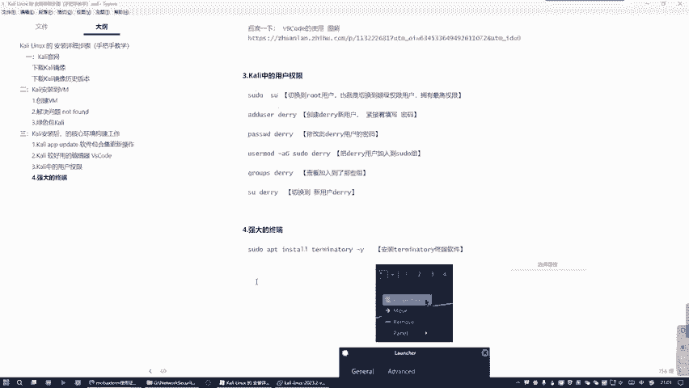
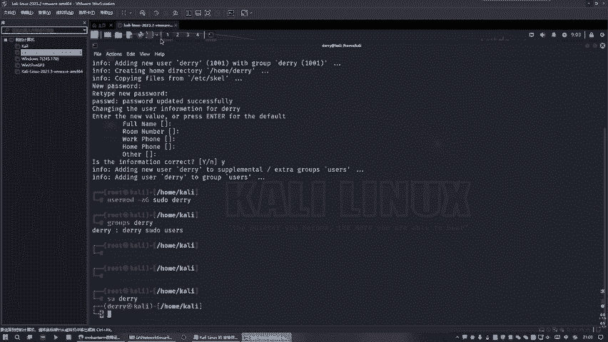
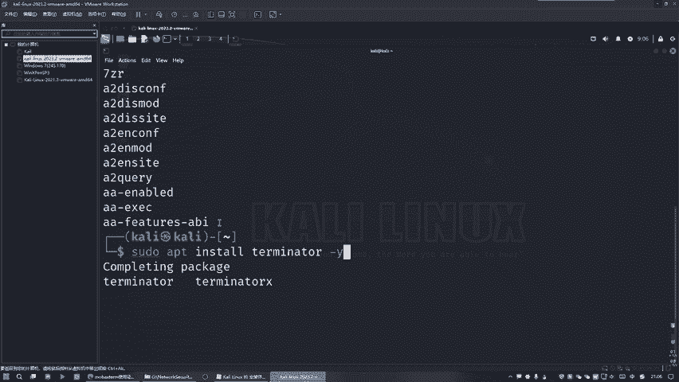
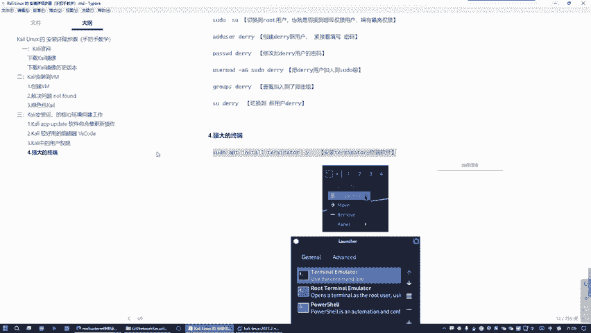
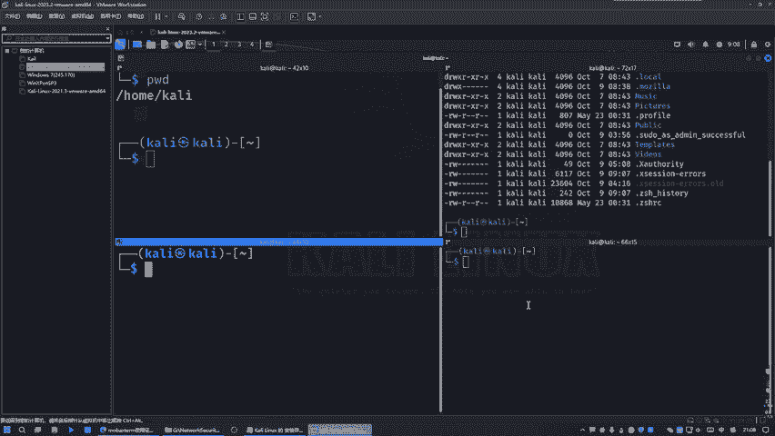

# 网络安全入门教程：P12：Kali Linux中的强大终端

## 概述
在本节课中，我们将学习如何在Kali Linux系统中安装和使用一个比默认终端更强大、更灵活的终端工具。我们将了解默认终端的局限性，并掌握安装、配置新终端以及使用其分屏等高级功能的方法。

## Kali Linux默认终端的局限性
上一节我们介绍了Kali Linux的基本操作。本节中，我们来看看系统自带的终端工具。

Kali Linux默认提供了一个终端。以普通用户身份打开时，终端提示符为美元符号 `$`，代表普通权限。

我们可以切换到`root`超级用户。输入`root`用户的密码后，终端提示符会变为井号 `#`，这代表我们拥有了超级权限。

然而，默认终端存在一个问题：它在一个桌面环境中只能打开一个终端窗口。若想打开多个终端，必须切换到另一个桌面，这在实际操作中非常不便。

因此，我们需要安装一个功能更强大的终端工具，它允许我们在同一个桌面内打开并管理多个终端窗口。

## 安装新的终端工具
为了解决上述问题，我们将安装一个名为`Terminator`的终端工具。

以下是安装步骤：
1.  打开终端。
2.  输入安装命令：`sudo apt install terminator -y`。
    *   `sudo` 代表以管理员权限执行。
    *   `apt install` 是安装软件包的命令。
    *   `terminator` 是要安装的软件包名称。
    *   `-y` 参数表示对安装过程中的所有询问自动回答“是”。

执行命令后，系统会提示输入当前用户的密码（即Kali Linux的登录密码）。输入密码后，安装过程将自动完成。

**提示**：在输入命令时，可以善用键盘的 `Tab` 键进行自动补全，这能有效避免输入错误。

## 配置并使用新终端
安装完成后，我们需要将其设置为默认启动的终端。

以下是配置方法：
1.  在屏幕底部的任务栏上，**右键点击**终端图标。
2.  在弹出的菜单中，选择“添加到面板”。
3.  在应用列表中找到并选择我们刚刚安装的“Terminator”。
4.  添加成功后，可以将新终端的图标拖动到任务栏最前端，这样以后点击终端图标就会默认打开`Terminator`。

现在，关闭所有终端窗口，再次点击任务栏的终端图标，打开的就是功能更强大的`Terminator`了。

## Terminator 的核心优势与使用
`Terminator` 的主要优势在于其灵活的分屏功能，这极大地提升了多任务操作的效率。

以下是一些基本操作：
*   **分屏**：在终端界面中，可以通过右键菜单或快捷键（如 `Ctrl+Shift+E` 垂直分屏，`Ctrl+Shift+O` 水平分屏）将当前窗口分割成多个区域。
*     **多任务并行**：你可以在不同的分屏中执行不同的命令，例如在一个分屏编译代码，在另一个分屏监控日志。
*   **调整字体**：按住 `Ctrl` 键并滚动鼠标滚轮，可以快速放大或缩小终端内的字体。

通过这些功能，你可以在一个屏幕内高效地管理多个命令行任务，这比系统自带的终端工具更加符合开发者和安全研究人员的操作习惯。

## 总结
本节课中，我们一起学习了如何提升Kali Linux的命令行操作体验。我们首先认识了系统默认终端的权限切换方式及其局限性——无法在单一桌面内打开多个窗口。接着，我们通过安装`Terminator`终端工具解决了这个问题，并学会了将其配置为默认终端。最后，我们探索了`Terminator`强大的分屏功能，这能帮助我们在一个界面内并行处理多项任务，显著提高工作效率。掌握一个高效的终端工具，是后续深入学习网络安全技术的重要基础。