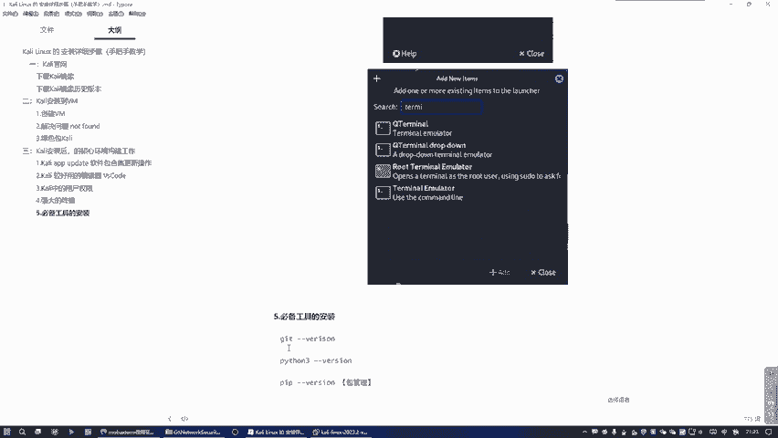
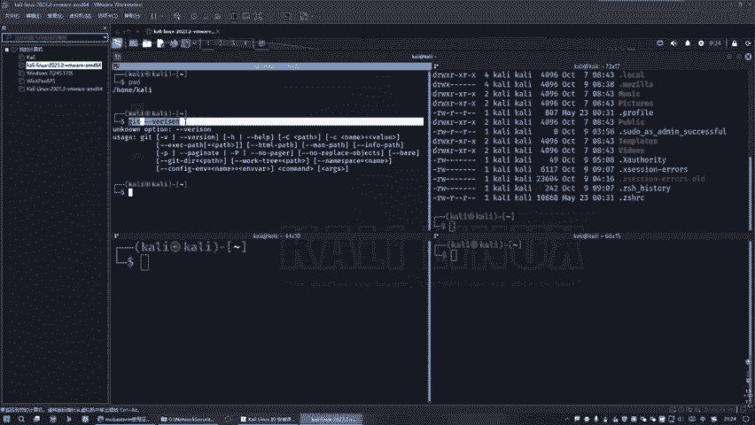
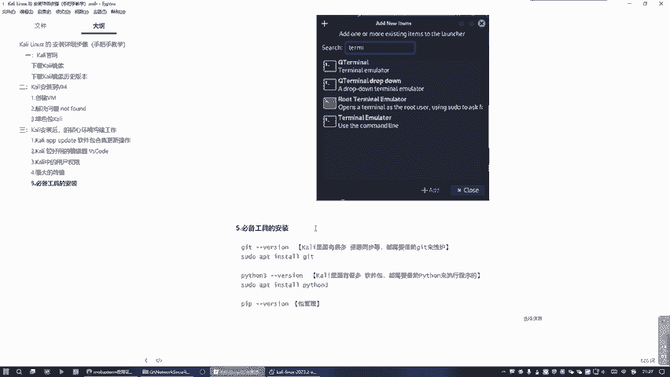

# Kali Linux 入门教程：P13：11. Kali 中必备工具

## 概述
在本节课中，我们将学习在 Kali Linux 系统中必须安装的三个核心工具。这些工具是后续进行网络安全学习和实践的基础，缺少它们可能会导致环境不完整或功能缺失。

---

## 核心工具一：Git

上一节我们介绍了强大的终端环境，本节中我们来看看必须安装的第一个工具：Git。

在整个 Kali Linux 系统中，许多资源的下载、同步和信息交互都需要借助 Git 来完成。因此，确保 Git 已正确安装至关重要。

以下是检查与安装 Git 的步骤：

1.  首先，在终端中输入 `git` 命令，检查 Git 是否已安装。
2.  如果系统提示命令未找到，则需要安装 Git。
3.  安装命令为 `sudo apt install git`。使用 `sudo` 是为了获取更高的安装权限。

安装完成后，再次输入 `git` 命令，应能看到 Git 的版本信息，这表明安装成功。

---

## 核心工具二：Python

接下来，我们来看第二个必备工具：Python。

Python 之所以重要，是因为 Kali Linux 中许多软件包的管理工具和程序本身都依赖于 Python 环境来执行。

以下是检查与安装 Python 的步骤：

1.  在终端中输入 `python3` 命令，检查 Python 3 是否已安装并可正常使用。
2.  如果 Python 未安装或出现问题，可以使用命令 `sudo apt install python3` 进行安装。
3.  同样，使用 `sudo` 是为了确保拥有足够的安装权限。

确保 Python 环境正常，是为后续安装和运行各种安全工具做好准备。

---

## 核心工具三：Pip

最后，我们来安装第三个工具：Pip。

Pip 是 Python 的包管理工具。安装它是为了让 Python 环境更加完善，便于后续安装和管理各种 Python 软件包。

以下是检查与安装 Pip 的步骤：

1.  在终端中输入 `pip` 或 `pip3` 命令，检查 Pip 是否已安装。
2.  如果未安装，可以使用命令 `sudo apt install python3-pip` 进行安装。
3.  安装完成后，可以运行 `pip3 --version` 来验证安装是否成功。

---

## 总结
本节课中我们一起学习了在 Kali Linux 中必须安装的三个核心工具：**Git**、**Python** 和 **Pip**。它们是构建完整网络安全学习和实践环境的基础。请务必确保这三个工具都已正确安装，否则后续的许多操作将无法顺利进行。