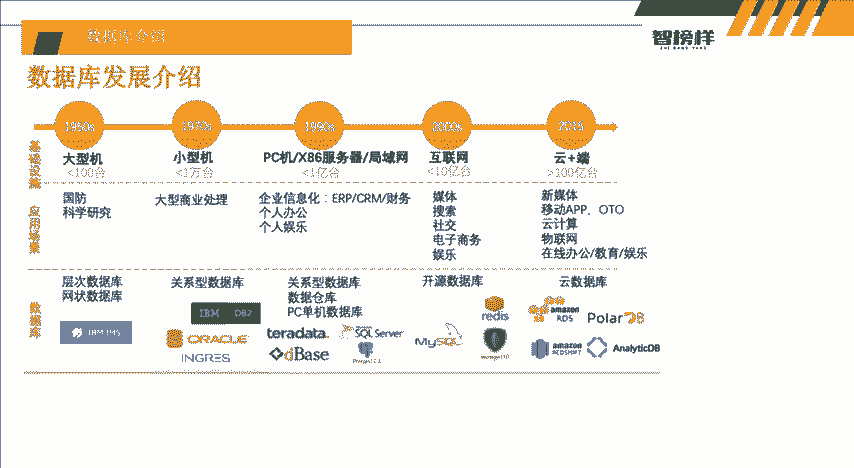
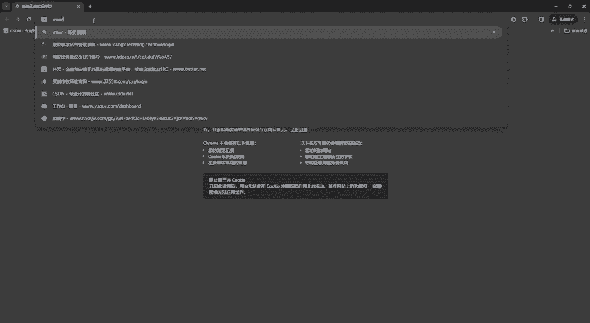

# 网络安全入门教程：P1：数据库介绍

## 概述
在本节课中，我们将要学习数据库的基础知识。数据库是网络安全，特别是Web安全（如SQL注入）领域的重要基础。了解数据库是什么、如何工作以及它与网站的关系，是后续学习的关键第一步。

## 什么是数据库？ 🗄️
数据库是存放数据的仓库。它的存储空间很大，可以存放百万条、千万条甚至上亿条的数据。数据库并非随意存放数据，而是遵循特定规则进行组织，否则查询效率会非常低。

当今世界是一个充满数据的互联网世界。我们在利用网站上网的同时，会产生大量数据。数据库就是为了高效存储和管理这些数据而生的。例如，我们的出行记录、消费记录、浏览的网页、发送的信息等文本数据，以及图像、音乐和声音等多媒体数据，都可以被数据库存储。

在建设网站时，数据库通常作为后端，支撑网站运作并存储数据。例如，我们在淘宝、微信等应用中保存的地址、聊天记录、浏览历史，实际上都存储在这些公司维护的数据库中。因此，我们在前端页面（如淘宝收货地址列表）看到的信息，正是从后端数据库中查询并展示出来的。

## 数据库的发展历程 📜
上一节我们介绍了数据库的基本定义，本节中我们来看看数据库是如何发展演变的。

以下是数据库发展的几个关键阶段：
*   **1950年代**：数据库技术早期应用于国防科学研究。当时主要使用层次数据库和网状数据库，分类并不像现在这样清晰。
*   **1970年代**：随着计算机和商业活动的发展，数据量急剧增长，纸质记录已无法满足需求。在小型机普及的背景下，出现了如Oracle、DB2等关系型数据库，开始用于商业处理。
*   **1990年代**：个人电脑、服务器和局域网技术发展，数据库应用扩展到企业和个人领域，用于办公、娱乐等。出现了多种数据库，如dBase、SQL Server，并形成了关系型数据库、数据仓库和PC单机数据库等类别。
*   **2000年代**：互联网进入快速发展期，媒体、搜索、社交、电子商务（如百度）等应用涌现。开源数据库变得流行，例如MySQL，因为它好用且免费。此外，Redis、MongoDB等数据库也开始出现。
*   **2015年至今**：随着云计算、物联网、新媒体的兴起，“云数据库”成为趋势。虽然出现了许多新型数据库，但目前主流且广为人知的仍然是MySQL、Oracle和SQL Server等。

## 数据库与网站技术的关联 🔗
在我们浏览各种网站时，通常看不到它使用的是哪种数据库。那么，如何判断一个网站可能使用了什么数据库呢？这通常与构建网站所使用的计算机语言有关。

常见的网站开发语言与数据库搭配有以下三种模式：
*   **PHP**：通常配合 **MySQL** 数据库使用。这是一种非常常见且经典的组合。
*   **Java**：通常配合 **Oracle** 数据库使用。
*   **ASP.NET**：通常配合 **SQL Server** 数据库使用。

一个粗略但常用于初步判断的方法是查看网站URL的后缀：
*   后缀为 **`.aspx`** 的网站，很可能使用 **SQL Server** 数据库。
*   后缀为 **`.jsp`** 或 **`.do`** 的网站，很可能使用 **Oracle** 数据库。
*   后缀为 **`.php`** 的网站，很大概率使用 **MySQL** 数据库。

## 实战观察：PHPStudy环境 🛠️
了解了理论上的搭配后，我们通过一个实际工具来观察。PHPStudy是一个集成了PHP开发环境的软件包，可以让我们清晰地看到网站、PHP和数据库是如何协同工作的。

在PHPStudy的控制面板中，我们可以明确看到：
*   **网站管理** 部分会显示PHP的版本信息。
*   **数据库服务** 部分明确显示使用的是 **MySQL** 服务。

这直观地展示了我们使用PHPStudy搭建网站时，其技术栈就是 **PHP语言 + MySQL数据库** 的组合。

## 总结
本节课中，我们一起学习了数据库的核心概念。我们了解到数据库是用于存储和管理海量数据的系统，是网站的后端核心。我们回顾了数据库的发展简史，并掌握了不同编程语言（如PHP、Java、ASP.NET）与特定数据库（如MySQL、Oracle、SQL Server）的常见搭配关系。最后，我们通过PHPStudy工具，直观地验证了PHP与MySQL在实际网站搭建中的关联。这些知识为我们后续学习SQL注入等Web安全技术奠定了重要的基础。