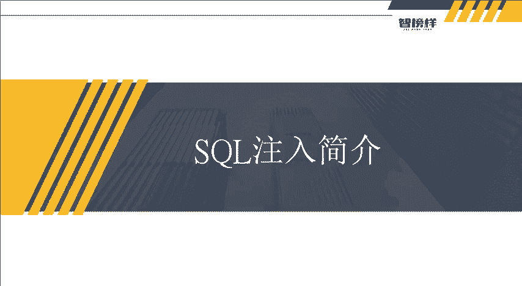
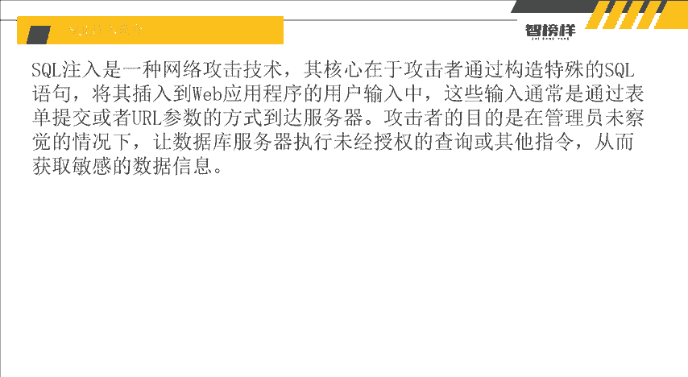
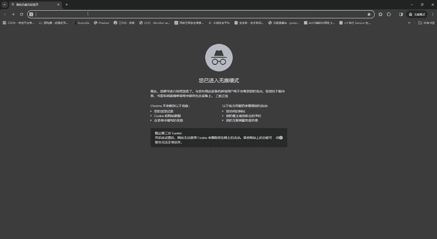
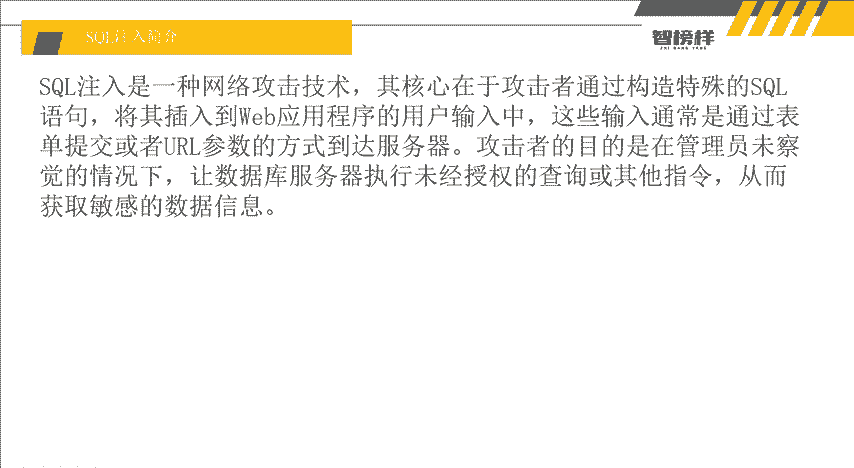
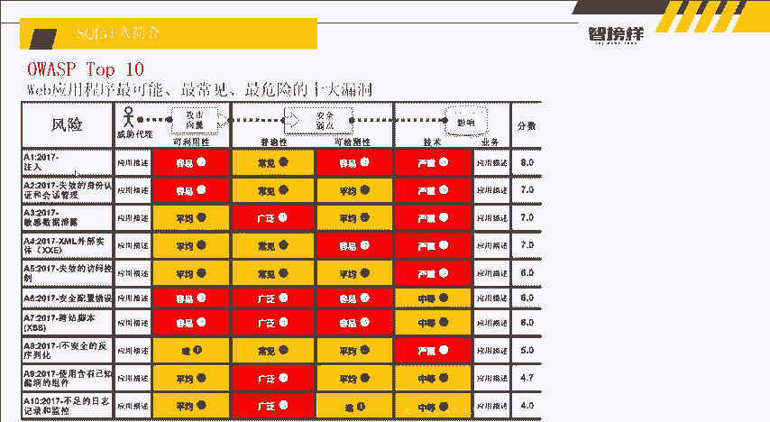
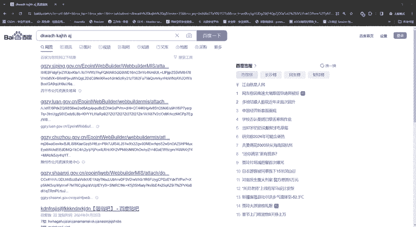

# 网络安全入门：P4：SQL注入简介 🎯

在本节课中，我们将要学习SQL注入攻击的基础知识。我们将了解什么是SQL注入、它的攻击原理、常见危害以及它在网络安全漏洞中的重要地位。掌握这些概念是理解后续实战演示的关键。

## 什么是SQL注入？🔍

上一节我们介绍了课程概述，本节中我们来看看SQL注入的定义。

SQL注入是一种网络攻击技术。其核心在于攻击者通过构造特殊的SQL语句，将其插入到外部应用程序（例如网站）的用户输入中。

这些用户输入通常通过表单提交或URL参数的方式传递到服务器。例如，在百度（`www.baidu.com`）的搜索框中输入关键词，或是在网址中看到 `?id=1` 这类参数，这些位置都可能与后端数据库产生交互。

攻击者的目的是在管理员未察觉的情况下，让数据库服务器执行这些未经授权的查询或其他指令，从而获取敏感信息。数据库通常存储着用户的账号、密码、地址等隐私数据。正常情况下，只有数据库所有者有权操作。SQL注入攻击则试图绕过这一授权机制。

## SQL注入在漏洞排名中的位置 📊

了解了SQL注入的基本定义后，我们来看看它在整个网络安全威胁中的严重性。

OWASP Top 10是一个权威的十大Web应用安全风险排行。其中，**注入**漏洞（主要包括SQL注入）常年位居榜首。

以下是OWASP Top 10 2021年的部分漏洞类型：
*   **注入**
*   失效的访问控制
*   加密机制失效
*   不安全设计
*   安全配置错误

SQL注入因其**非常普遍、易于利用且危害严重**而排名第一。这凸显了学习和防范此类攻击的重要性。

## SQL注入的攻击步骤 ⚙️

认识到SQL注入的严重性后，我们来剖析其攻击过程。一个典型的SQL注入攻击通常包含两个核心步骤。

以下是攻击步骤：
1.  **寻找注入点**：攻击者寻找应用程序中未对用户输入数据进行充分检查、过滤或验证的地方。这些位置使得用户输入的数据能够被“拼接”到原始的SQL查询语句中。
2.  **构造并执行恶意代码**：在发现注入点后，攻击者插入精心构造的恶意SQL代码。这些代码可以执行各种未经授权的数据库操作。

## SQL注入的核心原理与危害 💥

上一节我们介绍了攻击步骤，本节中我们来看看其根本原理和可能造成的破坏。

### 攻击原理

SQL注入最核心的原理可以用一句话概括：**将用户输入的数据当做SQL代码执行**。

在安全的程序中，用户输入（如搜索词“苹果”）会被当作普通数据处理。而在存在漏洞的程序中，如果用户输入了一段SQL代码片段（例如 `‘ OR ‘1’=’1`），这段“数据”会被数据库误认为是合法的SQL指令并执行。

### 主要危害

SQL注入成功可能引发多种严重后果，以下是一些主要危害：
*   **数据泄露**：盗取用户的个人信息、隐私数据、商业机密等。新闻中常见的“XX公司数据泄露，涉及上亿用户”往往与此相关。
*   **数据篡改**：修改数据库中的记录，例如篡改网页内容、发布违法信息或修改账户余额。
*   **网站篡改**：通过操作数据库对网页进行篡改，甚至嵌入网页木马（俗称“挂马”），进一步攻击访问该网站的用户。
*   **获取服务器控制权**：在数据库服务器上执行系统命令，从而安装后门，将服务器变为“肉鸡”。
*   **数据破坏**：对数据库进行增加或删除操作。极端情况如“删库跑路”，即删除全部数据，导致业务瘫痪，损失巨大。

## 总结与下节预告 📚

本节课中我们一起学习了SQL注入的基础知识。我们明确了SQL注入是一种通过将恶意输入作为代码执行来攻击数据库的技术。它位列OWASP Top 10漏洞之首，危害极大，可导致数据泄露、篡改乃至系统瘫痪。其核心原理是 **“输入的数据被当作代码执行”**。

下节课，我们将正式进入实战演示环节。老师将利用SQL语句，在靶场环境中一步步展示SQL注入是如何产生和利用的。为了更好地理解后续内容，请大家务必提前熟悉基本的SQL语句。