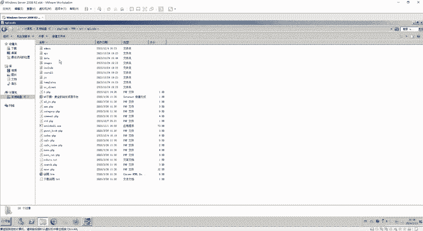
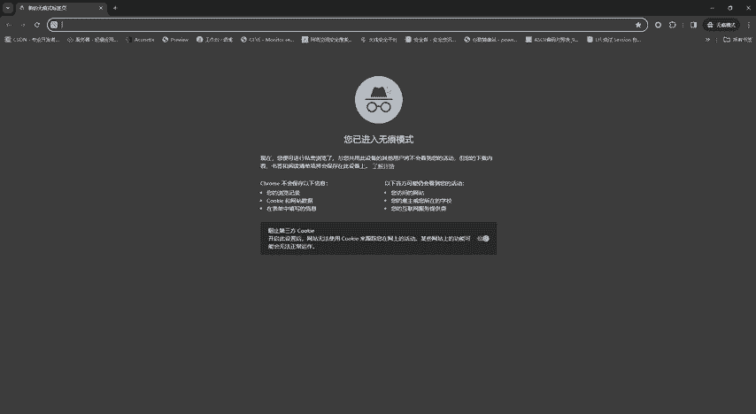
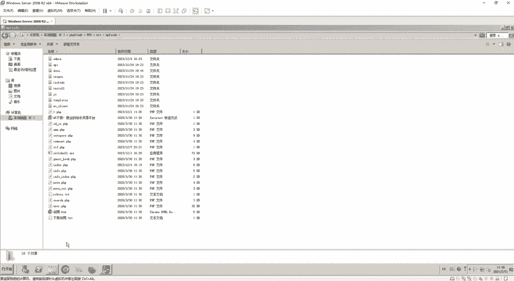
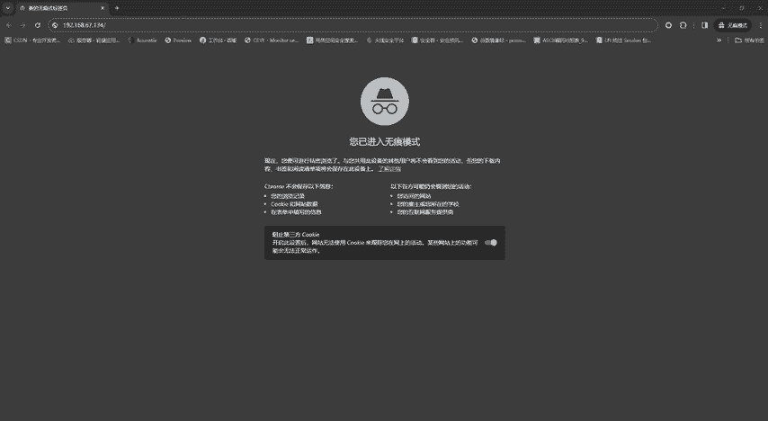
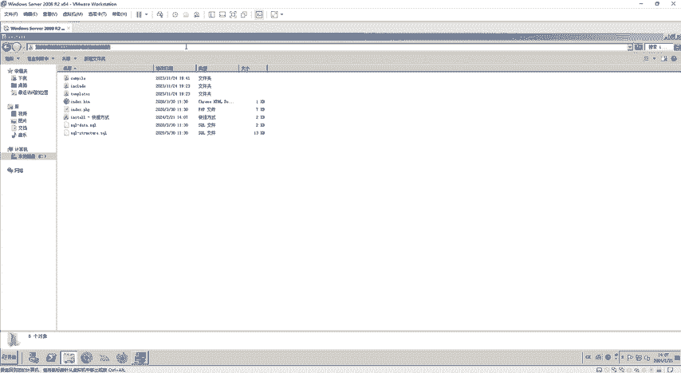
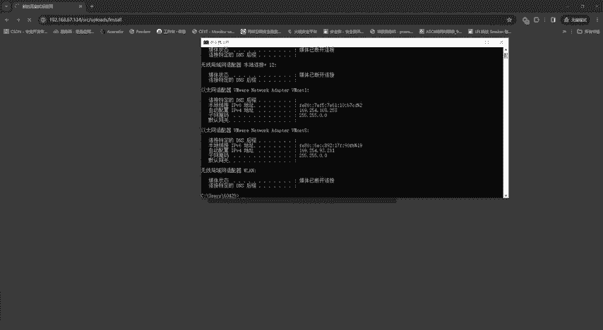
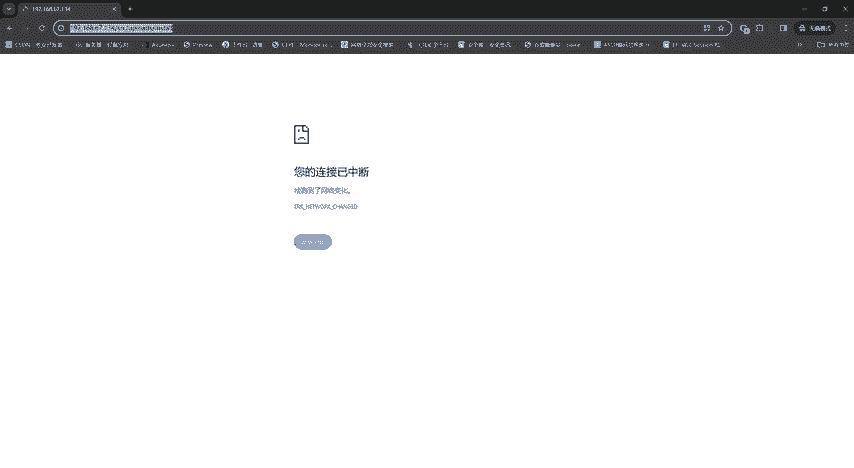
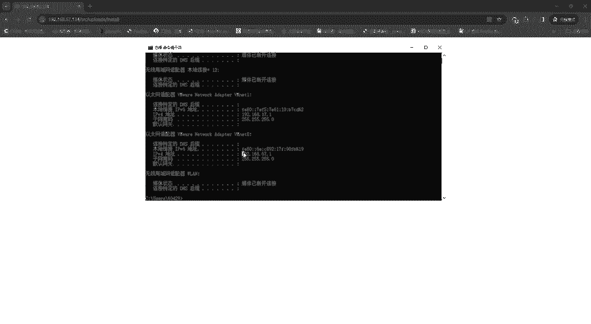
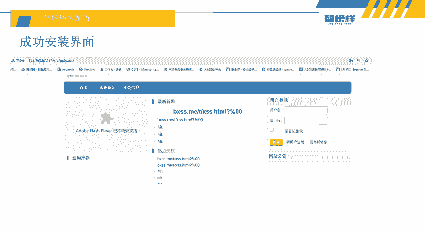

# 网络安全入门教程：P7：靶场环境配置 🎯

## 概述
在本节课中，我们将学习如何配置一个用于网络安全实战演练的靶场环境。我们将以 BlueCMS 系统为例，在 Windows Server 2008 系统上，使用 PHPStudy 搭建一个存在漏洞的网站，为后续的渗透测试实操做好准备。

上一节我们介绍了 SQL 注入的基本类型，本节中我们来看看如何搭建一个真实的靶场进行实战演练。

## 实验环境说明
本次实验需要配置以下环境：
*   **靶机系统**：Windows Server 2008 R2
*   **靶机 IP**：192.168.67.134
*   **攻击机**：本机（Kali Linux 或 Windows）
*   **靶场应用**：BlueCMS（因其存在已知漏洞，适合初学者练习）

## 实战目标预览
本次实战的最终目标是获取 BlueCMS 后台的管理员账号密码。我们将通过两种主要路径来实现：

**路径一：常规渗透流程**
1.  使用 Nmap 进行主机发现与服务扫描。
2.  扫描网站目录，寻找后台入口。
3.  对后台登录页面进行爆破，获取账号密码。
4.  进行 CMS 识别与已知漏洞搜索利用。

**路径二：利用 SQL 注入**
1.  寻找网站存在的 SQL 注入点。
2.  通过 SQL 注入直接获取数据库中的管理员账号密码。

接下来，我们将从最基础的靶场搭建开始。

## 靶场搭建步骤详解
以下是搭建 BlueCMS 靶场的具体操作流程。



### 第一步：准备 BlueCMS 源码
首先，需要获取 BlueCMS 的安装包。将下载好的 `bluecms.zip` 压缩包进行解压。



### 第二步：部署到 Web 目录
将解压后得到的文件夹（例如 `bluecms`）整个复制到 PHPStudy 的 `www` 根目录下。`www` 目录是 PHPStudy 默认的网站根目录，所有网站文件都应放置于此。



**关键路径公式**：
```
网站访问路径 = http://[靶机IP]/[放入www下的文件夹名]
```





### 第三步：启动 PHPStudy 服务
打开 PHPStudy，启动 Apache 和 MySQL 服务。**请注意**，PHP 版本需选择 **5.2.x** 系列（例如 5.2.17），版本过高可能导致 BlueCMS 兼容性问题。



### 第四步：运行安装程序
在浏览器中访问 BlueCMS 的安装页面。假设靶机 IP 为 `192.168.67.134`，文件夹名为 `bluecms`，则安装地址为：
```
http://192.168.67.134/bluecms/upload/install/
```
访问该地址后，按照页面提示，点击“继续”即可完成安装。安装过程中，数据库账号密码通常为默认的 `root` / `root`。



### 第五步：安装完成验证
安装成功后，浏览器会自动跳转到 BlueCMS 的网站首页。同时，你也可以访问后台登录地址（通常为 `http://192.168.67.134/bluecms/upload/admin/`）来确认后台存在。



## 常见问题与解决
在配置过程中，你可能会遇到虚拟机网络问题。

**问题**：虚拟机获取到 `169.254.x.x` 这类无效的 IP 地址。
**解决**：
1.  进入宿主机的“网络连接”设置。
2.  禁用与虚拟机相关的虚拟网卡（如 VMware Network Adapter VMnet1 和 VMnet8）。
3.  重新启用这些虚拟网卡，或在虚拟机中重启网络服务。
4.  在虚拟机中执行 `ipconfig` 命令，确认已获取到正确的 `192.168.x.x` 格式的 IP 地址。

## 总结
本节课中我们一起学习了如何配置一个基础的渗透测试靶场。我们使用 PHPStudy 在 Windows Server 2008 上成功搭建了存在漏洞的 BlueCMS 系统，并明确了后续攻击的两条主要路径。一个稳定、可控的靶场环境是进行所有安全实操的基础。

下节课，我们将开始真正的“攻击”阶段，首先学习使用 **Nmap** 工具对靶机进行信息搜集，识别开放端口和运行服务，为后续的深入渗透打开突破口。



> 提示：PHPStudy 及 BlueCMS 安装包可在课程资料中获取。