# 网络安全入门：P8：Nmap简介与使用 🛡️


在本节课中，我们将学习一个在网络安全和渗透测试中至关重要的工具——Nmap。我们将了解它的基本概念、核心功能，并通过实际操作演示如何使用它来发现网络中的主机和开放的端口，这是信息收集阶段的关键步骤。

## Nmap是什么？

Nmap是一种网络扫描和主机检测工具。在日常的渗透测试或项目实践中，我们经常利用Nmap对目标进行端口扫描。

它的主要功能包括信息收集和枚举，同时也可以作为漏洞探测器或安全扫描器使用。不过，相比于其强大的信息收集能力，其漏洞探测功能相对次要。因此，我们主要使用Nmap来收集信息和进行端口扫描。

## Nmap的核心功能

以下是Nmap的几个核心功能：

*   **检测存活在网络上的主机**：例如，在一个网段（如192.168.67.0/24）中，Nmap可以扫描出所有在线的主机IP地址，而不仅限于我们已知的一台。
*   **检测主机上开放的端口**：例如，一台主机可能不仅开放了80端口的Web服务，还可能运行着其他服务。
*   **检测相应端口服务的软件和版本**：识别出某个端口运行的是Apache还是Nginx，以及具体的版本号。
*   **检测操作系统、硬件地址以及软件版本**。
*   **检测脆弱性的漏洞**：这通常需要借助Nmap的脚本（NSE）功能。

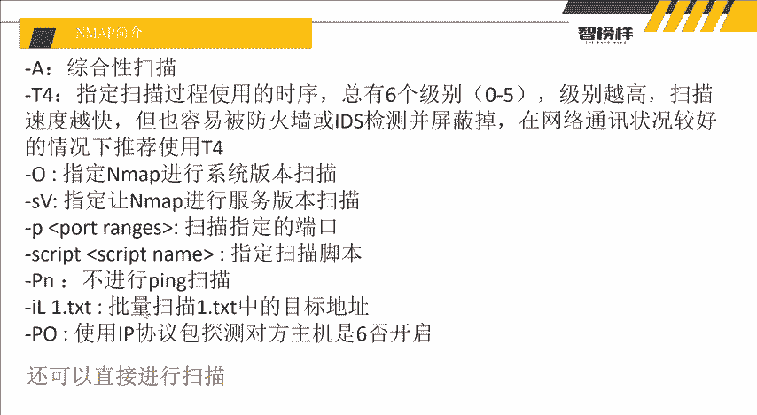

本节课，我们将重点演示如何检测存活主机和开放的端口。

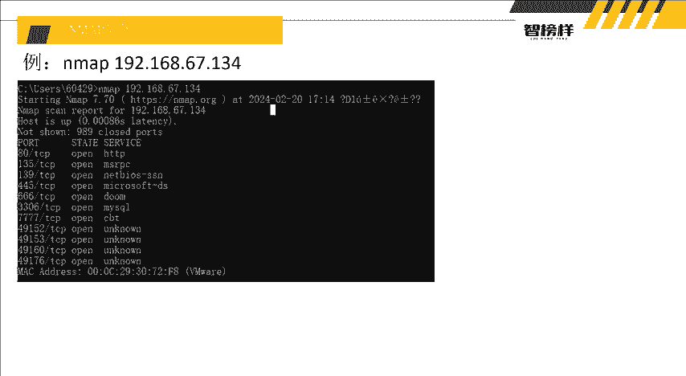

## Nmap常用参数简介

Nmap拥有丰富的参数来控制扫描行为。以下是一些常用参数：

*   **`-A`**：进行综合性扫描，包括操作系统检测、版本检测、脚本扫描和路由追踪。
*   **`-T4`**：指定扫描速度。Nmap有0-5共6个速度级别，级别越高扫描越快，但也更容易被防火墙或入侵检测系统（IDS）发现并屏蔽。
*   **`-O`**：启用操作系统检测。
*   **`-sV`**：探测服务版本信息。
*   **`-p`**：指定扫描的端口范围，例如 `-p 80,443` 或 `-p 1-1000`。

当然，Nmap也可以不使用任何参数进行最基本的扫描。

## 为什么信息收集如此重要？

在渗透测试中，信息收集是第一步，也是最关键的一步。我们可以用一个简单的比喻来理解：

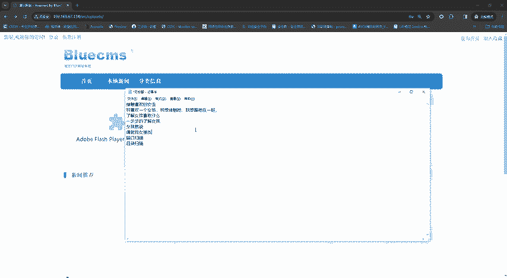

假设你想追求一位心仪的女孩。如果你对她一无所知，直接表白很可能失败。因此，你需要先了解她的喜好、习惯和性格。这个过程就像渗透测试中的信息收集：扫描端口、探测服务、寻找网站后台。每一步都是为了更深入地了解“目标”，发现可能的“入口点”（如未授权访问的后台）。只有充分了解目标，才能制定有效的策略。

## 实战演示：使用Nmap进行扫描

接下来，我们将进行两个简单的实战演示。

### 1. 扫描网段内存活的主机

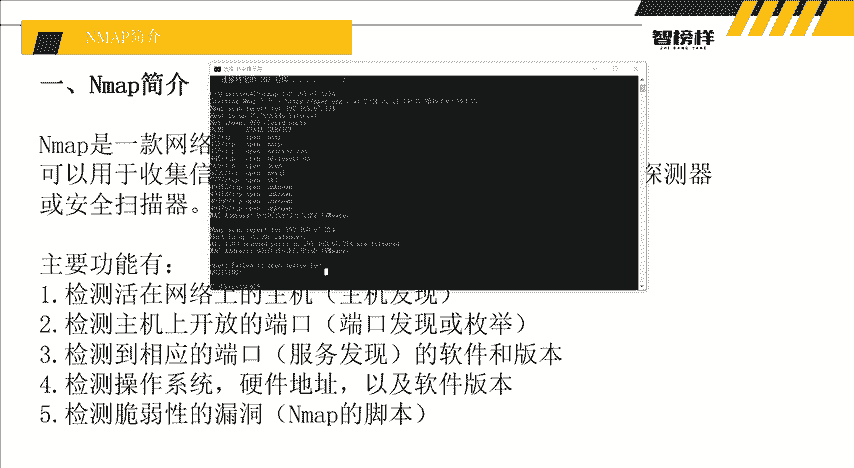

我们可以使用以下命令扫描整个C类网段（192.168.67.0/24）中所有存活的主机。

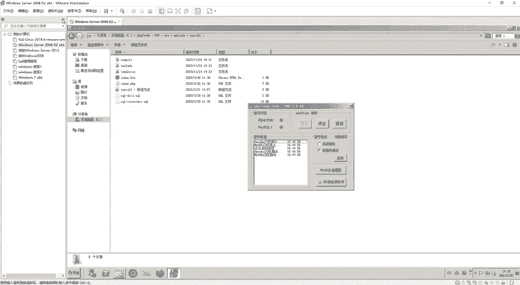

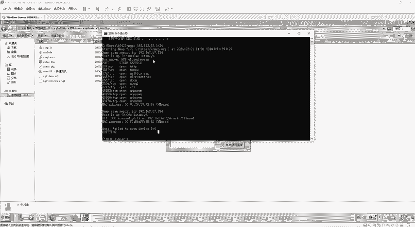

```bash
nmap 192.168.67.1/24
```

执行后，Nmap会列出该网段内所有在线设备的IP地址。在渗透测试中，当我们进入目标内网后，这项功能可以帮助我们快速发现内网中的其他服务器、电脑等设备。

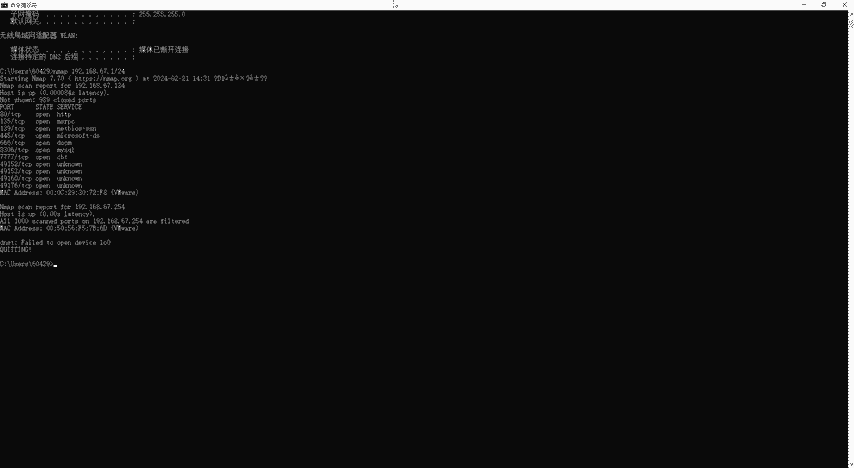

在上面的演示中，由于只开启了一台IP为 `192.168.67.134` 的虚拟机，所以扫描结果中只显示了这一台主机。

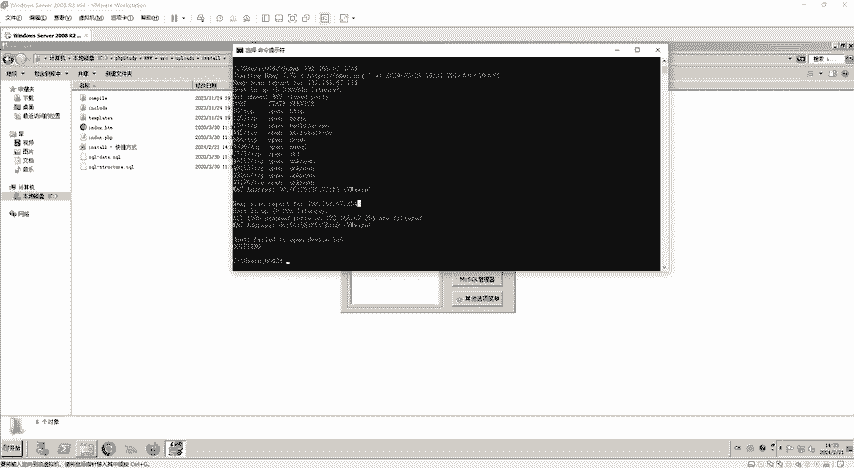

### 2. 扫描目标主机的开放端口

确定目标主机后，我们可以对其进行详细的端口扫描。

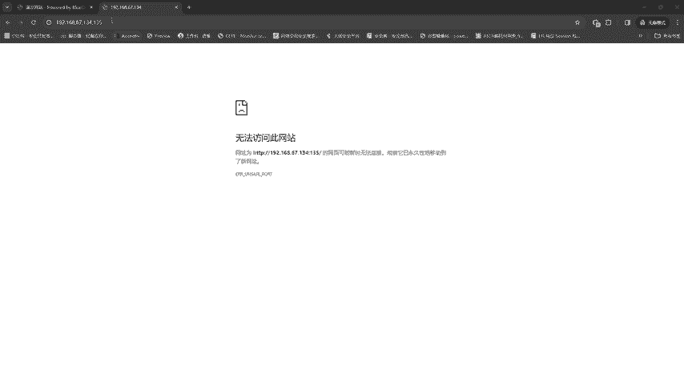

```bash
nmap 192.168.67.134
```

扫描结果显示，该主机开放了多个端口，例如：
*   **80端口**：HTTP服务，运行着一个网站。
*   **666端口**：运行着一个“业务管理系统”。
*   **7777端口**：运行着一个“蜜罐智能反制诱捕系统”。
*   **3306端口**：MySQL数据库服务。


此外，Nmap还识别出该主机是一台VMware虚拟机。

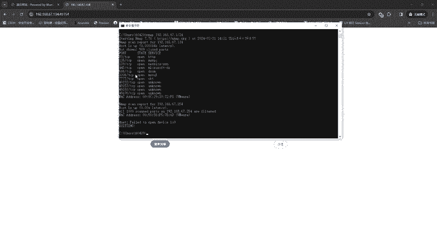

通过访问这些端口（如 `http://192.168.67.134:666`），我们确认了这些服务确实存在。这意味着，仅通过一次简单的Nmap扫描，我们就从一个目标（80端口的网站）扩展到了三个潜在的攻击入口（80、666、7777端口），极大地丰富了我们的信息收集成果。


## 总结

本节课我们一起学习了Nmap工具的基本概念与使用方法。

我们了解到Nmap是网络扫描和信息收集的利器，核心功能包括发现存活主机、探测开放端口及服务版本。通过 `nmap 192.168.67.1/24` 和 `nmap 192.168.67.134` 的实战演示，我们看到了它如何快速揭示网络中的设备和目标主机的服务概况。

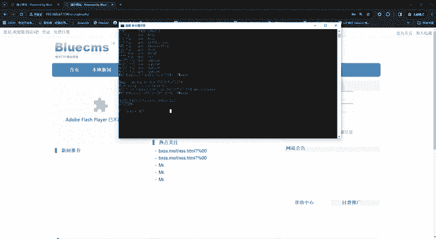

信息收集是渗透测试的基石，而Nmap是执行这一步骤的必备工具。无论是外部网络侦查还是内网横向移动，Nmap都发挥着不可替代的作用。建议大家在自己的实验环境中多加练习，熟练掌握。请注意，未经授权对他人网络和系统进行扫描是违法行为，所有练习都应在授权或自有环境中进行。