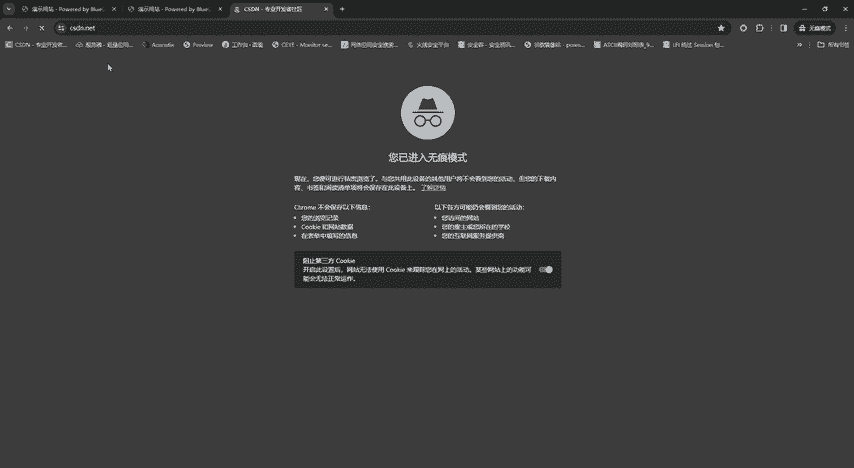
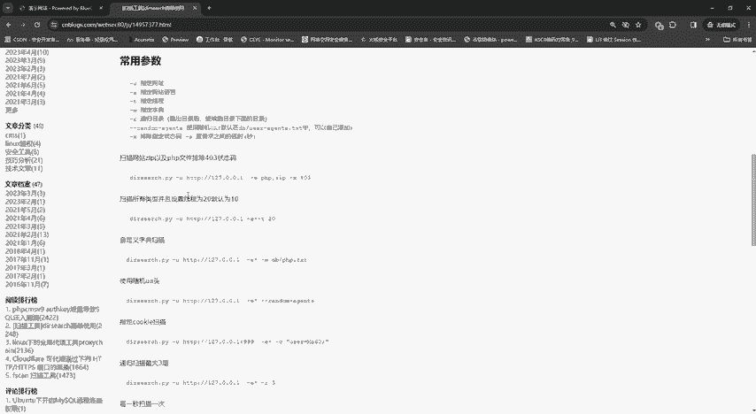
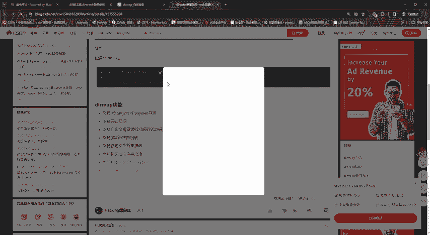
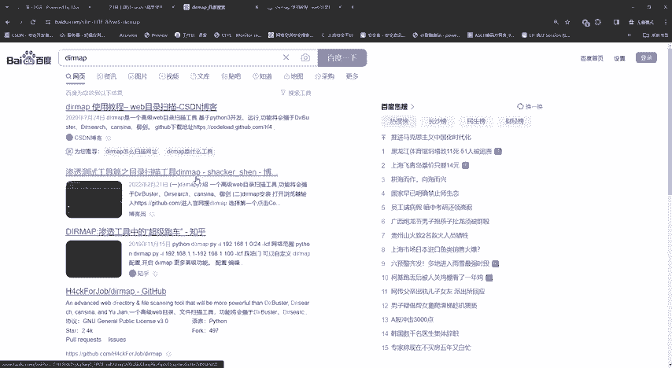
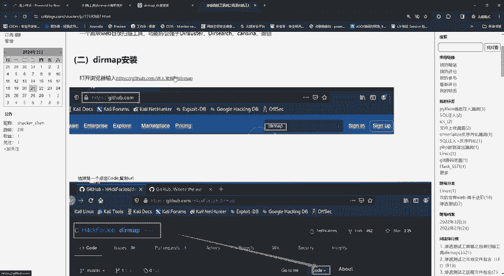
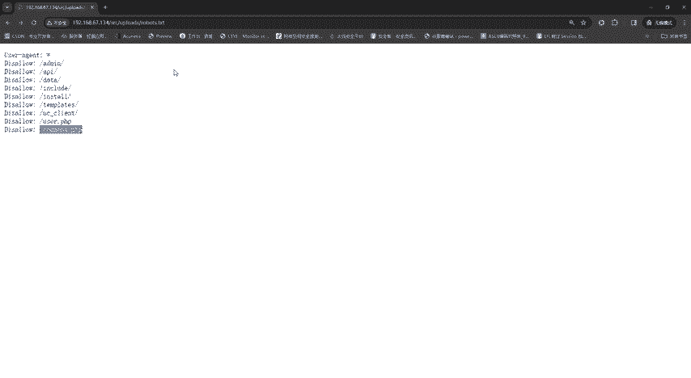

# 网络安全入门到精通：P9：目录扫描 🔍




## 概述
在本节课中，我们将要学习网络安全渗透测试中的一个重要环节——**目录扫描**。我们将了解目录扫描的目的、常用工具，并通过一个实际演示来掌握其基本使用方法。

---

## 目录扫描简介
上一节我们介绍了渗透测试的基本流程，本节中我们来看看目录扫描的具体作用。

在渗透测试过程中，我们通常无法直接访问目标网站的后台管理界面或其他敏感目录。网站管理员会将这些含有敏感信息的页面隐藏起来，只向公众展示正常的页面内容。目录扫描的目的，就是通过自动化工具尝试访问大量可能的目录和文件路径，从而发现这些被隐藏的**敏感目录**、**后台管理入口**、**数据库文件**，甚至是**网站源码**。

具体来说，目录扫描能帮助安全人员：
*   发现目标站点的目录和页面数量，理清网站结构。
*   定位敏感文件，为后续的渗透测试提供突破口。

## 常用目录扫描工具
目录扫描工具有很多，并非唯一。以下是几种常见的工具：

*   **Dirsearch**: 一款基于Python3的命令行目录扫描工具，支持多线程、保持连接、HTTP代理等功能。
*   **Dirb**: 另一款经典的目录爆破工具。
*   **Gobuster**: 用Go语言编写的高性能目录扫描工具。
*   **御剑后台扫描工具**: 国内安全人员常用的图形化工具。






这些工具的核心原理相似，都是通过加载一个包含大量常见路径的**字典文件**，向目标网址发起请求，并根据HTTP状态码（如`200`、`403`、`404`）来判断目录或文件是否存在。





## 工具功能与参数解析
以Dirsearch为例，它拥有丰富的参数来定制扫描行为。以下是部分核心参数介绍：

```
python3 dirsearch.py -u <目标URL> -e <扩展名> -w <字典路径> -t <线程数>
```

*   `-u`: 指定要扫描的目标网址。
*   `-e`: 指定网站语言或文件扩展名（如`php, asp, jsp`）。
*   `-w`: 指定自定义的字典文件路径。
*   `-t`: 设置扫描线程数，影响扫描速度。
*   `--random-agents`: 使用随机的User-Agent头，避免被简单的WAF拦截。
*   `--exclude-status`: 排除特定的HTTP状态码，例如`-x 403,404`。

Dirsearch和类似工具通常需要从GitHub等平台下载，并在配置好Python3环境后通过命令行执行。网络上已有详细的安装与使用教程，大家可以自行搜索学习。

## 实战演示：使用图形化工具进行扫描
考虑到初学者对命令行可能不熟悉，本节我们将使用一款图形化工具“Tpscan”进行演示，其原理与命令行工具一致，但操作更为直观。

1.  **启动与配置**：打开Tpscan工具。在“扫描目标”处输入要测试的网站URL。工具内置了多种分类字典（如ASP、PHP、JSP等），我们可以根据目标网站的技术栈选择合适的字典，也可以加载自己的外部字典文件。
2.  **开始扫描**：配置好目标URL和字典后，直接点击“开始”按钮。工具会使用多线程对目标进行扫描，我们只需等待即可。
3.  **分析结果**：扫描结束后，结果列表会显示发现的路径及其HTTP状态码。
    *   **状态码200（蓝色）**：通常表示该路径可正常访问，是重点查看对象。
    *   **状态码403（红色）**：表示访问被禁止，通常可以暂时忽略。
    *   **状态码404**：表示不存在。

以下是扫描结果中可能发现的有价值目录示例，我们可以右键点击路径进行访问或复制：

*   `/admin/` - 网站后台管理入口
*   `/phpmyadmin/` - MySQL数据库管理界面
*   `/upload/` - 文件上传目录
*   `/config.php` - 网站配置文件（可能包含数据库密码）
*   `/install/` - 网站安装目录（若未删除，可导致网站被重装）
*   `/backup.sql` - 数据库备份文件

在本次演示中，我们成功发现了目标网站的`/admin/`后台管理登录页面。这为我们下一步可能进行的**密码爆破**测试找到了一个明确的入口。

## 总结
本节课中我们一起学习了目录扫描的核心概念与实战操作。我们了解到目录扫描是渗透测试中信息收集的关键步骤，旨在发现隐藏的敏感路径和文件。我们介绍了几款主流工具，并通过图形化工具Tpscan完成了从配置、扫描到结果分析的完整流程，成功定位了目标网站的后台地址。



找到后台只是第一步，如何进入后台则是下一个挑战。在下一节课中，我们将探讨如何对找到的后台登录页面进行**密码爆破测试**。