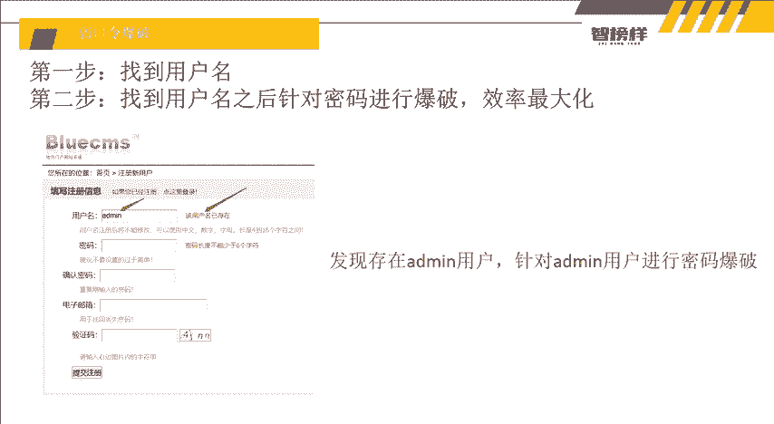
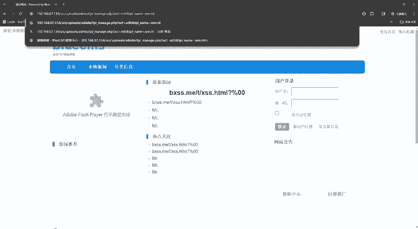
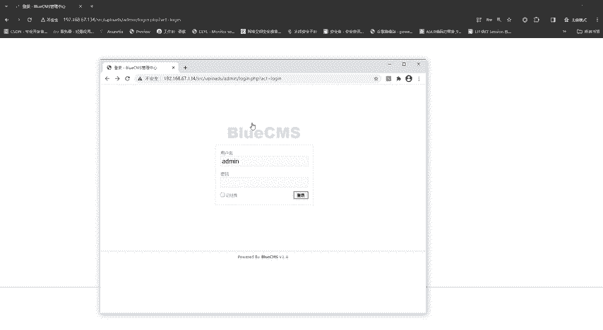
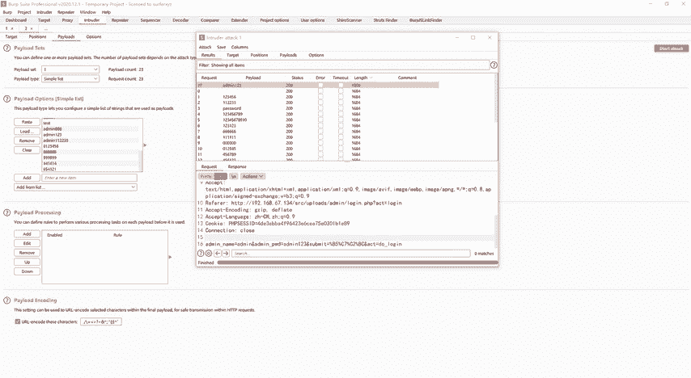
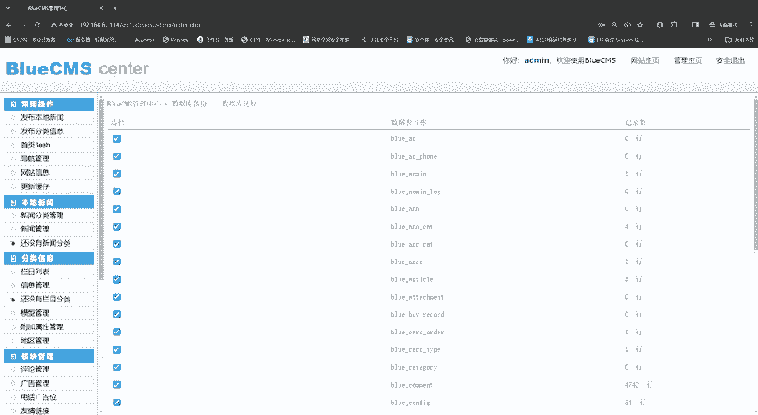

# 网络安全入门教程：P10：弱口令爆破

在本节课中，我们将学习如何对一个网站的后台登录系统进行弱口令爆破。我们将从发现有效用户名开始，然后使用自动化工具对密码进行批量尝试，最终成功进入后台管理系统。

## 概述与思路

上一节我们找到了目标网站的后台管理系统入口。当我们尝试输入账号密码时，系统提示“输入的用户名密码不对”。这表明我们需要先确定一个有效的用户名，再针对该用户名进行密码爆破。

如果同时爆破用户名和密码，工作量会成倍增加。因此，我们的策略是先找到一个确定存在的用户名，然后只针对这个用户的密码进行爆破，这样效率最高。

## 第一步：寻找有效用户名

我们首先尝试常见的后台用户名，如 `admin`、`root` 等，观察系统的不同反应。

以下是测试过程：
*   输入 `admin` / `123`，系统提示“用户名不正确”。这说明 `admin` 这个用户可能不存在。
*   输入 `root` / `123`，系统提示“您输入的用户名密码不对”。这暗示 `root` 这个用户是存在的，只是密码错误。
*   为了进一步确认，我们可以尝试网站的用户注册功能。输入 `root` 作为新用户名，系统提示“该用户名已经存在”。这证实了 `root` 用户确实存在于系统中。

至此，我们确定了目标用户名：`root`。

## 第二步：引入自动化爆破工具

手动尝试密码效率极低。我们需要一个能自动发送大量登录请求并分析响应的工具。这里我们使用 **Burp Suite**（简称BP）。

Burp Suite 是一个功能强大的Web安全测试工具，集成了抓包、重放、扫描、爆破等多种功能。它自带一个内置浏览器，无需安装额外插件即可直接抓取流量。

## 第三步：配置Burp Suite进行抓包

1.  打开Burp Suite，确保 **Intercept** 功能处于 **On**（开启）状态。
2.  使用BP内置浏览器访问目标后台登录页面。
3.  在登录框中输入我们确定的用户名 `root` 和一个任意密码（如 `123`），点击登录。
4.  此时，Burp Suite 会截获浏览器发送的登录请求数据包。

## 第四步：使用Intruder模块进行密码爆破

我们将截获的数据包发送到 **Intruder**（入侵者）模块进行爆破。

以下是操作步骤：
1.  在抓包界面右键点击，选择 **Send to Intruder**。
2.  切换到 **Intruder** 标签页，点击 **Clear §** 按钮，清除所有可能自动标记的变量。
3.  在请求数据中找到密码参数（通常是 `password` 或 `pwd` 字段），将其对应的值（我们刚才输入的`123`）选中，然后点击 **Add §** 按钮。这告诉工具，这个位置是需要进行爆破的变量。
4.  切换到 **Payloads** 标签页。这里我们使用预置的弱口令字典。
    *   **Payload set** 保持为 `Simple list`。
    *   点击 **Load...** 按钮，选择一个包含常见弱口令（如 `123456`， `admin123`， `root` 等）的字典文件。
5.  点击右上角的 **Start attack** 按钮，开始攻击。

## 第五步：分析结果并获取密码

攻击开始后，工具会使用字典中的每一个密码替换变量，并发送登录请求。

以下是分析结果的要点：
*   我们需要关注服务器的响应长度（**Length** 列）或状态码（**Status** 列）。
*   登录失败时，服务器返回的页面通常是固定的错误提示，因此响应长度也基本一致。
*   当某个密码尝试成功时，服务器会返回一个不同的页面（例如后台首页），其响应长度会与其他失败的尝试有明显差异。

在结果列表中，我们点击 **Length** 列进行排序，发现其中一个响应的长度与其他条目不同。查看该条目的Payload，发现密码是 `admin123`。

我们使用组合 `root` / `admin123` 在浏览器中尝试登录，成功进入后台管理系统。

## 进入后台后的操作

成功进入后台后，我们获得了该网站的高权限管理能力，例如：
*   发布、编辑或删除文章/公告。
*   管理用户账号，甚至为自己添加权限或余额。
*   操作数据库，进行备份或查看敏感信息。
*   修改网站核心配置。

因此，在渗透测试中，后台管理系统是一个极其重要的目标，一旦突破，往往意味着对整个系统取得了控制权。

## 总结

本节课我们一起学习了弱口令爆破的完整流程：
1.  **信息收集**：通过逻辑推理和简单测试，确定了一个有效的后台用户名（`root`）。
2.  **工具准备**：引入了自动化渗透工具 **Burp Suite**，并利用其抓包和爆破功能。
3.  **实施爆破**：配置Intruder模块，使用弱口令字典对目标用户的密码进行批量尝试。
4.  **结果分析**：通过对比HTTP响应长度的差异，成功识别出正确的密码（`admin123`）。
5.  **权限获取**：使用得到的账号密码成功登录后台，验证了爆破结果。

弱口令是网络安全中最常见也最危险的漏洞之一。通过本课的学习，你不仅掌握了一种实用的攻击手法，更重要的是理解了为什么设置强密码和采取账户安全策略（如登录失败锁定）是如此关键。

